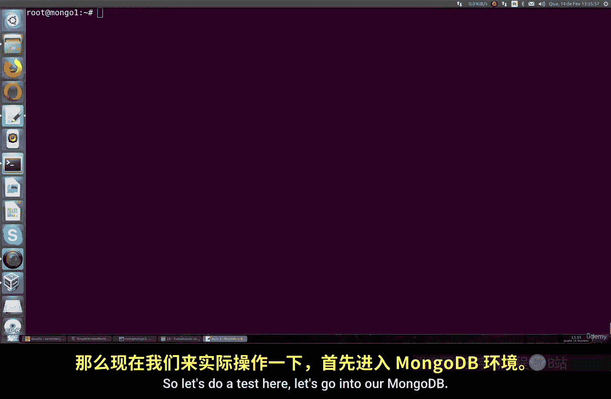
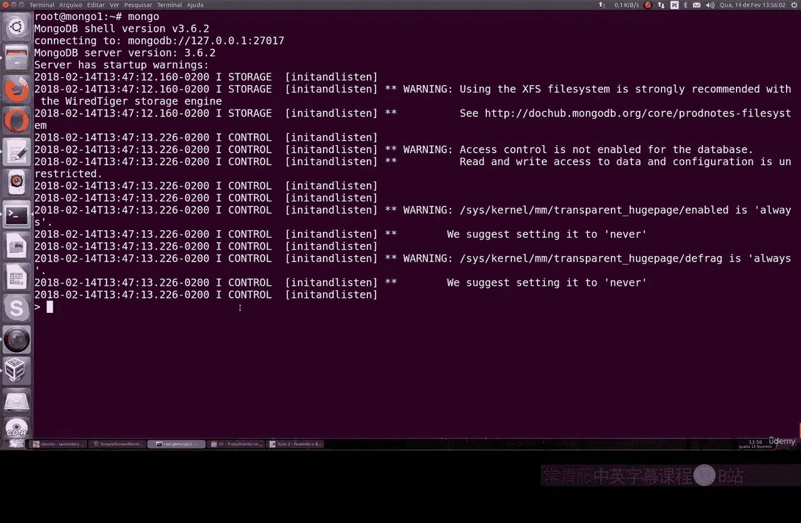
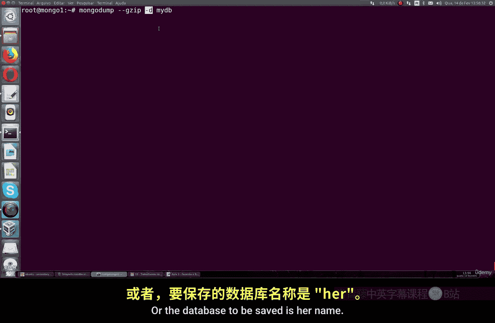
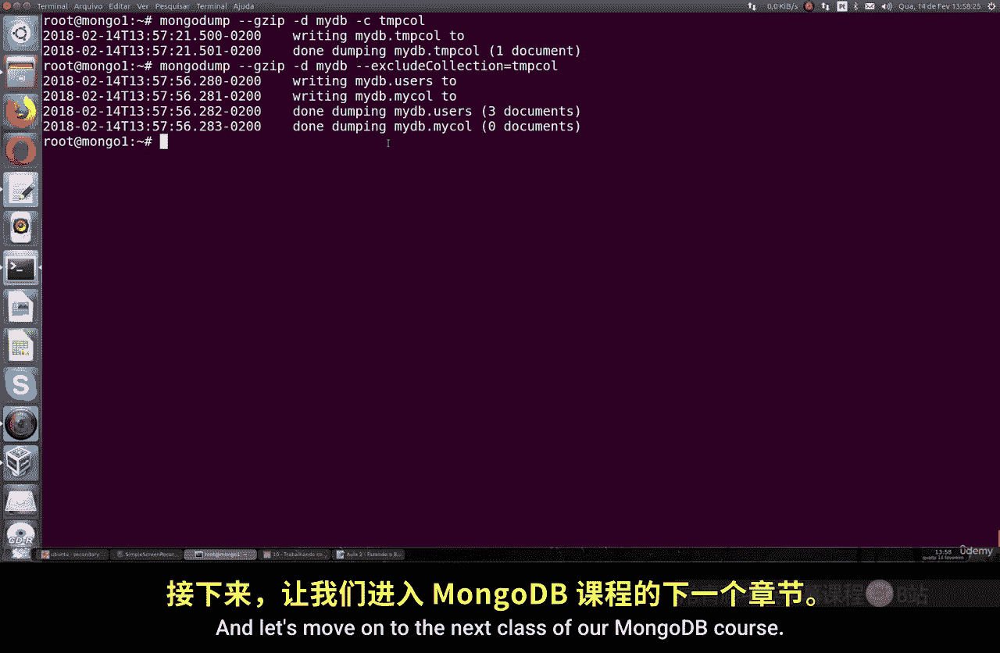

# 144：备份特定集合或数据库 🗄️

在本节课中，我们将要学习如何在 MongoDB 中备份特定的集合或特定类型的数据库。上一节我们介绍了如何备份整个 MongoDB 实例，但实际情况中，我们并不总是需要备份所有数据。本节中我们来看看如何针对性地进行备份。

## 概述

有时，我们不需要备份整个数据库，而只需要备份其中的一部分，例如某个特定的数据库或集合。MongoDB 提供了相应的命令行工具来实现这一目标。

## 创建测试数据

首先，为了演示备份过程，我们需要创建一个测试数据库并插入一些数据。以下是操作步骤：

1.  进入 MongoDB 命令行。
2.  创建一个新的数据库。
3.  在该数据库中创建一个集合并插入一个简单的文档。

以下是具体操作命令：





```bash
# 进入 MongoDB 命令行
mongo

# 在 MongoDB 命令行中执行
use test_backup_db
db.test_collection.insertOne({ name: "example", value: 123 })
```

## 备份特定数据库

现在，假设我们只想备份名为 `test_backup_db` 的数据库及其所有集合。我们可以使用 `mongodump` 命令并指定 `-d` 参数。

以下是备份特定数据库的命令格式：



```bash
mongodump --gzip -d <database_name>
```

将 `<database_name>` 替换为你的数据库名称，例如：

```bash
mongodump --gzip -d test_backup_db
```

执行此命令后，`mongodump` 工具将只备份 `test_backup_db` 数据库及其包含的所有集合。命令执行过程中会显示保存了哪些文档。

## 备份特定集合

如果备份需求更加具体，例如只备份某个数据库内的特定集合，操作则更为简单。我们使用 `mongodump` 命令，并通过 `-c` 参数指定集合名称。

以下是备份特定集合的命令格式：

```bash
mongodump --gzip -d <database_name> -c <collection_name>
```

例如，要备份 `test_backup_db` 数据库中的 `test_collection` 集合，命令如下：

```bash
mongodump --gzip -d test_backup_db -c test_collection
```

此命令将保存该特定集合中的所有文档。

## 排除特定集合进行备份

除了指定要备份的内容，我们还可以在备份数据库时排除特定的集合。这通过 `--excludeCollection` 参数实现。

以下是排除特定集合进行备份的命令格式：

```bash
mongodump --gzip -d <database_name> --excludeCollection <collection_name>
```

例如，要备份 `test_backup_db` 数据库中除 `test_collection` 之外的所有集合，命令如下：

```bash
mongodump --gzip -d test_backup_db --excludeCollection test_collection
```

这样，你就可以灵活地选择备份除某个特定集合类型之外的所有内容。

## 总结

本节课中我们一起学习了 MongoDB 的针对性备份操作。我们掌握了以下核心技能：
1.  使用 `mongodump -d <database_name>` 备份特定数据库。
2.  使用 `mongodump -d <database_name> -c <collection_name>` 备份特定集合。
3.  使用 `mongodump -d <database_name> --excludeCollection <collection_name>` 在备份时排除特定集合。



通过这些命令，你可以有效地管理 MongoDB 中的备份任务，根据实际需求灵活选择备份范围。