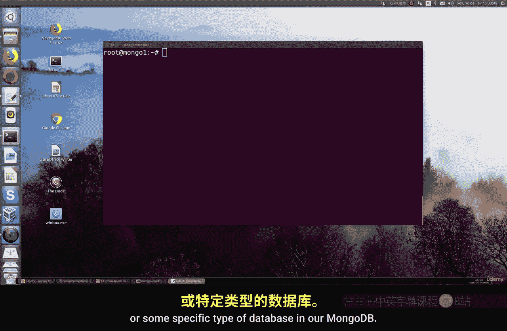
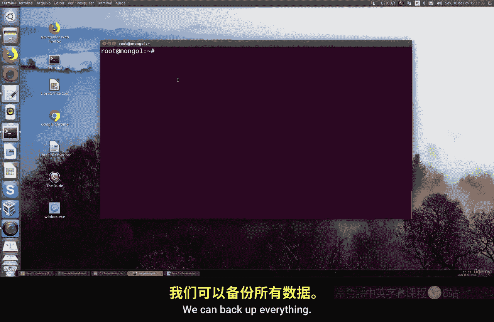
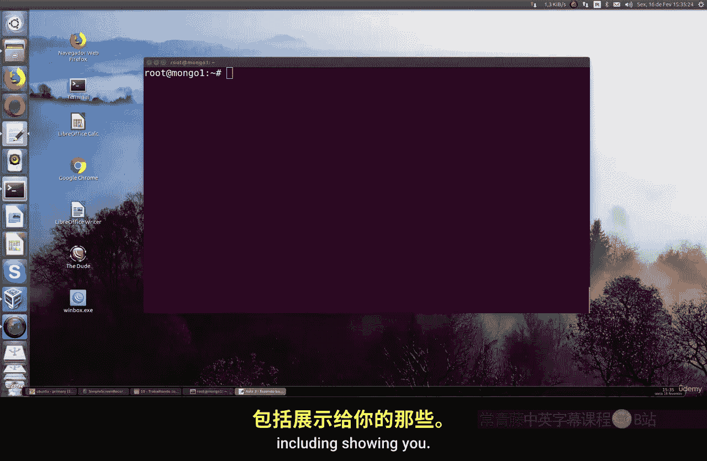
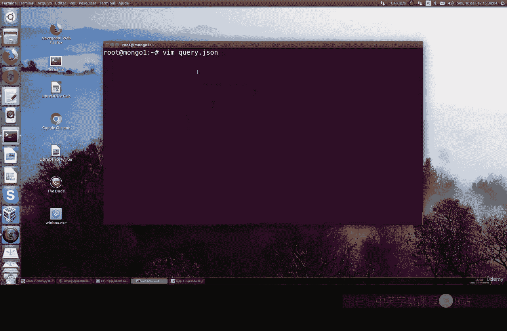
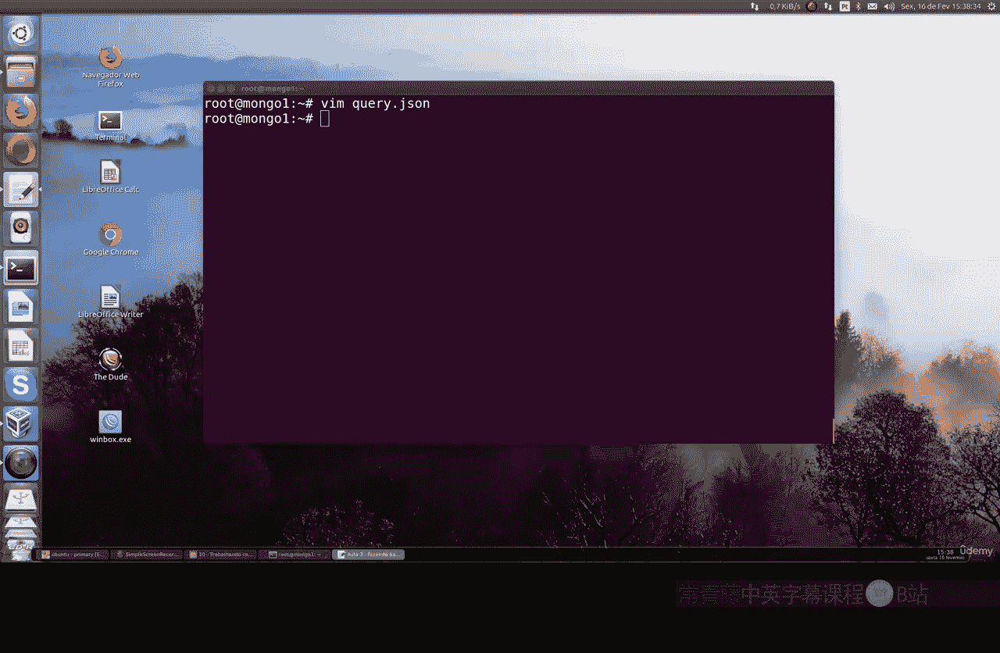
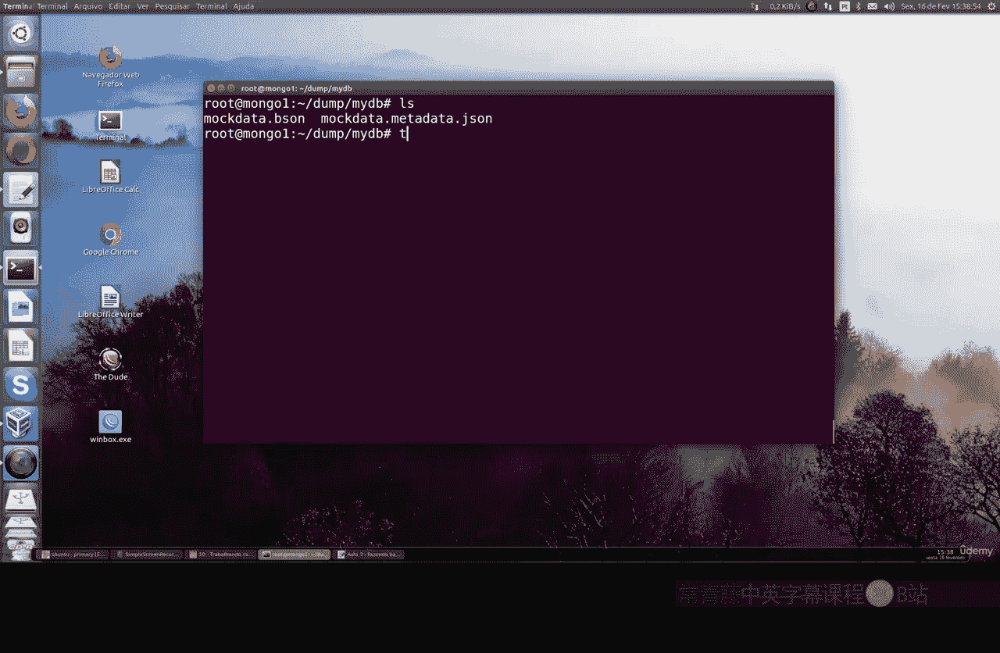

# 145：备份特定数据库与集合 📂

在本节课中，我们将学习如何在 MongoDB 中备份特定的数据库或特定类型的集合。上一节我们介绍了如何备份整个 MongoDB 实例，但实际情况中，我们并不总是需要备份所有数据。

有时，我们只需要备份特定的数据库或集合，而不是全部内容。这可以节省存储空间和时间，并使备份管理更加灵活。



## 备份特定数据库



首先，我们进入 MongoDB 环境，创建一个名为 `data` 的测试数据库，并向其中的一个集合插入简单的文档。

完成数据准备后，我们可以使用 `mongodump` 命令进行备份。以下是备份特定数据库的命令格式：

```bash
mongodump --gzip --db <数据库名称>
```

例如，要备份名为 `data` 的数据库，命令如下：


```bash
mongodump --gzip --db data
```

执行此命令后，MongoDB 将仅保存指定数据库及其包含的所有集合。备份过程会自动完成，并显示哪些文档已被保存。



## 备份特定集合

如果只需要备份数据库中的某个特定集合，操作更为简单。以下是备份特定集合的命令格式：


```bash
mongodump --gzip --db <数据库名称> --collection <集合名称>
```

例如，要备份 `data` 数据库中名为 `tpm` 的集合，命令如下：

```bash
mongodump --gzip --db data --collection tpm
```

此命令将保存该特定集合中的所有文档。

## 排除特定集合进行备份

在某些情况下，我们可能希望备份一个数据库中的所有集合，但排除其中的某一个。这可以通过以下命令实现：

```bash
mongodump --gzip --db <数据库名称> --excludeCollection <要排除的集合名称>
```

例如，要备份 `data` 数据库中除 `tpm` 集合外的所有集合，命令如下：

```bash
mongodump --gzip --db data --excludeCollection tpm
```

这样，您就可以灵活地选择备份除特定集合外的所有内容。




## 总结




本节课中，我们一起学习了 MongoDB 中备份特定数据库和集合的方法。通过使用 `mongodump` 命令的不同参数，我们可以实现：
*   备份整个特定数据库。
*   仅备份数据库中的某个特定集合。
*   备份数据库时排除指定的集合。




掌握这些灵活的备份策略，可以帮助您更有效地管理 MongoDB 的数据备份工作。