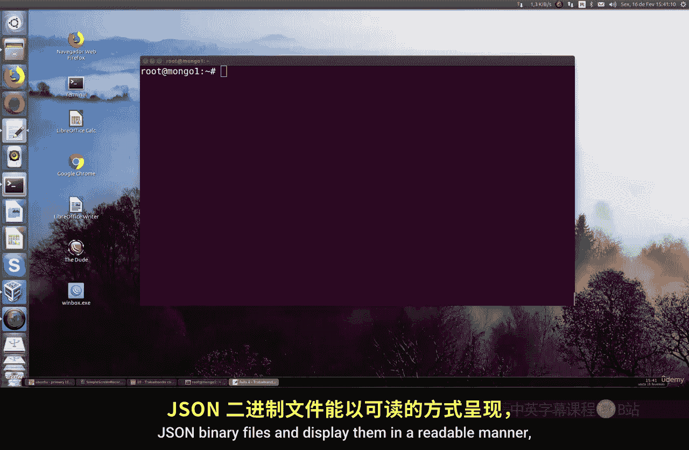
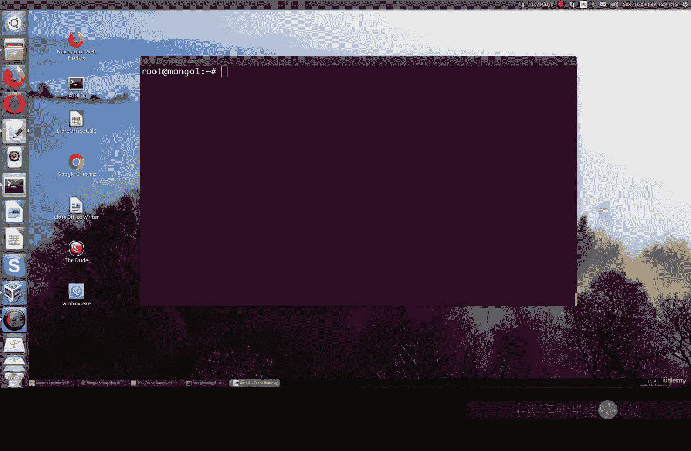
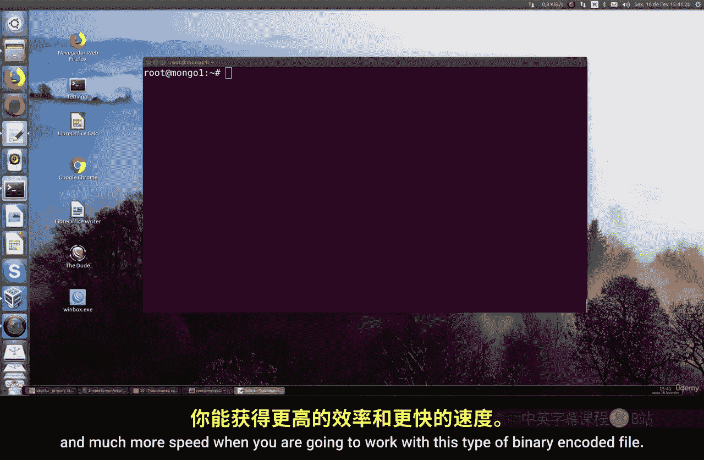
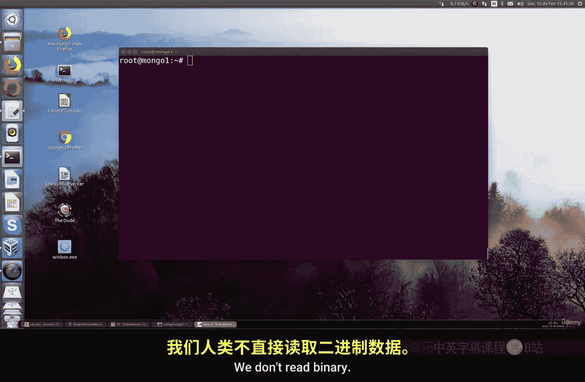
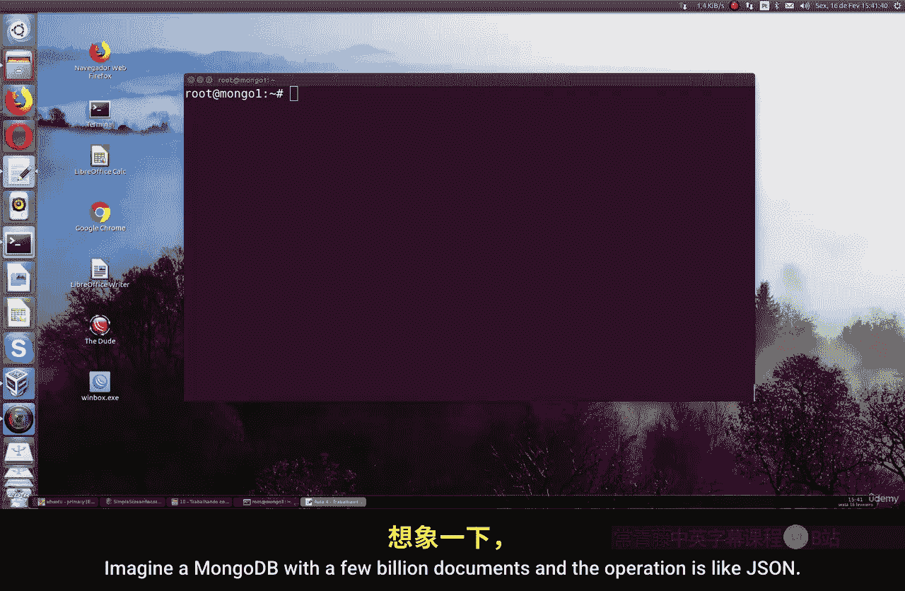
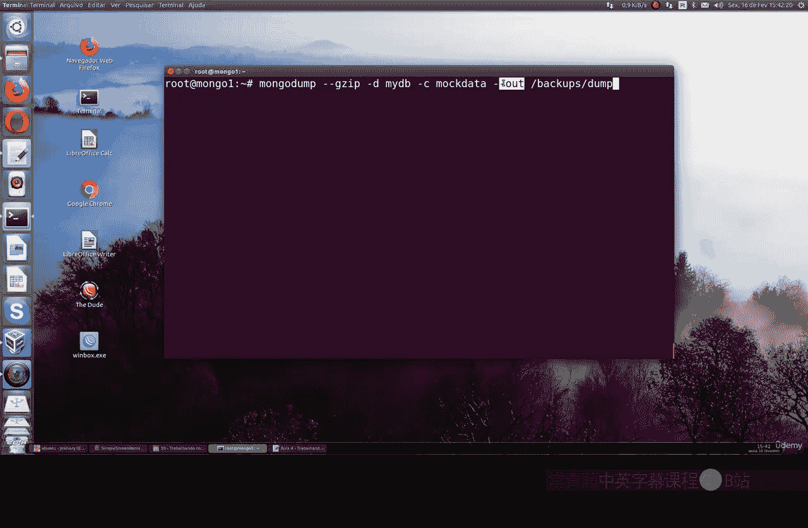

# 146：使用bsondump工具 🛠️

在本节课中，我们将学习如何使用 `bsondump` 工具来处理MongoDB的二进制JSON文件，即BSON文件。我们将了解其工作原理、优势以及如何通过命令行读取和分析这类文件。


## 概述 📋




`bsondump` 是一个用于分析和读取MongoDB二进制JSON文件（BSON）的工具。与普通的JSON文件相比，BSON格式在机器处理时效率更高，速度更快。本节将介绍如何使用 `bsondump` 将BSON文件转换为可读的格式。



## BSON与JSON的区别 🔍



上一节我们介绍了MongoDB的基本概念，本节中我们来看看BSON与JSON的区别。BSON是二进制编码的JSON，它在存储和传输数据时比纯文本JSON更高效。机器擅长处理二进制数据，而人类更习惯阅读文本格式。因此，当需要处理大量数据时，使用BSON可以显著提升性能。




## 使用bsondump工具 🛠️



了解了BSON的优势后，我们来看看如何使用 `bsondump` 工具。`bsondump` 可以将BSON文件转换为可读的JSON格式，便于我们分析和查看数据。

以下是使用 `bsondump` 的基本步骤：


1.  首先，确保你已经安装了MongoDB工具包，其中包含 `bsondump` 命令。
2.  使用 `ls -all` 命令查看当前目录下的文件，确认存在BSON类型的文件。
3.  运行 `bsondump` 命令，指定BSON文件作为输入，工具会自动将其转换为可读的JSON格式输出到终端。



例如，假设我们有一个名为 `data.bson` 的文件，可以通过以下命令查看其内容：

```bash
bsondump data.bson
```

## 性能优势 ⚡

使用BSON格式处理数据可以带来显著的性能优势。当MongoDB数据库包含数十亿条文档时，使用BSON格式进行备份和恢复操作会比使用纯JSON格式快得多。虽然本节没有提供具体的性能测试数据，但你可以自行进行测试，体验其速度的提升。

## 总结 📝

本节课中我们一起学习了 `bsondump` 工具的使用。我们了解到BSON是MongoDB中高效的二进制JSON格式，`bsondump` 工具能够帮助我们将BSON文件转换为人类可读的JSON格式。在处理大规模数据时，优先使用BSON格式可以节省时间和计算资源，提高工作效率。记住，时间就是金钱，选择高效的工具至关重要。