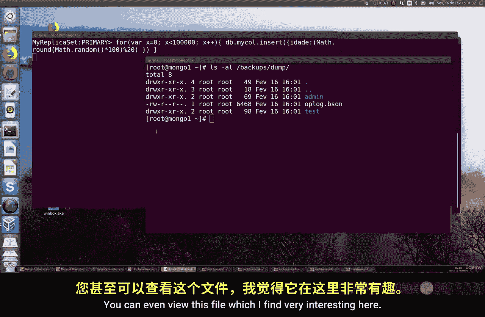
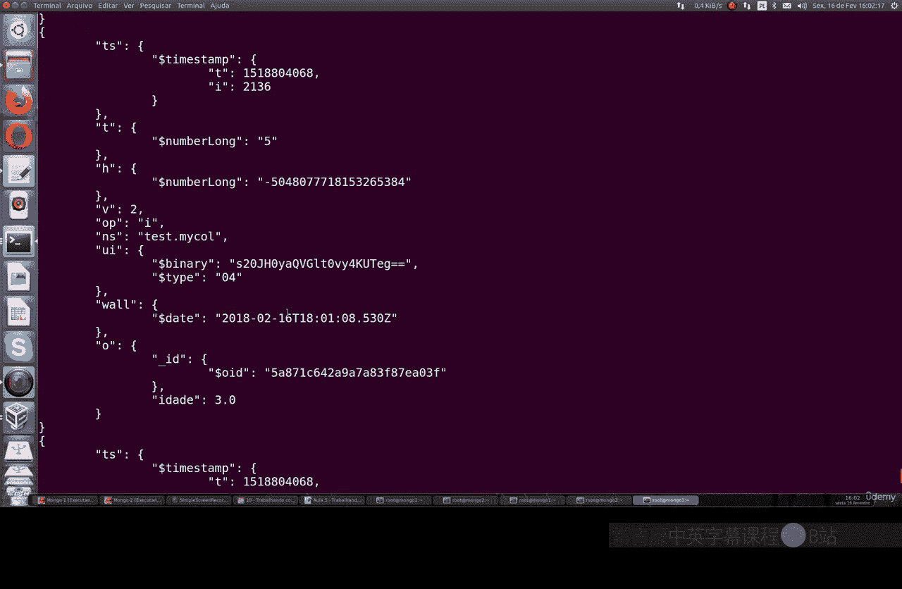

# 147：使用高可用性进行MongoDB备份 🔄

在本节课中，我们将学习如何在MongoDB运行时，利用其高可用性（副本集）功能进行备份。这是一种无需停止数据库服务即可完成备份的有效方法。

## 概述

上一节我们介绍了MongoDB的基础操作，本节中我们来看看如何为运行中的MongoDB副本集进行备份。这在生产环境中尤为重要，因为很多时候我们无法停止服务来进行备份操作。

## 准备工作

开始之前，请确保你已经按照命令行课程中的步骤，搭建并运行着一个MongoDB副本集。本节课将基于一个正常运行的副本来进行演示，而不会重复讲解副本集的搭建过程。

## 生成测试数据

为了演示备份过程，我们首先需要在主节点上插入一些测试数据。以下是创建包含随机年龄的文档的示例代码：

```javascript
// 在主节点的MongoDB shell中执行
for (var i = 0; i < 100; i++) {
    db.users.insert({ "name": "User" + i, "age": Math.floor(Math.random() * 100) });
}
```

这段代码会在 `users` 集合中插入100个文档，每个文档包含一个姓名和一个随机生成的年龄。

## 执行运行时备份

在数据持续插入的同时，我们可以在另一个终端（连接到同一台机器和端口）执行备份命令。以下是核心的备份命令：

```bash
mongodump --port <你的端口号> --oplog
```

请将 `<你的端口号>` 替换为你MongoDB实例实际运行的端口号。这个命令会捕获备份时间点附近的所有操作日志。

## 查看备份日志

命令执行后，系统会生成备份文件。你可以通过以下命令查看备份目录和日志文件：

```bash
ls -l
```



查看生成的日志文件（通常以 `.bson` 或 `.json` 格式存在），可以让你了解备份期间数据库的所有操作记录。

## 操作流程总结

以下是整个备份过程的关键步骤总结：

1.  **确认副本集运行**：确保你的MongoDB副本集处于健康运行状态。
2.  **模拟生产负载**：在主节点上执行数据插入操作，模拟真实的生产环境。
3.  **执行备份命令**：在另一个终端使用 `mongodump --oplog` 命令开始备份。
4.  **验证备份结果**：检查生成的备份文件和操作日志，确认备份成功。

## 总结



本节课中我们一起学习了如何为运行中的MongoDB副本集执行备份。通过使用 `--oplog` 参数，我们可以在不中断服务的情况下，获取一个数据一致性的备份点。这种方法对于需要高可用性的生产系统来说，是一个非常重要且实用的技巧。