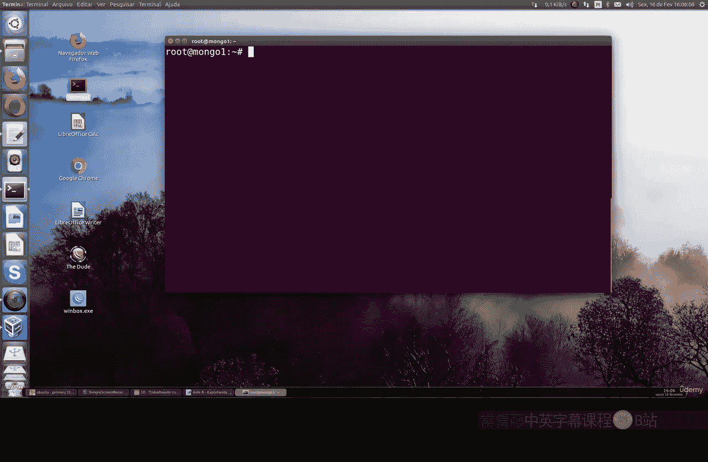
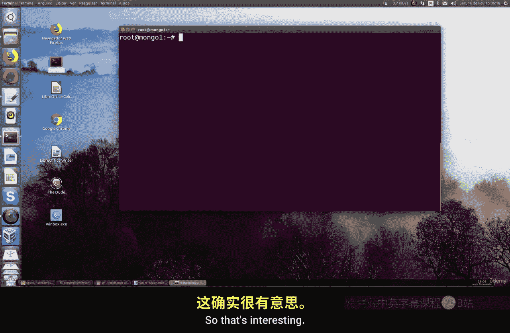
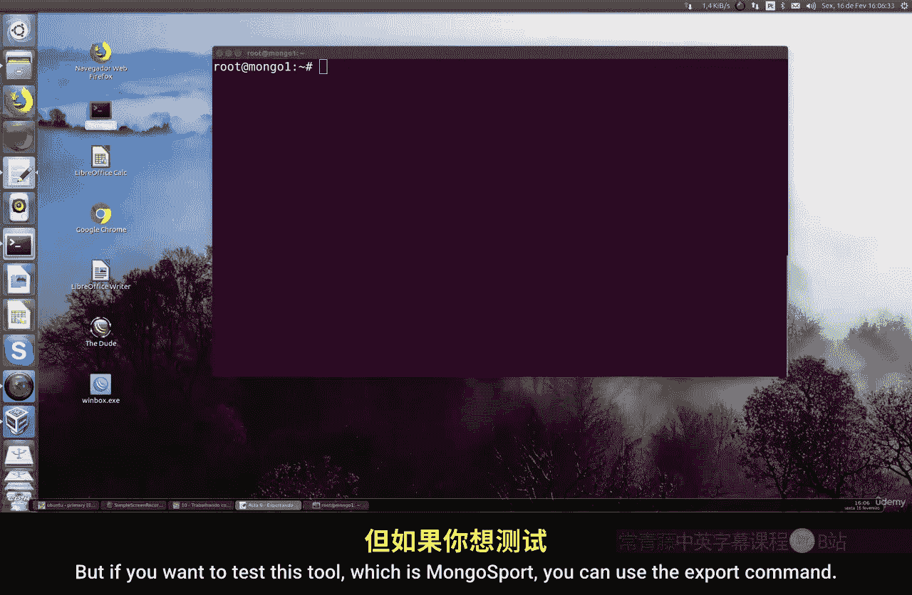

Linux命令行基础：Part2：使用mongoexport导出数据 📤

在本节课中，我们将学习如何使用 `mongoexport` 工具从MongoDB数据库中导出数据。我们将了解其基本用法、适用场景以及需要注意的事项。



---

`mongoexport` 并非生产环境中执行备份的合适工具。然而，它在快速提取数据以生成报告时非常有用。例如，你可以用它来快速生成JSON格式的备份或Excel CSV类型的报告。



虽然不推荐在生产环境中使用此方法，但如果你想测试 `mongoexport` 工具，可以按照以下步骤操作。


以下是 `mongoexport` 命令的基本语法结构：



```bash
mongoexport -d <database_name> -c <collection_name> -f <field1,field2,...> -o <output_file> --type=<csv|json>
```

**参数解释：**
*   `-d`: 指定要导出的数据库名称。
*   `-c`: 指定要导出的集合名称。
*   `-f`: 指定要导出的字段，用逗号分隔。
*   `-o`: 指定输出文件的路径和名称。
*   `--type`: 指定输出文件的格式，如 `csv` 或 `json`。

例如，命令 `mongoexport -d mydb -c mycollection -f name,age -o my_data.csv --type=csv` 会将 `mydb` 数据库中 `mycollection` 集合的 `name` 和 `age` 字段导出到 `my_data.csv` 文件。

你还可以通过 `-q` 参数指定一个查询条件来过滤要导出的数据。这允许你只导出符合特定条件的文档。

导出完成后，你可以直接查看生成的文件。例如，对于CSV文件，可以使用文本编辑器或命令行工具（如 `cat` 或 `less`）进行查看。命令 `cat my_data.csv` 会显示文件的内容。

这个工具速度很快，操作简单。当你需要生成临时报告，或者快速创建一个可供读取和分发的数据文件时，`mongoexport` 是一个不错的选择。

---

本节课中，我们一起学习了 `mongoexport` 工具的基本使用方法。我们了解到它主要用于快速数据提取和报告生成，虽然简单高效，但不适用于生产环境的正式备份。记住在需要临时处理数据时可以考虑使用它。