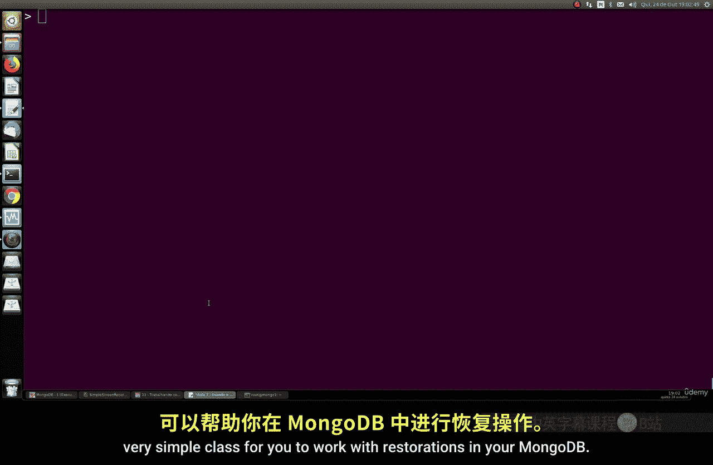

# 149：使用 mongorestore 进行不同类型恢复 🛠️

在本节课中，我们将学习如何使用 `mongorestore` 工具从备份中恢复数据。我们将探讨几种不同类型的恢复操作，这对于数据库管理至关重要。

## 概述

备份是数据库管理中的基础环节。上一节我们介绍了如何使用 `mongodump` 创建备份，本节中我们来看看如何使用 `mongorestore` 从这些备份文件中恢复数据。我们将学习如何执行完整恢复、测试恢复、选择性恢复以及重命名恢复。

## 完整恢复

首先，我们演示如何进行完整的数据库恢复。假设我们已经使用 `mongodump` 备份了一个名为 `mockData` 的数据库，其中包含大约 1000 个随机文档。

要恢复整个备份，我们使用 `mongorestore` 命令，并配合 `--drop` 参数。这个参数会先删除目标服务器上已存在的同名数据库，然后再进行恢复。

```bash
mongorestore --drop /path/to/your/backup/dumps/
```

执行此命令后，`mongorestore` 会读取备份目录中的所有数据，包括数据库、集合、索引和文档，并将它们完整地恢复到 MongoDB 服务器中。

## 恢复测试（预演）

在实际执行恢复之前，有时我们希望预览恢复操作的结果，检查是否有错误或问题。这时可以使用 `--dryRun` 参数。

```bash
mongorestore --dryRun /path/to/your/backup/dumps/
```

这个命令会模拟整个恢复过程，显示将要执行的操作（例如，会恢复哪些数据库和集合），但并不会真正地将数据写入数据库。这对于验证备份文件的完整性和恢复参数非常有用。

## 选择性恢复

我们并不总是需要恢复整个备份。`mongorestore` 允许我们只恢复特定的数据库或集合。

以下是选择性恢复的操作方法：

### 恢复特定数据库和集合

使用 `--nsInclude` 参数可以指定要恢复的命名空间（即数据库和集合）。例如，只恢复 `mockData` 数据库中的 `mockData` 集合：

```bash
mongorestore --drop --nsInclude="mockData.mockData" /path/to/your/backup/dumps/
```

### 排除特定数据库和集合

相反地，使用 `--nsExclude` 参数可以排除不想恢复的部分。例如，恢复除 `local` 数据库外的所有数据：

```bash
mongorestore --drop --nsExclude="local.*" /path/to/your/backup/dumps/
```

### 使用通配符

你还可以使用通配符 `*` 进行模式匹配。例如，恢复 `mockData` 数据库下的所有集合：

```bash
mongorestore --drop --nsInclude="mockData.*" /path/to/your/backup/dumps/
```

## 重命名恢复

有时，你可能希望将数据恢复到一个不同名称的数据库或集合中。`mongorestore` 的 `--nsFrom` 和 `--nsTo` 参数可以实现这一点。

例如，将备份中 `mockData.mockData` 的数据，恢复到名为 `db2.collection2` 的新集合中：

```bash
mongorestore --drop --nsFrom="mockData.mockData" --nsTo="db2.collection2" /path/to/your/backup/dumps/
```

执行后，你可以连接到 MongoDB 验证：

```javascript
use db2
show collections
// 你将看到 collection2 集合
db.collection2.find().count()
// 这将显示恢复的文档数量
```

## 在同一数据库中创建集合副本

另一个有用的技巧是在同一个数据库内，从一个集合的备份创建一个名称不同的新集合。这相当于复制了一个集合。

例如，将 `mockData` 数据库中的 `mockData` 集合备份，并恢复为同库下的 `mockData_copy` 集合：

```bash
# 首先备份特定集合
mongodump --db mockData --collection mockData --out ./backup/
# 然后恢复并重命名集合
mongorestore --nsFrom="mockData.mockData" --nsTo="mockData.mockData_copy" ./backup/
```

恢复后，在 `mockData` 数据库中，你将拥有两个内容完全相同但名称不同的集合：`mockData` 和 `mockData_copy`。

## 总结

本节课中我们一起学习了 `mongorestore` 工具的强大功能。我们掌握了如何进行完整恢复、通过 `--dryRun` 进行恢复预演、使用 `--nsInclude` 和 `--nsExclude` 进行选择性恢复、以及利用 `--nsFrom` 和 `--nsTo` 实现重命名恢复和在库内复制集合。灵活运用这些技巧，可以让你高效、精准地管理 MongoDB 的数据恢复工作。

---




**注意**：课程相关问题请在课程论坛提问，将会得到解答。