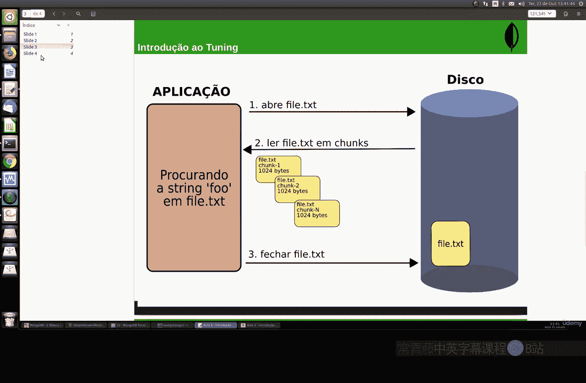
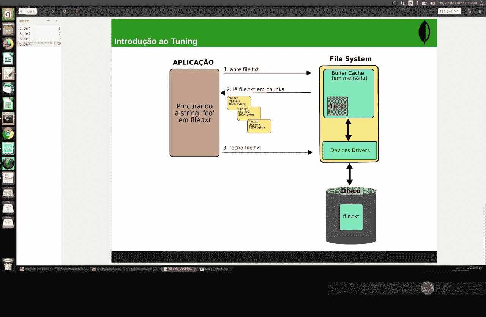
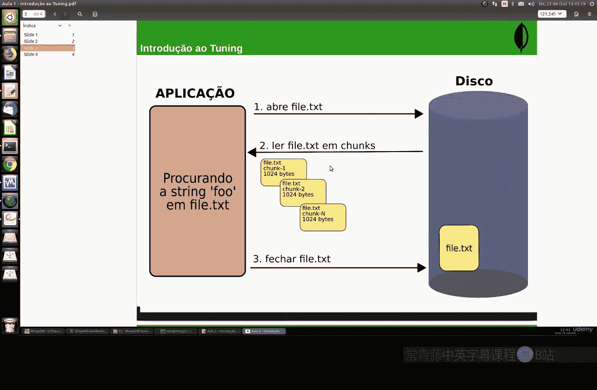
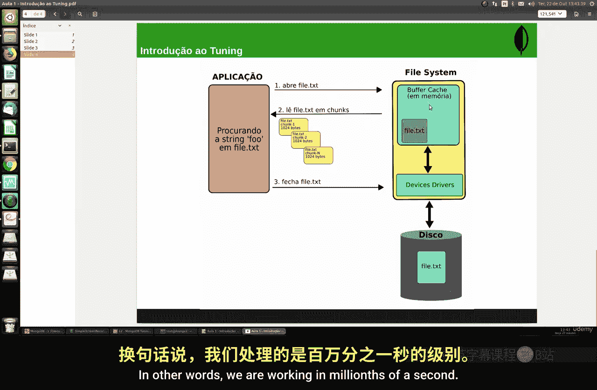
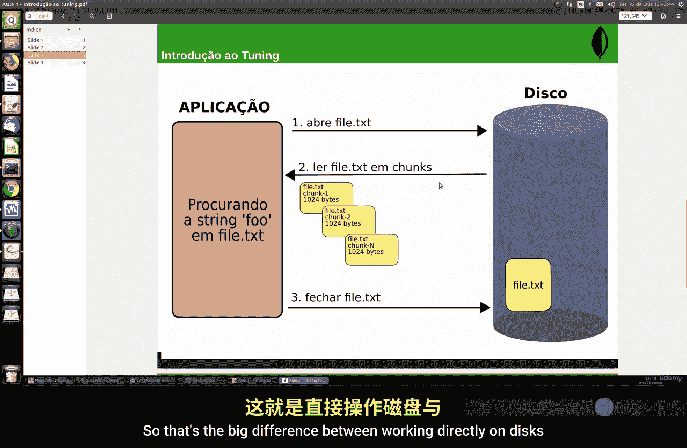
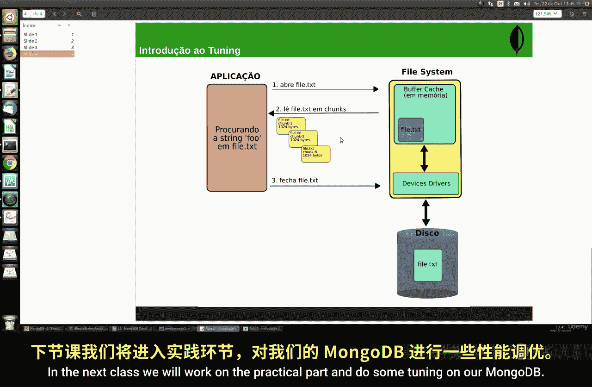

# 150：调优介绍 🚀

在本节课中，我们将学习MongoDB数据库性能调优的基础知识。调优是一个非常重要的主题，它不仅是许多学生的需求，也是市场对数据库管理技能的核心要求。我们将从理解数据库如何与系统资源交互开始，为后续的实践操作打下理论基础。

## 数据库如何工作 💡

上一节我们概述了调优的重要性，本节中我们来看看MongoDB乃至所有数据库工作的基本原理。除了依赖RAM（内存）和CPU（中央处理器）之外，MongoDB在服务器上大量使用磁盘。

为了让大家更好地理解这种依赖关系，我将上一堂理论课，介绍数据库调优背后的逻辑。这不仅适用于MongoDB，也基本适用于你使用的所有数据库，例如PostgreSQL、MySQL、MariaDB、Oracle等。

## 一个简单的读写示例 📖

为了说明问题，让我们看一个非常简单的例子：一个应用程序在磁盘上读写文件。

假设你有一个包含几千行的文件，每行包含一组字符串，这些字符串没有任何特定的顺序。如果有人编写一个程序来搜索特定的字符串序列，例如单词“full”，那么程序需要打开文件，并逐行搜索该序列。

以下是这个过程的步骤：
1.  应用程序在磁盘上打开TXT文件。
2.  它以数据块的形式读取TXT文件。
3.  它逐块（chunk1, chunk2, ... chunk N）读取。
4.  它读取并显示数据。
5.  最后，它关闭文件。

这些操作完全在磁盘上执行。你可以看到，这发生在你的硬盘驱动器（HDD）、固态硬盘（SSD）或任何存储MongoDB数据的磁盘上。

这种每次查询都读取文件的方式效率非常低，因为磁盘的读写速度远低于内存。

## Linux的缓存机制 ⚡

为了克服直接磁盘读写的低效性，Linux操作系统内核严重依赖于内存中的缓存缓冲区。

内核使用这个缓存来存储所有从磁盘频繁读取的数据块。因此，当一个进程试图读取特定文件时，内核首先在你的缓存中搜索数据。如果数据已存储在缓存中，它就不会去读取整个磁盘。

如下图所示，数据将被存储在缓冲缓存中。

缓存中的数据会根据其使用频率被移除。某种查询使用得越多，其频率就越高，在缓存中保留的时间就越长；使用得越少，就越会被自动移除。这就是我们RAM内存中的缓存缓冲区。

此外，内核会尝试将所有可用的空闲内存用于缓存，但如果任何其他进程需要更多内存，它会自动调整缓存大小。

## 缓存带来的性能提升 🚄

这种缓存设计是为了规避磁盘读写固有的延迟。任何类型的应用程序或系统，无论是MongoDB、Node.js还是Python，都非常依赖磁盘的输入/输出（I/O）。

另一方面，如果设置为使用RAM，速度会极快。

为了让你有个概念，如果你使用直接读写磁盘的应用程序，我们谈论的时间尺度大约是千分之一秒（毫秒）级别。

而如果我们采用使用文件系统缓存和RAM的方案，我们工作的时间尺度是纳秒级别，也就是十亿分之一秒。

这就是直接工作在磁盘上与间接通过RAM和缓存工作在磁盘上的巨大差异。这种间接的工作方式极大地提升了磁盘读写的性能和效率。

## 核心概念总结 📊

了解这种差异非常重要，因为磁盘读写性能是决定数据库（如MongoDB）速度快慢的关键因素。知道如何配置这些设置对于优化任何类型的数据库都至关重要。

本节课中我们一起学习了数据库调优的基本原理，特别是Linux缓存机制如何通过减少磁盘I/O来大幅提升数据库性能。我们了解到，通过让数据更多地驻留在高速的RAM中（即使是作为缓存），可以避免缓慢的磁盘访问，这是所有数据库性能优化的核心逻辑之一。

在下一节课中，我们将进入实践部分，在我们的MongoDB上进行一些实际的调优操作。