# 151：测量MongoDB性能 🔍

在本节课中，我们将学习如何分析和测量MongoDB数据库的性能。我们将重点关注三个核心领域：事务的阻塞性能、内存使用情况以及数据库连接的管理。通过理解这些关键指标，你可以判断数据库是否存在性能瓶颈，并做出相应的优化决策。

## 事务阻塞性能分析 🔒

上一节我们介绍了课程概述，本节中我们来看看事务的阻塞性能。MongoDB在一个包含多种事务类型（如读取、写入和更新）的环境中运行。客户端（通常是应用程序）的访问通常不是顺序的，并且可能同时操作正在被其他请求更新的数据。

为了更好地理解，如果一个客户端尝试读取另一个客户端正在更新的文档，可能会产生冲突。这可能导致数据丢失或意外的更改。为了解决这个问题，MongoDB使用一种锁机制来维护数据一致性。它会锁定特定的文档或集合。

例如，如果一个读取操作正在等待一个写入操作完成，而该写入操作耗时过长，那么后续的其他操作也必须等待这个写入操作完成。通常，单个大型的写入或读取操作本身就足以影响数据库的性能。如果服务器长时间无响应，可能会导致副本集状态改变，甚至产生多米诺骨牌效应。

MongoDB提供了一些有用的指标来帮助你确定阻塞是否正在影响数据库性能。

以下是查看全局锁状态和相关指标的命令：

```bash
db.serverStatus().globalLock
```

执行该命令后，你会看到一些关键信息。其中，`currentQueue.total` 这个数字可能指示并发性问题。如果这个值非常高，可能意味着存在问题。这通常发生在多个请求等待锁释放时。这个队列不能太长，否则确实可能存在某种问题。

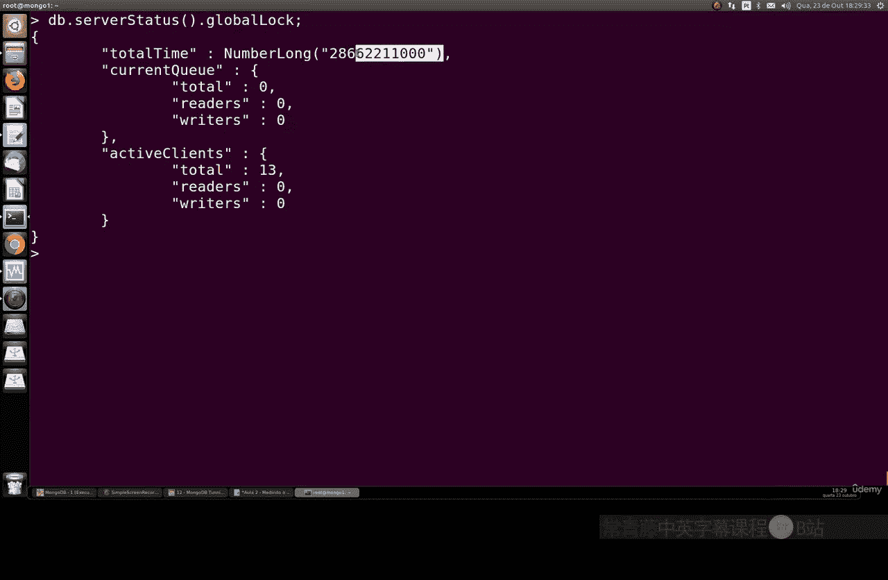

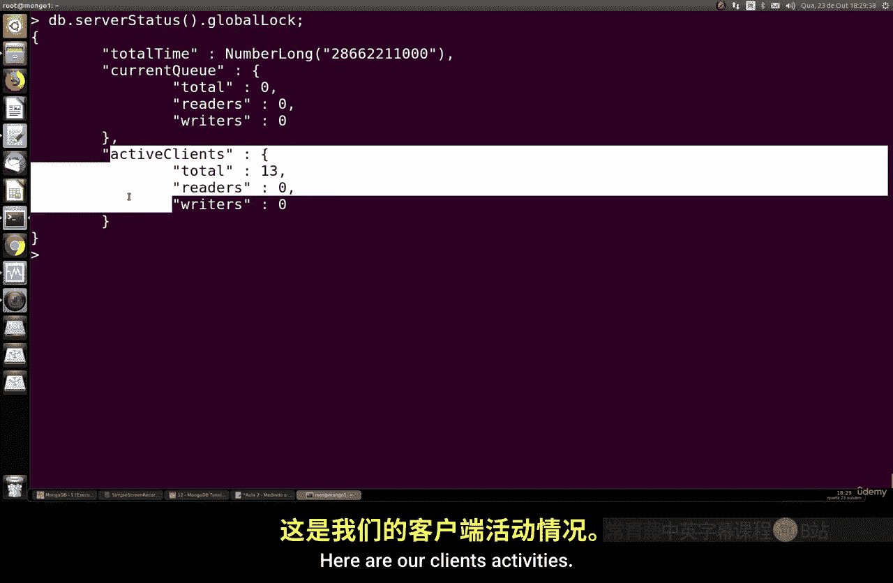

另一个关键指标是 `totalTime`。这个值基本上是数据库处于锁定状态的总时间。它不应该比数据库的总运行时间（uptime）长太多。如果它远大于数据库的运行时间，说明数据库可能长时间处于阻塞状态，需要引起注意。

## 内存使用情况监控 💾

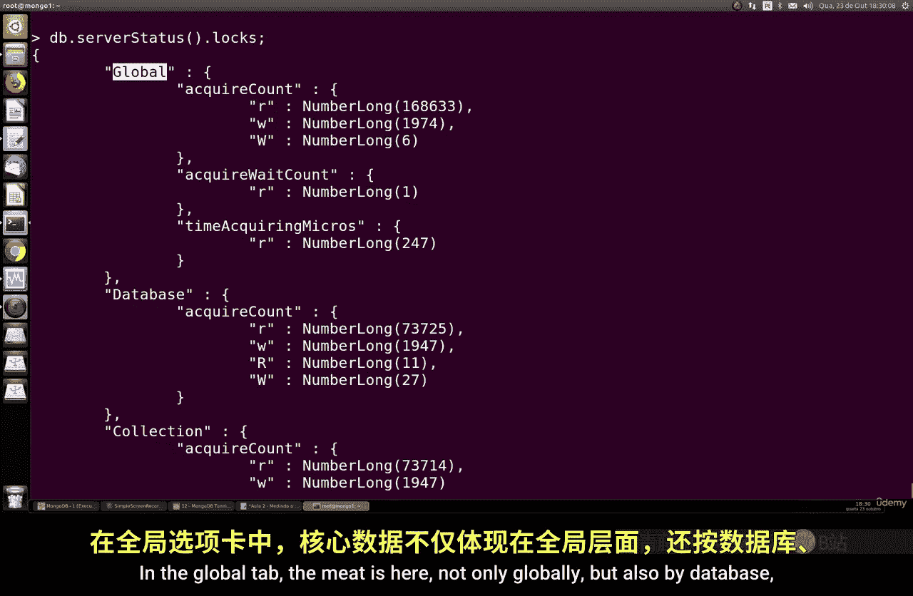

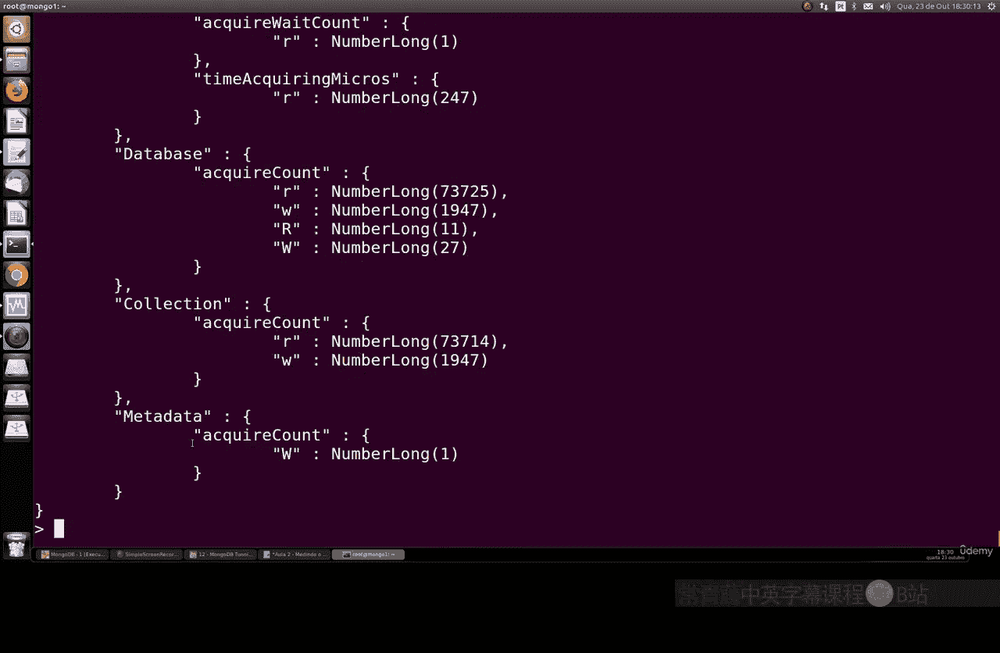

上一节我们分析了事务阻塞，本节中我们来看看内存使用情况。我们可以查看MongoDB的内存指标。

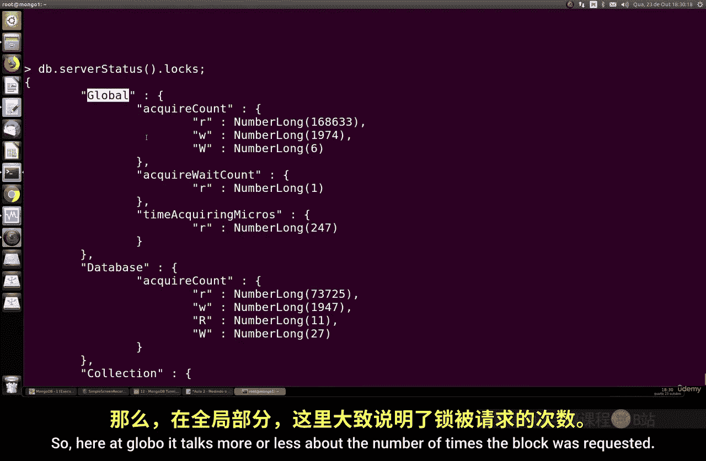

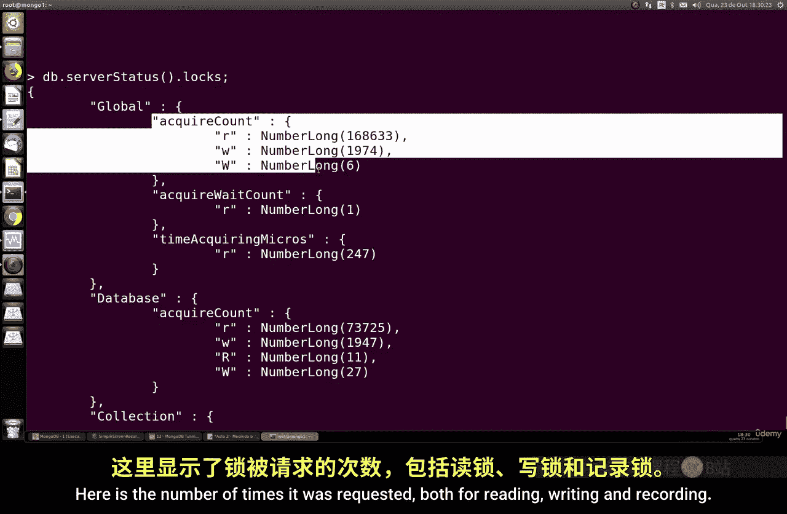

以下是查看内存使用情况的关键命令和字段：

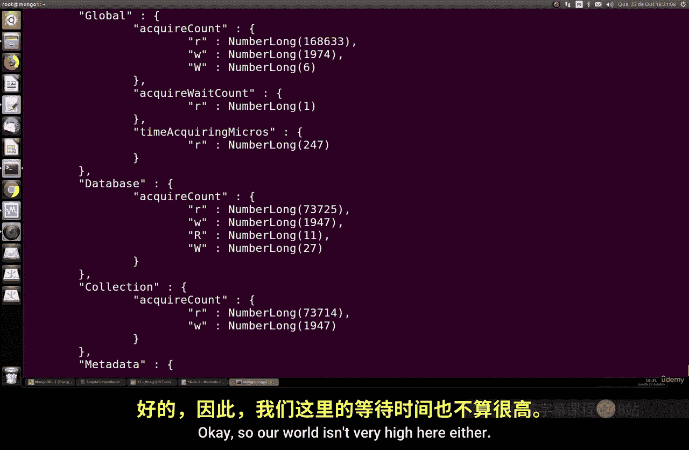

```bash
db.serverStatus().mem
```

在这些字段中，最重要的是 `resident` 字段。它的值（单位是MB）大致相当于数据库进程使用的物理内存（RAM）量。例如，`"resident" : 143` 表示使用了大约143MB内存。

我们还可以查看 `mapped` 字段，它表示数据库映射的内存量（单位也是MB）。我们需要将 `resident` 值与系统的内存配额进行比较，以判断是否超出了系统容量。

如果 `resident` 字段的值超过了系统内存值，并且有大量数据未映射到磁盘，那么我们可能已经超出了系统的承载能力。这时需要考虑进行一些改变，例如升级到更强大的服务器（更好的处理器、更多内存）、使用集群等。

## 存储引擎缓存调整 ⚙️

上一节我们检查了内存使用，本节中我们来调整存储引擎缓存。默认情况下，MongoDB的WiredTiger存储引擎会保留50%的可用RAM用于数据缓存。

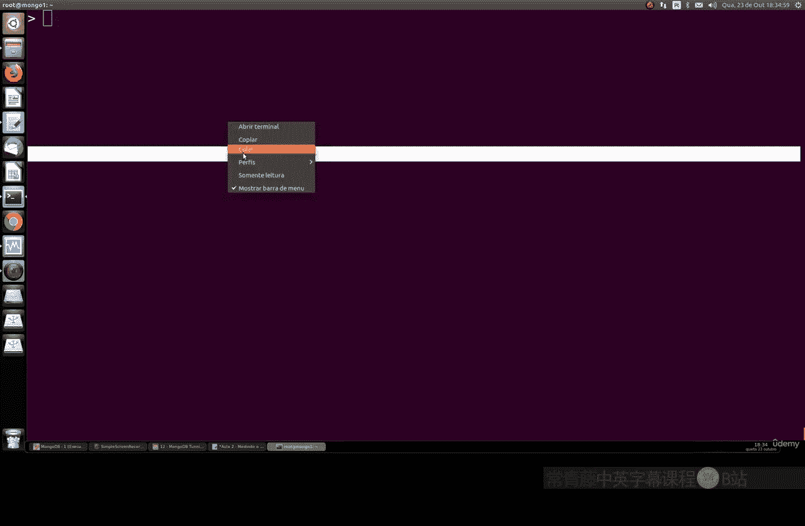

例如，如果你的机器有8GB RAM，那么至少有4GB会被WiredTiger使用。这个缓存大小对于确保系统正常运行非常重要，因此值得检查是否需要调整。

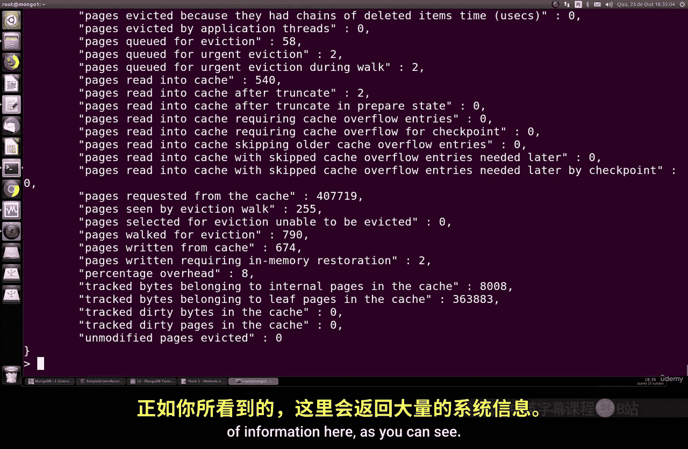

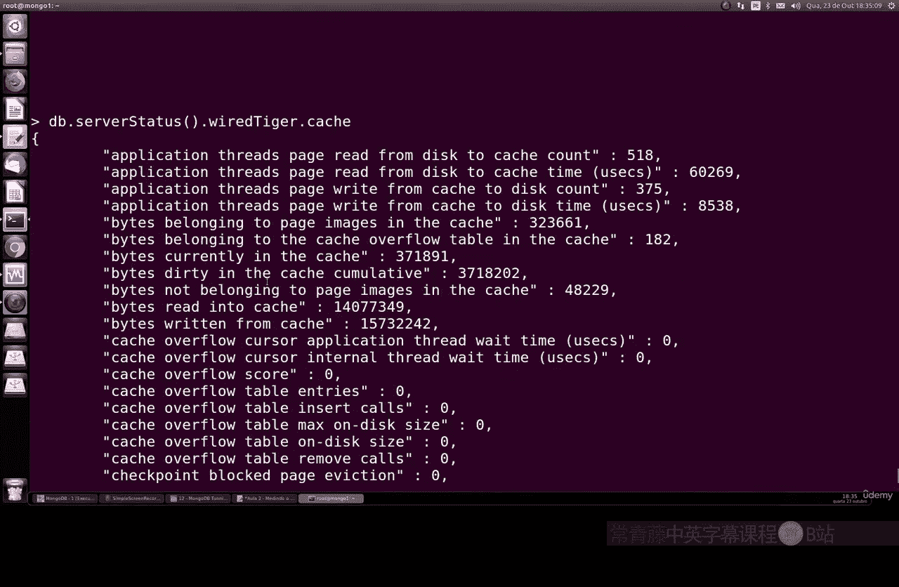

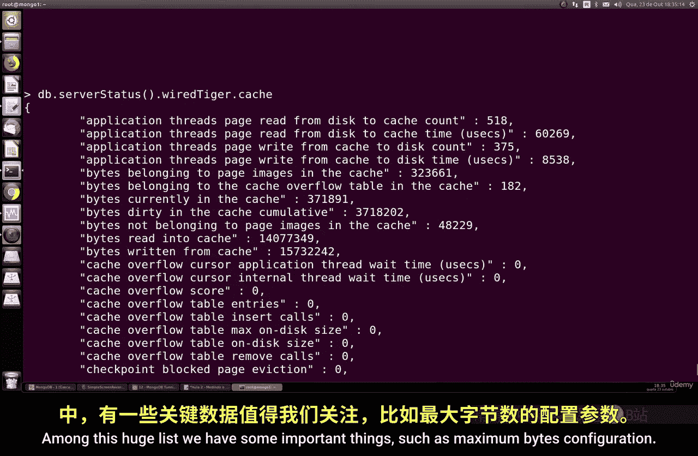

以下是查看和评估缓存配置的命令：

```bash
db.serverStatus().wiredTiger.cache
```

在返回的大量信息中，有几个重要的字段：
*   `"maximum bytes configured"`：这是缓存的最大大小（单位是字节）。你需要将其转换为MB来正确查看。这个值默认大约是你RAM的一半。
*   `"bytes currently in the cache"`：这是缓存中数据的当前大小（单位是字节）。这个值显然不应该大于 `maximum bytes configured`。
*   `"tracked dirty bytes in the cache"`：这是缓存中“脏数据”的大小。这个值应该远小于 `bytes currently in the cache`。

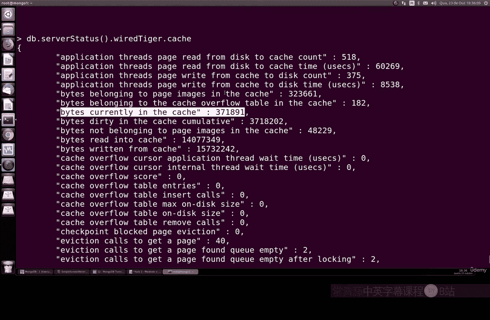

通过观察这些值，我们可以判断是否需要增加缓存。此外，`bytes read into cache` 字段也很有用。如果你的应用程序进行大量读取操作，这个值会增长，你可能需要考虑增加缓存大小。同样，如果写入量很大，也可能需要调整。

## 连接监控与管理 🔗

上一节我们讨论了缓存调整，本节中我们来看看连接监控。服务器对连接数有物理限制（如CPU、内存）。应用程序与数据库之间的大量连接可能会使数据库过载，从而限制其处理能力。

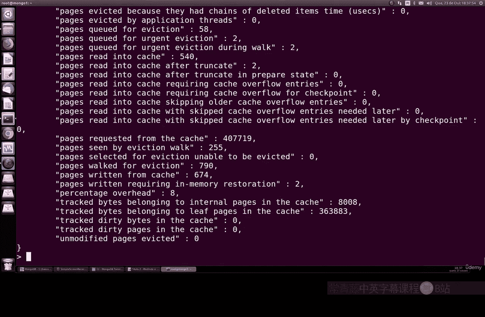

通常，让MongoDB在10个连接下稳定工作，比在120个连接下全部崩溃要好。你可以限制连接数，直到你决定升级基础设施。

以下是查看连接状态的关键命令：

```bash
db.serverStatus().connections
```

返回的信息中，`current` 字段表示当前活跃连接数，这是一个非常重要的指标。你需要检查你的应用程序是否创建了过多连接，以及这是否是实际需要的。如果连接数过多且请求量巨大，那么你真的需要考虑通过集群等方式来分发负载。

## 总结 📝

本节课中我们一起学习了如何测量和分析MongoDB的核心性能指标。我们探讨了如何通过 `db.serverStatus()` 命令查看：
1.  **全局锁状态**（`globalLock`），以识别事务阻塞问题。
2.  **内存使用情况**（`mem`），特别是 `resident` 字段，以确保未超出系统内存容量。
3.  **存储引擎缓存**（`wiredTiger.cache`）的配置和使用情况，以优化读写性能。
4.  **当前连接数**（`connections`），以管理数据库负载并避免过载。

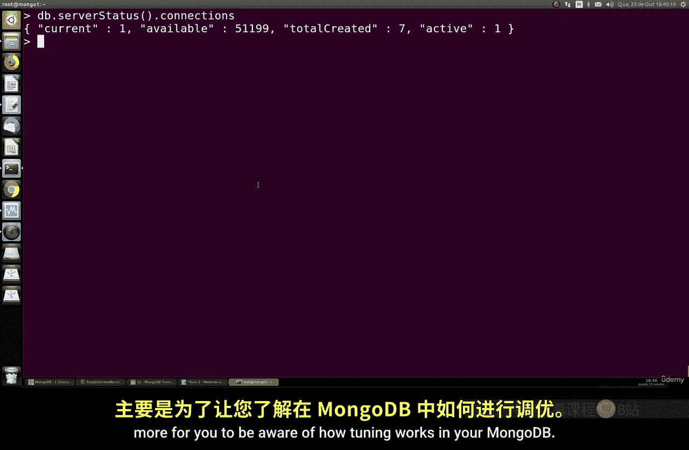

这些指标是进行MongoDB性能调优的基础。通过定期监控它们，你可以及时发现潜在问题，并采取相应措施（如优化查询、调整配置、升级硬件或架构）来确保数据库的稳定高效运行。在接下来的课程中，我们将学习如何具体调整这些配置参数。