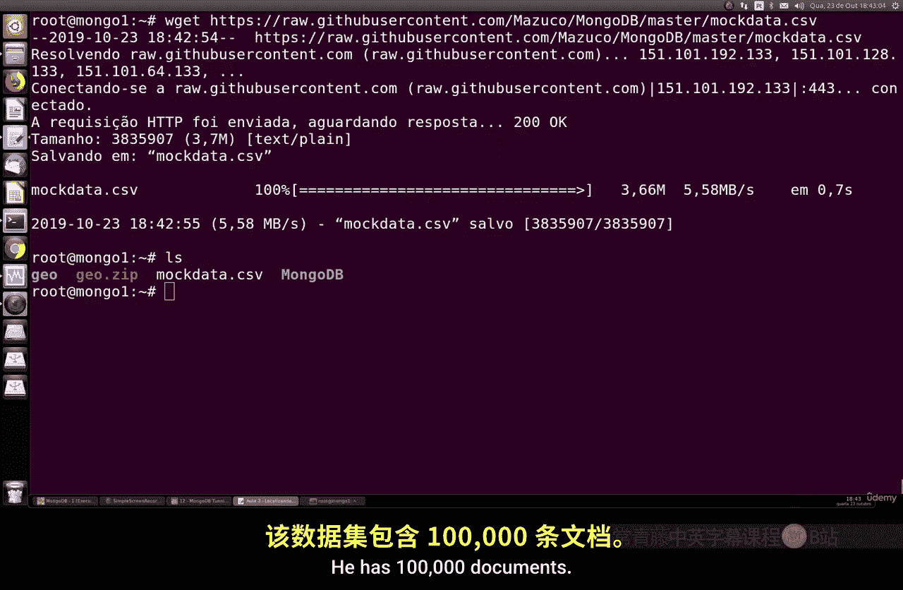
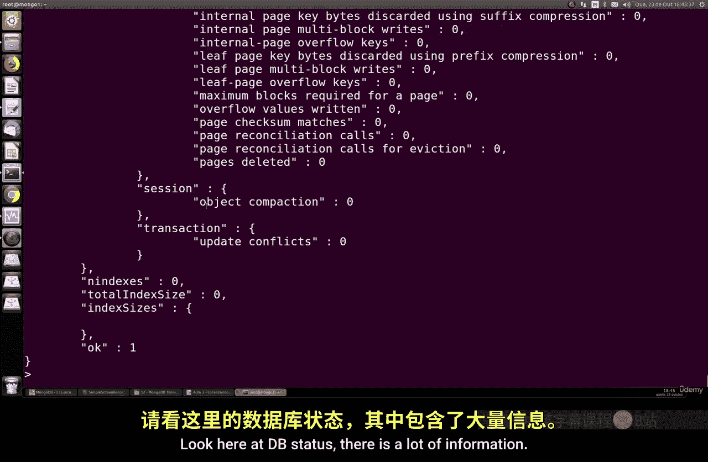
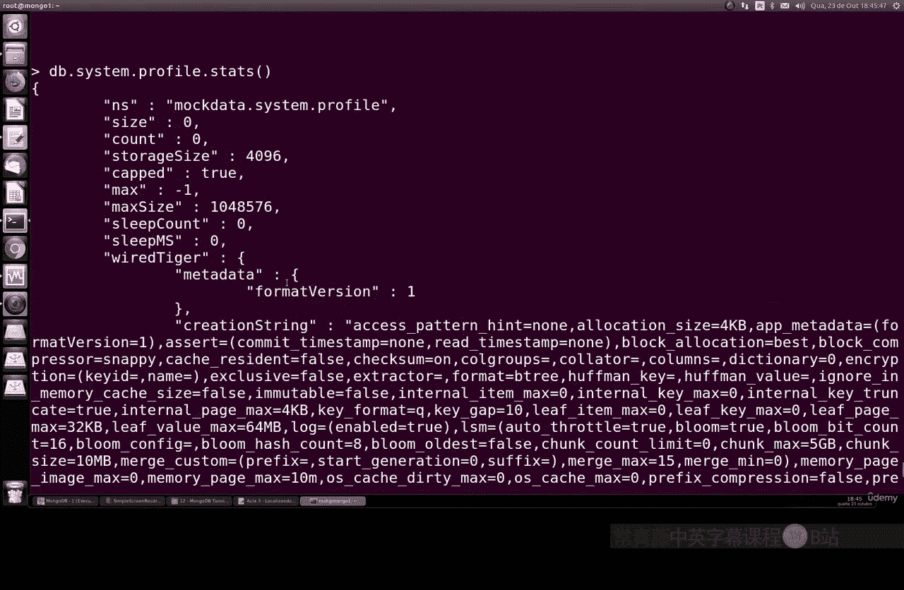
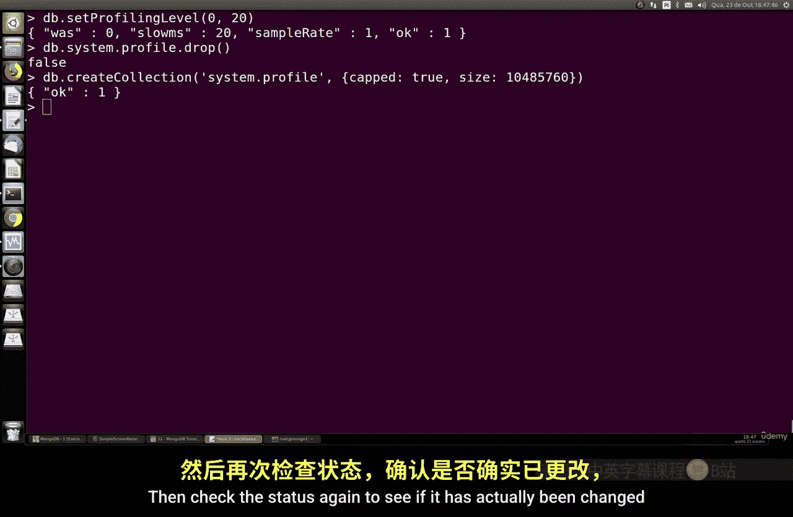
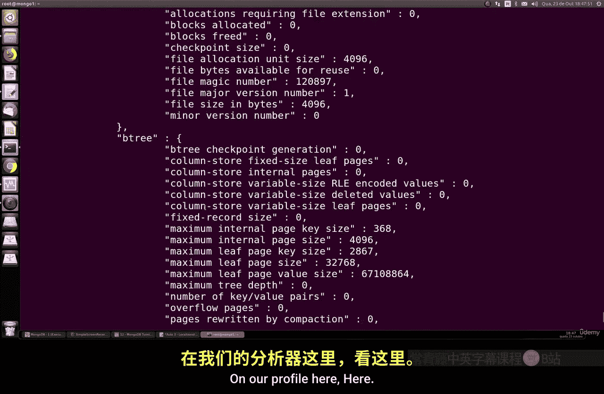
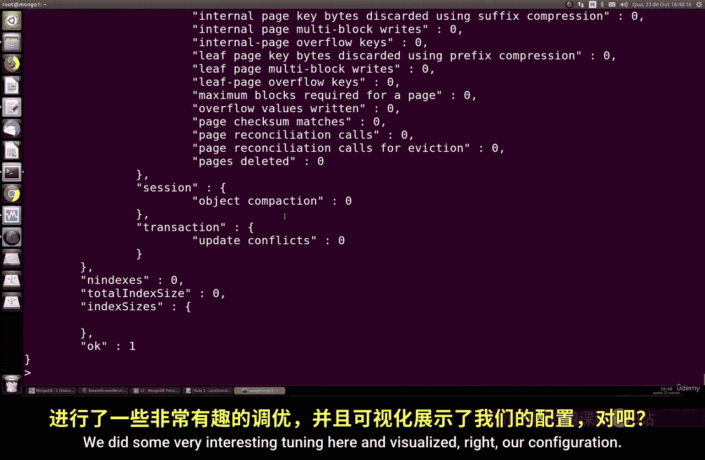
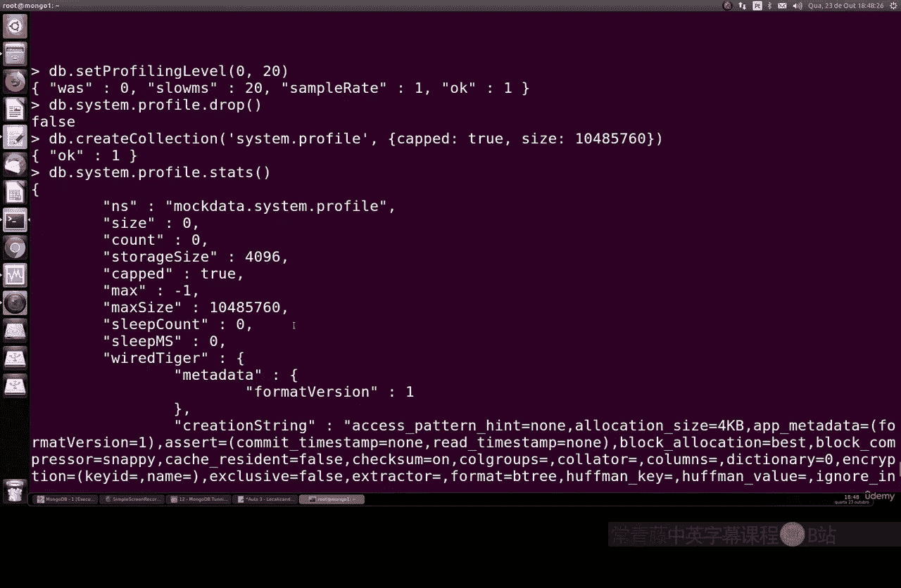
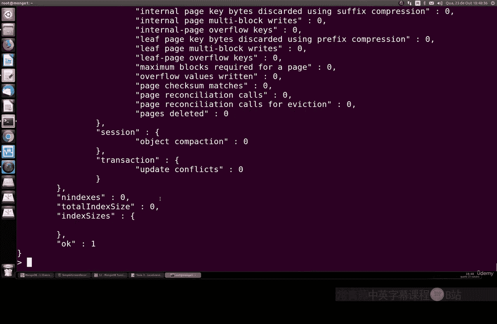

# 152：定位慢查询与操作 🔍

在本节课中，我们将学习如何在MongoDB中进行性能调优实验，核心目标是定位并记录执行缓慢的查询和操作。通过识别这些慢查询，我们可以更恰当地为数据库建立索引，或者优化应用程序代码。我们将重点学习如何创建和使用数据库的性能分析器（Profiler），这是一个非常实用的MongoDB功能。

## 准备工作：导入测试数据

在开始之前，我们需要一个包含大量文档的数据库来进行实验。以下是操作步骤：

1.  下载包含10万份文档的模拟数据文件。
2.  使用`mongoimport`命令将数据导入MongoDB。

导入完成后，我们可以进入Mongo Shell，连接到`mock data`数据库，并确认数据已成功导入。

## 理解与分析性能分析器

上一节我们准备好了测试数据，本节中我们来看看如何配置和使用MongoDB的性能分析器。



MongoDB的性能分析器有三个级别：
*   **Level 0**：默认级别，不记录任何操作。
*   **Level 1**：记录执行时间超过设定阈值的**慢查询**。
*   **Level 2**：记录执行时间超过设定阈值的**所有慢操作**。

我们可以使用以下命令查看当前数据库的分析器状态：

```javascript
db.getProfilingStatus()
```

该命令会返回一个对象，其中`was`字段表示当前的分析级别，`slowms`字段表示被视为“慢操作”的阈值（单位：毫秒）。

## 配置性能分析器

了解了分析器的基本概念后，现在我们来学习如何配置它，以开始记录我们关心的慢查询。

我们可以使用`db.setProfilingLevel()`命令来更改分析级别和慢操作阈值。例如，要将分析级别设置为1（记录慢查询），并将慢查询阈值设置为40毫秒，可以执行：

```javascript
db.setProfilingLevel(1, { slowms: 40 })
```

执行后，任何执行时间超过40毫秒的查询都将被记录到名为`system.profile`的固定集合中。你可以根据实际需求调整这个阈值。





## 管理分析器集合

配置好分析器后，它会产生日志数据。本节我们来了解如何管理存储这些日志的集合。

再次运行`db.getProfilingStatus()`命令，可以确认配置已生效。此外，我们还可以查看`system.profile`集合的状态信息：



```javascript
db.system.profile.stats()
```



在返回的信息中，`capped`字段表示这是一个**固定集合**，它有预定义的最大尺寸。当集合达到最大尺寸时，旧的记录会被自动覆盖。这是为了防止分析日志无限增长。

如果需要修改这个集合的大小（例如，设置为10MB），或者需要清空它，请按以下步骤操作：
1.  首先，将分析级别设置为0以停止记录：`db.setProfilingLevel(0)`
2.  然后，删除现有的`system.profile`集合：`db.system.profile.drop()`
3.  最后，重新创建一个指定大小的固定集合并启用分析：
    ```javascript
    db.createCollection("system.profile", { capped: true, size: 10000000 }) // 10MB
    db.setProfilingLevel(1, { slowms: 40 })
    ```
4.  再次检查状态，确认更改已生效。





## 总结



本节课中我们一起学习了MongoDB性能调优的一个重要环节：定位慢查询与操作。我们掌握了如何配置和使用数据库的性能分析器（Profiler），包括设置分析级别、调整慢操作阈值，以及管理存储分析日志的固定集合。通过记录和分析慢查询，我们可以有针对性地优化数据库索引和应用程序代码，从而提升整体系统性能。如果在配置过程中遇到任何问题，记得首先关闭分析器再进行集合的修改操作。