# 153：安装与配置TLS（SSL）🔐

在本节课中，我们将学习如何在MongoDB实例上安装和配置TLS/SSL认证。我们将使用OpenSSL工具生成自签名证书，并配置MongoDB以使用这些证书进行加密通信，从而增强实例的安全性。

## 检查OpenSSL版本

首先，我们需要确认系统中安装的OpenSSL版本。这是生成证书的前提条件。

以下是检查OpenSSL版本的命令：
```bash
openssl version
```
请确保你的OpenSSL版本至少是通用版本。

## 生成私钥

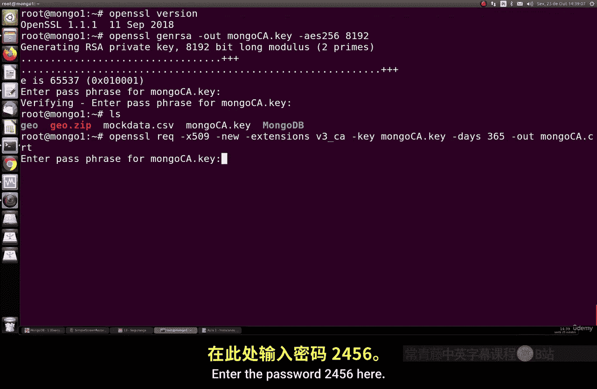

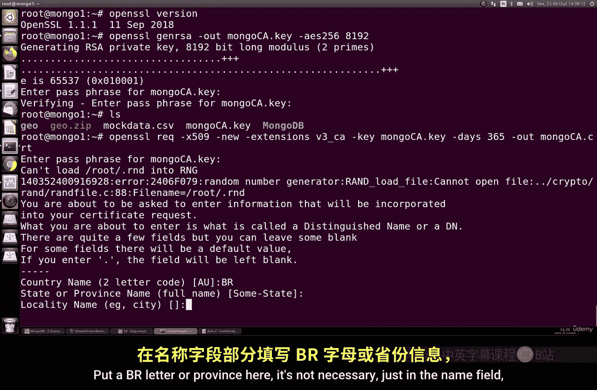

上一节我们确认了OpenSSL的可用性，本节中我们将生成一个安全的私钥。这是创建证书的第一步。

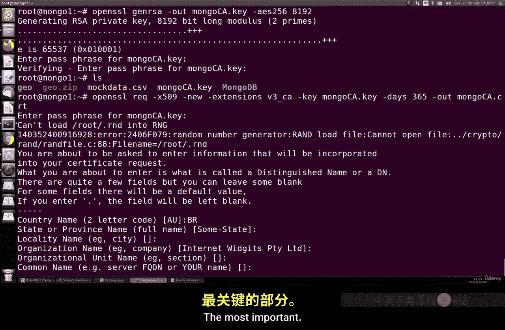

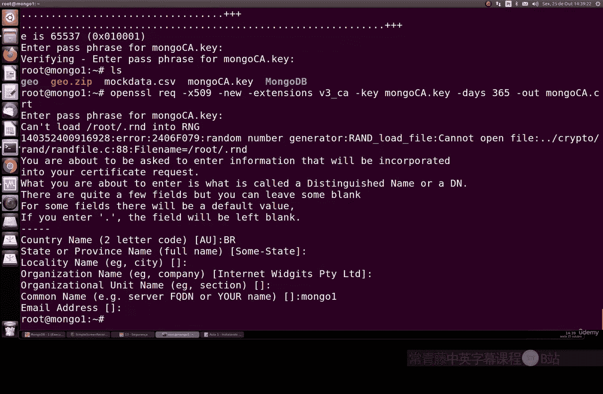

我们将创建一个8192位的RSA私钥，这是目前最安全且推荐的长度。

以下是生成私钥的命令：
```bash
openssl genrsa -out mongodb.key 8192
```
系统会提示你为私钥设置一个密码，例如 `123456123456`。

## 生成自签名证书

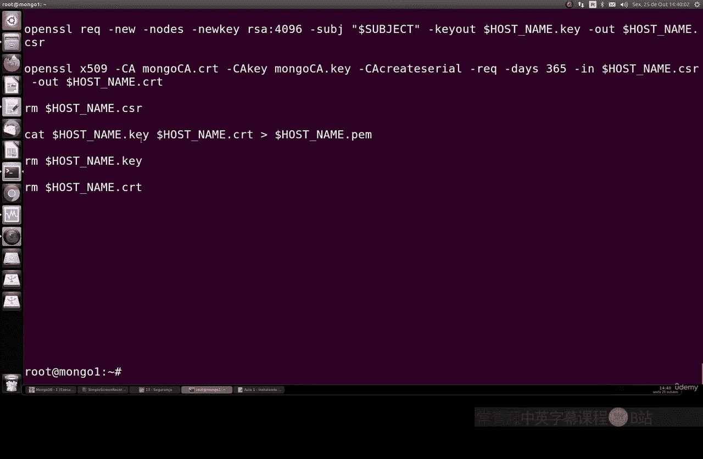

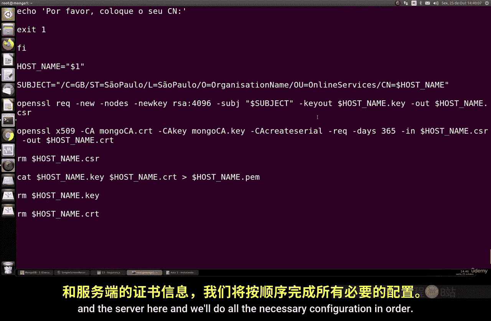

现在，我们将基于上一步生成的私钥来创建自签名证书。这个证书将用于MongoDB服务器的身份验证。

以下是生成证书的命令：
```bash
openssl req -new -x509 -key mongodb.key -out mongodb.crt -days 365
```
执行命令后，你需要输入私钥的密码（例如 `123456`），并填写证书信息。其中，**Common Name（CN）** 字段最为重要，应填写你的MongoDB实例的主机名（例如 `mongo1`）。其他字段如国家、省份等可以按需填写或留空。

## 使用脚本批量生成证书

为了更高效地为服务器和客户端生成证书，我们可以使用一个预写的Bash脚本。这个脚本能帮助我们快速完成所有必要的配置。

你可以在GitHub上找到一个名为 `gen_certs.sh` 的简单脚本。它能够为指定的MongoDB实例名称生成全套证书文件。

以下是使用脚本的命令格式：
```bash
bash gen_certs.sh <实例名称>
```
例如，为名为 `mongo` 的实例生成证书：
```bash
bash gen_certs.sh mongo
```
你需要提供私钥密码（例如 `123456`）。脚本运行后，会生成 `.pem` 文件，其中包含了密钥和证书。

## 组织证书文件

良好的配置实践要求我们有序地管理文件。接下来，我们创建一个专用目录来存放所有的SSL证书和密钥。

以下是创建目录并移动文件的命令：
```bash
sudo mkdir /etc/ssl/mongodb
sudo mv mongodb.key mongodb.crt /etc/ssl/mongodb/
```
然后，我们需要修改目录的权限，确保MongoDB进程能够访问这些文件。

以下是修改权限的命令：
```bash
sudo chown -R mongodb:mongodb /etc/ssl/mongodb
sudo chmod 600 /etc/ssl/mongodb/*
```

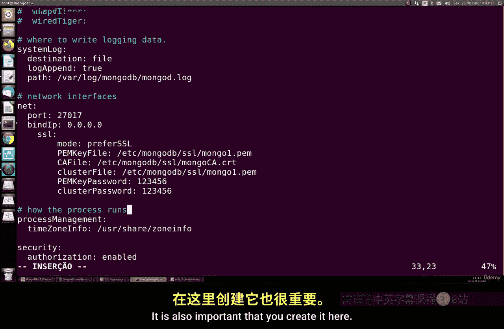

## 配置MongoDB使用SSL

假设你的MongoDB实例已经配置了管理员用户名和密码。现在，我们需要编辑MongoDB的配置文件，使其启用SSL。

编辑MongoDB配置文件（通常是 `/etc/mongod.conf`），在 `net` 部分添加或修改以下配置：
```yaml
net:
  ssl:
    mode: requireSSL
    PEMKeyFile: /etc/ssl/mongodb/mongodb.pem
    CAFile: /etc/ssl/mongodb/mongodb.crt
    clusterFile: /etc/ssl/mongodb/mongodb.pem # 如果配置了副本集或分片集群则需要
```
请确保缩进正确，并且文件路径准确无误。保存配置文件后，重启MongoDB服务使更改生效。

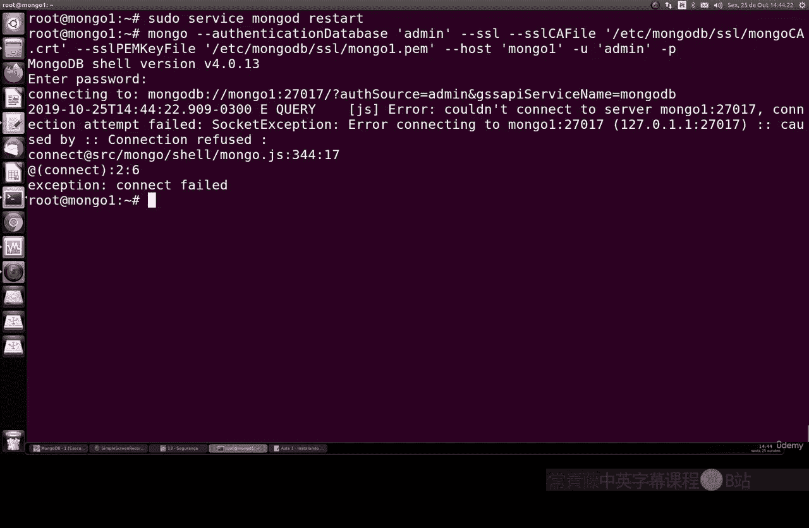

以下是重启服务的命令：
```bash
sudo systemctl restart mongod
```

## 使用SSL连接MongoDB

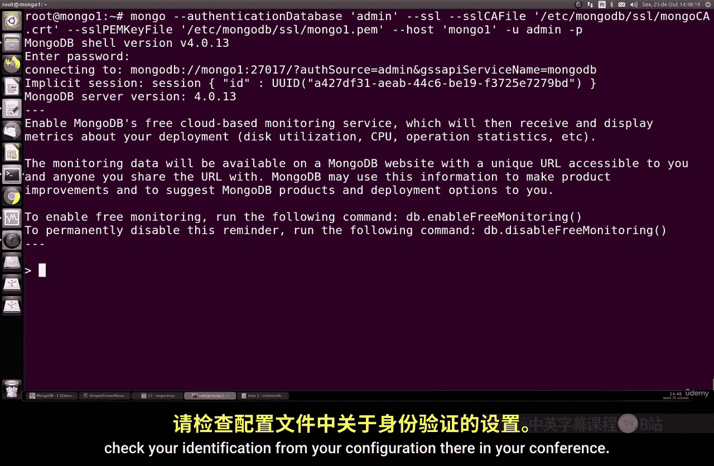

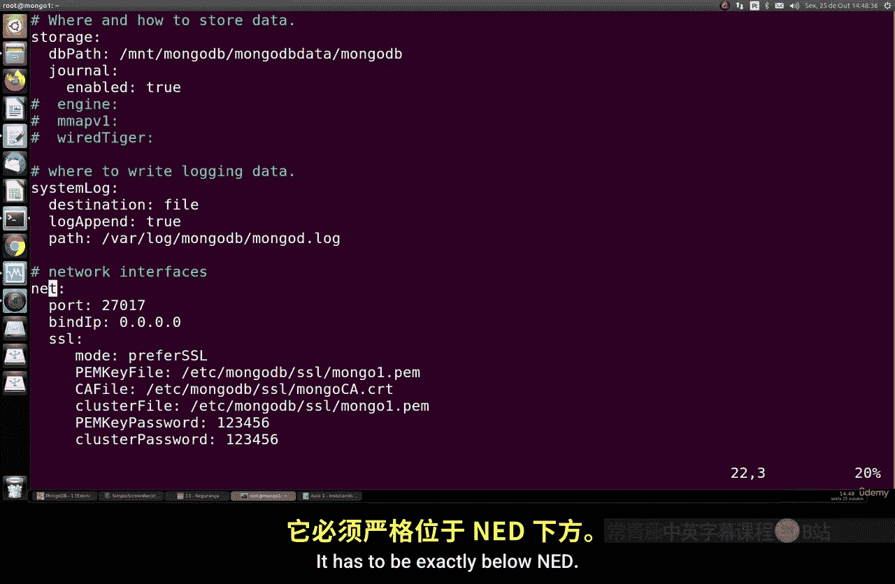

配置完成后，我们需要使用SSL来连接MongoDB实例。连接命令需要指定证书和密钥的完整路径。

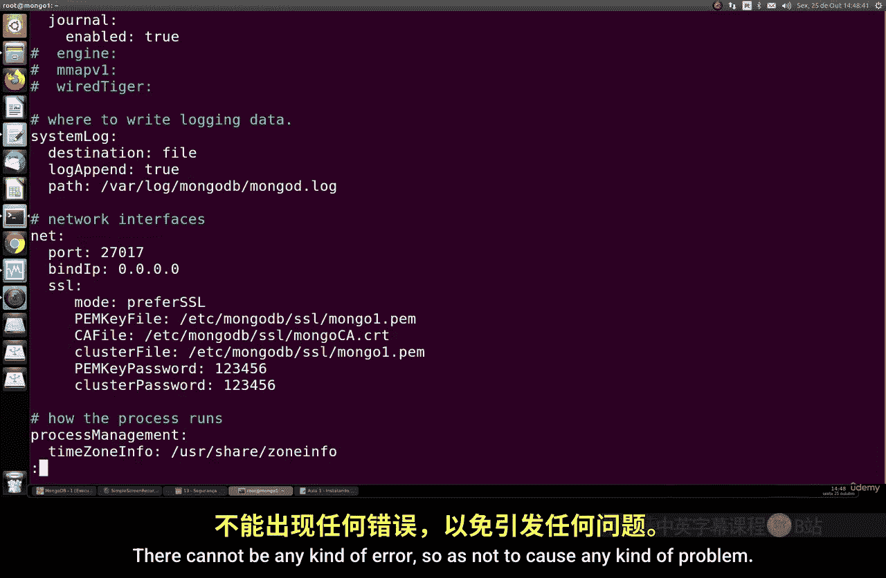

以下是使用SSL进行认证连接的示例命令：
```bash
mongo --host mongo1 --port 27017 --username admin --password 123456 --ssl --sslCAFile /etc/ssl/mongodb/mongodb.crt --sslPEMKeyFile /etc/ssl/mongodb/mongodb.pem
```
如果连接成功，你将能够访问所有数据库，且数据完好无损。如果出现错误，请仔细检查配置文件的缩进和路径设置。

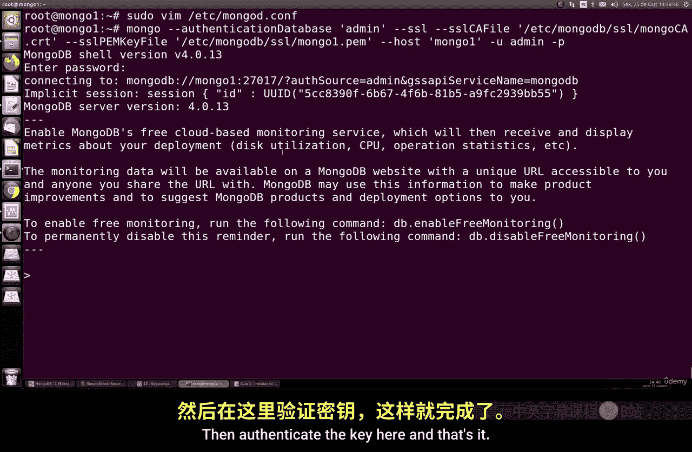

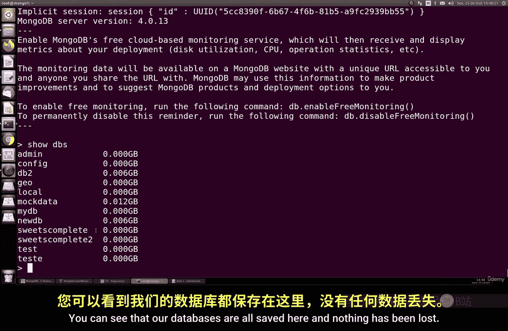

## 总结

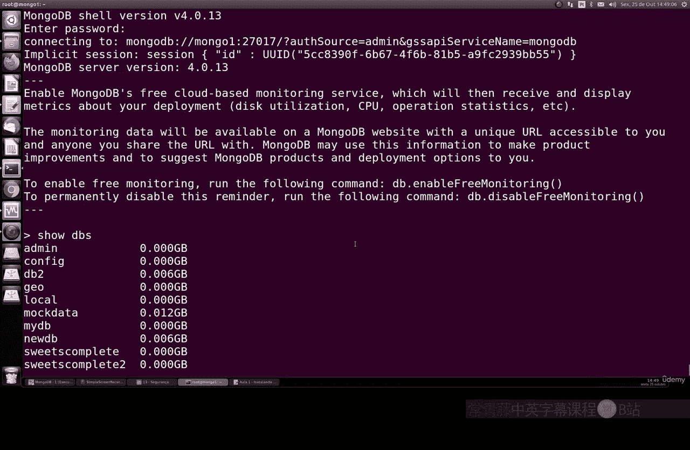

本节课中我们一起学习了如何为MongoDB配置TLS/SSL加密。我们从检查OpenSSL版本开始，逐步完成了生成私钥和自签名证书、使用脚本批量处理、组织文件结构、修改MongoDB配置，最后使用SSL安全连接到数据库的整个过程。为你的MongoDB实例启用SSL是提升数据通信安全性的重要步骤。