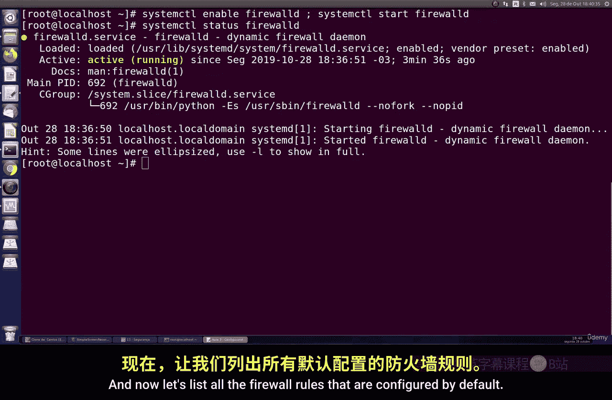
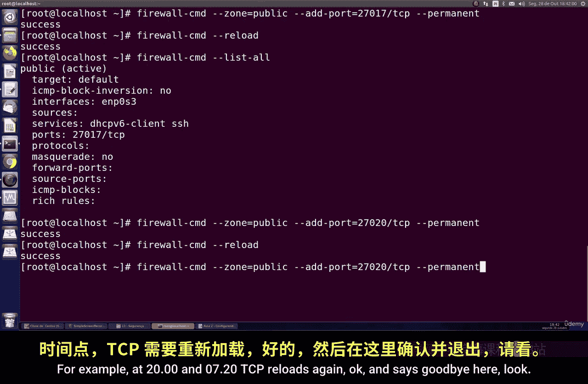
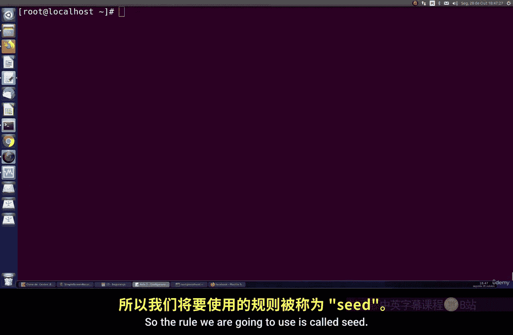
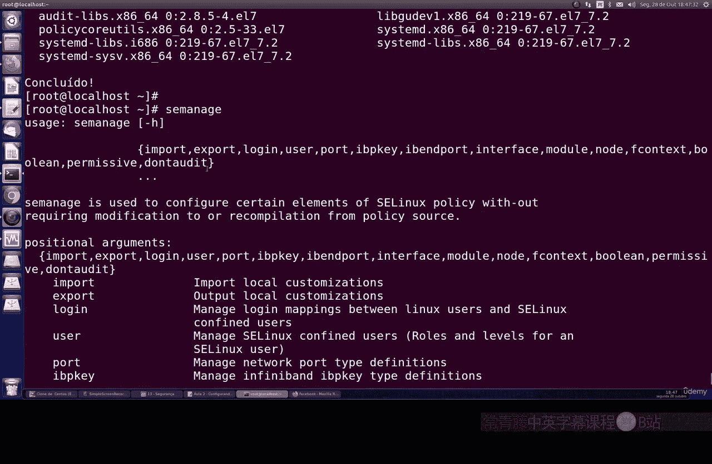
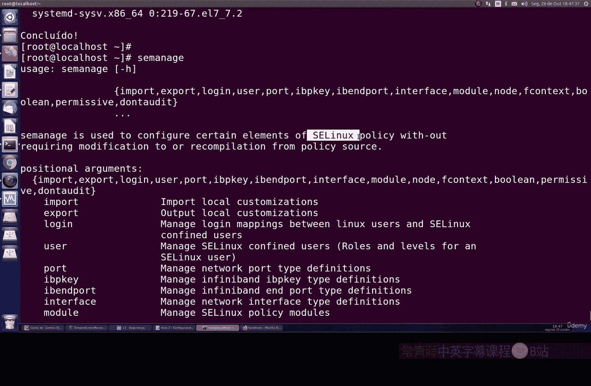
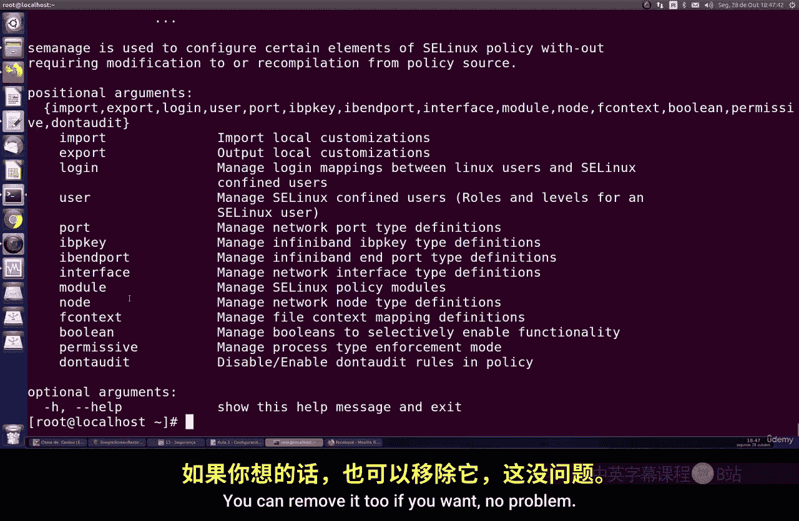
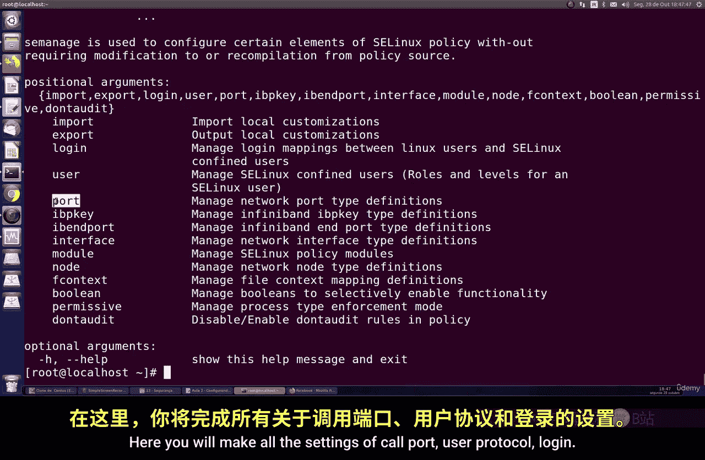
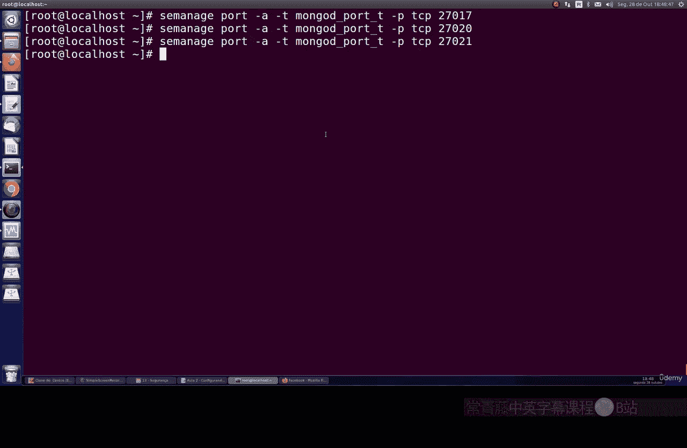

# 154：在CentOS上配置防火墙与SELinux 🔥

在本节课中，我们将学习如何在CentOS系统上配置防火墙和SELinux，以确保MongoDB数据库能够安全、顺畅地运行。我们将从启用防火墙开始，逐步学习如何开放特定端口，然后配置SELinux以允许数据库服务。

---

## 启用并检查防火墙状态

首先，我们需要确保系统防火墙已启用并处于运行状态。默认情况下，防火墙可能被禁用，尤其是在安装MongoDB时。但为了安全，我们必须启用并正确配置它。

执行以下命令来启用并启动防火墙：

```bash
systemctl enable firewalld
systemctl start firewalld
```

接下来，检查防火墙的状态，确认其已激活并正在运行：

```bash
systemctl status firewalld
```

如果一切正常，你将看到防火墙处于活动状态。

---

## 查看默认防火墙规则

上一节我们启用了防火墙，本节中我们来看看系统默认配置了哪些规则。



执行以下命令列出所有默认的防火墙规则：

```bash
firewall-cmd --list-all
```

你会发现，默认情况下，防火墙只允许DHCPv6客户端和SSH端口的流量，其他所有端口都被阻止。这表明防火墙默认采取“全部阻止”策略，我们需要手动开放所需端口。

---

## 为MongoDB开放端口

现在，我们需要为MongoDB数据库开放端口。假设MongoDB使用默认的TCP端口27017。

以下是开放端口的步骤：

1.  使用`firewall-cmd`命令添加一条永久规则，允许TCP协议通过27017端口。
2.  重新加载防火墙配置以使新规则生效。

具体命令如下：

```bash
firewall-cmd --permanent --zone=public --add-port=27017/tcp
firewall-cmd --reload
```

命令执行成功后，再次列出所有规则以确认端口已开放：

```bash
firewall-cmd --list-all
```

你将在端口列表中看到 `27017/tcp`。



---

## 开放多个端口

如果你的系统需要运行多个MongoDB实例或其他服务，可以重复上述步骤来开放更多端口。

例如，要同时开放端口27017和27018，可以执行：

```bash
firewall-cmd --permanent --zone=public --add-port=27017/tcp
firewall-cmd --permanent --zone=public --add-port=27018/tcp
firewall-cmd --reload
```

再次使用 `firewall-cmd --list-all` 命令检查，你将看到两个端口都已成功添加。

至此，防火墙的基本配置已完成。

---

## 配置SELinux

防火墙配置好后，我们还需要处理SELinux。SELinux是一个复杂但强大的安全模块，它可能会阻止MongoDB的正常运行。我们需要对其进行配置。

首先，编辑SELinux的配置文件，将其模式设置为 `enforcing`：

```bash
vim /etc/selinux/config
```

找到 `SELINUX=` 这一行，将其值改为 `enforcing`，然后保存并退出编辑器。

为了使配置生效，需要重启系统或使用以下命令更改当前模式（但这只是临时生效，重启后以配置文件为准）：

```bash
setenforce 1
```

---

## 安装SELinux管理工具

为了更精细地管理SELinux对MongoDB的规则，我们需要安装一些辅助工具。

执行以下命令来安装 `setroubleshoot` 和相关工具包：

```bash
yum install setroubleshoot setools -y
```

安装过程可能需要一些时间。这些工具能帮助我们分析和解决SELinux引起的访问拒绝问题。

---

## 为MongoDB添加SELinux规则



工具安装完成后，我们就可以为MongoDB添加特定的SELinux策略规则了。



核心命令是 `semanage`，我们需要用它来允许MongoDB绑定到其默认端口。

为MongoDB的默认TCP端口27017添加规则：



```bash
semanage port -a -t mongod_port_t -p tcp 27017
```

如果你的MongoDB实例使用其他端口（例如27018），只需重复上述命令并修改端口号即可：



```bash
semanage port -a -t mongod_port_t -p tcp 27018
```



这条命令的作用是：在SELinux策略中，将指定的TCP端口类型标记为 `mongod_port_t`，从而允许MongoDB服务使用这些端口。

---

## 验证配置

完成所有配置后，建议进行验证。

1.  确认防火墙端口已开放：
    ```bash
    firewall-cmd --list-ports
    ```
    应显示 `27017/tcp` 和 `27018/tcp`（如果已添加）。

2.  确认SELinux端口上下文已正确设置：
    ```bash
    semanage port -l | grep mongod_port_t
    ```
    你会在输出列表中看到已添加的MongoDB端口。

---

## 总结

本节课中我们一起学习了在CentOS系统上配置防火墙和SELinux以支持MongoDB运行。



我们首先启用并检查了防火墙状态，然后学习了如何查看默认规则、为MongoDB开放单个及多个端口。接着，我们配置了SELinux为强制模式，并安装了必要的管理工具。最后，我们使用 `semanage` 命令为MongoDB的端口添加了SELinux策略规则。

通过以上步骤，你的CentOS服务器现在已为MongoDB数据库配置好了必要的网络和安全环境。记住，在生产环境中，只开放必要的端口并保持SELinux启用是保障系统安全的重要实践。