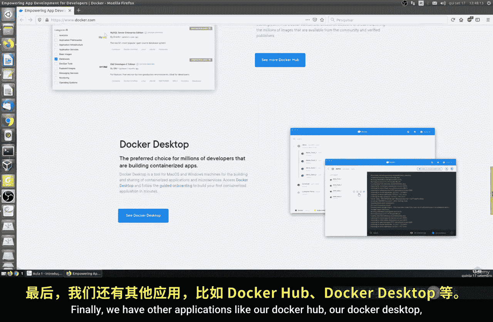
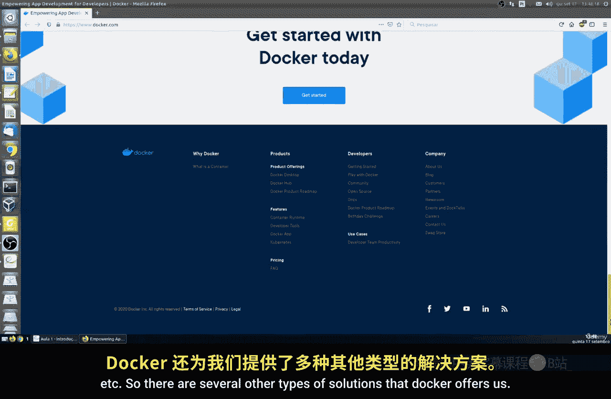
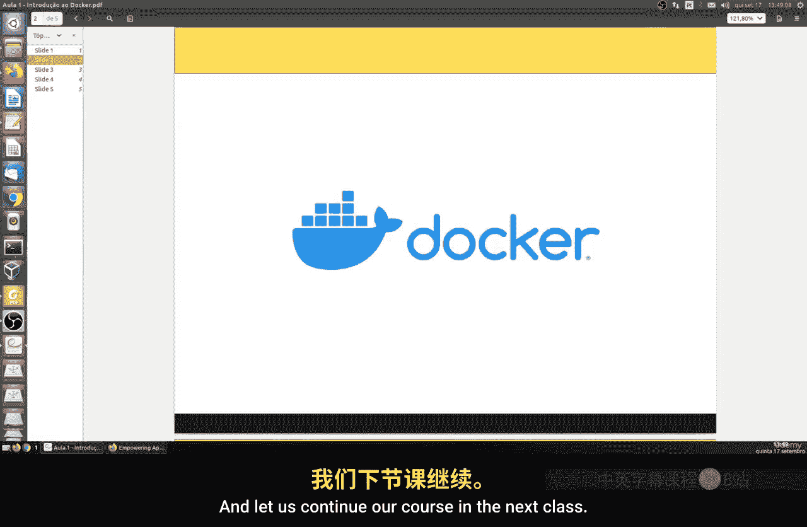

# 155：Docker介绍 🐳

在本节课中，我们将开始学习如何在Linux上使用Docker。Docker是一个广泛使用的开源平台，它能极大地简化应用的开发、部署和运行过程。我们将从基础概念开始，了解Docker是什么以及它为何如此重要。

## 什么是Docker？

Docker是一个开源平台，其主要目标是简化应用程序在完全隔离环境中的开发、部署和运行过程。

这里的“应用程序”可以是任何你想部署的东西，例如一个网站、一个项目或一个数据库。使用Docker，我们可以更快、更安全地实现应用部署。因为它能让我们非常轻松地管理整个应用、系统或网站的基础设施，从而大大加速创建、维护乃至修改服务的过程。

这非常出色，因为我们可以完成整个过程，而无需任何对公司基础设施的特殊访问权限或特权。例如，负责某个网站或特定类型程序的开发团队，可以与负责公司服务器的团队共同参与环境规划。

## Docker如何工作？

Docker可以作为一种“通用语言”，在开发人员和系统管理员之间架起桥梁。我们可以使用这种语言来编写定义文件，描述所需的基础设施、应用程序在环境中的部署方式、服务运行的端口、需要的外部数据卷等信息。

Docker可以将环境打包，并快速地在公共云或其他环境中共享和使用。例如，我们可以获取现成的Apache镜像，然后为我们的特定应用或网站配置专门的模块，从而在几行命令内创建出我们自己的定制化环境。

## 容器化概念

我们可以将多种类型的应用程序（例如运行多个网站或多种环境）打包，并在单个平台上运行。这个平台可以是你的笔记本、云服务器或任何类型的计算机。

我们称之为Docker**容器**。容器封装了磁盘、内存、处理和网络资源的复用，从而能高效优化资源，避免像传统虚拟机那样造成沉重的负载。它实现了操作系统级别的虚拟化，允许多个主机或多个设备更灵活地共存，而不会造成损害或过度的处理开销。

## 操作系统级虚拟化

Docker的隔离模型是**操作系统级虚拟化**，但这并非我们通常理解的、在一台机器上再运行一台完整虚拟机的模式。相反，它复用了宿主操作系统的内核。

例如，如果我们的宿主操作系统是Linux，Docker就会复用Linux内核，并创建多个与宿主主机（无论是云服务器、物理机还是笔记本）隔离的进程。为了实现这种隔离，Docker使用了内核的一个功能，叫做 **`Namespaces`**。

`Namespaces` 为容器创建了隔离的环境，确保一个容器内应用程序的进程无法访问其他容器的资源。尽管它们运行在同一个操作系统上，但它们在库文件、二进制文件等所有方面都是完全分离的，这可以避免资源耗尽的问题。

## 容器独立性：一个类比

为了理解容器的独立性，可以想象一艘货轮（代表我们的宿主机或服务器）。货轮上装载着许多集装箱（代表我们的Docker容器）。正如你所知，每个集装箱都是完全独立的。

它们被装载在同一艘船上，但互不影响。如果一个集装箱（比如一个装食物的）损坏了，其他集装箱不会受到影响。Docker也是如此：如果一个应用程序容器出现故障、错误或任何问题，其他容器中的应用程序将完全不受影响，保持完好无损。这就是我们称之为“容器”的原因。

我们可以在同一台机器上运行多个Docker容器，从而极大地优化RAM内存、CPU等资源的使用。这对于按需付费的云服务器来说尤其有益。

## Docker核心组件

最后，我们来了解一下Docker的一些核心组件。我们后续会详细演示，但先在此做理论性介绍：

*   **Docker引擎**：这是我们整个解决方案的基础软件，是一个守护进程。它负责管理容器。
*   **Docker客户端**：我们用来向守护进程发送命令的工具。
*   **Docker Compose**：一个用于基于定义文件来定义和运行多容器应用的工具。
*   **Docker Machine**：一个能够创建和维护Docker环境的工具，这些环境可以在虚拟机、云环境甚至物理机上运行。

以下是Docker的官方网站，上面有所有相关页面和信息。Docker还提供了其他应用和服务，如Docker Hub（镜像仓库）、Docker Desktop等。

Docker为我们提供了多种解决方案。

这是Docker的产品页面。需要说明的是，Docker有付费版本（例如Docker Desktop的部分功能），但我们将只关注社区版，因为这是我们进行所有配置和学习的部分。

## 总结

本节课我们一起学习了Docker的基础概念。我们了解到Docker是一个用于容器化应用的开源平台，它通过操作系统级虚拟化和`Namespaces`实现隔离，使得应用能够快速、安全且独立地运行。我们还简要介绍了Docker的核心组件。

在下一节课中，我们将开始在Linux操作系统上安装和配置Docker。希望你对本课内容有所收获。如有疑问，请在课程论坛中提问。让我们在下一节课继续学习。

