# 157：容器基本操作 🐳

在本节课中，我们将学习如何初始化、停止和移除容器，并理解一些Docker基本命令的工作原理。

## Docker命令结构解析

上一节我们介绍了Docker的基本概念，本节中我们来看看Docker命令的具体结构。

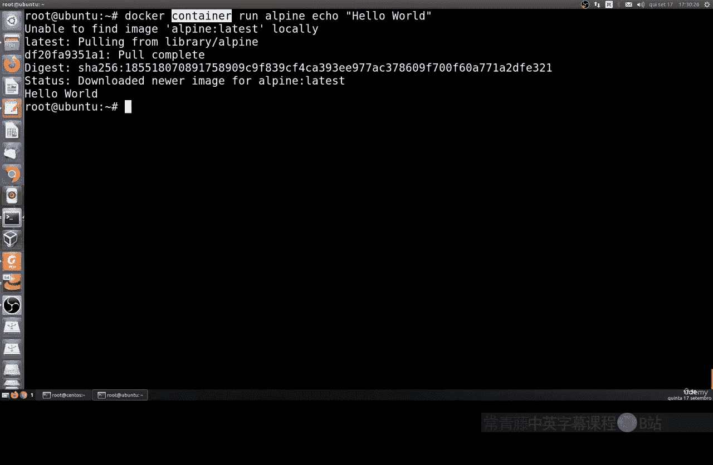

Docker命令遵循一个清晰的模式。其基本结构如下：

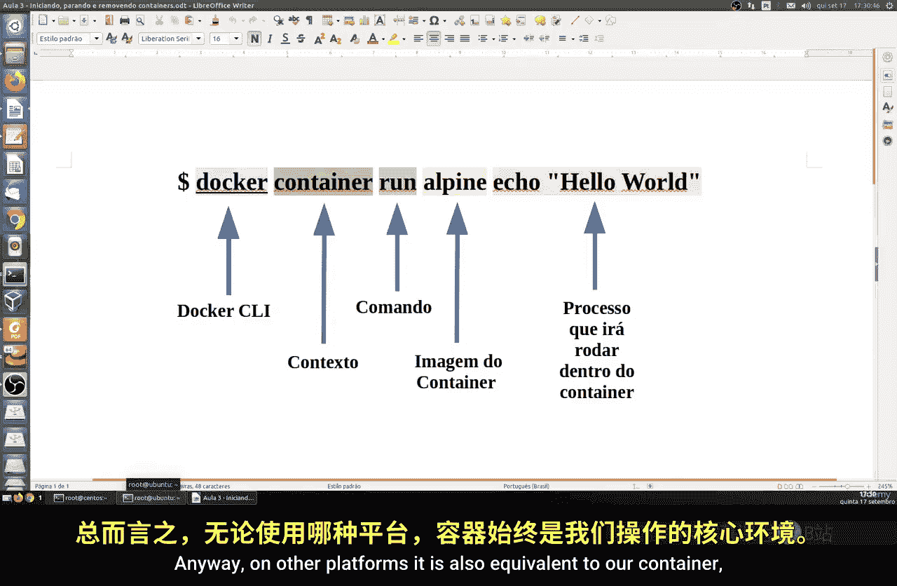

**`docker [对象] [命令] [选项]`**

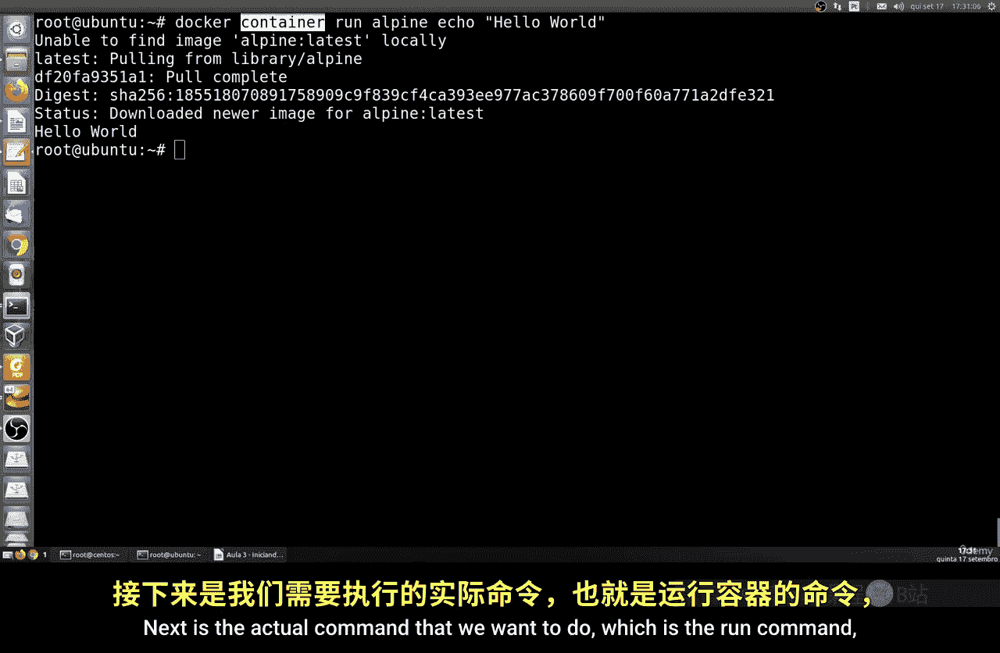

以下是该结构中各部分的详细解释：

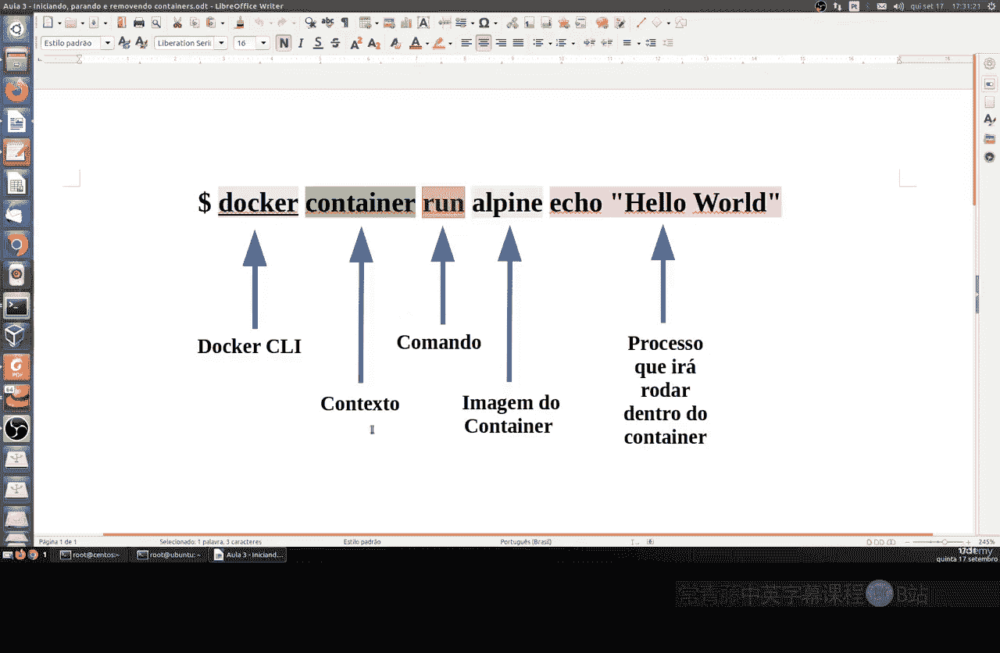

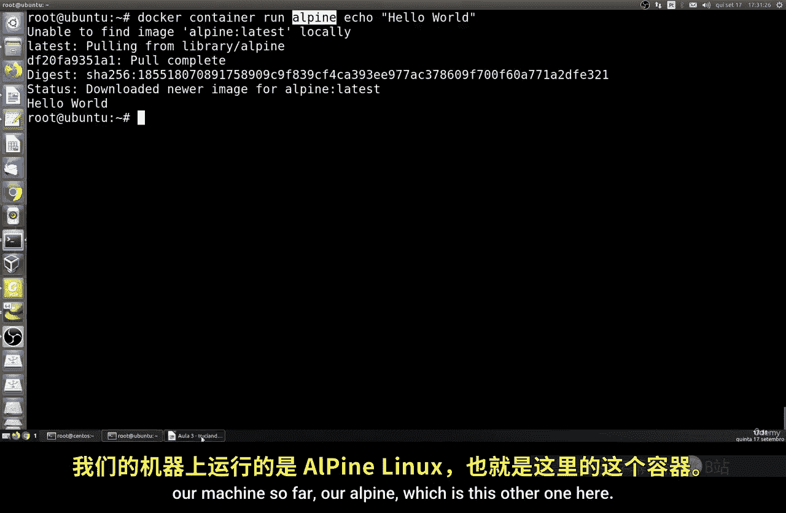

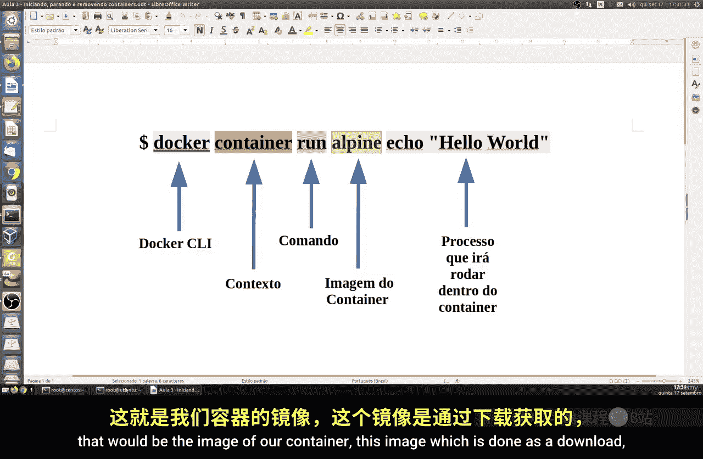

*   **`docker`**：这是主命令，用于与Docker守护进程交互。
*   **`[对象]`**：指定操作的对象类型，例如 `container`（容器）、`image`（镜像）、`network`（网络）。
*   **`[命令]`**：定义要对对象执行的具体操作，例如 `run`（运行）、`stop`（停止）、`rm`（移除）。
*   **`[选项]`**：提供命令的额外参数或配置。

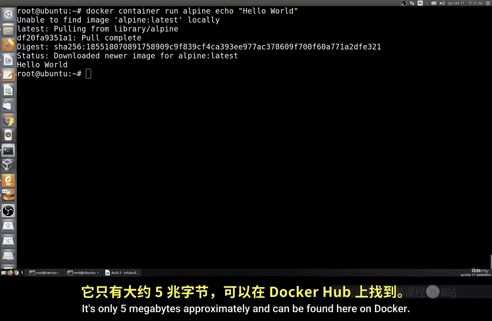

## 运行第一个容器

理解了命令结构后，我们来运行第一个容器。

执行以下命令：

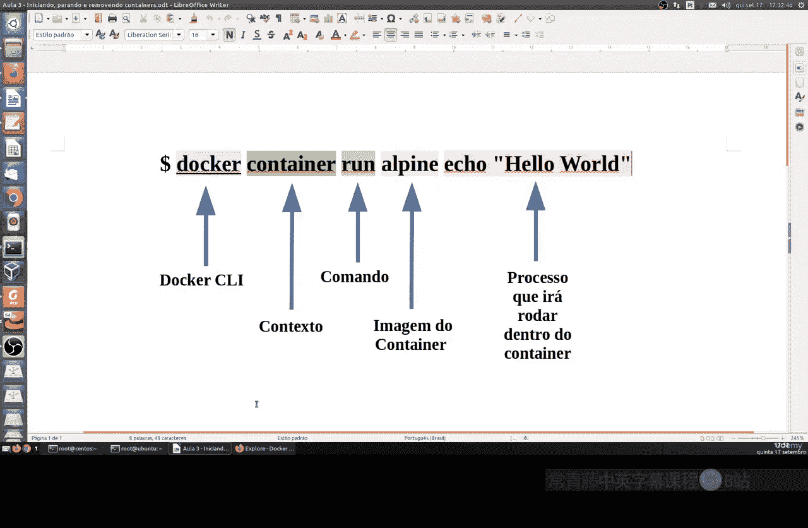

```bash
docker container run alpine echo "Hello World"
```

这个命令的执行流程如下：
1.  Docker首先在本地查找名为 `alpine:latest` 的镜像。
2.  如果本地没有该镜像，Docker会从默认的公共仓库（Docker Hub）下载它。
3.  下载完成后，Docker会基于 `alpine` 镜像创建并启动一个**新容器**。
4.  容器启动后，会在其内部执行 `echo "Hello World"` 命令。
5.  命令执行完毕后，容器自动停止。

这里的 `alpine` 是一个极简的Linux发行版镜像，体积很小（约5MB），非常适合用作基础镜像。

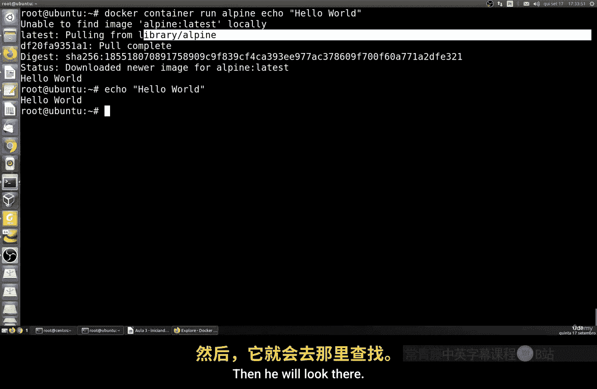

## 运行交互式容器

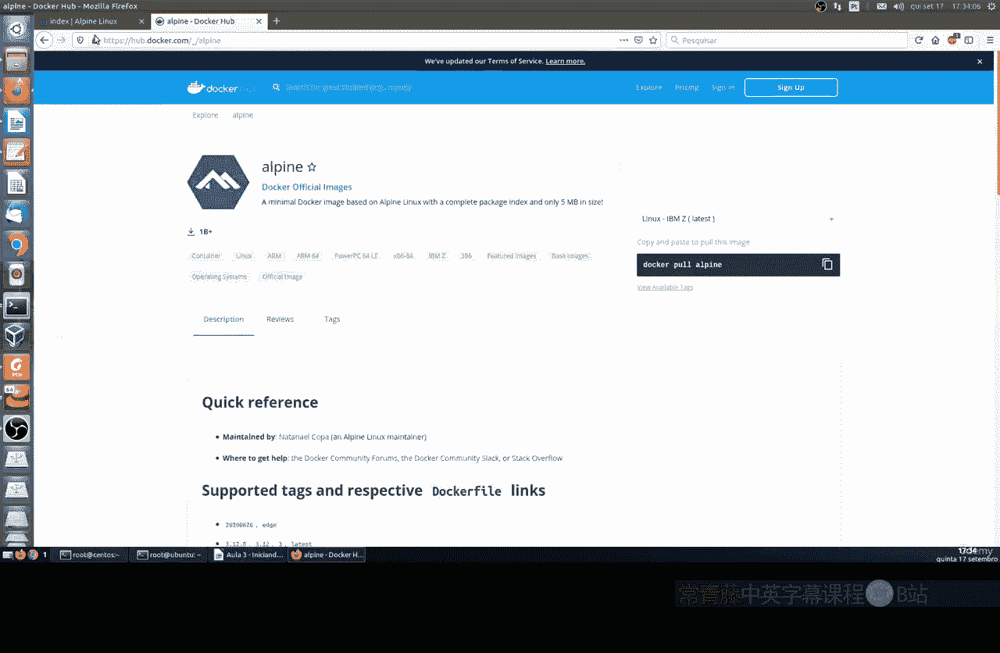

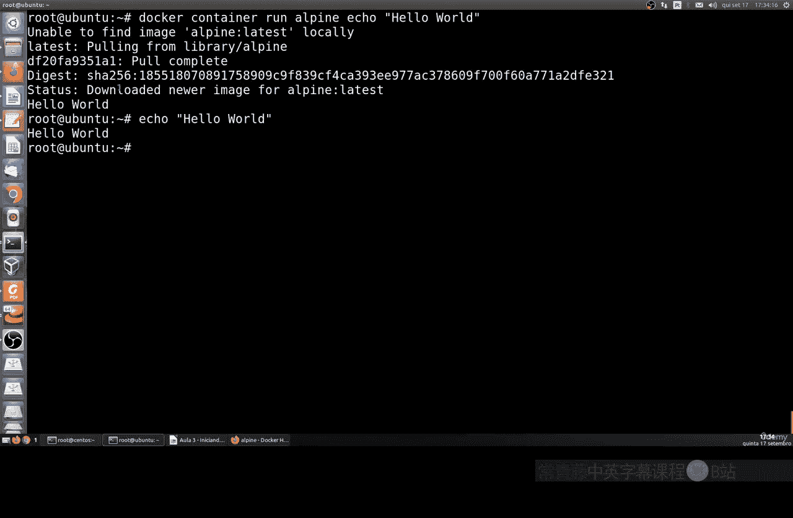

接下来，我们运行一个能进行网络测试的交互式容器。

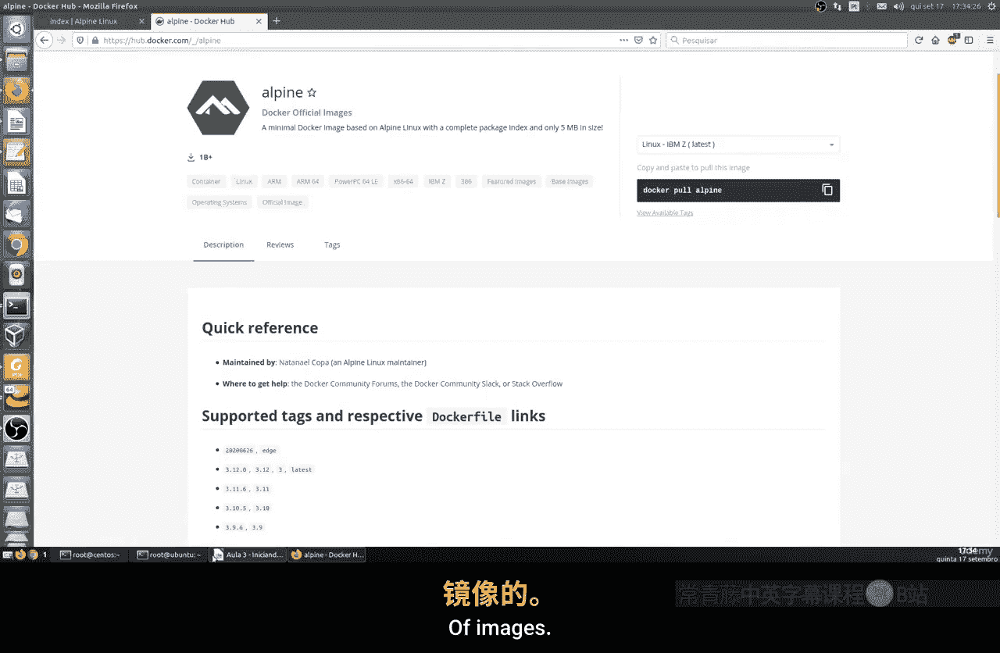

执行以下命令：

```bash
docker container run centos ping -c 5 127.0.0.1
```

这个命令与上一个类似：
1.  Docker会尝试拉取 `centos:latest` 镜像。
2.  基于该镜像启动容器。
3.  在容器内部执行 `ping -c 5 127.0.0.1` 命令，即向本地回环地址发送5次网络探测包。
4.  命令执行完成后，容器退出。

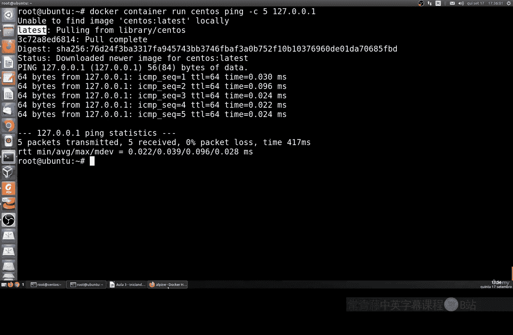

## 关于镜像版本（标签）

在拉取镜像时，如果不指定版本，Docker默认会拉取标记为 `latest` 的镜像。`latest` 是一个标签，通常指向该镜像的最新稳定版。

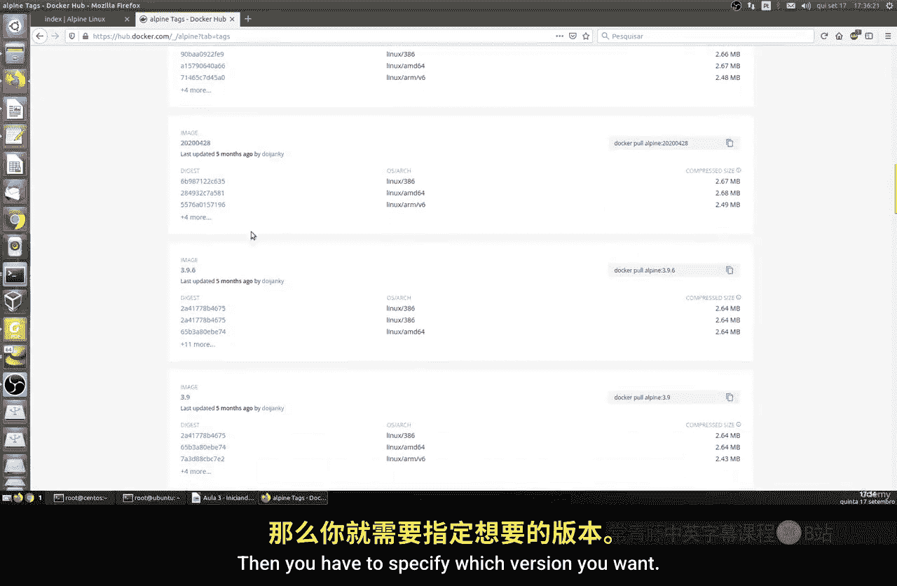

实际上，一个镜像可以有多个标签，代表不同的版本。例如，`alpine:3.16`、`alpine:3.15`。为了确保环境一致性，在生产中建议明确指定镜像版本。

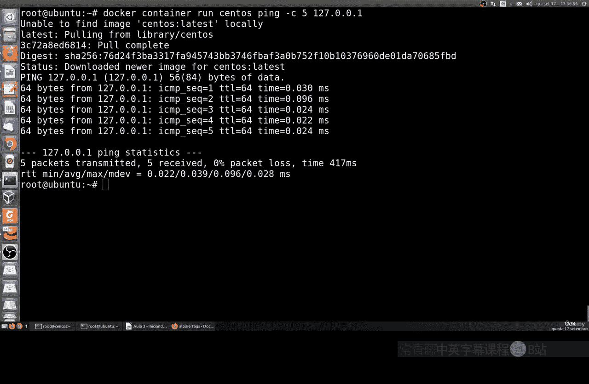

本节课中我们一起学习了Docker命令的基本结构，并通过两个实例练习了如何使用 `docker container run` 命令来运行容器。我们还了解了Docker拉取镜像的过程以及镜像标签的概念。在下一节课，我们将继续学习更多操作Docker容器的基本概念。