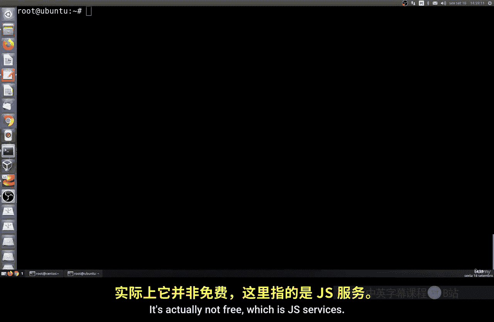
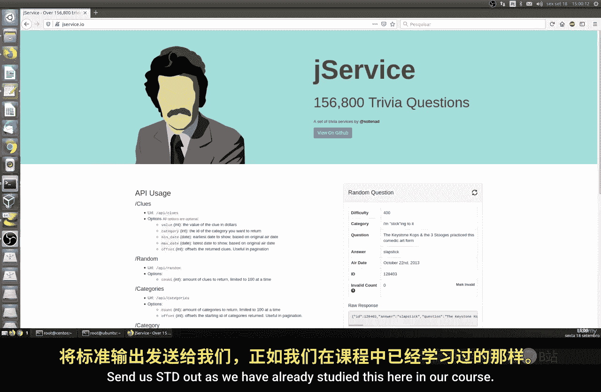
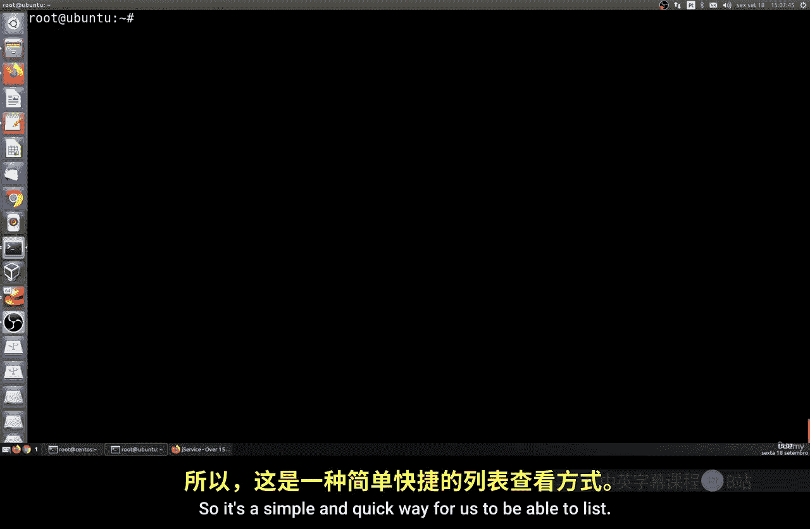

# 158：列出容器 🐳



在本节课中，我们将学习如何在Linux系统中列出Docker容器。我们将通过创建一个持续运行的后台容器作为示例，并详细讲解`docker ps`命令及其各种选项的用法。

---



上一节我们介绍了Docker的基本概念，本节中我们来看看如何管理和查看正在运行的容器。

首先，为了后续课程的需要，我们需要一个能在后台持续运行的容器。我们将使用一个名为“JS Services”的免费API服务，它可以每隔五秒生成一个随机的趣味问答。这个服务对于网站开发者来说非常实用。

以下是创建并运行此容器的步骤：

1.  首先，我们需要在Ubuntu系统上安装`jq`工具来处理JSON数据。对于Fedora系统，安装命令会有所不同。
    ```bash
    # Ubuntu/Debian 系统
    apt-get update && apt-get install -y jq

    # Fedora 系统
    dnf install -y jq
    ```

2.  安装完成后，我们可以测试一下API服务是否正常工作。该服务会每隔五秒生成一个随机句子。

3.  接下来，我们使用Docker运行一个后台容器。`-d`参数表示在后台运行，`--name`参数用于为容器指定一个明确的名称。
    ```bash
    docker run -d --name trivia trivia:latest
    ```

现在容器已经在后台运行了，让我们学习如何列出系统中的容器。

运行`docker ps`命令可以列出当前正在运行的容器。这与我们在bash中使用的`ls`命令逻辑类似。

命令输出包含多个信息列：
*   **CONTAINER ID**：容器的唯一标识符，是一个SHA-256哈希值。
*   **IMAGE**：容器所使用的镜像名称。
*   **COMMAND**：容器启动时执行的主命令。
*   **CREATED**：容器的创建时间。
*   **STATUS**：容器的当前状态（如运行中、已退出、已暂停）。
*   **PORTS**：容器映射到主机的端口信息。本例中未映射端口，故为空。
*   **NAMES**：容器的名称。

如果想结束本节的示例，我们可以停止并移除这个`trivia`容器。
```bash
docker stop trivia && docker rm trivia
```
执行后，再次使用`docker ps`命令将看不到`trivia`容器。

`docker ps`命令还有一些有用的选项：
*   `-a` 或 `--all`：列出所有容器（包括已停止的）。
*   `-f` 或 `--filter`：根据条件过滤列出的容器。
*   `-l` 或 `--last`：仅显示最新创建的容器。
*   `-q` 或 `--quiet`：仅显示容器ID。
*   `-s` 或 `--size`：显示容器的总文件大小。

此外，你可以随时使用`docker ps --help`命令来查看所有可用选项的详细说明。

---



本节课中我们一起学习了如何使用`docker ps`命令及其参数来列出和查看Docker容器。我们创建了一个后台容器作为示例，并了解了如何解读命令输出的关键信息。掌握这些命令是有效管理容器化应用的基础。在接下来的课程中，我们将继续探索更多的Docker操作。