# 159：停止与启动容器 🐳

在本节课中，我们将学习如何在Docker中停止和启动容器。

## 停止容器

上一节我们介绍了容器的基本操作，本节中我们来看看如何停止一个正在运行的容器。

要停止一个容器，可以使用 `docker stop` 命令。该命令会向容器的主进程发送一个名为 `TERM` 的Linux信号，请求其优雅地关闭。命令格式如下：

```bash
docker stop <容器名称或ID>
```

执行此命令后，Docker会等待大约10秒。如果容器内的进程没有响应 `TERM` 信号并自行关闭，Docker将在等待超时后发送一个 `KILL` 信号来强制终止进程。因此，停止过程稍有延迟并非内存或处理问题，而是Docker在Linux上处理进程的标准行为。

## 启动已停止的容器

停止容器后，其状态会发生变化。若想再次运行它，只需使用 `docker start` 命令。

```bash
docker start <容器名称或ID>
```

启动后，你可以使用 `docker container ls` 命令来确认容器已恢复运行状态。

## 使用容器ID进行操作

除了容器名称，使用容器ID进行各类操作通常更为精确和方便。以下是获取容器ID的方法：

```bash
docker container ls -a
```

此命令会列出所有容器及其详细信息，其中就包含容器ID。你可以将此ID导出为变量，或直接在后续命令中使用。例如，停止一个特定ID的容器：

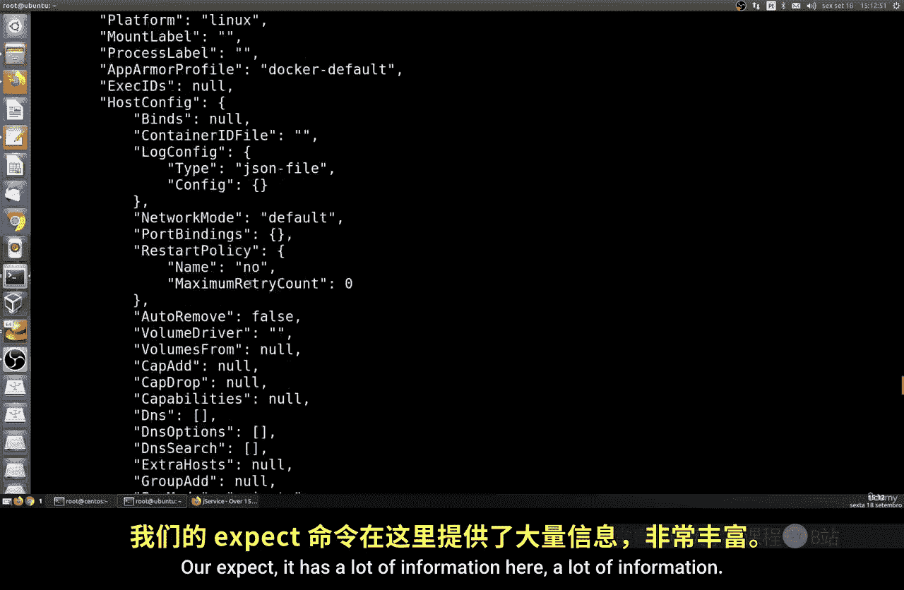

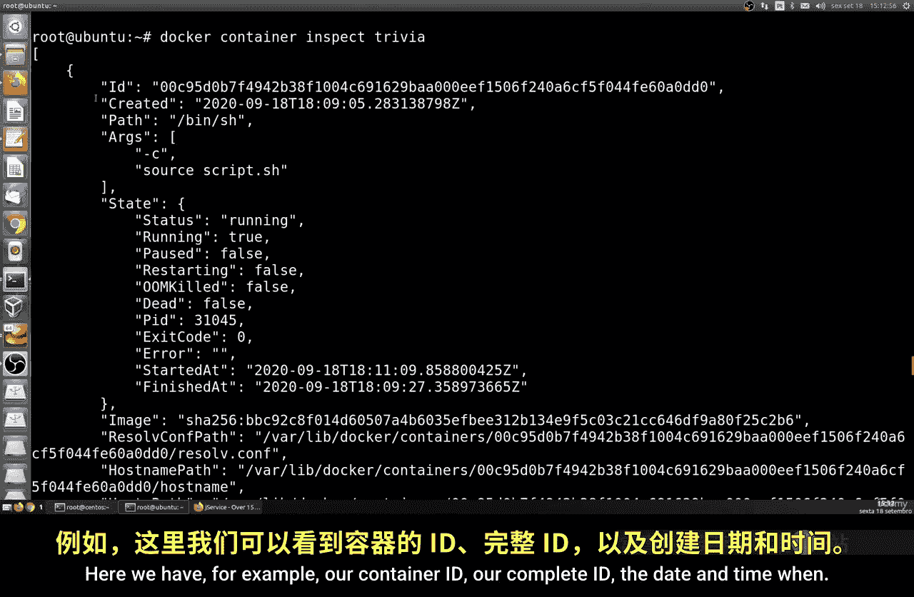

```bash
docker stop <容器ID>
```

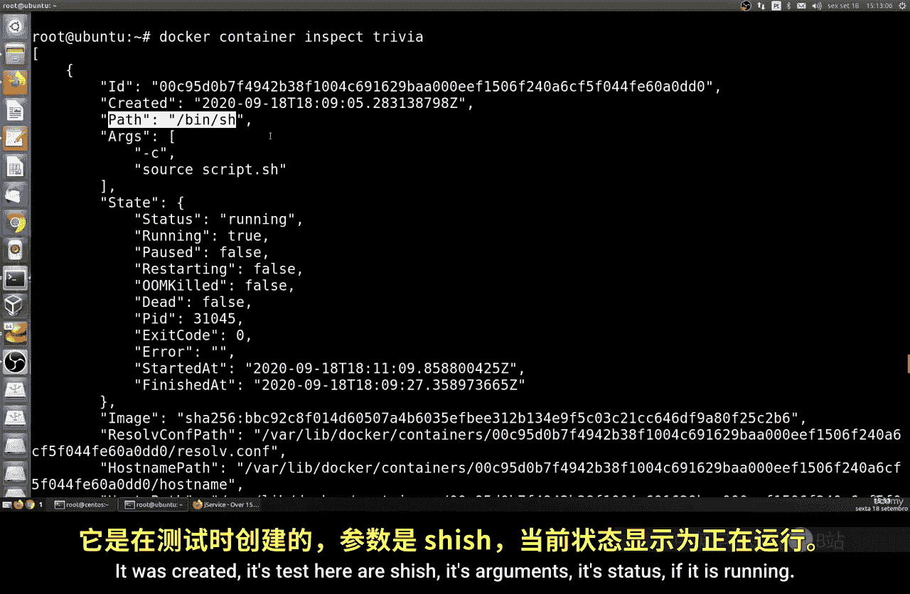

同样地，你也可以通过容器名称来移除容器，这非常简单直接。

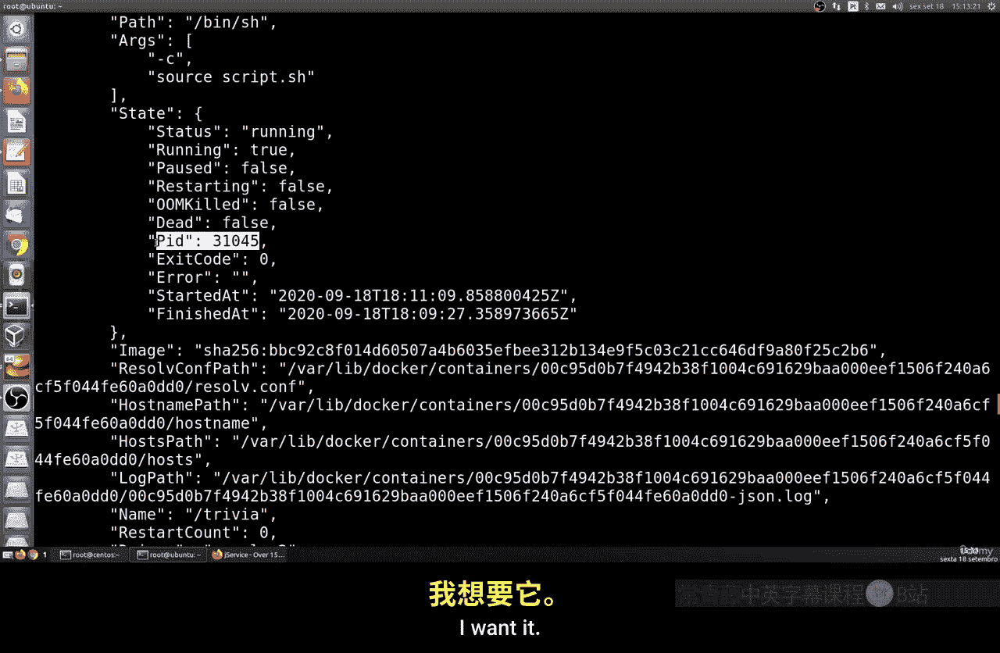

## 查看容器详细信息

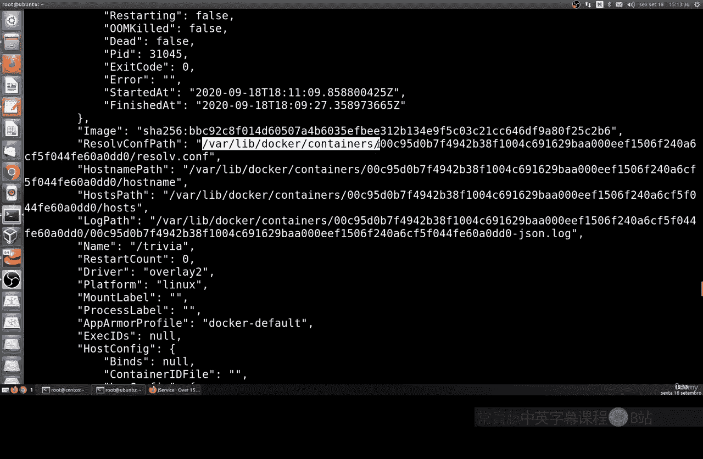

Docker提供了 `docker inspect` 命令，用于获取容器的详细配置和状态信息。这是一个非常有用的诊断工具。

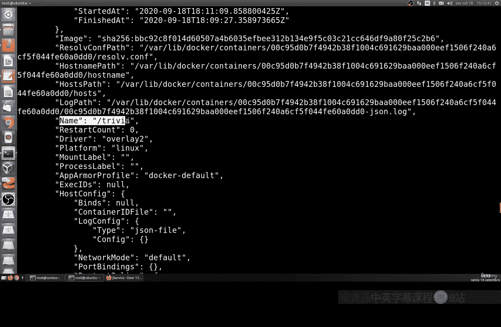

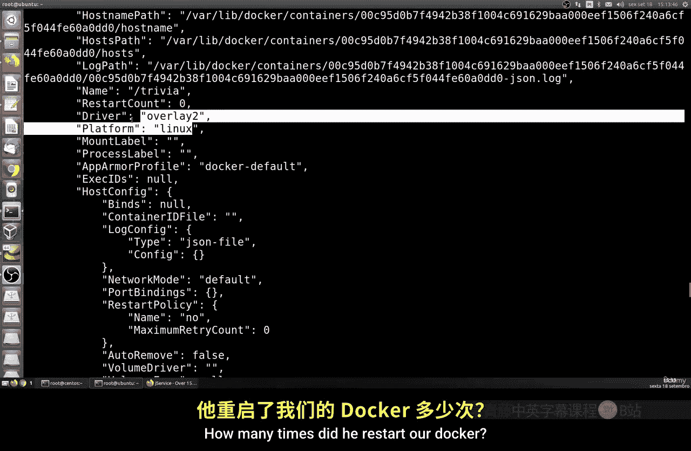

```bash
docker inspect <容器名称或ID>
```

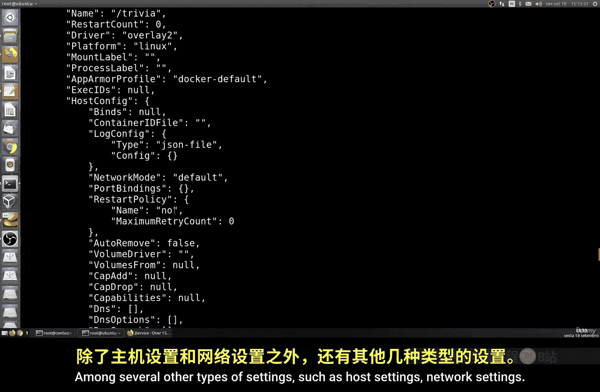

该命令会输出大量JSON格式的信息，包括：
*   **容器ID**和**完整ID**
*   **创建时间**和**启动时间**
*   容器内运行的**命令**和**参数**
*   容器**状态**（如运行中、已退出、已暂停、重启中、已死亡）
*   所使用的**镜像**
*   **重启次数**
*   运行的**平台**（如Linux）
*   **主机配置**、**网络设置**、**DNS信息**和**卷挂载**等详细信息

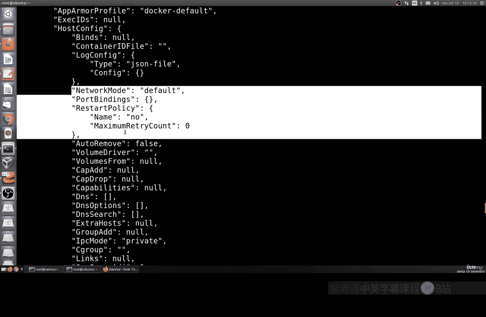

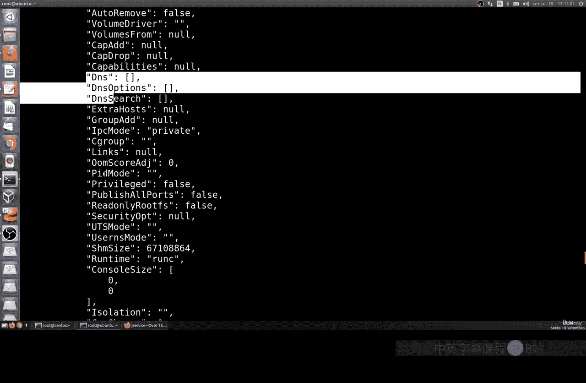

## 过滤容器信息

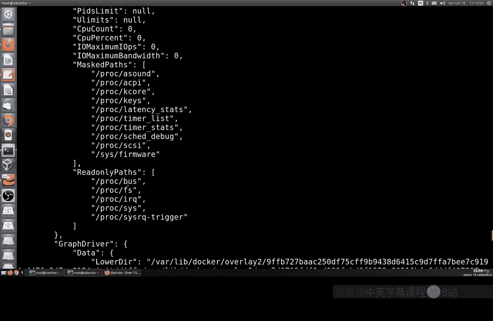

当管理多个容器时，过滤信息能帮助我们快速定位。`docker ps` 命令支持使用 `--filter` 选项进行过滤。

例如，以下命令可以筛选出所有正在运行的容器：

```bash
docker ps --filter “status=running”
```

你可以根据状态（如 `running`, `exited`, `paused`, `restarting`, `dead`）或其他条件进行过滤，从而更有效地管理容器状态。

## 总结

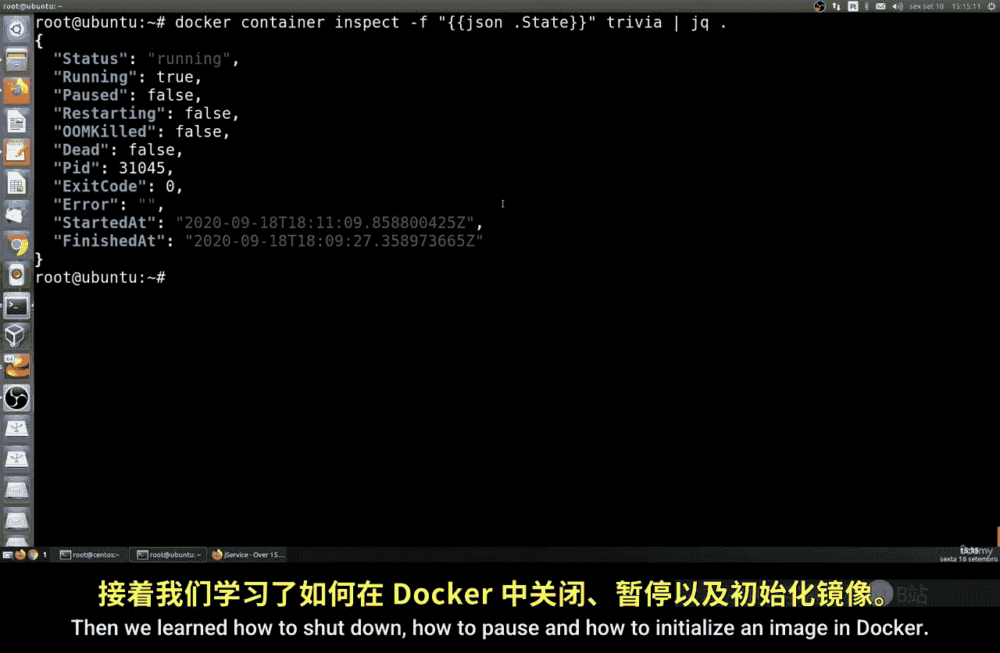

本节课中我们一起学习了Docker容器的生命周期管理。我们掌握了如何使用 `docker stop` 和 `docker start` 命令来停止和启动容器，理解了停止过程中的信号机制。我们还学习了如何通过 `docker container ls -a` 获取容器ID，以及如何使用容器ID或名称进行精确操作。此外，`docker inspect` 命令帮助我们深入了解容器的内部详情，而 `--filter` 选项则让我们能够高效地筛选和管理容器列表。这些是管理Docker容器的基础且重要的技能。