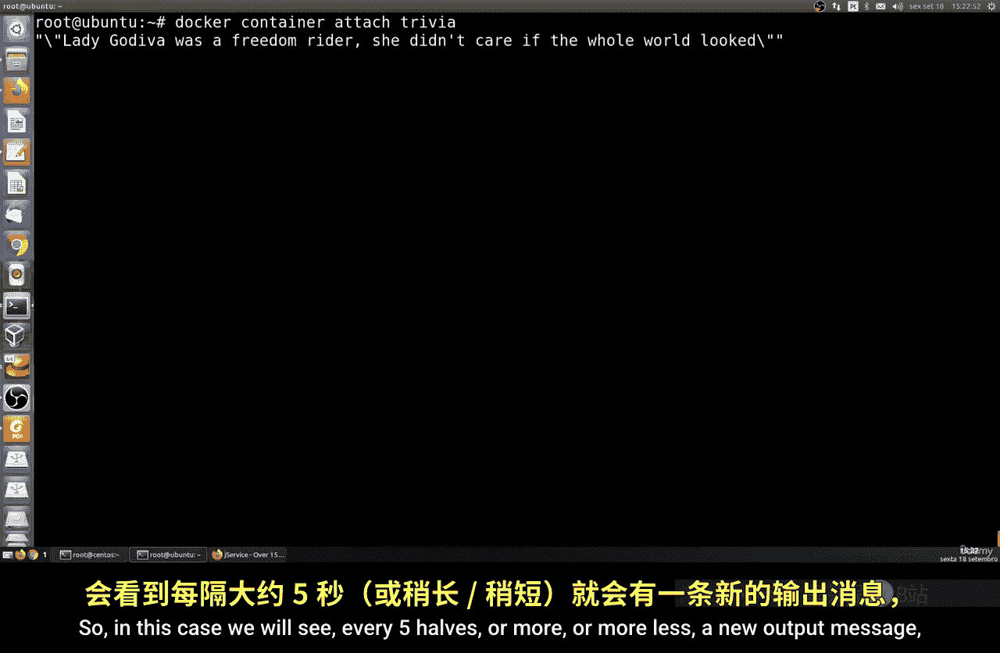
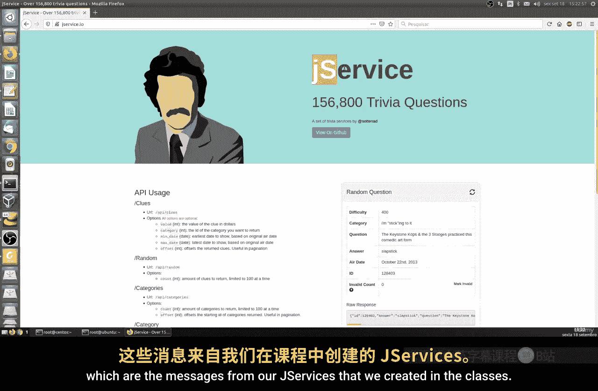
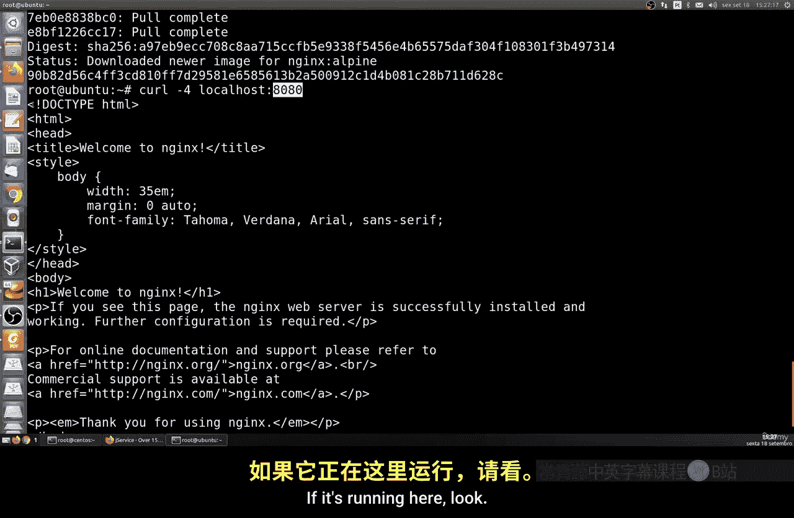
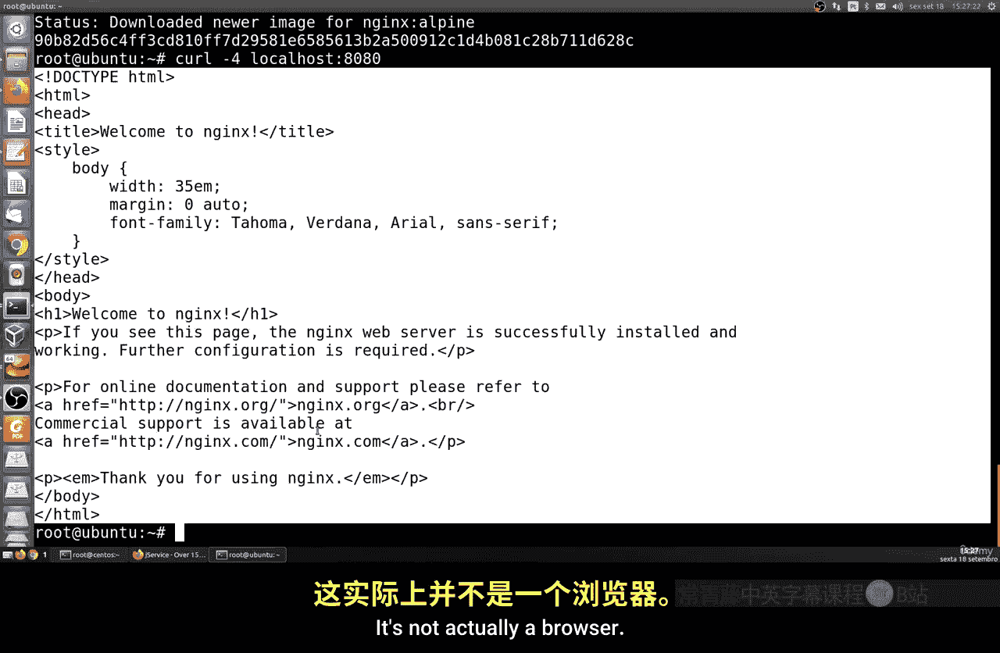
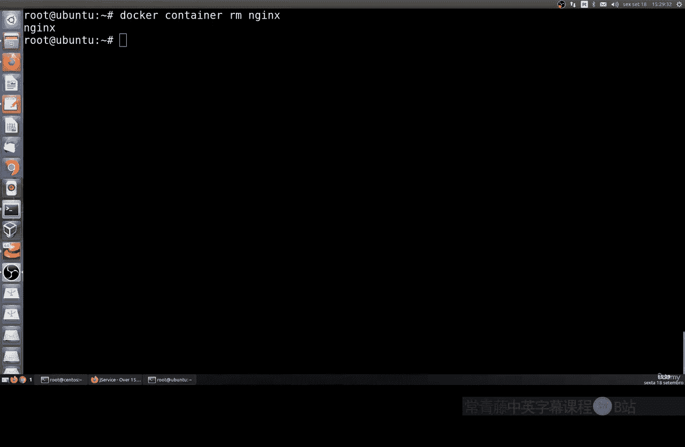

# 160：在运行中的容器中执行与附加命令 🐳

在本节课中，我们将要学习两个重要的Docker命令：`exec`和`attach`。这两个命令允许我们与正在运行的容器进行交互，执行额外进程或连接到其标准输入输出流。

## 概述

上一节我们介绍了Docker的基本操作，本节中我们来看看如何与正在运行的容器进行交互。我们将重点学习 `docker container exec` 和 `docker container attach` 这两个命令的用法。

## 使用 `exec` 命令在容器内执行进程

如果我们想要在一个已经在运行的容器内部执行一个额外的进程，可以使用 `exec` 命令。

其基本命令格式如下：
```bash
docker container exec [OPTIONS] CONTAINER COMMAND [ARG...]
```

以下是 `exec` 命令的两个常用选项：
*   **`-i` 或 `--interactive`**：保持标准输入（STDIN）打开，即使没有连接。这允许我们以交互模式运行进程。
*   **`-t` 或 `--tty`**：为命令分配一个伪终端（TTY）。这通常与 `-i` 选项一起使用，以提供一个交互式的命令行环境。

例如，要在一个名为 `my_container` 的容器内打开一个新的交互式shell，可以运行：
```bash
docker container exec -it my_container /bin/sh
```
执行后，你将进入容器内部的shell提示符，可以运行Linux命令，例如 `ps` 来列出所有正在运行的进程。

要退出这个交互式shell并返回到主机终端，可以按 `Ctrl` + `D` 组合键。

此外，`exec` 命令也可以直接执行一个命令而不进入交互式终端。例如，在容器内直接执行 `echo` 命令：
```bash
docker container exec my_container echo "Hello World"
```
这种方式更简单直接，命令执行完毕后会立即返回结果，而不会停留在容器的终端里。



## 使用 `attach` 命令连接到容器



`attach` 命令用于将你的终端标准输入、输出和错误流连接到正在运行的容器的主进程。

例如，我们可以运行一个会持续输出日志的容器：
```bash
docker container run --name logger ubuntu bash -c 'while true; do echo "Service log message"; sleep 5; done'
```
这个容器会每隔大约5秒输出一条信息。

要观察这些输出，我们可以使用 `attach` 命令连接到它：
```bash
docker container attach logger
```
现在，你将在终端中看到容器持续输出的日志信息。



如果想退出容器而不停止它（即断开连接但让容器继续在后台运行），可以按 `Ctrl` + `P`， 然后按 `Ctrl` + `Q` 组合键。如果直接按 `Ctrl` + `C`，通常会终止容器的主进程，从而导致容器停止运行。



## 实践示例：连接到一个Web服务器容器

让我们通过一个Web服务器的例子来实践。首先，在后台（`-d` 选项表示分离模式）运行一个Nginx容器，并将主机的8080端口映射到容器的80端口：
```bash
docker container run -d --name my_web -p 8080:80 nginx
```
容器启动后，你可以使用 `curl` 命令测试它是否正常运行：
```bash
curl localhost:8080
```
如果看到返回的HTML内容，说明Nginx服务器正在运行。

现在，我们可以使用 `attach` 命令连接到这个容器，观察它的访问日志：
```bash
docker container attach my_web
```
默认情况下，你可能看不到任何输出，因为此时还没有HTTP请求。此时，在另一个终端里再次执行 `curl localhost:8080` 命令来模拟一次访问，你将在 `attach` 命令所在的终端里看到Nginx生成的访问日志。

要退出连接，可以按 `Ctrl` + `C`。请注意，对于像Nginx这样的前台进程，按 `Ctrl` + `C` 会停止容器。如果你想在断开连接后让容器继续运行，应该使用之前提到的 `Ctrl` + `P`， `Ctrl` + `Q` 组合键。

最后，如果你想清理这个容器，可以使用移除命令：
```bash
docker container rm -f my_web
```
**请注意**：移除容器是一个不可逆的操作，命令执行前不会多次确认，因此操作时需要格外小心。

## 总结



本节课中我们一起学习了两个关键的Docker交互命令。我们了解了如何使用 `docker container exec` 在运行中的容器内执行新的命令或打开交互式会话。同时，我们也学会了使用 `docker container attach` 来连接并观察容器的标准输出流。掌握这两个命令能帮助你更有效地管理和调试容器化的应用程序。请记住，操作容器时要谨慎，特别是执行移除命令时。