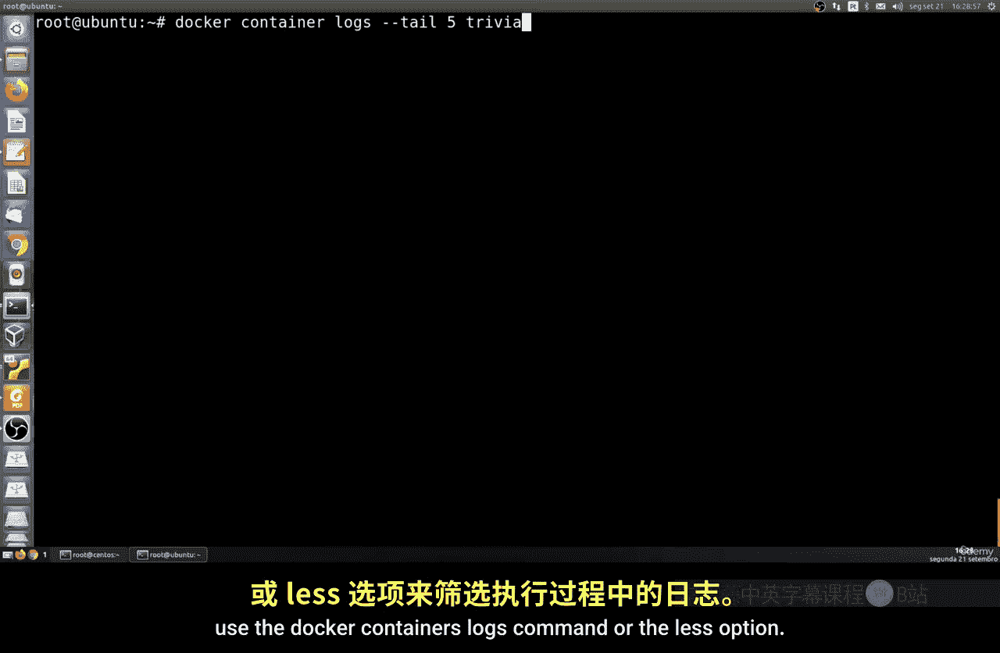
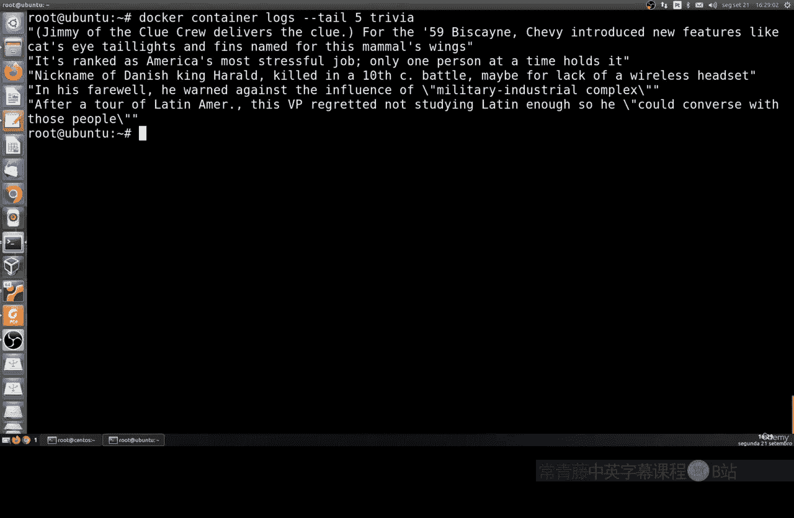
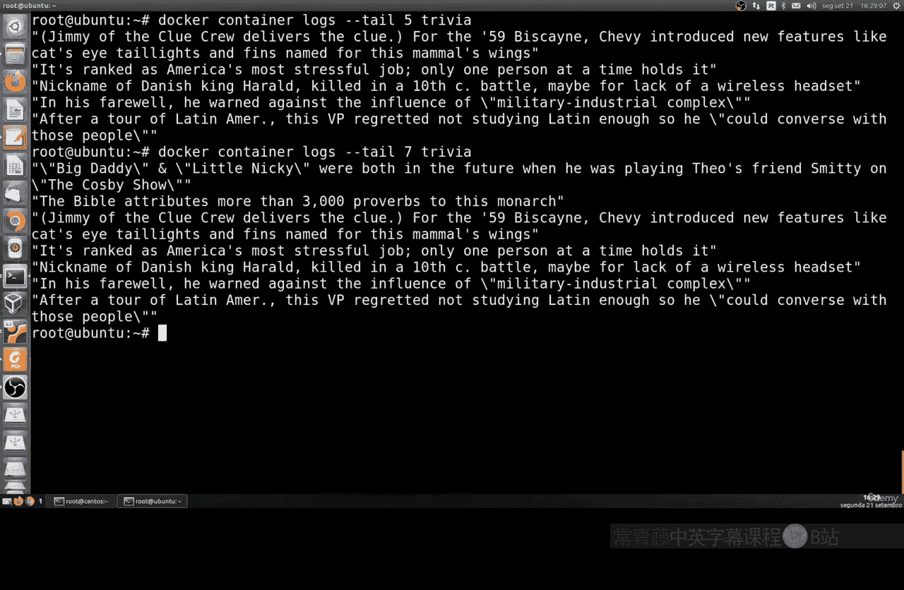
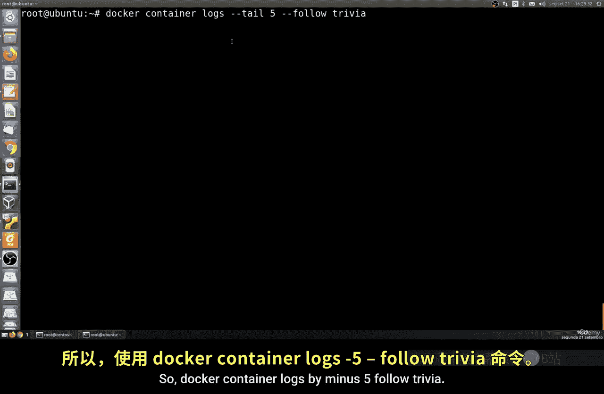
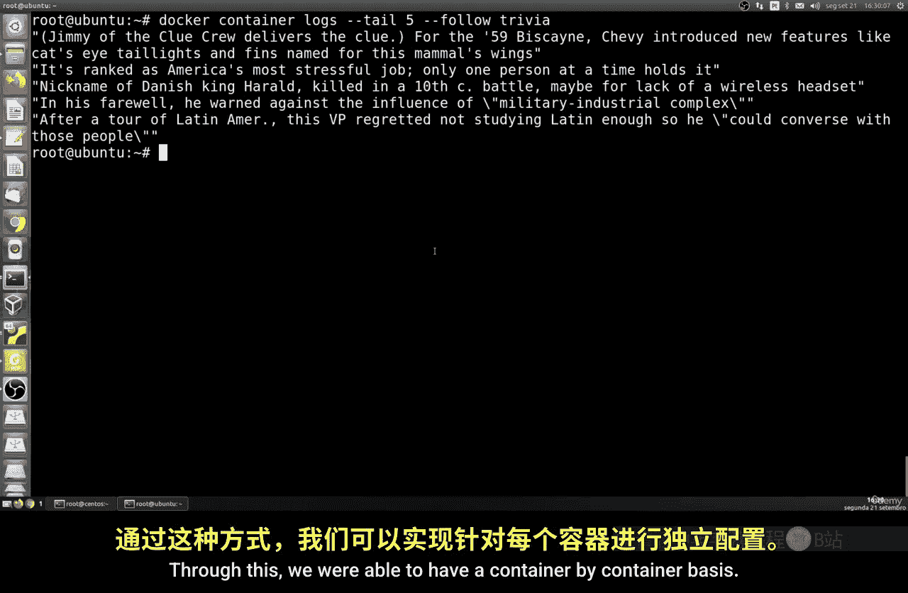
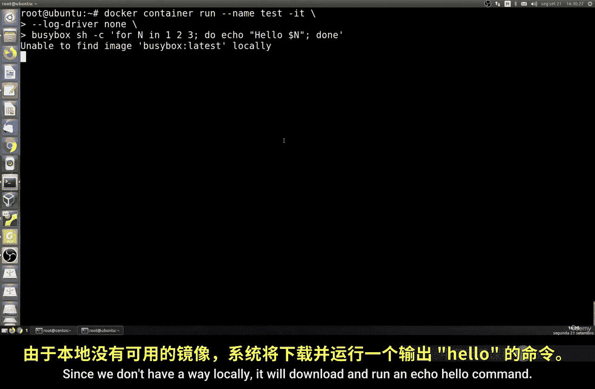
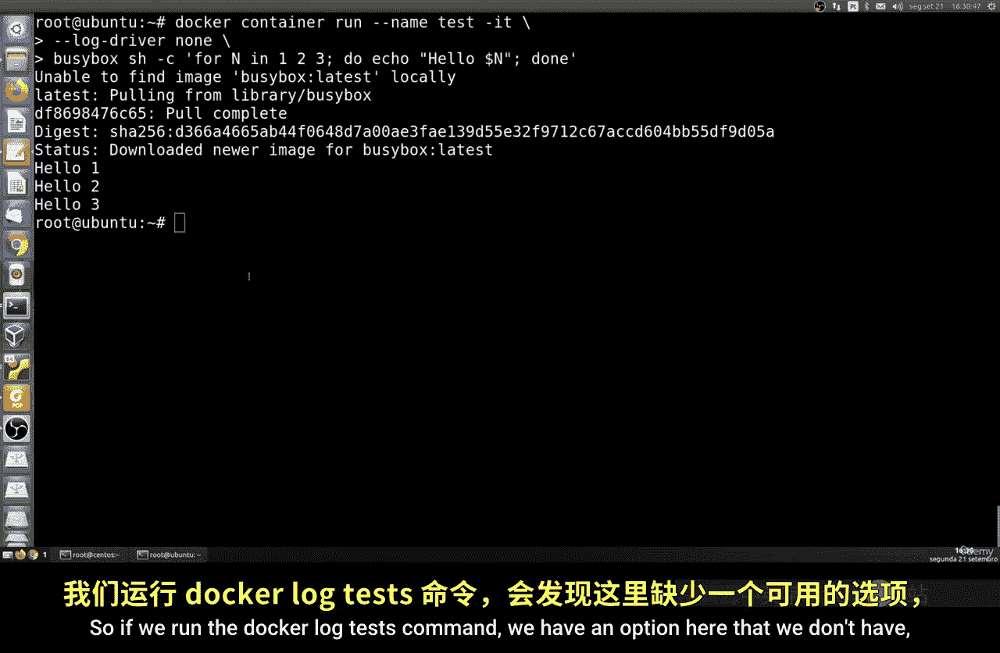
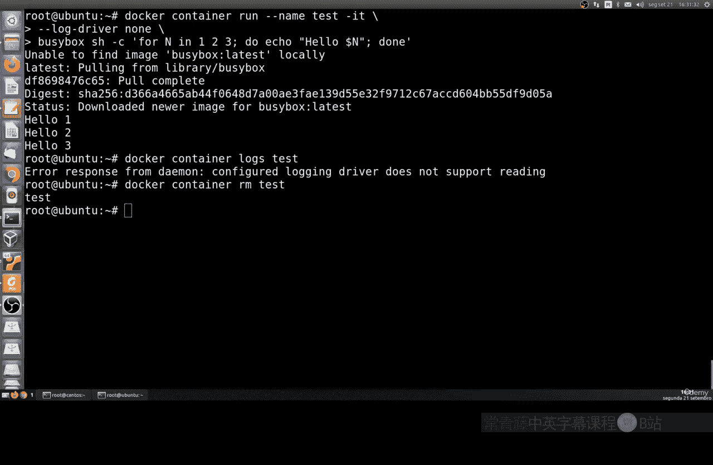

# 161：处理Docker日志 📜

在本节课中，我们将学习如何处理Docker容器中的日志和记录文件。我们将介绍如何查看、筛选和配置Docker容器的日志输出。

## 概述

Docker容器在运行过程中会产生日志记录。这些日志对于监控应用状态和排查问题至关重要。我们可以使用Docker命令来访问和管理这些日志。

## 查看容器日志

要查看容器的日志，我们使用 `docker container logs` 命令。

例如，我们可以查看名为 `trivia` 的容器的所有日志：

```bash
docker container logs trivia
```

这个命令会显示该容器自创建以来产生的所有日志消息。在之前的课程中，我们配置了 `trivia` 容器，使其每5秒生成一条随机消息。因此，执行上述命令将输出这些消息。

## 筛选日志条目

有时我们只关心最近的几条日志。以下是筛选日志的方法。



我们可以使用 `--tail` 选项来指定查看最后几条日志记录。例如，查看最后5条记录：



```bash
docker container logs --tail 5 trivia
```



同样，查看最后7条记录：

```bash
docker container logs --tail 7 trivia
```

你可以自由定义 `--tail` 后面的数字，以查看任意数量的最新日志条目。

## 实时跟踪日志



上一节我们介绍了如何查看历史日志，本节中我们来看看如何实时监控日志的产生。

如果你想实时跟踪一个容器正在产生的日志，可以使用 `--follow` (或 `-f`) 选项。结合 `--tail` 选项，可以先显示最近的几条历史日志，然后开始实时跟踪。

例如，以下命令先显示最后5条日志，然后开始实时跟踪新产生的日志：

```bash
docker container logs --tail 5 --follow trivia
```



这是一个非常有用的选项，可以让你持续监控容器的运行状态。

## 配置日志驱动

除了查看日志，我们还可以配置Docker使用不同的日志驱动。这可以全局设置，也可以针对单个容器设置。



例如，我们可以在运行容器时，通过 `--log-driver` 参数指定日志驱动。以下命令创建一个使用 `none` 日志驱动的临时容器（这意味着不产生任何日志输出）：

```bash
docker run --log-driver none --name test alpine echo "Hello 1, 2, 3"
```

容器执行 `echo` 命令后会退出。由于日志驱动设置为 `none`，该容器不会产生任何日志输出。



如果我们尝试查看这个容器的日志：

```bash
docker logs test
```

将会收到错误提示，因为 `none` 驱动不记录任何日志。如果你想清理这个测试容器，可以运行：

```bash
docker container rm test
```

## 总结



本节课中我们一起学习了Docker日志处理的基础知识。我们掌握了如何使用 `docker container logs` 命令查看日志，如何使用 `--tail` 选项筛选日志条目，以及如何使用 `--follow` 选项实时跟踪日志。最后，我们还了解了如何通过 `--log-driver` 参数为容器配置不同的日志驱动。掌握这些技能将帮助你有效地监控和管理Docker容器的运行状态。