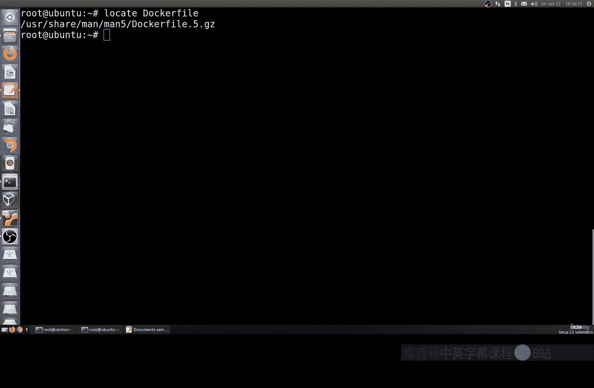
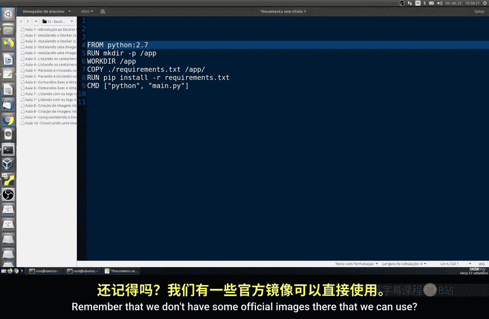
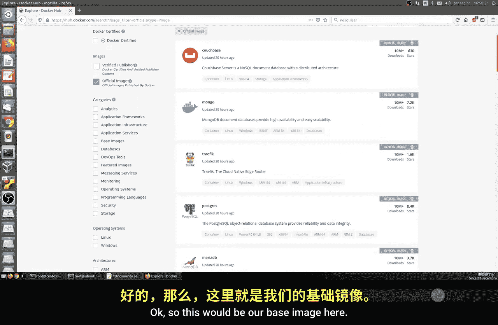
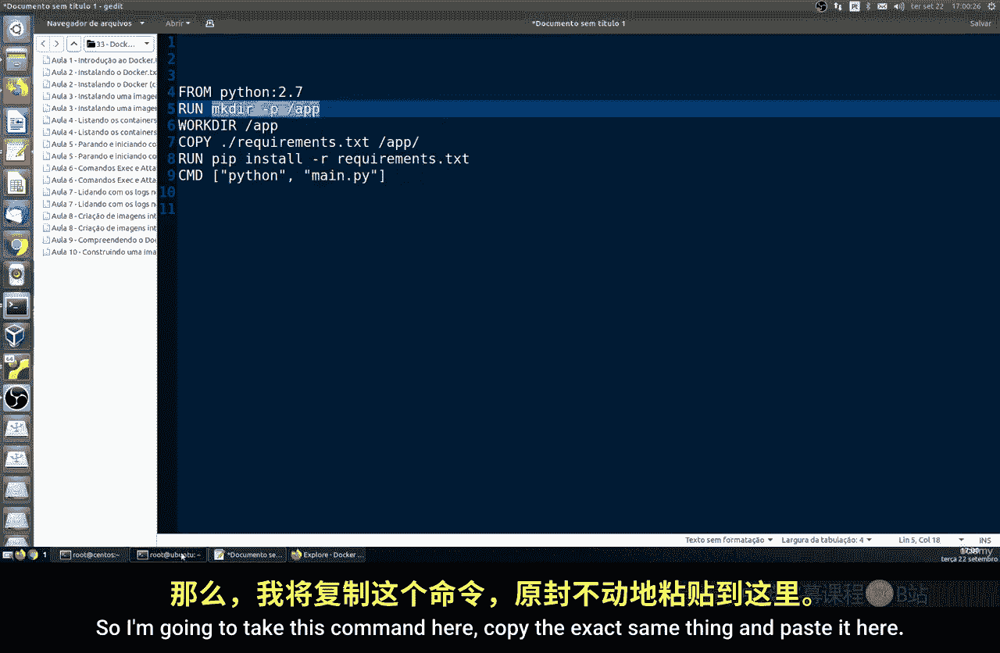
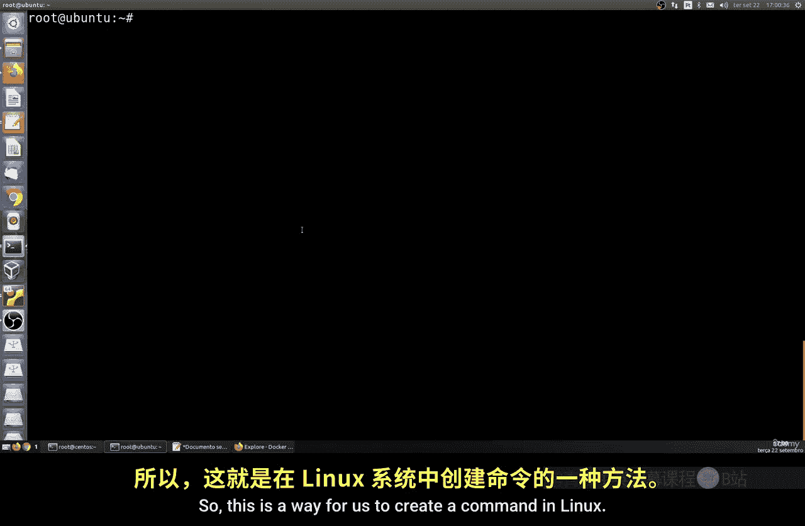
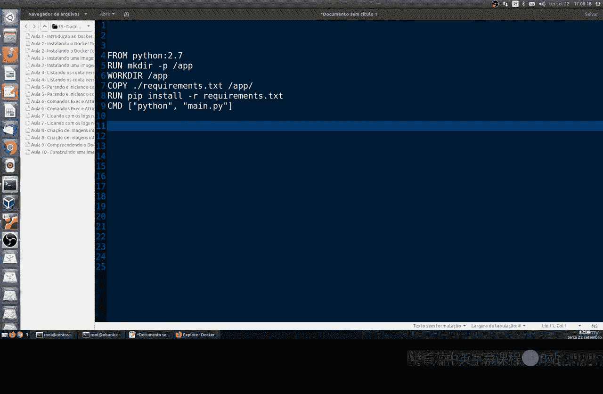

# 163：理解Dockerfile 🐳



在本节课中，我们将要学习Dockerfile的工作原理，以及它如何帮助我们创建自定义的容器镜像。我们将解析Dockerfile的基本语法和核心命令，为后续的实践操作打下基础。

## 概述

Dockerfile是一个文本文件，它包含了一系列用于构建Docker镜像的指令。通过编写Dockerfile，我们可以定义如何创建镜像、配置容器以及运行命令。接下来，我们将逐一解析这些指令。

## Dockerfile的基本结构

一个典型的Dockerfile包含多行指令，每行指令都以一个特定的关键字开头。这些关键字是Dockerfile的保留字，每个都代表一个特定的功能。以下是Dockerfile中常见的几行指令示例。



## 核心指令详解



以下是Dockerfile中几个关键指令的详细说明。

### FROM指令

`FROM`指令是每个Dockerfile的起点，它定义了构建自定义镜像所基于的基础镜像。基础镜像可以是任何系统，例如一个操作系统、Python环境、Node.js环境或数据库。

**公式**：
```dockerfile
FROM <image>:<tag>
```



例如，如果你想基于Ubuntu 18.04构建镜像，可以这样写：
```dockerfile
FROM ubuntu:18.04
```
如果你想从一个完全空白的镜像开始，可以使用`scratch`：
```dockerfile
FROM scratch
```



### RUN指令

`RUN`指令用于在镜像构建过程中执行任何有效的Linux命令。例如，你可以使用它来创建目录、安装软件包或运行脚本。

**公式**：
```dockerfile
RUN <command>
```

例如，创建一个名为`app`的目录：
```dockerfile
RUN mkdir -p /app
```
对于较长的命令，可以使用反斜杠`\`来换行，使其更易读：
```dockerfile
RUN apt-get update && \
    apt-get install -y curl
```

### COPY和ADD指令

`COPY`和`ADD`指令用于将文件、目录或远程URL资源从构建上下文复制到镜像中。`ADD`指令功能更强大，它还可以自动解压压缩文件。

**公式**：
```dockerfile
COPY <src> <dest>
ADD <src> <dest>
```

例如，将当前目录下的文件复制到镜像的`/app`目录：
```dockerfile
COPY . /app
```
或者，添加并解压一个压缩包：
```dockerfile
ADD application.tar.gz /app
```

### WORKDIR指令

`WORKDIR`指令用于设置镜像中的工作目录。后续的指令（如`RUN`、`CMD`）将在这个目录下执行。

**公式**：
```dockerfile
WORKDIR <directory>
```

例如，将工作目录设置为`/app`：
```dockerfile
WORKDIR /app
```

### CMD和ENTRYPOINT指令

`CMD`和`ENTRYPOINT`指令都用于指定容器启动时运行的命令。它们之间的区别比较微妙：`ENTRYPOINT`定义了容器的主要可执行命令，而`CMD`则提供了默认参数。

**公式**：
```dockerfile
CMD ["executable","param1","param2"]
ENTRYPOINT ["executable", "param1", "param2"]
```

例如，一个使用`ping`命令的配置：
```dockerfile
ENTRYPOINT ["ping"]
CMD ["-c", "3", "8.8.8.8"]
```
在这个例子中，容器默认会执行`ping -c 3 8.8.8.8`。

## 总结




本节课我们一起学习了Dockerfile的核心概念和基本指令。我们了解了`FROM`用于指定基础镜像，`RUN`用于执行命令，`COPY`/`ADD`用于添加文件，`WORKDIR`用于设置工作目录，以及`CMD`和`ENTRYPOINT`用于定义容器启动行为。所有Dockerfile都遵循这一基本模式。在下一节课中，我们将通过实践，一步步创建一个完整的Dockerfile。