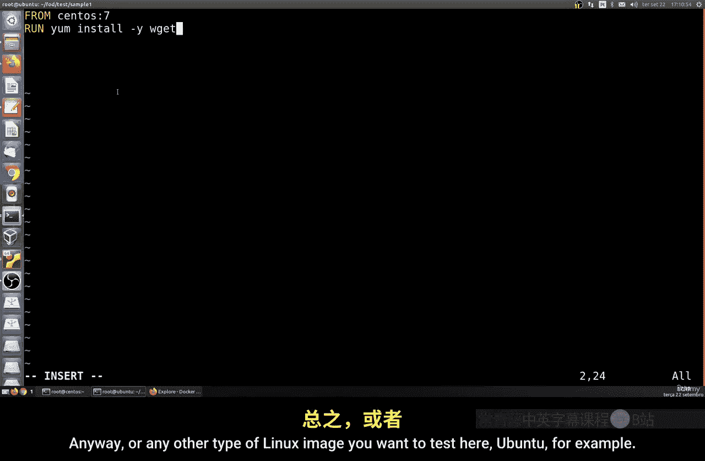
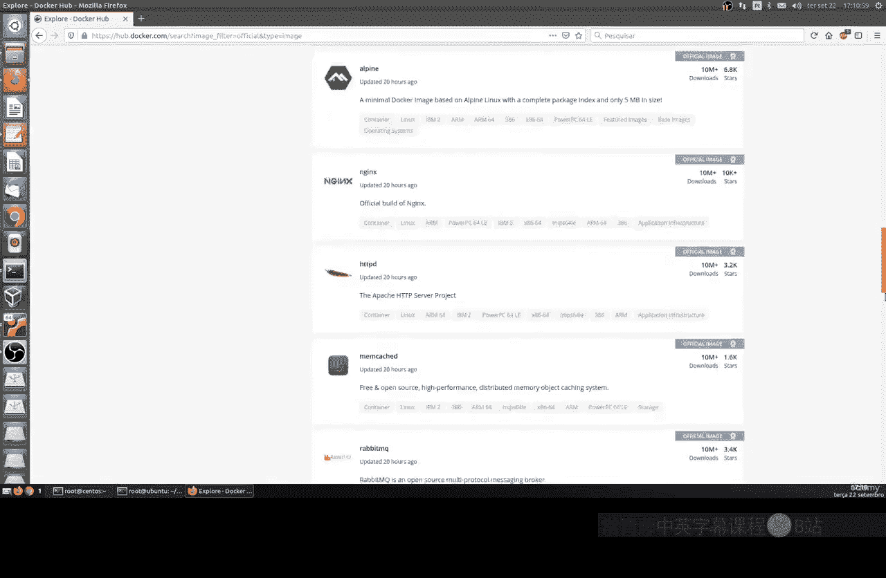
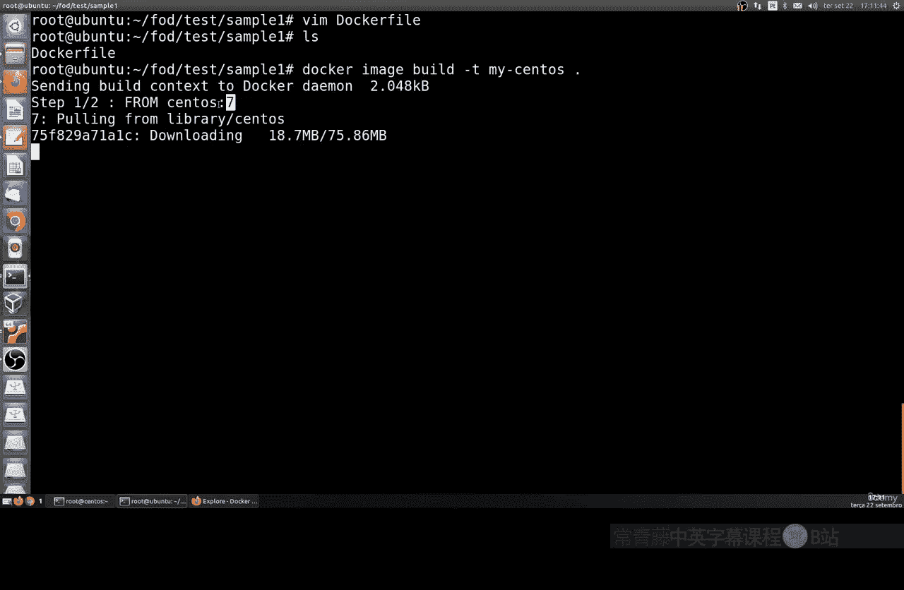
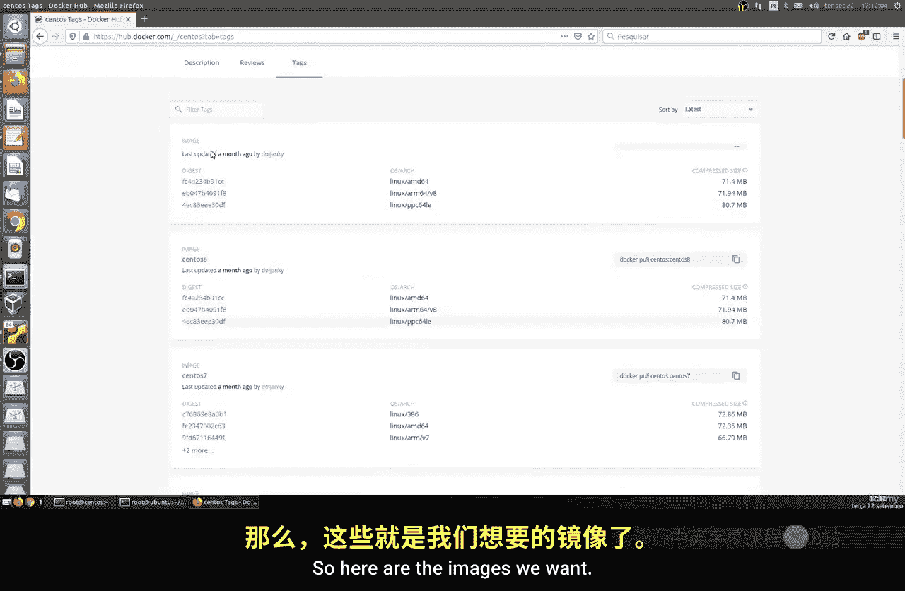
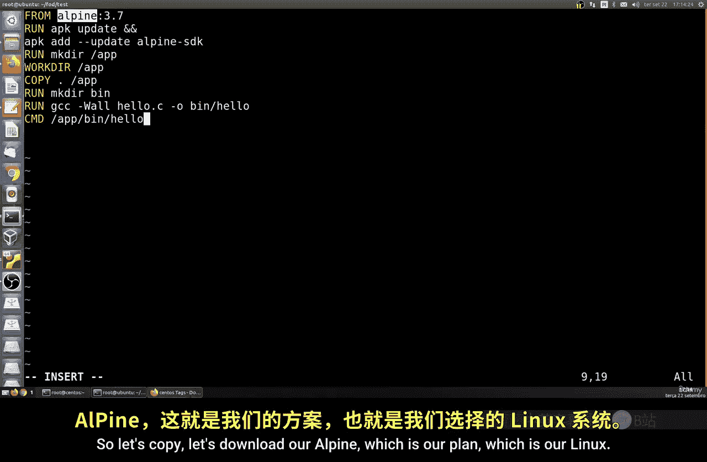
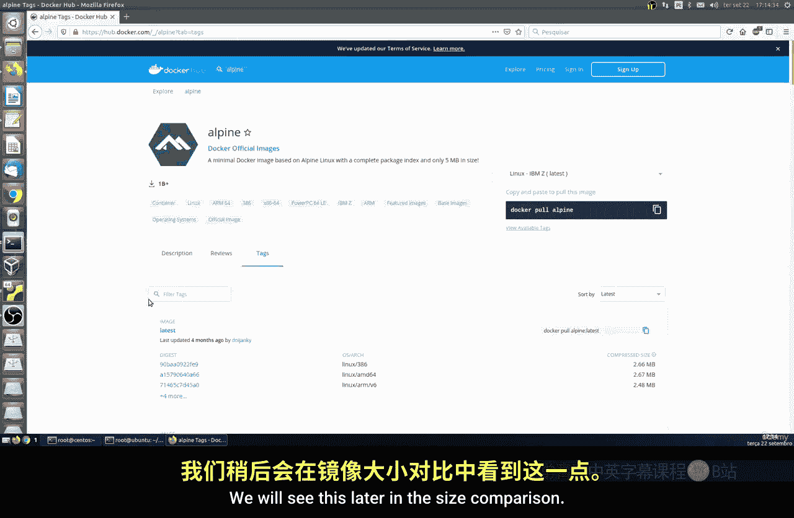
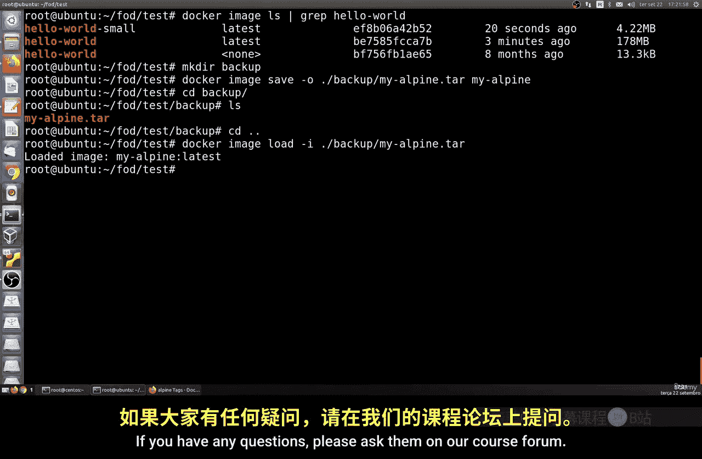

# 164：从零开始构建Docker镜像 🐳

在本节课中，我们将学习如何从零开始构建一个Docker镜像。我们将通过创建和配置`Dockerfile`文件，来实践如何定义和构建自定义的容器镜像。

---

## 概述

我们将创建一个简单的`Dockerfile`，并逐步构建一个包含特定工具的镜像。之后，我们会创建一个更复杂的示例，编译并运行一个C语言程序，并探讨如何优化镜像大小。

---

## 创建第一个Docker镜像

上一节我们介绍了Docker的基本概念，本节中我们来看看如何实际构建一个镜像。





首先，我们需要创建一个工作目录，以避免与系统中的其他文件混淆。

以下是创建和进入测试目录的步骤：

```bash
mkdir test
cd test
```

接下来，我们创建一个名为`Dockerfile`的文件。请注意，文件名必须精确为`Dockerfile`，首字母大写，且没有扩展名。

你可以使用任何文本编辑器。这里我们使用`vim`：



```bash
vim Dockerfile
```

在`Dockerfile`中，我们将指定基础镜像并运行一个安装命令。内容如下：



```dockerfile
FROM centos:7
RUN yum install -y wget
```

这个`Dockerfile`的含义是：基于`centos:7`这个官方镜像，并在其中运行`yum install -y wget`命令来安装`wget`工具。

保存并退出编辑器后，我们可以使用`docker build`命令来构建镜像：

```bash
docker build -t my-centos .
```

命令解释：
*   `-t my-centos`：为构建的镜像指定一个标签（名称）。
*   末尾的`.`：指定构建上下文为当前目录，Docker会在这里寻找`Dockerfile`。

执行命令后，Docker会首先拉取`centos:7`基础镜像，然后执行`RUN`指令安装`wget`。完成后，我们就得到了一个名为`my-centos`的自定义镜像。

这个例子展示了Docker的强大之处：我们可以在一个基础的Linux系统（如Ubuntu）中，轻松创建和管理其他Linux发行版（如CentOS）的容器环境。

如果你想指定不同的`Dockerfile`文件名或路径，可以使用`-f`选项：

```bash
docker build -t my-image -f /path/to/your/Dockerfile .
```

---

## 构建包含C程序的Docker镜像



现在，让我们来看一个更复杂的例子。我们将创建一个能编译和运行C语言程序的Docker镜像。



首先，回到上级目录并创建一个简单的C程序文件：

```bash
cd ..
echo '#include <stdio.h>\nint main() { printf(\"Hello World\\n\"); return 0; }' > hello.c
```

这个`hello.c`文件包含了一个打印“Hello World”的C程序。

接下来，我们创建一个新的`Dockerfile`来构建镜像。这次我们使用`alpine`作为基础镜像，因为它非常轻量。

```dockerfile
FROM alpine:latest
RUN apk update
RUN apk add build-base
RUN mkdir /app
WORKDIR /app
COPY hello.c /app
RUN gcc -o hello hello.c
CMD ["./hello"]
```

这个`Dockerfile`的步骤如下：
1.  `FROM alpine:latest`: 基于最新的Alpine Linux镜像。
2.  `RUN apk update`: 更新Alpine的软件包列表。
3.  `RUN apk add build-base`: 安装编译工具（包括gcc）。
4.  `RUN mkdir /app`: 创建一个名为`/app`的目录。
5.  `WORKDIR /app`: 将后续命令的工作目录设置为`/app`。
6.  `COPY hello.c /app`: 将本地的`hello.c`文件复制到容器的`/app`目录。
7.  `RUN gcc -o hello hello.c`: 编译`hello.c`，生成可执行文件`hello`。
8.  `CMD ["./hello"]`: 设置容器启动时默认运行的命令。

使用以下命令构建镜像：

```bash
docker build -t hello-world .
```

构建过程会依次执行`Dockerfile`中的指令。完成后，运行这个镜像：

```bash
docker run hello-world
```

你应该会看到终端输出“Hello World”。

然而，这个镜像的大小可能接近178MB，因为它包含了完整的编译工具链。对于仅运行一个编译好的程序来说，这并不高效。

---

## 优化镜像：多阶段构建

为了解决镜像过大的问题，我们可以使用Docker的**多阶段构建**功能。其核心思想是：在一个阶段（`builder`）中编译程序，在另一个最终阶段只复制编译好的二进制文件，丢弃庞大的编译环境。

以下是优化后的`Dockerfile`：

```dockerfile
# 第一阶段：构建阶段
FROM alpine:latest as builder
RUN apk add build-base
COPY hello.c .
RUN gcc -o hello hello.c

# 第二阶段：运行阶段
FROM alpine:latest
COPY --from=builder /hello /app/hello
WORKDIR /app
CMD ["./hello"]
```

这个`Dockerfile`分为两个阶段：
1.  **构建阶段 (`builder`)**：基于`alpine`安装编译工具，编译`hello.c`，生成`hello`二进制文件。
2.  **运行阶段**：使用一个新的`alpine`镜像作为基础，仅从`builder`阶段复制编译好的`hello`文件到`/app`目录。最终的镜像不包含`gcc`等编译工具。

重新构建镜像：

```bash
docker build -t hello-world-optimized .
```

比较两个镜像的大小，你会发现优化后的镜像可能只有4MB左右，相比之前的178MB有了巨大的缩减。这对于需要部署大量容器的场景至关重要，能显著节省存储和网络带宽。

---

## 镜像的备份与加载

Docker提供了方便的镜像导出和导入功能，便于迁移或备份。

**导出镜像**为tar归档文件：

```bash
mkdir backup
docker save -o backup/hello-world.tar hello-world-optimized
```

**导入镜像**从tar文件：

```bash
docker load -i backup/hello-world.tar
```

之后，你就可以像使用其他镜像一样来运行它了。

---

## 总结

本节课中我们一起学习了Docker镜像构建的核心实践。
1.  我们创建了简单的`Dockerfile`来定制镜像。
2.  我们构建了一个能编译运行C程序的镜像，并理解了镜像层和构建过程。
3.  我们利用**多阶段构建**技术优化了镜像大小，这是生产环境中的最佳实践。
4.  最后，我们掌握了使用`docker save`和`docker load`命令进行镜像备份和迁移的方法。



通过`Dockerfile`，你可以以代码的形式定义任何应用环境，实现构建的自动化、可重复和版本化管理。