# 165：创建与挂载数据卷 📦

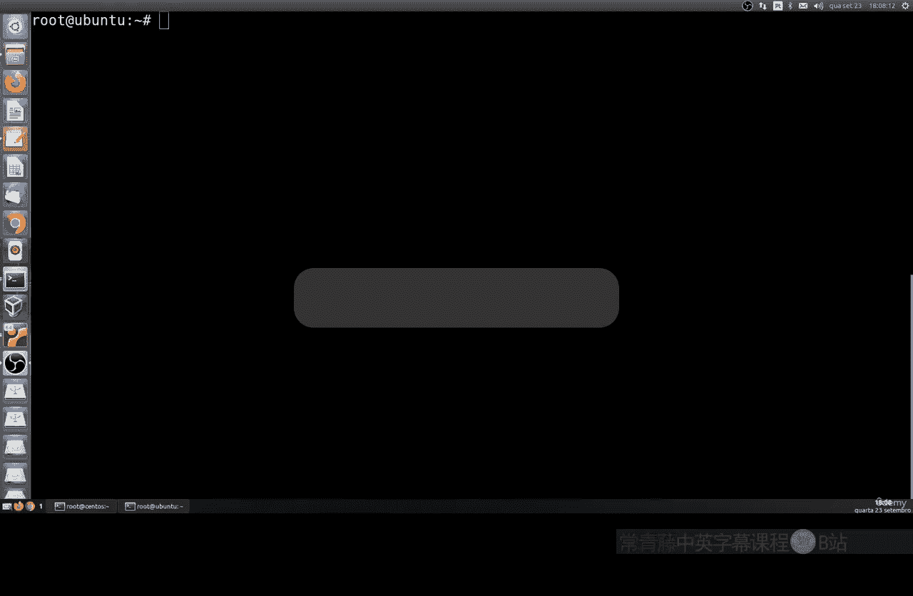

在本节课中，我们将学习如何在 Docker 中创建、挂载和管理数据卷。数据卷是 Docker 中用于持久化存储数据的关键组件，它们独立于容器的生命周期，即使容器被删除，数据也能得以保留。

## 数据卷的重要性

数据卷非常重要，因为它是所有数据持久化的地方。我们的容器会被创建，因此我们必须学会如何处理数据，并确保这类卷的生命周期能超越容器本身。这意味着，即使你删除了容器，你的数据也必须被保留下来。

## 创建并运行一个简单容器

首先，我们快速演示如何运行一个容器并执行一个脚本来创建新文件。我们将使用 `echo` 命令创建一个 TXT 文件。

以下是创建并运行一个名为 `demo` 的 Alpine 容器的命令，它会在容器内创建一个简单的文本文件：

```bash
docker run --name demo alpine sh -c 'echo "test" > /a.txt'
```

这个命令创建了一个名为 `demo` 的容器，并在其根目录下创建了一个包含文本 “test” 的 `a.txt` 文件。

## 检查容器文件系统的变化

如果你想查看相对于原始镜像，系统文件发生了哪些变化，可以使用 `docker container diff` 命令。

```bash
docker container diff demo
```

执行此命令后，你会发现唯一的差异就是我们创建的 `/a.txt` 文件。这证明了我们的操作确实在容器内创建了新文件。

## 理解数据持久化的需求

但是，如果我们想创建一个卷，即一个在容器内部的持久化存储空间，情况就不同了。这样，即使我们修改数据或删除容器，数据也不会被触及，它们将被保留下来。

如果没有创建卷，当你删除容器时，所有输入到该容器中的数据都会被自动移除。因此，我们需要创建一个新的数据卷。

## 创建持久化数据卷

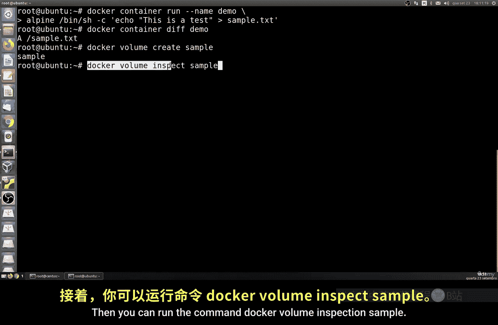

你可以使用 `docker volume create` 命令来创建一个持久化数据卷。

```bash
docker volume create sample
```

这个命令创建了一个名为 `sample` 的持久化卷。任何其他 Docker 容器之后都可以访问这个卷。实际上，你应该在创建容器之前先创建好卷。

## 查看数据卷的详细信息

创建卷后，你可以查看它的具体信息，例如它位于宿主机的哪个位置。

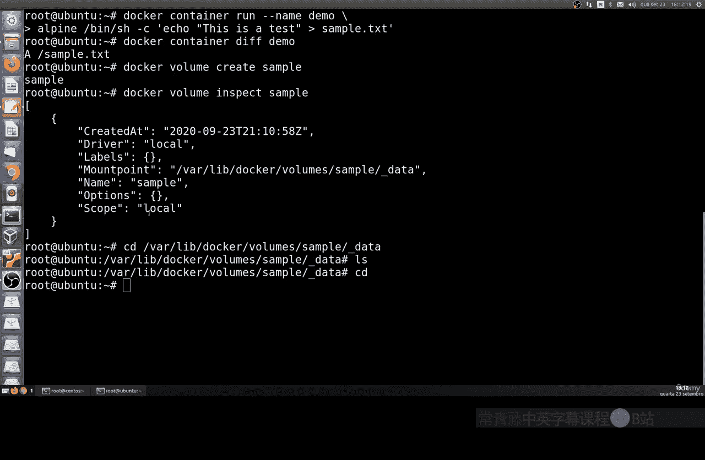

```bash
docker volume inspect sample
```

这个命令会输出一些重要信息，比如使用的驱动（通常是 `local`）、挂载点（Mountpoint）以及名称。请记下这个名称，因为稍后我们在创建 Docker 容器时，需要将容器索引到这个卷。

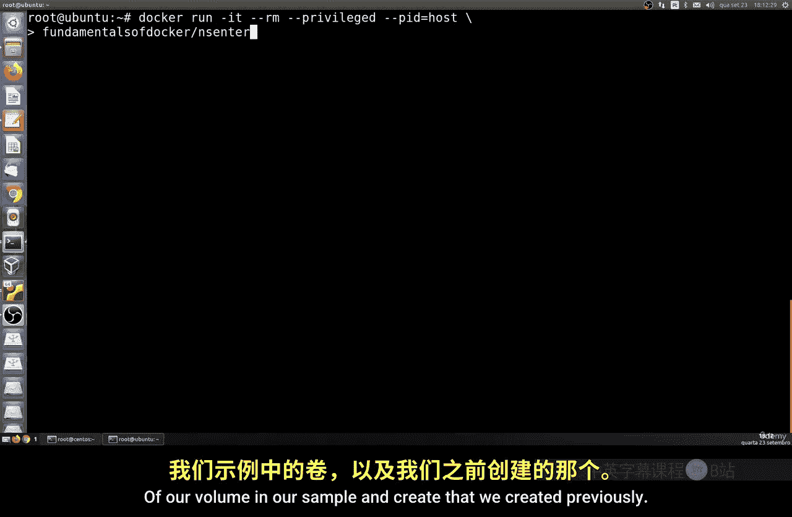

在 Linux 系统上，挂载点通常位于 `/var/lib/docker/volumes/` 目录下。你可以进入这个目录查看，目前它是空的，因为我们还没有存储任何数据。

## 在特权模式下访问卷

为了访问宿主机上受保护的系统部分（即卷的实际存储位置），我们可以以特权模式运行一个容器。

```bash
docker run -it --rm --privileged alpine sh
```

这个命令会运行一个具有特权（`--privileged`）的 Alpine 容器。这意味着容器内的应用可以访问宿主机的设备，甚至宿主机的进程树。在这个环境中，我们可以导航到卷的目录。

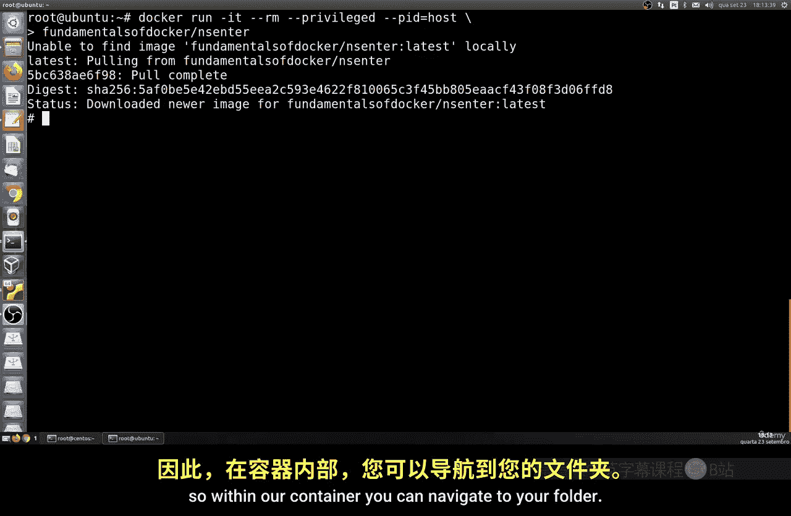

进入容器后，可以导航到卷的目录：

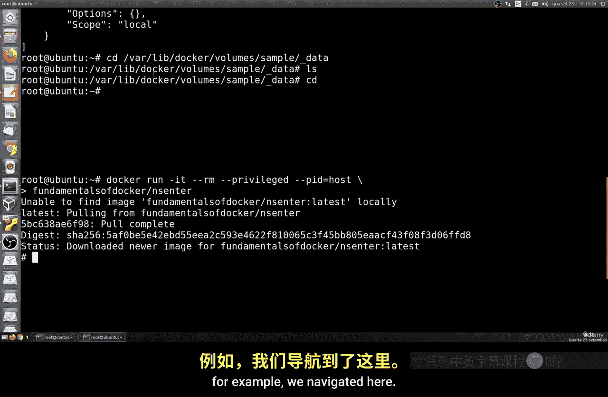

```bash
cd /var/lib/docker/volumes/sample/_data
```

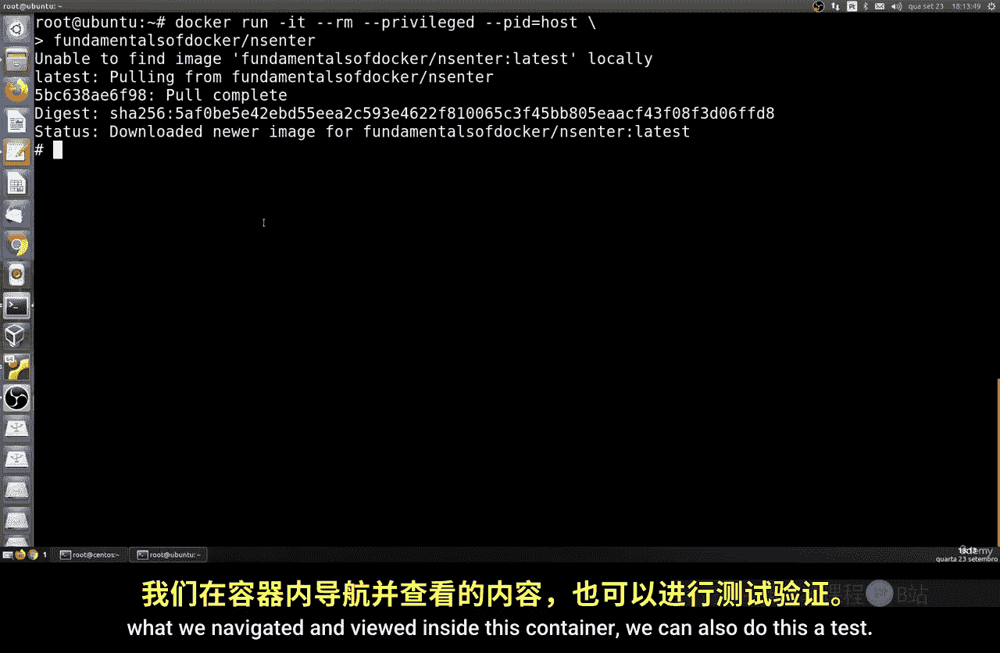

你会发现这个目录是空的，因为我们还没有存储任何数据。按 `Ctrl+D` 可以退出这个容器。

## 将数据卷挂载到容器

现在我们已经创建了一个名为 `sample` 的卷，接下来可以将其挂载到一个容器中。

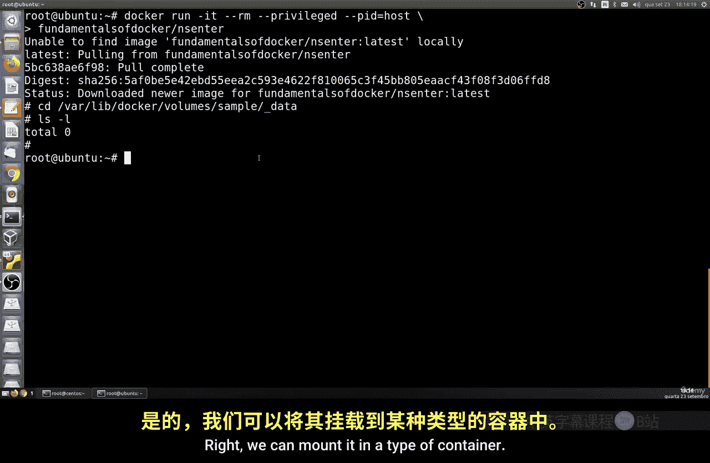

以下是创建一个新容器并将 `sample` 卷挂载到容器内 `/data` 目录的命令：

```bash
docker run -it --name test -v sample:/data alpine sh
```

这个命令的逻辑是：使用我们创建的 `sample` 卷，并将其索引（挂载）到容器的 `/data` 目录。我们使用 Alpine 镜像，并直接进入其交互式 Shell。

## 在挂载的卷中创建数据

现在，让我们在挂载的卷中创建一些数据。

进入容器后，切换到 `/data` 目录并创建一个新文件：

```bash
cd /data
echo "persistent data" > file1.txt
ls -l
```

创建文件后，退出容器。

## 验证数据的持久性

现在，我们来验证数据的持久性。首先，删除刚才创建的容器。

```bash
docker rm -f test
```

容器被删除后，数据卷依然存在。我们可以再次以特权模式进入宿主机上的卷目录查看：

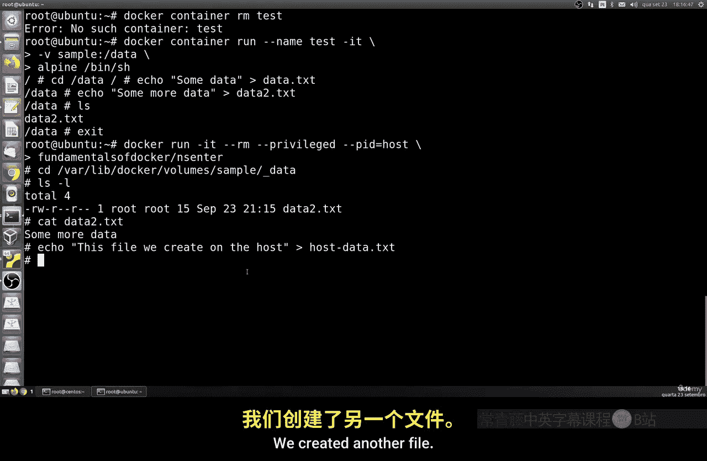

```bash
docker run -it --rm --privileged alpine sh
cd /var/lib/docker/volumes/sample/_data
ls -l
```

你会发现 `file1.txt` 文件仍然存在。这证明了数据被成功保留。

## 使用相同卷创建新容器

为了进一步证明，让我们使用同一个 `sample` 卷创建一个全新的容器，但使用不同的名称和镜像标签。

```bash
docker run -it --name test2 -v sample:/data alpine:3.18 sh
```

进入新容器后，再次检查 `/data` 目录：

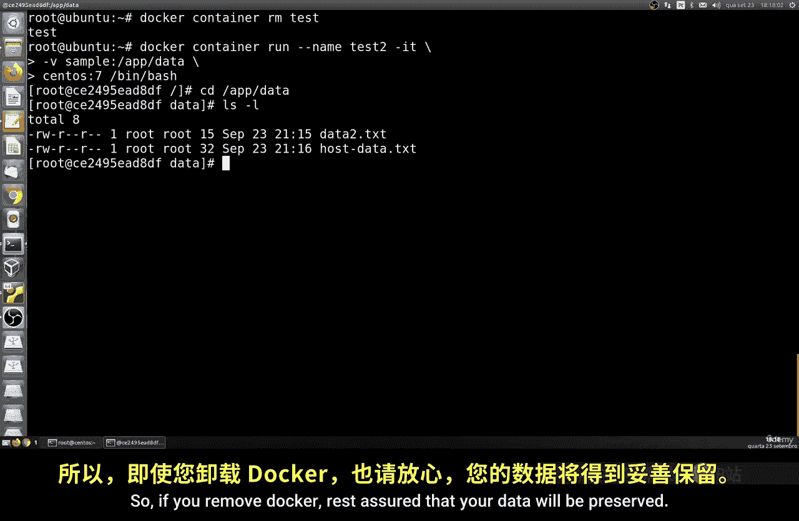

```bash
cd /data
ls -l
```

你将看到之前创建的 `file1.txt` 文件。这是最关键的证明：即使你删除了旧容器并使用另一个镜像创建新容器，只要挂载了同一个数据卷，你的数据就会被保留。

## 清理资源

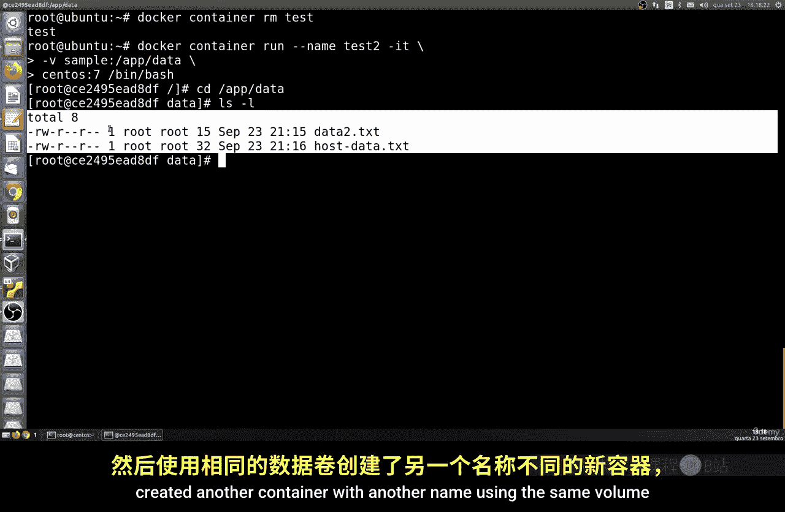

最后，我们来学习如何清理。如果你想删除一个数据卷，可以使用 `docker volume rm` 命令。

**注意**：只有当没有任何容器在使用该卷时，你才能删除它。

```bash
# 首先删除使用该卷的容器
docker rm -f test2

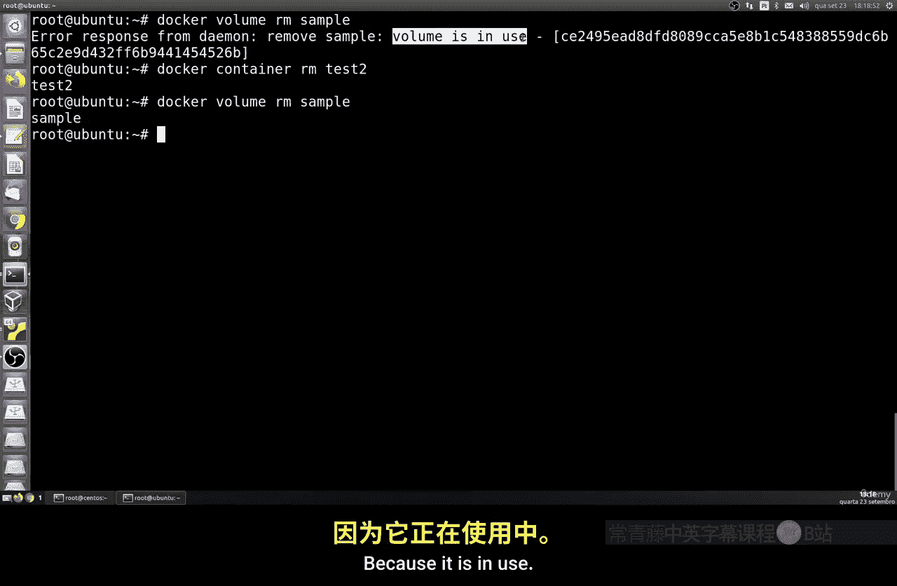

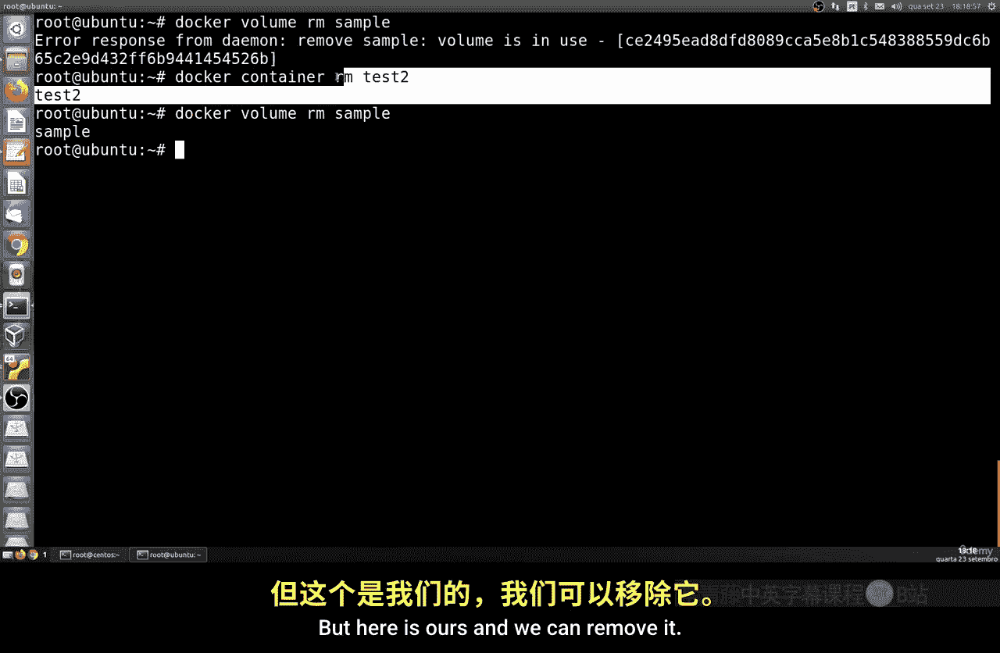

# 然后删除数据卷
docker volume rm sample
```

如果你想清理所有已停止的容器以释放系统资源，可以使用以下命令：

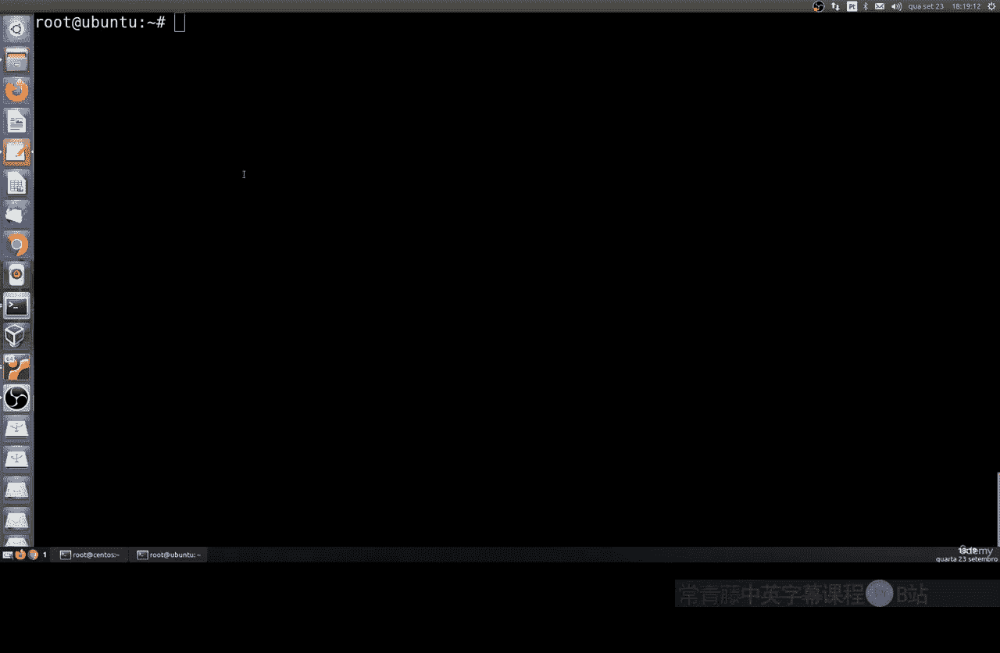

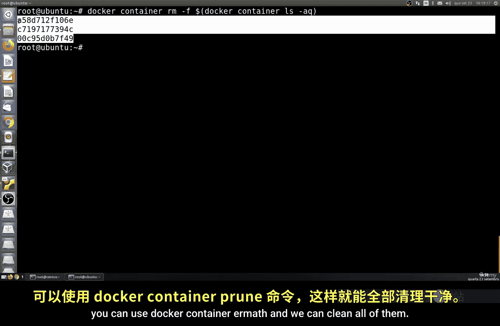

```bash
docker container prune -f
```

## 总结

本节课中，我们一起学习了如何在 Docker 中处理数据卷。我们涵盖了以下核心操作：
1.  **创建数据卷**：使用 `docker volume create <name>`。
2.  **挂载数据卷到容器**：使用 `-v <volume_name>:<container_path>` 参数运行容器。
3.  **验证数据持久性**：即使容器被删除，卷中的数据依然保留。
4.  **管理数据卷**：使用 `docker volume inspect` 查看信息，使用 `docker volume rm` 删除（需确保无容器使用）。

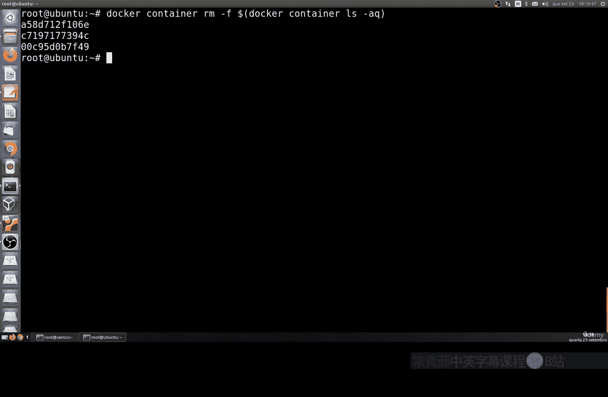

通过使用数据卷，你可以确保应用程序数据的安全性和持久性，这是 Docker 容器化实践中至关重要的一步。我们下节课再见！👋