# 166：在容器间共享数据 📂

在本节课中，我们将学习如何在不同的Docker容器之间共享数据。共享数据虽然非常有用，但也可能引发并发冲突。我们将探讨如何通过创建只读或读写容器来组织数据访问，避免冲突，并演示一个使用卷（Volume）实现实时文件共享的Web服务器实例。

## 概述

Docker的核心目的是创建独立的容器，使它们互不干扰。然而，有时我们需要在容器之间共享数据。本节将介绍如何安全、有效地实现数据共享，并通过一个Web开发实例展示其实际应用。

## 数据共享与潜在冲突

上一节我们介绍了Docker的基本操作，本节中我们来看看如何在容器间共享数据。直接在容器间共享数据可能引发并发冲突。例如，一个容器在写入数据时，另一个容器可能在删除或读取同一数据。

为了避免这类问题，我们可以设计不同的容器承担不同的职责。以下是一种组织方式：

*   一个容器专门负责**创建**或**修改**数据。
*   其他容器只负责**读取**数据。

我们还可以通过将卷（Volume）设置为**只读**（read-only）模式来保护数据。这样，只有一个特定的容器拥有修改或删除数据的权限。

## 创建并共享卷：基础示例

让我们从一个基础示例开始，了解如何创建卷并在容器间共享。

首先，我们清理环境，以便从头开始。

```bash
# 停止并删除所有容器
docker rm -f $(docker ps -aq)
# 删除所有卷
docker volume rm $(docker volume ls -q)
```

现在，创建一个名为`shared-data`的卷，并将其挂载到一个可读写容器中。

```bash
# 创建并运行一个可读写容器，挂载 shared-data 卷
docker run -d --name writer -v shared-data:/data alpine tail -f /dev/null
# 在 writer 容器中创建一个文件
docker exec writer sh -c "echo '示例数据' > /data/sample.txt"
```

接下来，创建第二个容器，挂载同一个`shared-data`卷，但将其设置为**只读**模式。

```bash
# 创建并运行一个只读容器，挂载相同的卷
docker run -d --name reader -v shared-data:/data:ro ubuntu tail -f /dev/null
# 验证 reader 容器可以读取文件
docker exec reader cat /data/sample.txt
# 尝试在只读容器中写入文件（此操作会失败）
docker exec reader sh -c "echo '新数据' > /data/new.txt"
```

最后一个命令会返回类似`Read-only file system`的错误，这证实了只读卷的保护作用。

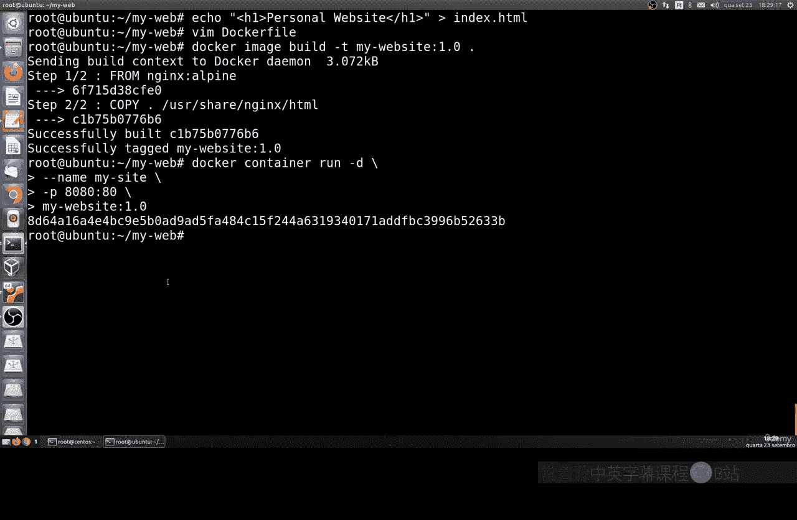

## 实战：使用绑定挂载开发Web应用

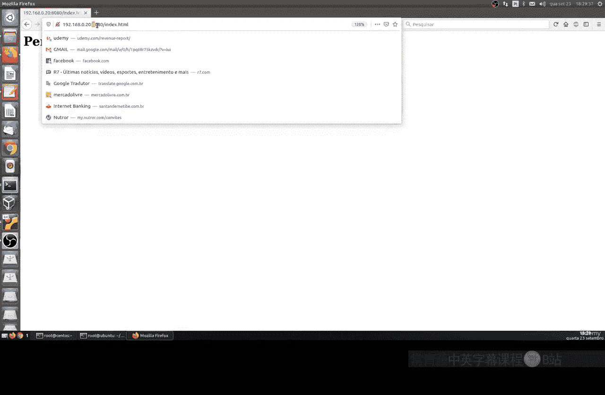

对于应用开发，更实用的方法是使用**绑定挂载**（Bind Mount），它将主机上的一个目录直接挂载到容器中。这样，在主机上修改文件，容器内会立即更新，无需重建镜像或重启容器。

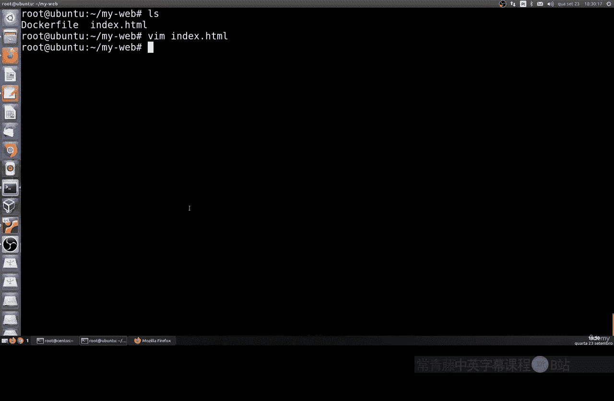

以下是具体步骤：

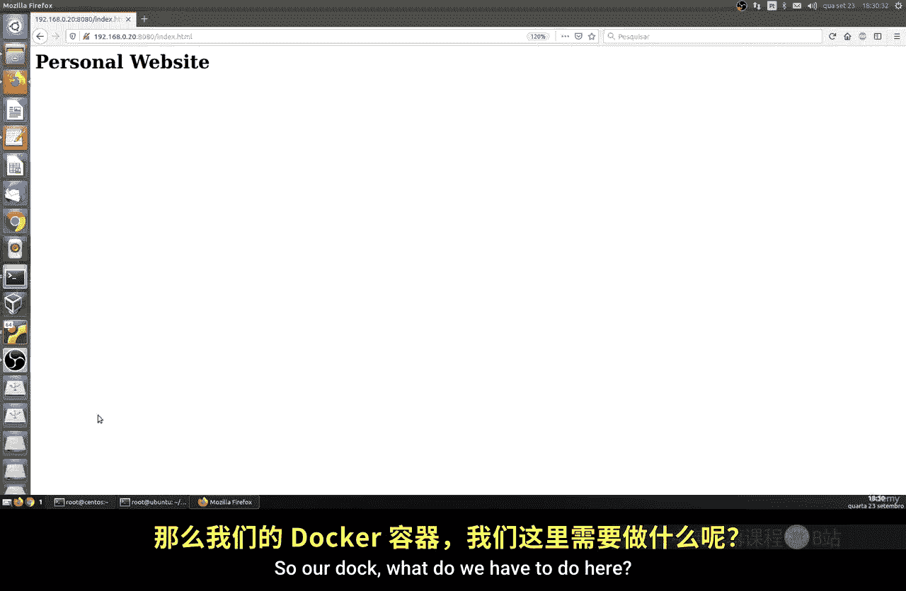

1.  **创建项目目录和文件**
    首先，在主机上创建一个项目目录和一个简单的HTML文件。

    ```bash
    mkdir web-app
    cd web-app
    echo "<h1>我的网站</h1>" > index.html
    ```

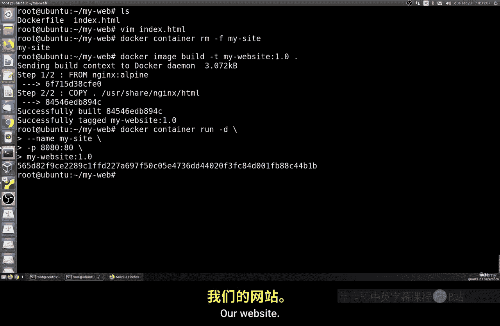

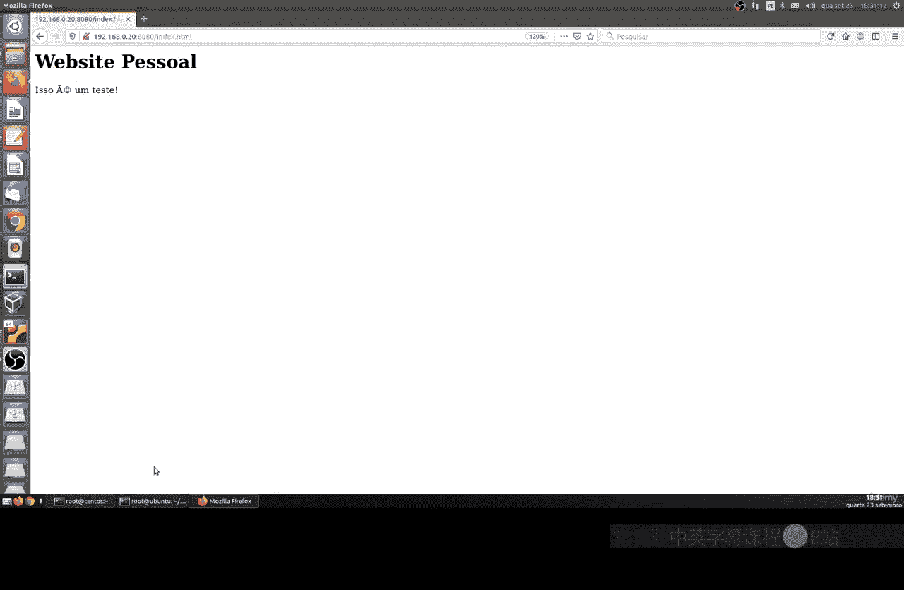

2.  **创建Dockerfile**
    创建一个使用Nginx作为Web服务器的Dockerfile。

    ```dockerfile
    # Dockerfile
    FROM nginx:alpine
    COPY . /usr/share/nginx/html
    ```

3.  **构建Docker镜像**

    ```bash
    docker build -t my-website .
    ```

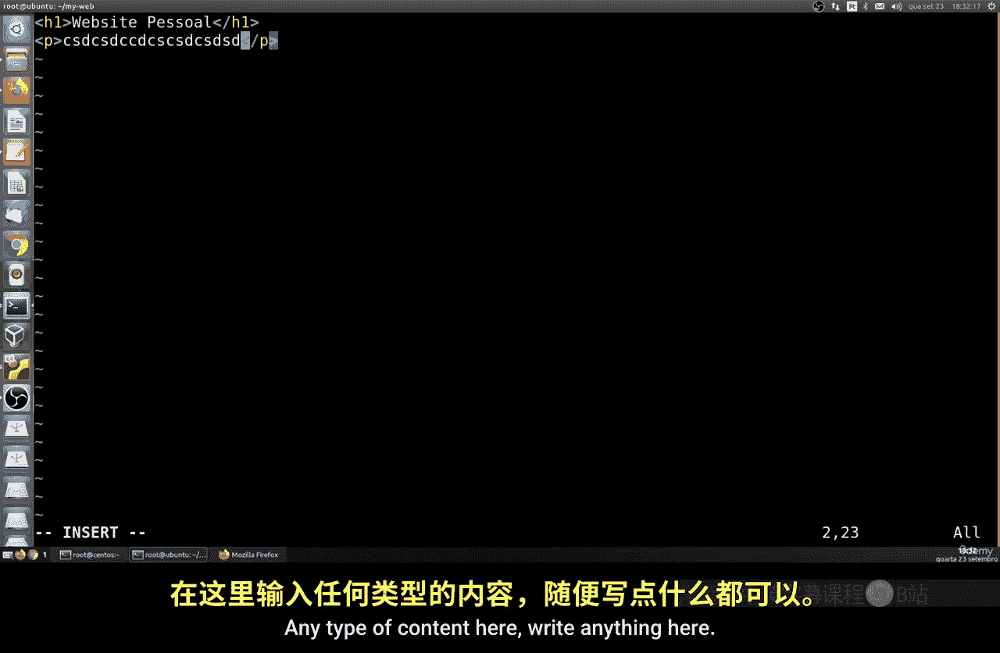

4.  **运行容器（不使用卷）**
    首先，我们看看如果不使用卷会有什么问题。

    ```bash
    docker run -d --name my-site -p 8080:80 my-website
    ```
    访问 `http://你的主机IP:8080`，可以看到网站。现在，修改主机上的`index.html`文件，然后刷新浏览器，你会发现内容**没有变化**。因为更改发生在主机，但容器内的文件是构建镜像时复制的副本。

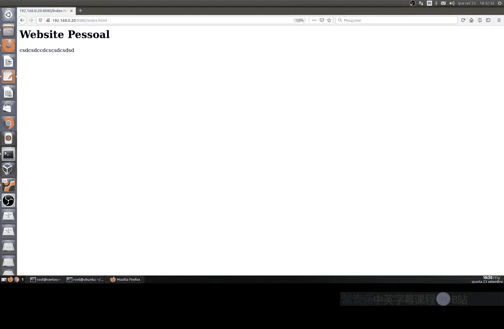

5.  **运行容器（使用绑定挂载）**
    现在，我们使用绑定挂载来解决这个问题。首先停止并移除旧容器。

    ```bash
    docker rm -f my-site
    ```
    使用`-v`参数进行绑定挂载，将主机当前目录（`$PWD`）挂载到容器的Nginx网页目录。

    ```bash
    docker run -d --name my-site -p 8080:80 -v $PWD:/usr/share/nginx/html my-website
    ```
    再次访问网站。此时，如果你修改主机上的`index.html`并保存，刷新浏览器后，更改会**立即生效**。

## 总结

本节课中我们一起学习了在Docker容器间共享数据的两种主要方法。

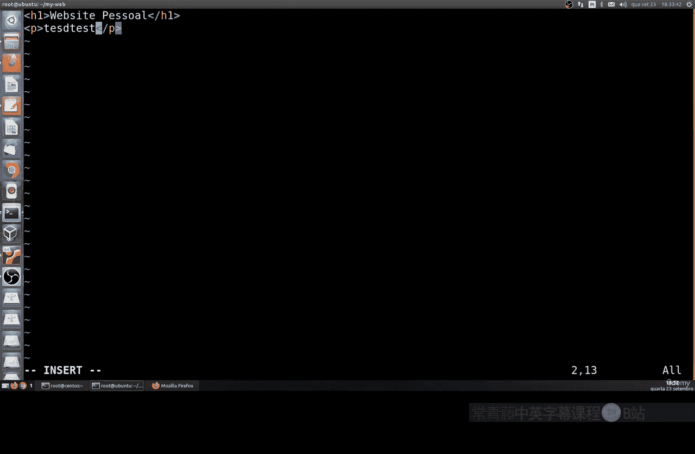

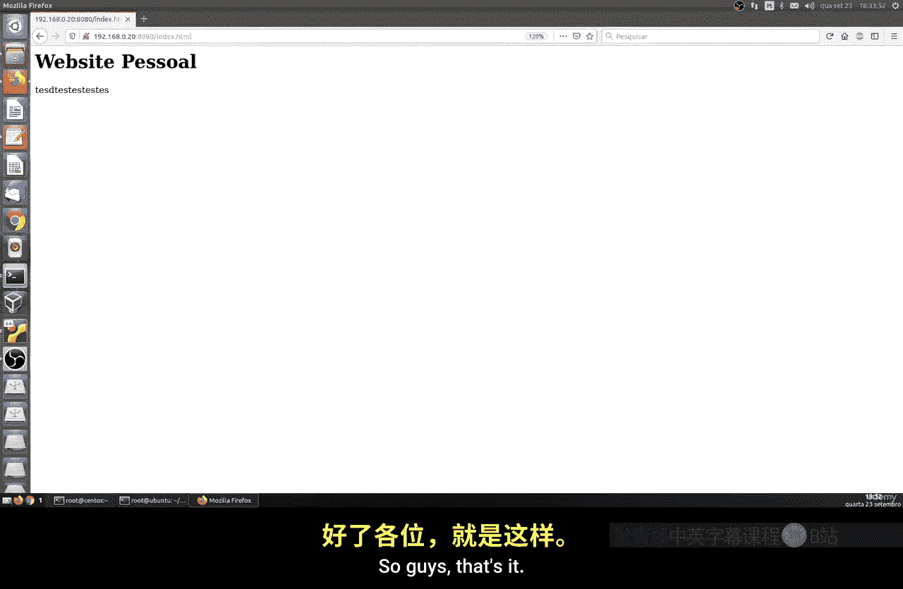

*   **使用命名卷**：适合持久化存储和容器间共享数据，可以通过设置`ro`标志实现只读共享，避免冲突。
*   **使用绑定挂载**：特别适合开发环境，它将主机目录直接映射到容器内，使文件更改能够实时同步，极大提升了开发效率。

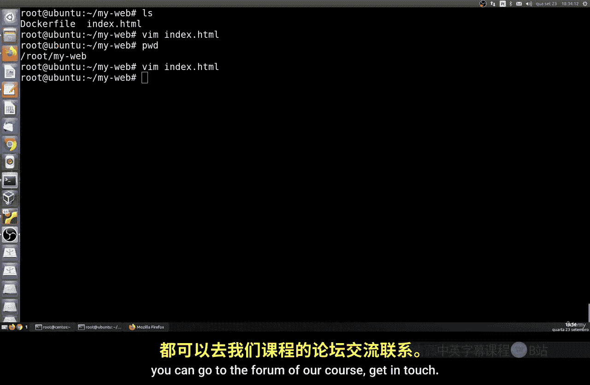

通过合理使用卷，我们既能利用Docker的隔离性，又能灵活地实现数据共享和持久化。