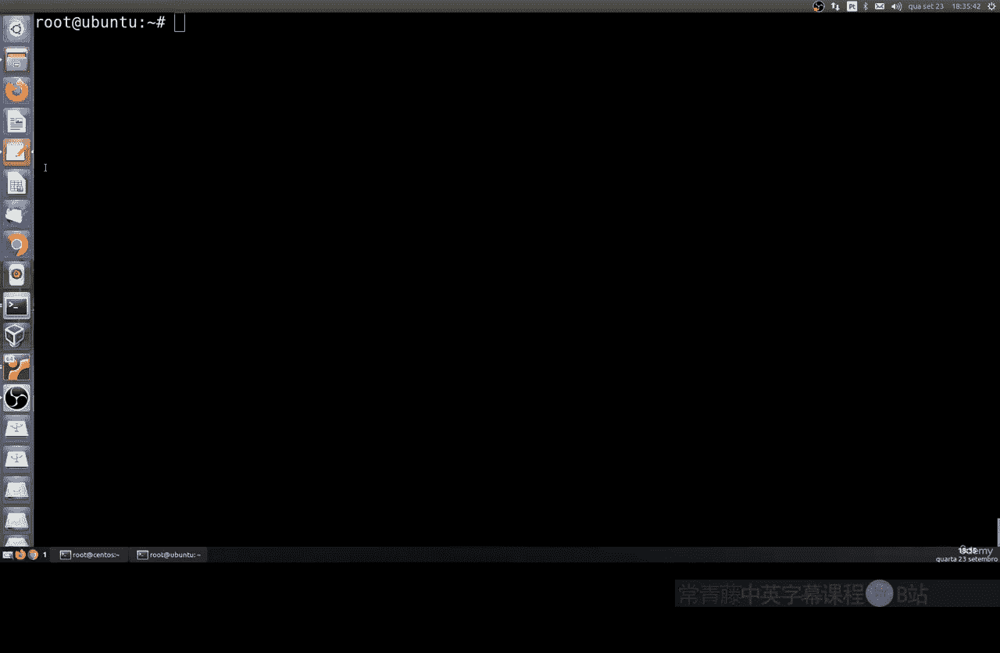
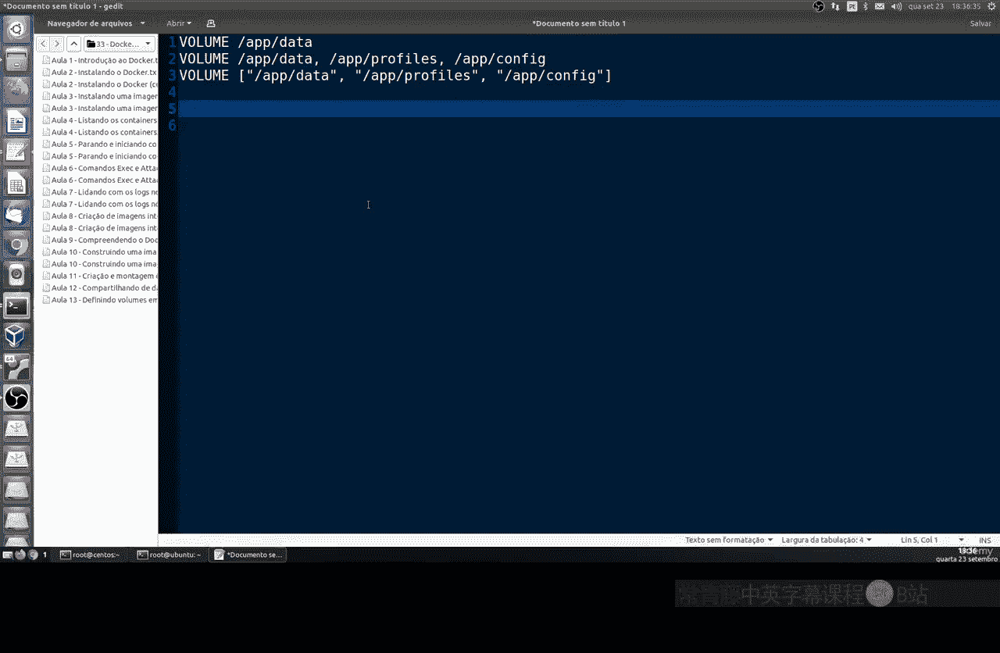
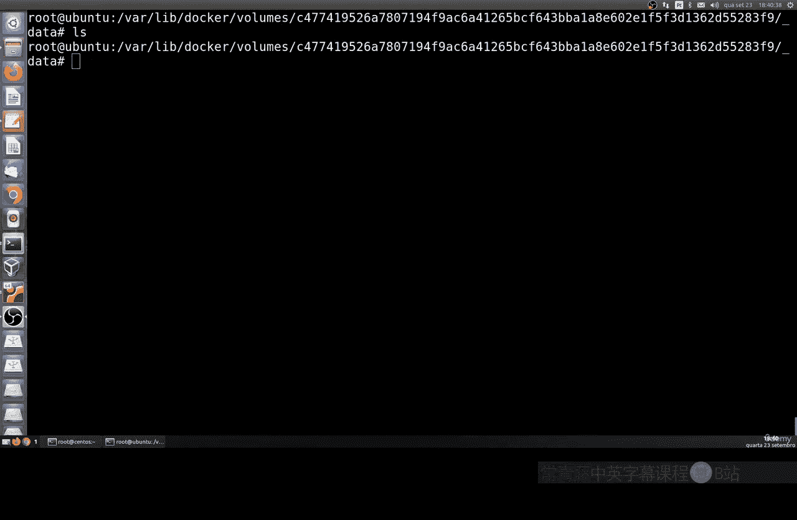

# 167：在Docker镜像中定义卷 📦

在本节课中，我们将学习如何在Docker镜像中定义卷。卷是Docker中用于持久化存储数据的重要机制，它允许容器在停止或删除后，其数据依然得以保留。

## 概述



上一节我们介绍了Docker镜像和容器的基础概念。本节中，我们来看看如何在构建镜像时，通过Dockerfile预定义容器运行时需要使用的数据卷。

## 在Dockerfile中定义卷

在Dockerfile中，我们可以使用`VOLUME`指令来声明一个或多个数据卷。这样，当从该镜像运行容器时，Docker会自动为这些目录创建卷。



`VOLUME`指令的基本语法如下：
```dockerfile
VOLUME ["/目录路径1", "/目录路径2"]
```
或者，也可以使用空格分隔的字符串格式：
```dockerfile
VOLUME /目录路径1 /目录路径2
```

## 查看官方镜像的卷定义

为了更好地理解这个概念，让我们以官方的MongoDB镜像为例，查看其定义的卷。

首先，拉取MongoDB镜像：
```bash
docker pull mongo:latest
```

接着，使用`docker image inspect`命令来检查该镜像的配置，并提取其卷信息：
```bash
docker image inspect mongo:latest --format='{{json .Config.Volumes}}'
```
运行此命令后，你会看到类似以下的输出，表明MongoDB镜像预定义了两个卷：
```json
{"/data/db": {}, "/data/configdb": {}}
```
这表示MongoDB容器运行时，`/data/db`和`/data/configdb`这两个目录将使用数据卷。

## 运行容器并验证卷

现在，让我们运行一个MongoDB容器，并查看Docker是如何管理这些卷的。

运行一个名为`my-mongo`的容器：
```bash
docker run -d --name my-mongo mongo:latest
```

然后，使用`docker inspect`命令查看这个具体容器的详细信息，特别是卷的映射关系：
```bash
docker inspect my-mongo --format='{{json .Mounts}}' | python -m json.tool
```
以下是该命令输出的核心部分解析：
*   **`Source`**：这是宿主机（你的Linux系统）上的实际目录路径，数据就存储在这里。
*   **`Destination`**：这是容器内部的目录路径（例如`/data/db`），即我们在Dockerfile中定义的卷位置。
*   **`Name`**：这是Docker为这个卷生成的唯一名称。

你可以导航到`Source`字段所示的宿主机路径（通常在`/var/lib/docker/volumes/`下），查看其中存储的正是MongoDB的数据库文件。即使容器被删除，这个目录下的数据也会保留。

## 总结

本节课中我们一起学习了Docker卷的核心概念及其在镜像中的定义方式。我们了解到：
1.  使用`VOLUME`指令可以在Dockerfile中预先声明数据卷。
2.  通过`docker image inspect`命令可以查看镜像定义的卷。
3.  运行容器时，Docker会自动将声明的目录挂载到宿主机上的特定位置，实现数据持久化。



这是一种将数据与容器生命周期解耦的有效方法，确保了应用数据的安全性和可移植性。在接下来的课程中，我们将继续探索如何配置容器应用以及构建自定义镜像的更多细节。