# 168：配置容器 🐳

在本节课中，我们将学习如何为Docker容器配置环境变量。环境变量是配置容器在不同环境（如开发、测试或生产环境）中运行的关键方式。我们将学习查看、设置以及通过文件管理这些变量的方法。

---

## 查看环境变量

上一节我们介绍了容器的基础操作，本节中我们来看看如何查看容器内的环境变量。

在Linux系统中，环境变量存储了诸如当前用户、工作目录和终端类型等信息。在宿主机上，可以使用 `export` 命令查看所有环境变量。

```bash
export
```

运行此命令会显示当前机器上的所有环境变量，例如：
*   `USER`：当前登录的用户。
*   `LANG`：字符集设置，通常是UTF-8。
*   `PWD`：当前工作目录。
*   `SHELL`：当前使用的Shell，例如bash。

Docker容器的环境与此类似。我们可以进入一个Alpine Linux容器并执行相同的命令来查看其环境变量。

```bash
docker run -it alpine
export
```

你会发现容器内也有类似的信息，例如 `PWD` 目录通常为根目录 `/`。

---

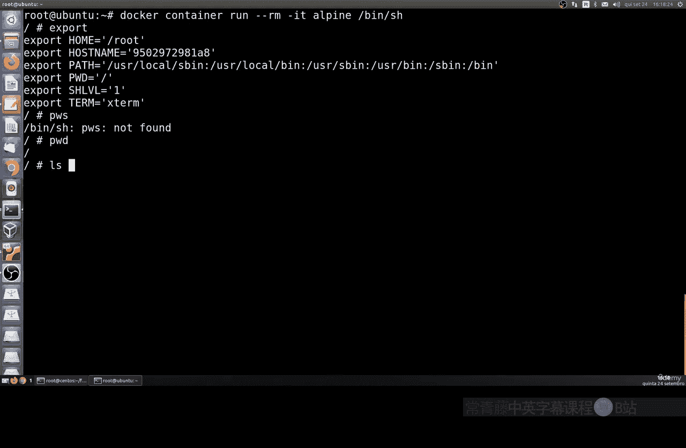

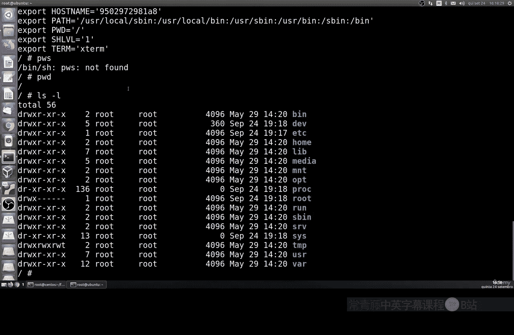

## 设置单个环境变量

了解了如何查看变量后，接下来我们学习如何为容器设置自定义的环境变量。

在运行容器时，可以使用 `-e` 或 `--env` 参数来设置环境变量。其基本语法如下：

```bash
docker run -it -e <变量名>=<值> <镜像名>
```

例如，我们启动一个Alpine容器，并将日志目录的环境变量设置为 `/log`：

```bash
docker run -it -e LOG_DIR=/log alpine
```

进入容器后，运行 `export` 命令，可以看到 `LOG_DIR` 变量已被成功设置。

---

## 通过文件设置多个环境变量

当需要设置大量环境变量时，在命令行中逐个定义会非常繁琐。更高效的方法是通过一个文件来管理所有变量。

以下是具体操作步骤：
1.  创建一个目录和配置文件。
2.  在配置文件中定义所有需要的环境变量。
3.  运行容器时，使用 `--env-file` 参数指定该文件。

首先，创建目录和配置文件：

```bash
mkdir config
cd config
```

然后，创建一个名为 `development.config` 的文件，并写入以下内容：

```bash
LOG_DIR=/var/log/app
LOG_FILE_MAX_SIZE=1G
LOG_FILE_MAX_NUM=5
```

最后，运行容器并加载这个环境变量文件：

```bash
docker run -it --env-file ./development.config alpine
```

进入容器后，使用 `export` 命令验证，可以看到文件中定义的所有变量都已生效。这种方法使得配置管理更加清晰和高效。

---

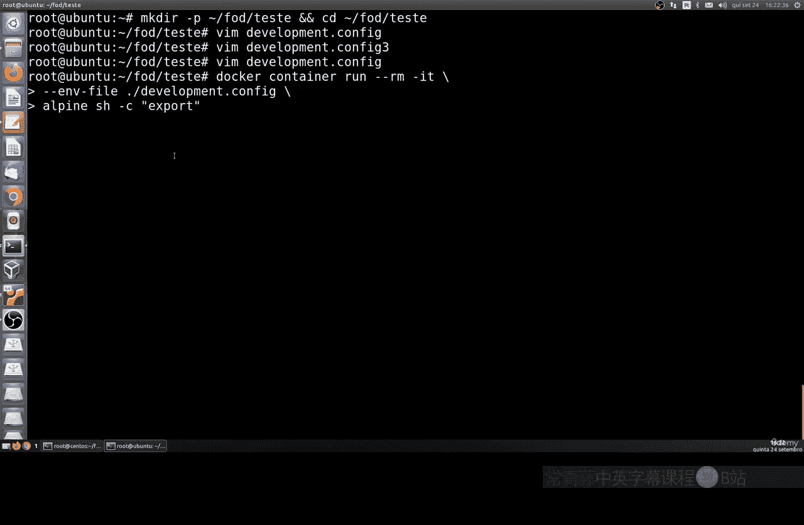

## 在Dockerfile中定义环境变量

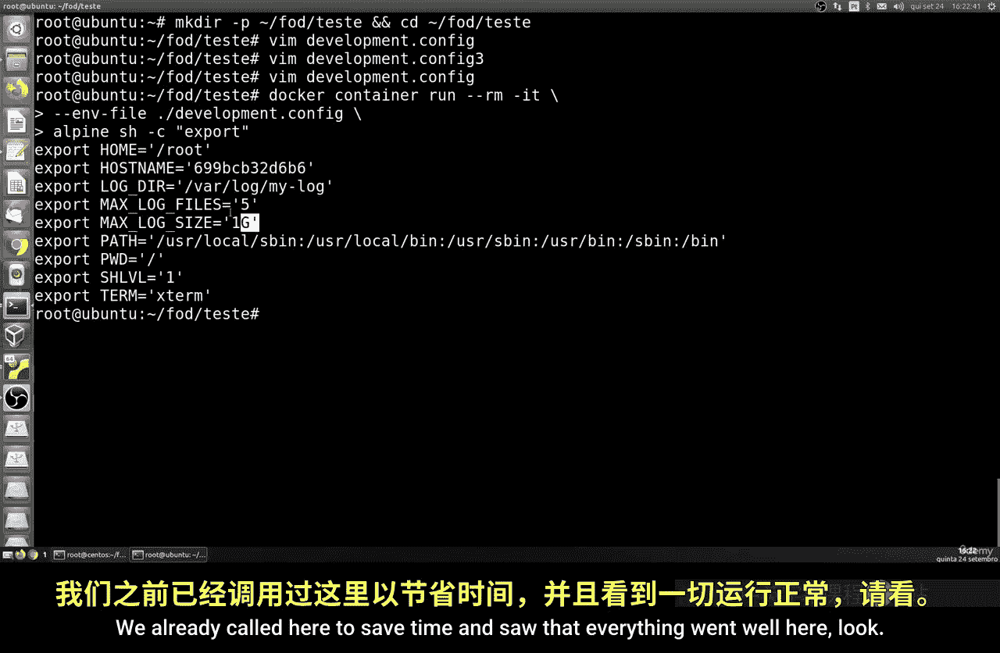

除了在运行时配置，我们还可以在构建镜像时，通过 `Dockerfile` 来预设环境变量。这对于创建具有标准配置的定制镜像非常有用。

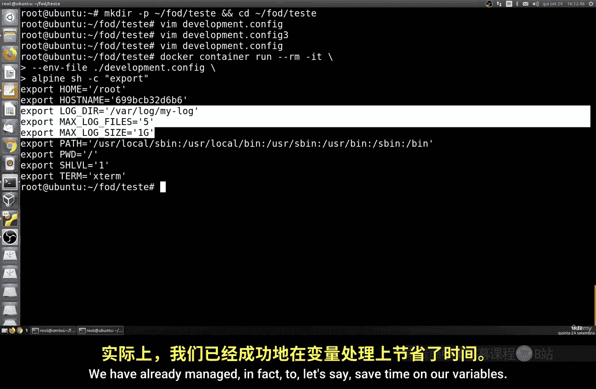

创建一个 `Dockerfile`，内容如下：

```dockerfile
FROM alpine:latest
ENV LOG_DIR=/var/log/app \
    LOG_FILE_MAX_SIZE=1G \
    LOG_FILE_MAX_NUM=5
```

然后，构建并运行这个新镜像：

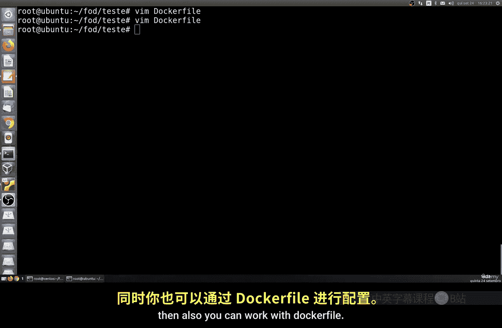

```bash
docker build -t my-alpine .
docker run -it my-alpine
```

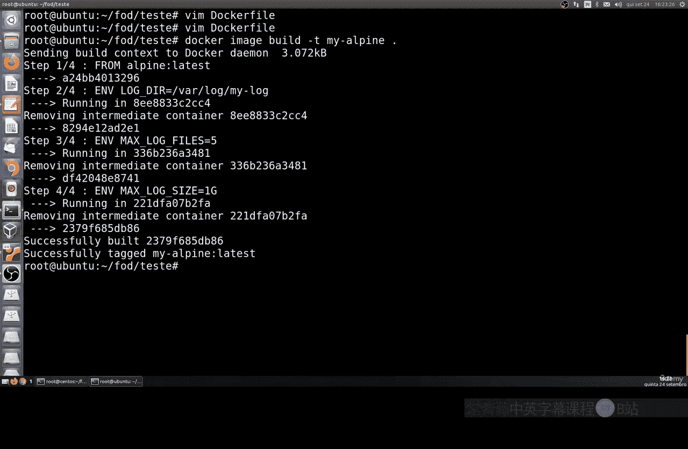

这样，基于此镜像运行的所有容器都会自动包含这些预设的环境变量。

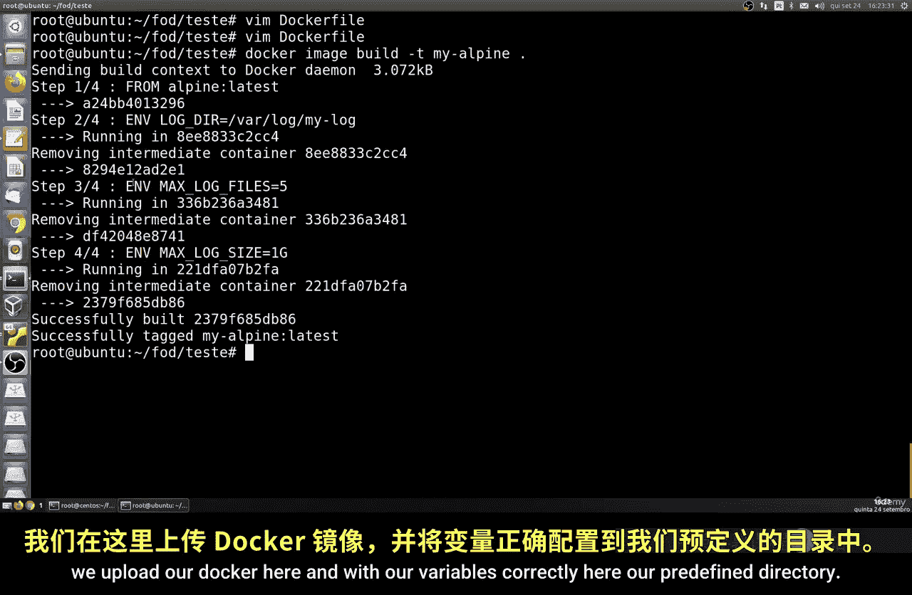

---

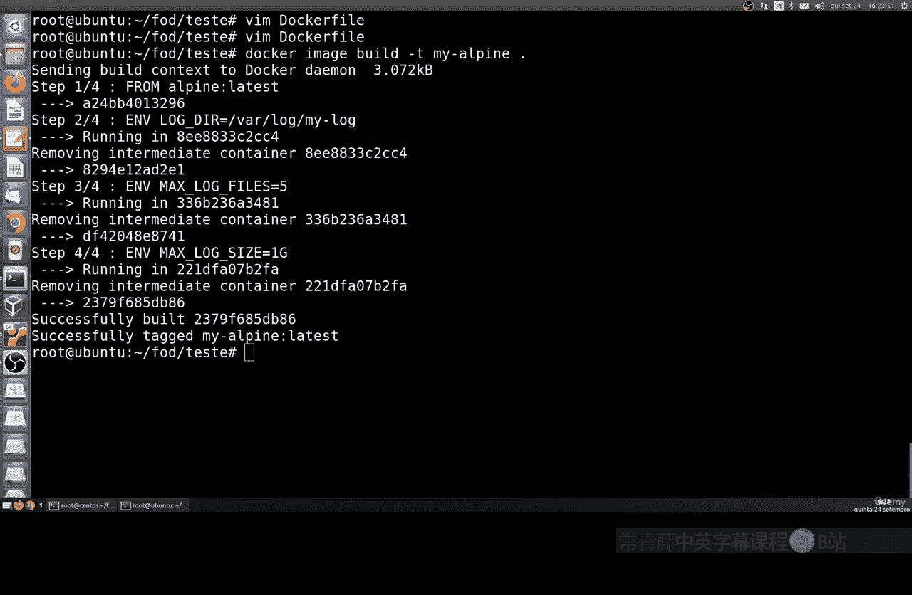

## 覆盖与指定镜像版本

最后，我们来看看如何覆盖已有的环境变量以及如何运行特定版本的镜像。

即使镜像的 `Dockerfile` 中已经定义了环境变量，在运行时仍然可以使用 `-e` 参数进行覆盖：

```bash
docker run -it -e LOG_DIR=/custom/log my-alpine
```

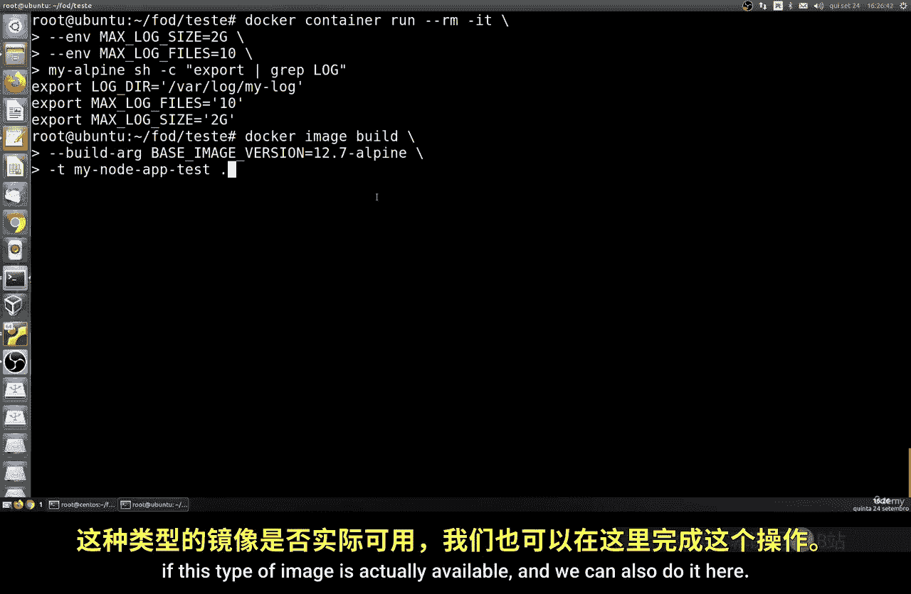

此外，你可以通过指定标签来运行某个特定版本的镜像，这在测试时非常有用：

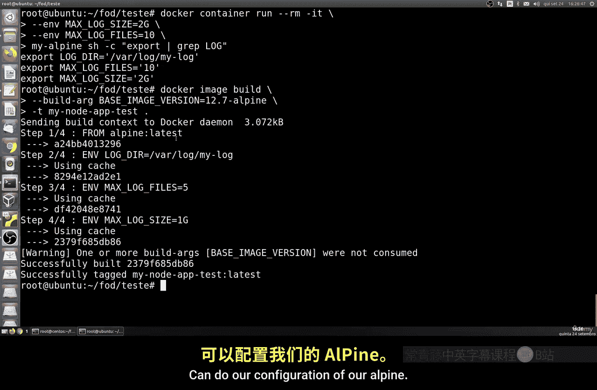

```bash
docker run -it alpine:3.12
```

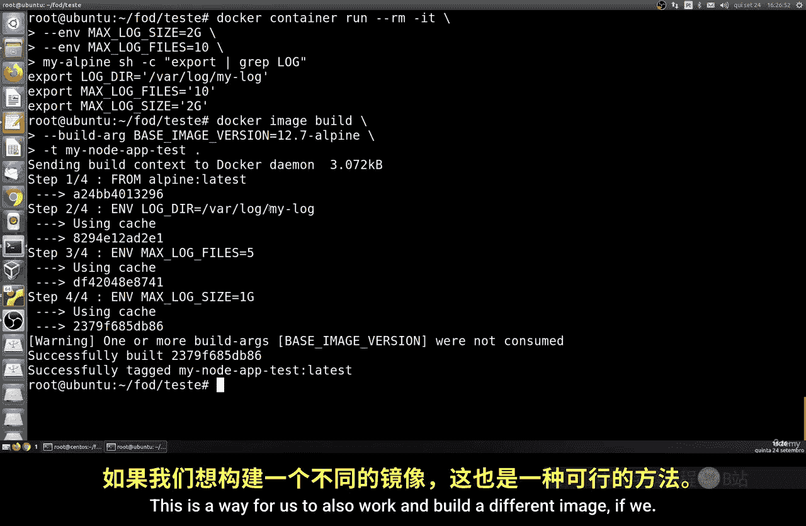

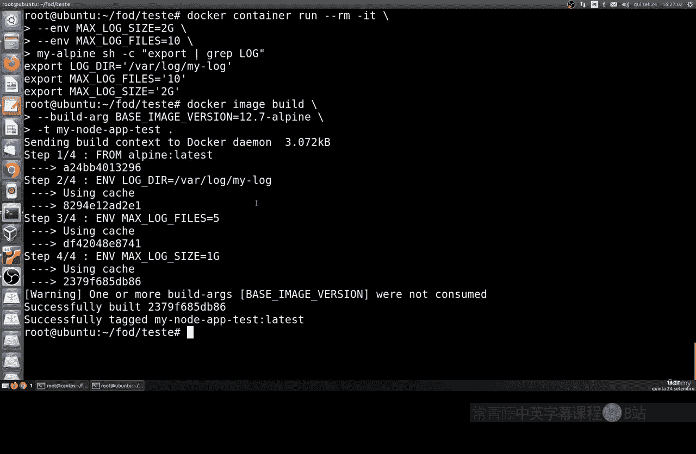

请确保你指定的镜像版本在仓库中是可用的。

---


本节课中我们一起学习了Docker容器环境变量的多种配置方法：包括如何查看、通过命令行设置、使用文件批量管理、在Dockerfile中预设以及如何覆盖它们。灵活运用这些技巧，可以让你轻松地配置容器以适应各种不同的运行环境。