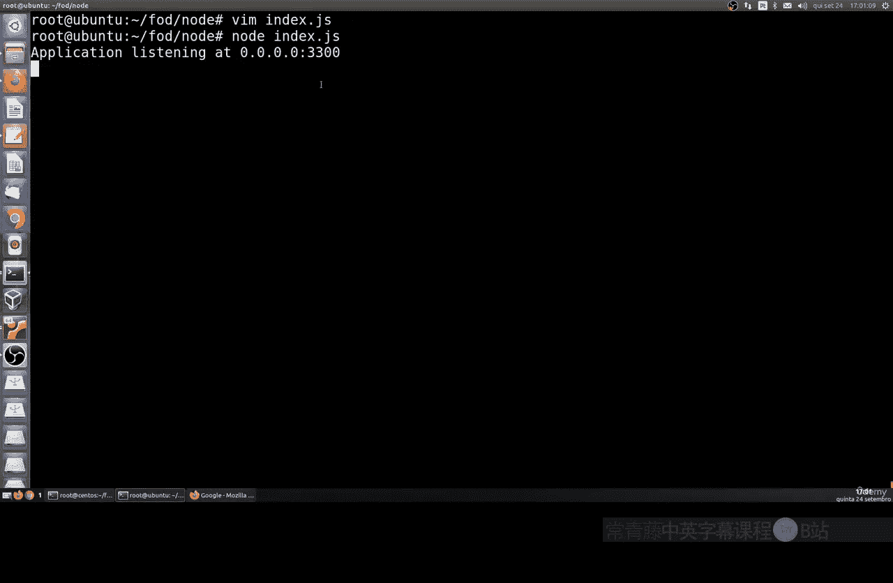
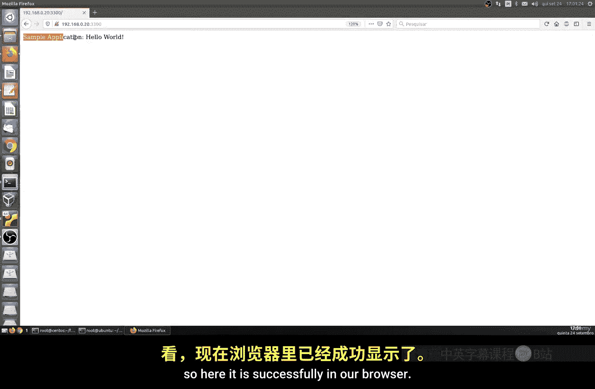
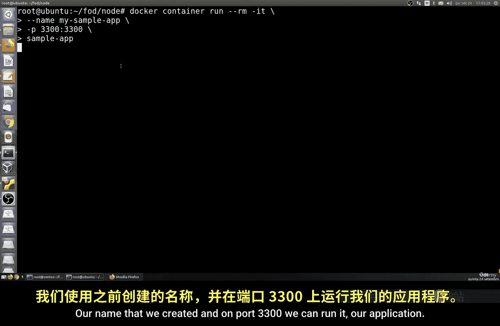
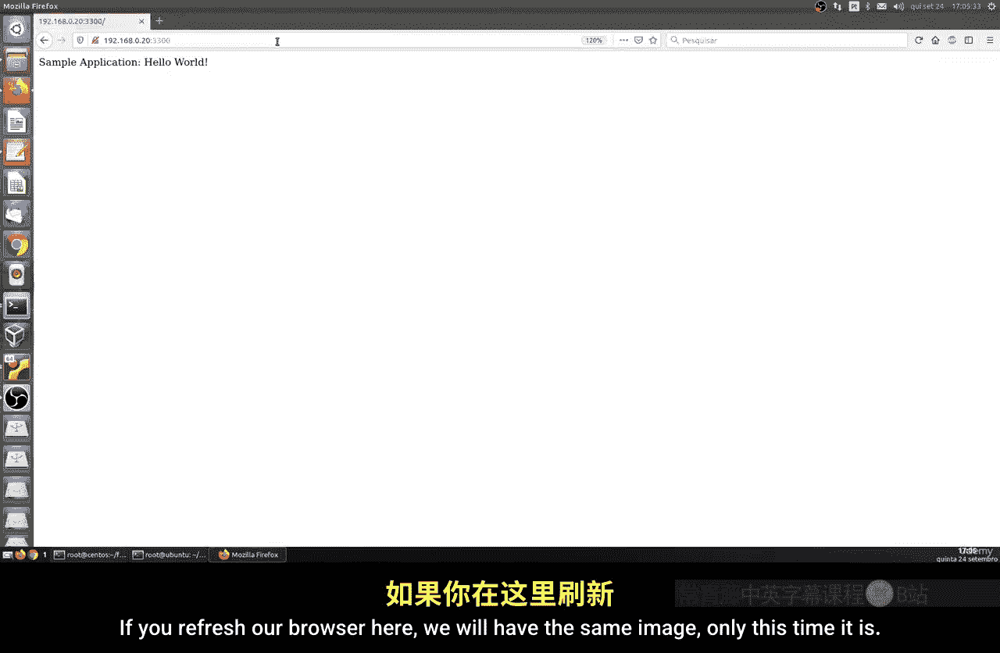
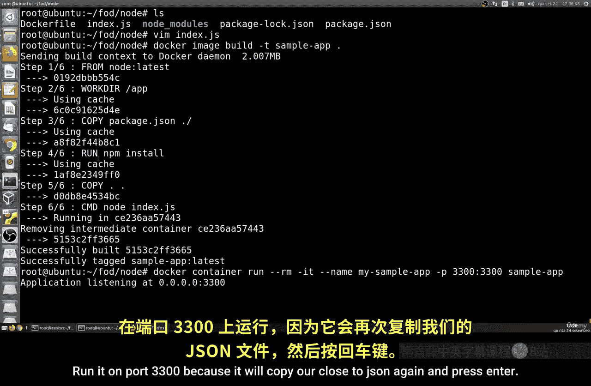
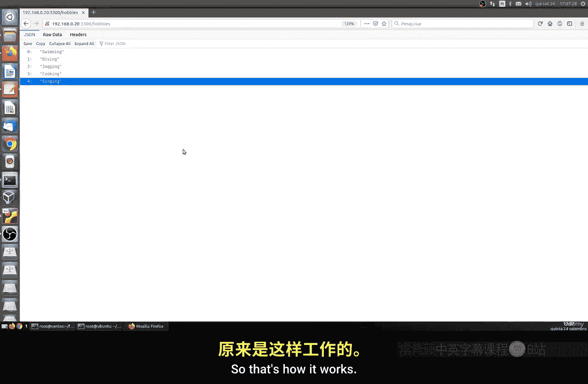
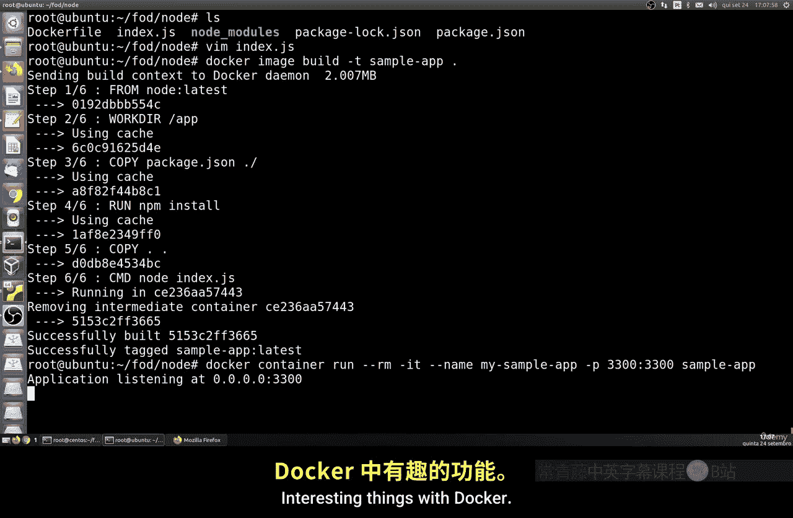

# 169：在容器中演进与测试代码 🚀

在本节课中，我们将学习如何在Docker容器中运行和测试代码。我们将以Node.js为例，演示如何创建一个简单的Web应用，并将其封装到Docker容器中运行，实现开发环境与容器环境的协同工作。

---

## 准备工作

首先，我们需要创建一个专门的工作目录并安装必要的软件。

创建一个名为`node`的文件夹：
```bash
mkdir node
```
进入该目录并安装Node.js。在Ubuntu系统上，可以使用以下命令安装：
```bash
sudo apt install nodejs npm
```
安装过程可能需要一些时间。安装完成后，我们可以初始化一个Node.js项目。

---

## 初始化Node.js项目

在`node`目录下，运行以下命令来初始化项目并创建`package.json`文件：
```bash
npm init
```
初始化过程中会询问一些问题，可以全部按回车键使用默认值。接着，安装Express框架，它是一个用于简化网站创建的实用工具：
```bash
npm install express --save
```
现在，创建一个名为`index.js`的文件，作为我们的主应用文件。

---

## 创建简单的Web应用



在`index.js`文件中，编写一个简单的Web服务器代码，使其在端口3000上运行并返回一条消息：
```javascript
const express = require('express');
const app = express();
const port = 3000;



app.get('/', (req, res) => {
  res.send('Hello from Node.js inside Docker!');
});

app.listen(port, () => {
  console.log(`App listening at http://localhost:${port}`);
});
```
保存文件后，在终端中运行应用以测试其是否正常工作：
```bash
node index.js
```
在浏览器中访问`http://localhost:3000`，应该能看到显示的消息。这验证了我们的Node.js应用在本地运行成功。

---

## 创建Docker镜像

上一节我们成功运行了本地Node.js应用。本节中，我们将看看如何将其封装到Docker容器中。

首先，在项目根目录下创建一个名为`Dockerfile`的文件，并添加以下内容：
```dockerfile
FROM node:14
WORKDIR /usr/src/app
COPY package*.json ./
RUN npm install
COPY . .
EXPOSE 3000
CMD ["node", "index.js"]
```
这个Dockerfile定义了基于官方Node.js镜像构建我们的容器，复制项目文件并安装依赖，最后指定启动命令。

使用以下命令构建Docker镜像：
```bash
docker build -t node-app .
```
构建过程可能需要一些时间，因为它需要下载基础镜像并安装依赖。

---



## 在Docker容器中运行应用



镜像构建完成后，我们可以运行一个容器实例：
```bash
docker run -p 3000:3000 -d --name my-node-app node-app
```
此命令将容器的3000端口映射到主机的3000端口，并在后台运行。现在，再次在浏览器中访问`http://localhost:3000`，你将看到相同的消息，但这次应用是在Docker容器中运行的。

---

## 实现文件共享与热重载

目前，我们对应用代码的任何修改都需要重新构建镜像和容器，这不利于快速开发。以下方法可以实现主机与容器之间的文件共享，从而实现代码修改的热重载。



首先，停止并移除当前运行的容器：
```bash
docker stop my-node-app && docker rm my-node-app
```
然后，使用卷（Volume）挂载的方式重新运行容器，将主机的当前目录映射到容器的工作目录：
```bash
docker run -p 3000:3000 -d --name my-node-app -v $(pwd):/usr/src/app node-app
```
现在，当你在主机上修改`index.js`文件并保存后，容器内的应用会自动更新，无需重启容器。你可以尝试修改`index.js`中的返回消息，刷新浏览器即可看到变化。



---

## 总结



本节课中，我们一起学习了如何将Node.js应用集成到Docker容器中。我们从创建简单的Web应用开始，然后编写Dockerfile构建镜像，并在容器中运行应用。最后，我们通过卷挂载实现了主机与容器之间的文件共享，使得在开发过程中能够快速测试代码修改。这种方法结合了Docker的隔离性与开发的灵活性，非常适合现代应用开发流程。