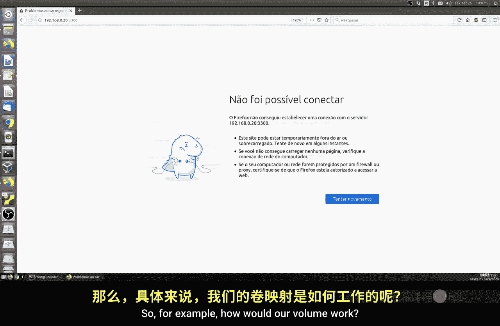
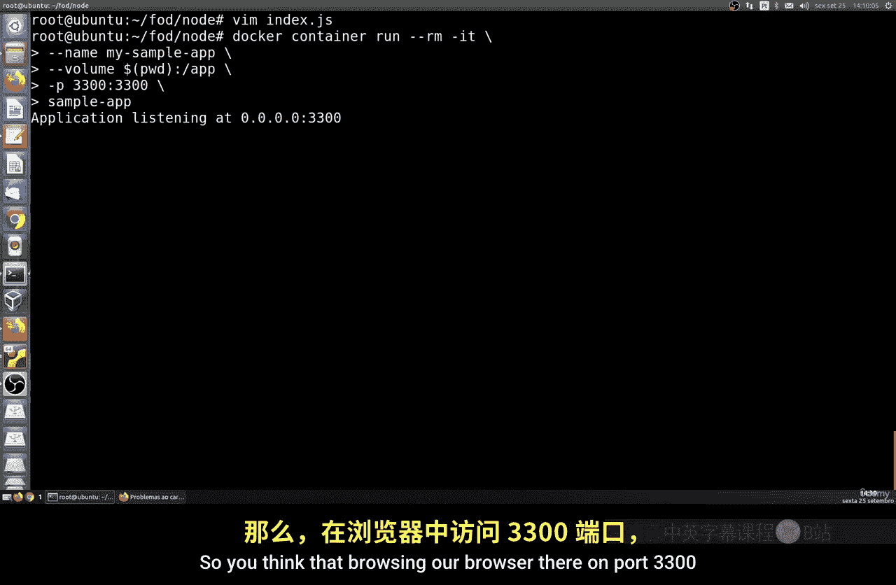
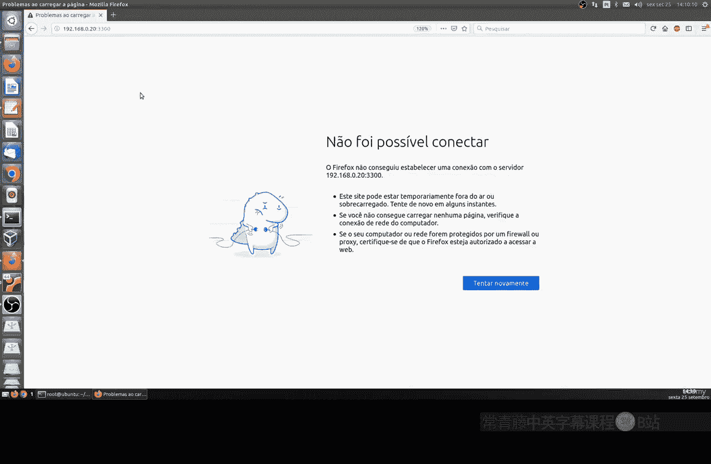
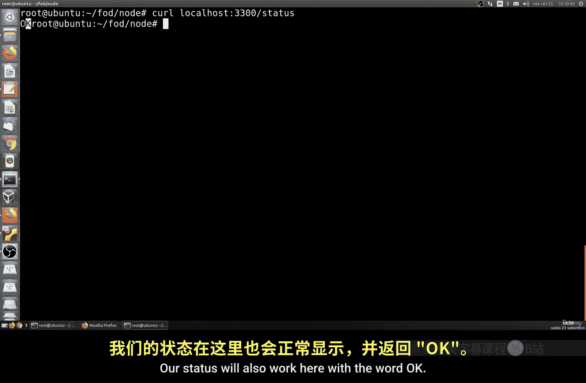
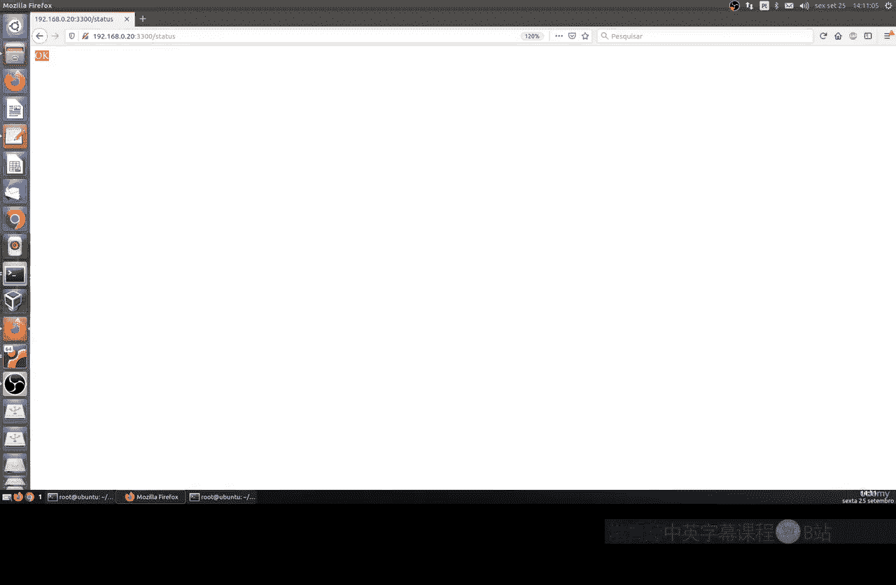
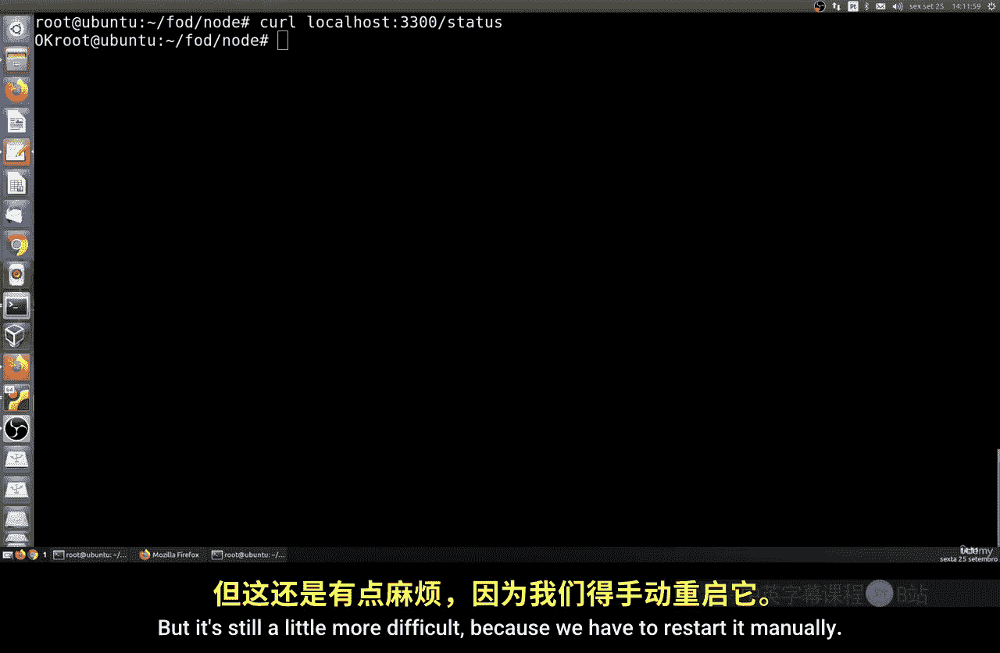
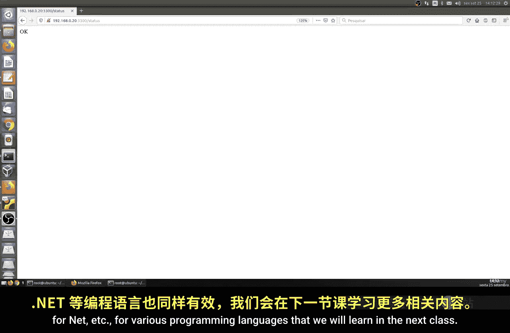

# 170：在运行中的容器中组装代码 🐳

在本节课中，我们将学习如何在容器运行的同时，实时地组装和修改我们的代码。我们将通过映射主机目录到容器内部，实现无需重建镜像即可更新应用的功能。

---

在之前的课程中，我们学习了如何将主机上的一个文件夹或目录映射到容器内部。本节我们将复用这个技术，实现代码的实时编辑与执行。



以下是实现这一目标的核心步骤：

1.  **创建并映射项目目录**：首先，在主机上创建一个项目目录，并将其映射到Docker容器内的特定路径（例如 `/app`）。
2.  **编辑代码文件**：在主机上使用文本编辑器修改映射目录中的代码文件。
3.  **观察变更生效**：由于目录是实时映射的，容器内的应用可以立即读取到修改后的文件内容。

为了更便捷地进行映射，我们可以使用 `PWD`（当前工作目录）变量，避免手动输入绝对路径。

让我们进入 `NodesC Food` 目录，这是一个我们在过往课程中已经创建好的示例项目。我们将演示如何以更实用的方式完成映射。

假设我们想要将当前主机的目录映射到容器内。我们可以执行以下配置：

首先，打开并编辑我们的 `index.js` 文件。我们将修改一个路由，例如，将一个 `GET` 路径改为根路径 `/`，并让其返回一个简单的“OK”状态。

修改完成后，保存并退出文本编辑器。

接下来，我们重新运行容器。但这次，我们无需先重建Docker镜像。我们直接启动一个新容器，并使用 `-v` 参数将主机的当前路径映射到容器内的 `/app` 目录。

命令示例如下：
```bash
docker run -v $(pwd):/app -p 3000:3000 your-image-name
```

现在，如果你在浏览器中访问 `localhost:3000`，应该能看到应用已经运行，并且我们刚刚修改的代码（返回“OK”）已经生效。





为了进一步验证，你可以打开另一个终端，进入同一目录，并使用 `curl` 命令测试接口：
```bash
curl localhost:3000
```
命令应返回“OK”，这证明状态接口工作正常，且使用的是我们最新修改的代码。

---

上一节我们介绍了如何通过卷映射实现代码的实时修改。然而，对于某些应用（如Node.js），仅仅修改源文件可能不会自动触发应用重启以加载新代码。



是的，要让修改生效，我们通常需要手动重启容器内的应用进程。



因此，我们可以在容器运行时，使用 `docker exec` 命令来手动重启应用。例如：
```bash
docker exec -it <container_id> node /app/index.js
```
通过这种方式，我们配置了映射并手动重启了应用。之后再次访问端口3000，就能看到更新后的状态。

但这仍然略显繁琐，因为需要手动重启。在下一节课中，我们将让这一切变得更加自动化。

---

我们将学习如何实现全自动化的代码重载。这样，当我们修改任何类型的文件时，无论是在Node.js、Python还是其他语言开发的应用中，变更都能被自动检测并应用，无论是在宿主机还是Docker容器内。



请记住，这种配置模式不仅适用于Node.js，也同样适用于Python、.NET等多种编程语言，我们将在后续课程中详细学习。

---



本节课中，我们一起学习了如何在Docker容器运行时，通过卷映射实现代码的实时编辑与更新。我们掌握了手动映射目录、编辑代码以及重启应用的方法，并了解到当前流程在自动化方面的局限。这为下一课学习如何实现自动化代码重载打下了基础。