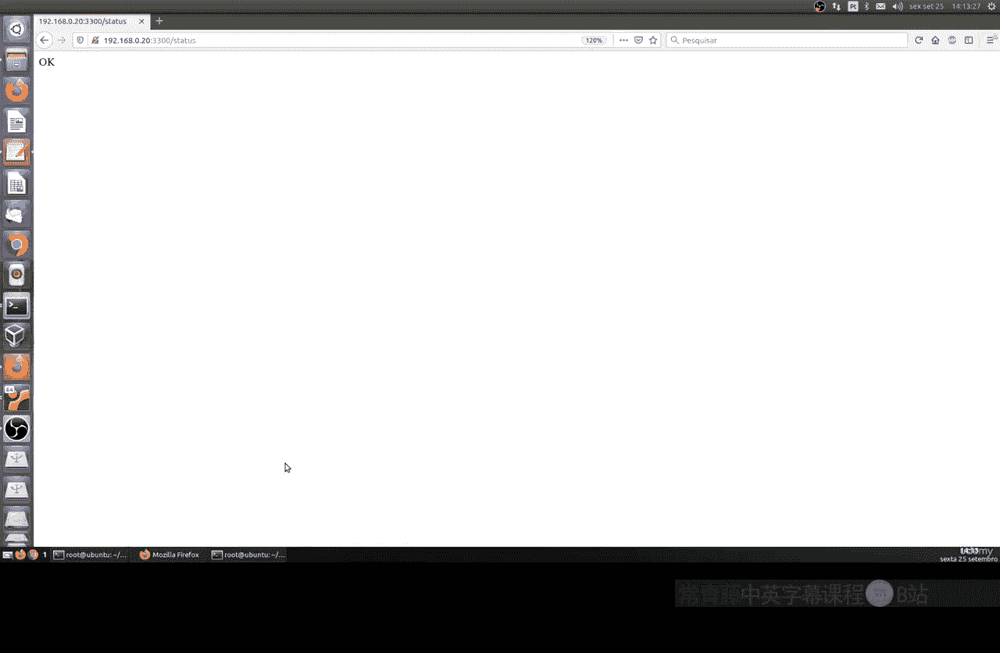
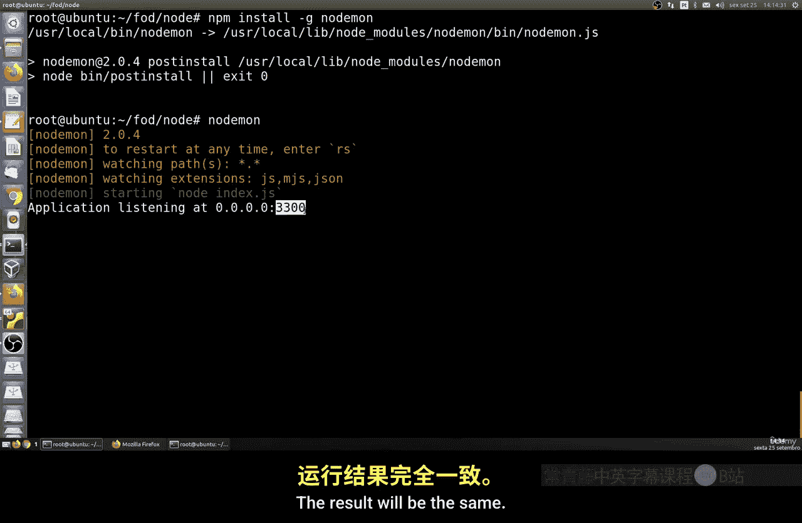
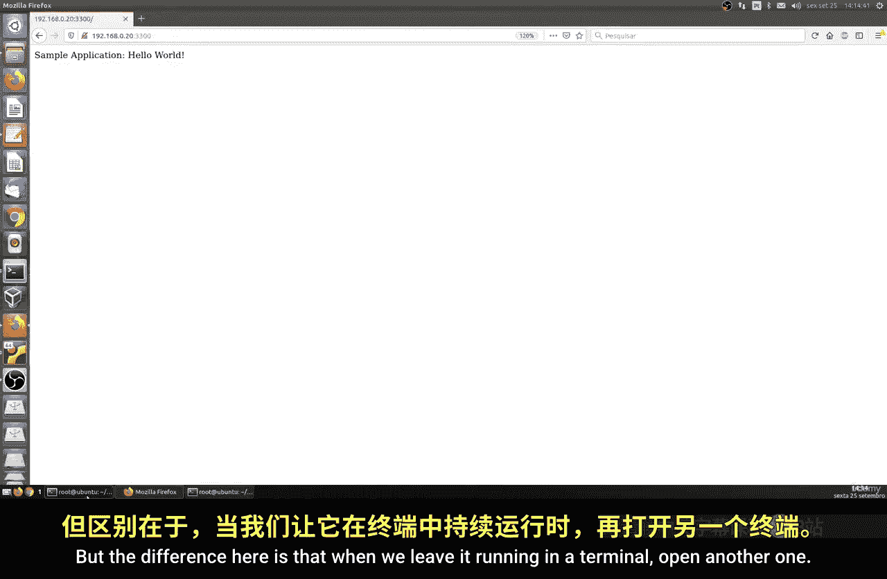
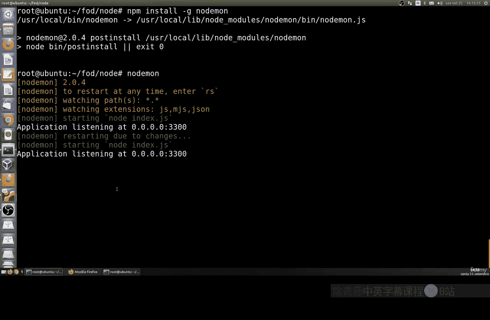
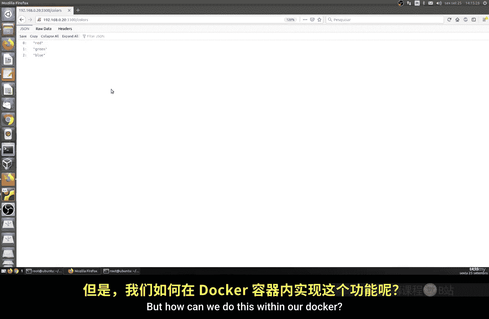
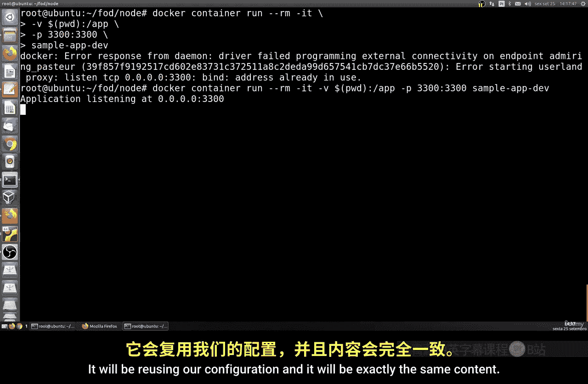
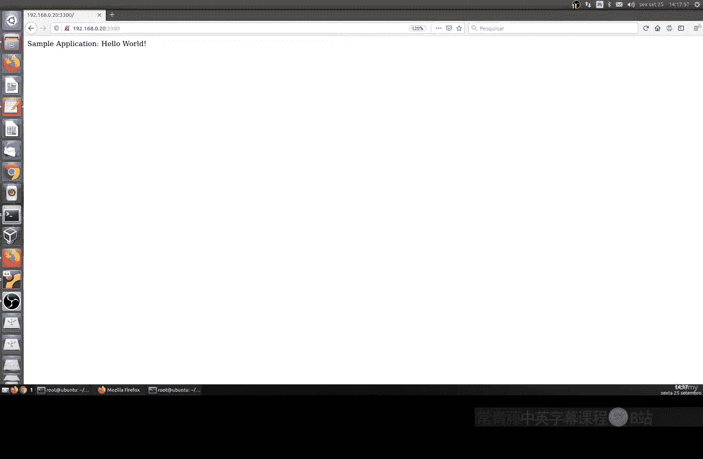
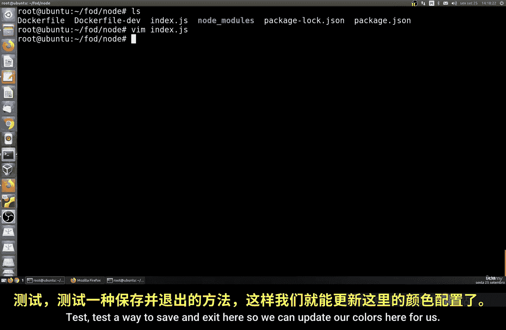
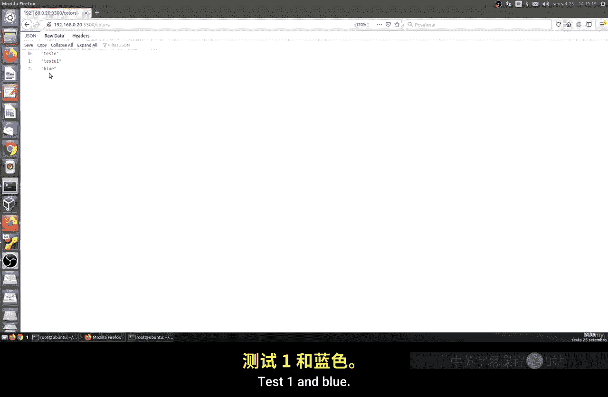
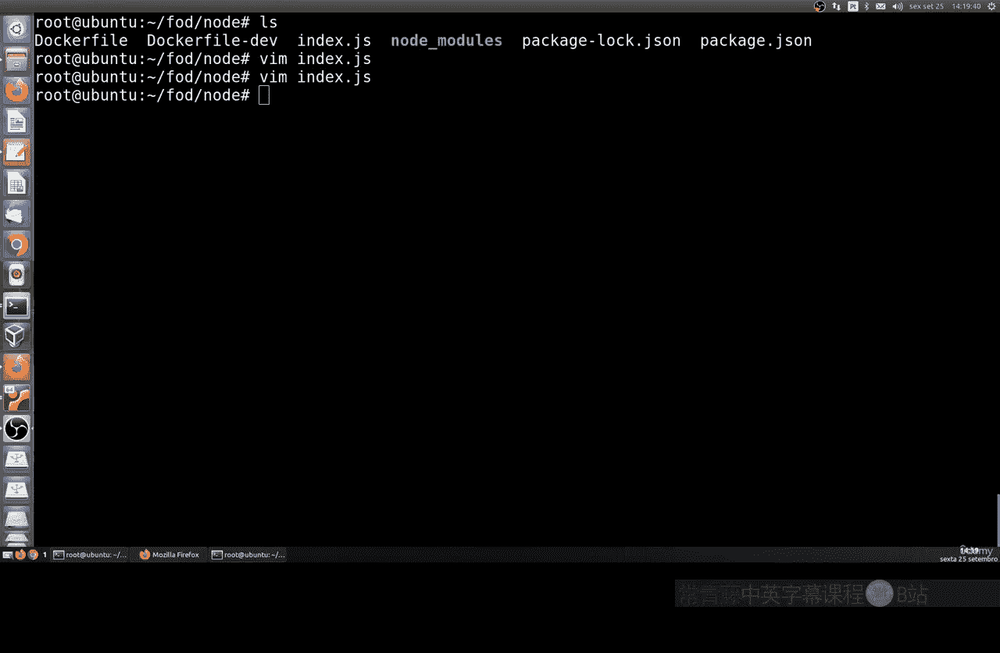

# 171：使用自动重启工具 🚀

在本节课中，我们将学习如何使用 `nodemon` 工具为 Node.js 应用实现自动重启功能。这是一种流行的开发工具，可以监控文件变化并自动重启应用，无需手动操作。我们还将探讨如何在 Docker 容器环境中配置和使用这一功能。



## 概述

`nodemon` 是一个用于 Node.js 开发的工具。它能够监视项目目录中的文件变动，并在检测到更改时自动重启 Node.js 应用程序。这极大地提升了开发效率，避免了开发者频繁手动停止和启动服务。

## 安装与使用 nodemon



首先，你需要在你的 Node.js 项目目录中安装 `nodemon`。它通常作为开发依赖项进行安装。



以下是安装 `nodemon` 的命令：
```bash
npm install --save-dev nodemon
```

安装完成后，你可以使用 `nodemon` 命令来启动你的应用，替代原本的 `node` 命令。例如，如果你的主文件是 `index.js`，可以运行：
```bash
nodemon index.js
```



`nodemon` 会自动读取 `index.js` 文件，并在默认端口（如 3000）上运行你的应用。当你在终端中保持它运行，并打开另一个终端窗口编辑项目文件（例如 `index.js`）时，`nodemon` 会检测到文件保存操作，并自动重启应用，使更改立即生效。



## 在 Docker 中配置自动重启

上一节我们介绍了在本地开发环境中使用 `nodemon`。本节中我们来看看如何将这一自动化流程整合到 Docker 容器中，以实现容器化开发的同样便利。

为了在 Docker 中使用 `nodemon`，我们需要创建一个专门用于开发环境的 Dockerfile，例如命名为 `Dockerfile.dev`。

以下是 `Dockerfile.dev` 文件的核心内容示例：
```dockerfile
FROM node:alpine
WORKDIR /app
COPY package.json .
RUN npm install
COPY . .
CMD ["nodemon", "index.js"]
```

这个 Dockerfile 与标准版本的主要区别在于 `CMD` 指令。我们使用 `nodemon index.js` 作为容器启动命令，而不是 `node index.js`。这样，当容器运行时，`nodemon` 就会在容器内部监控文件变化。

构建并运行此 Docker 镜像的步骤如下：

以下是构建和运行开发容器的命令：
```bash
# 构建镜像，指定使用 Dockerfile.dev 文件
docker build -f Dockerfile.dev -t my-node-app-dev .

# 运行容器，映射端口并挂载当前目录以实现代码同步
docker run -p 3000:3000 -v /$(pwd):/app my-node-app-dev
```

请注意，`-v /$(pwd):/app` 参数将宿主机的当前目录挂载到容器的 `/app` 目录。这意味着你在宿主机上对代码的修改会实时同步到容器内，`nodemon` 检测到这些变化后便会自动重启应用。





如果出现端口冲突（例如本地的 3000 端口已被占用），你需要先停止占用该端口的进程，然后再运行 Docker 容器。

## 测试自动重启功能



容器运行后，你可以在宿主机上编辑项目代码，例如修改 `index.js` 文件。保存更改后，观察运行容器的终端日志，你应该能看到 `nodemon` 重启应用的提示。随后，刷新浏览器中应用的对应页面（例如 `/colors` 路由），即可看到更新后的内容。



## 总结



本节课中我们一起学习了 `nodemon` 工具的使用。我们了解了它如何通过监控文件变化来实现 Node.js 应用的自动重启，从而提升开发体验。接着，我们进一步探索了如何通过创建特定的 `Dockerfile.dev` 文件，并将宿主机目录挂载到容器中，在 Docker 环境下实现相同的自动重启工作流。这使得在容器化开发中也能享受到代码热更新的便利。