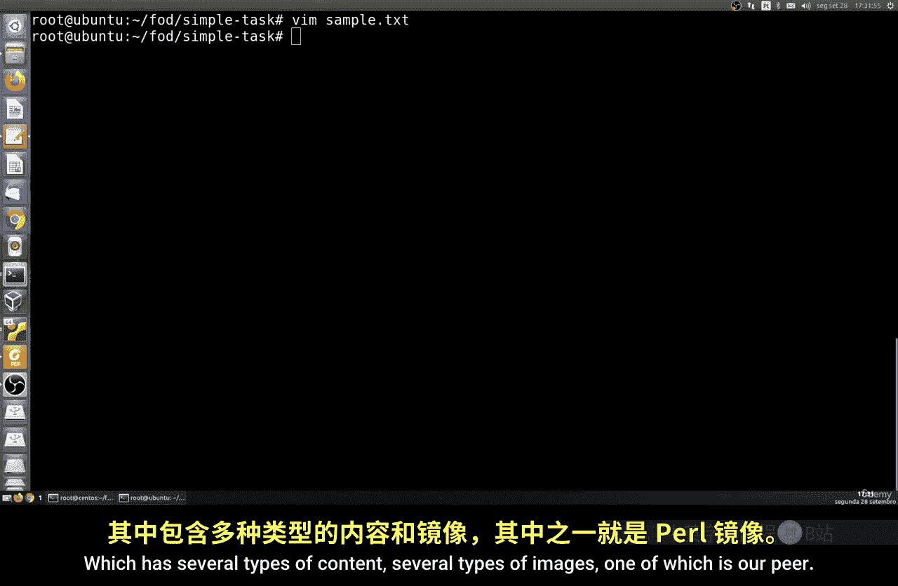
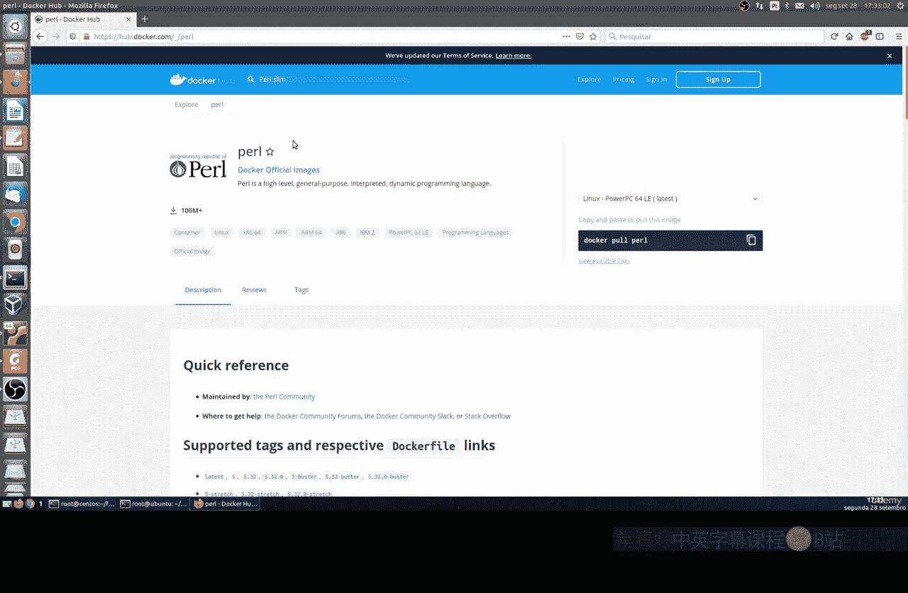
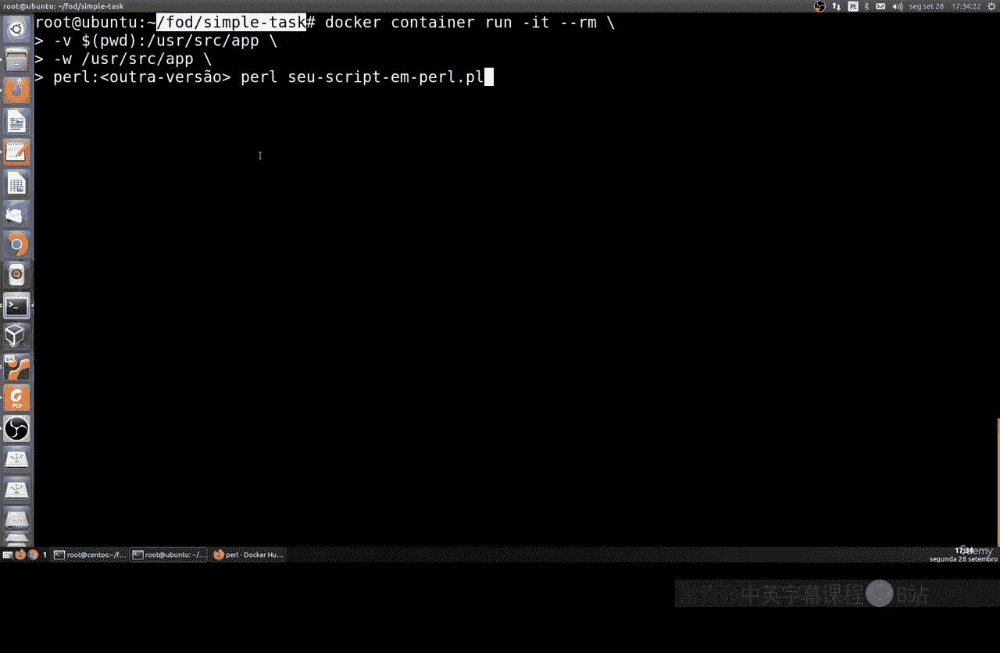
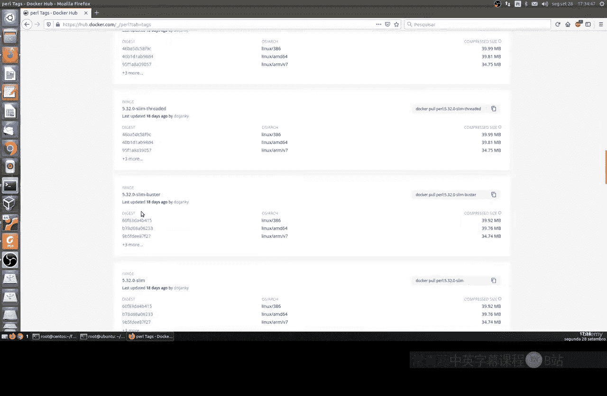
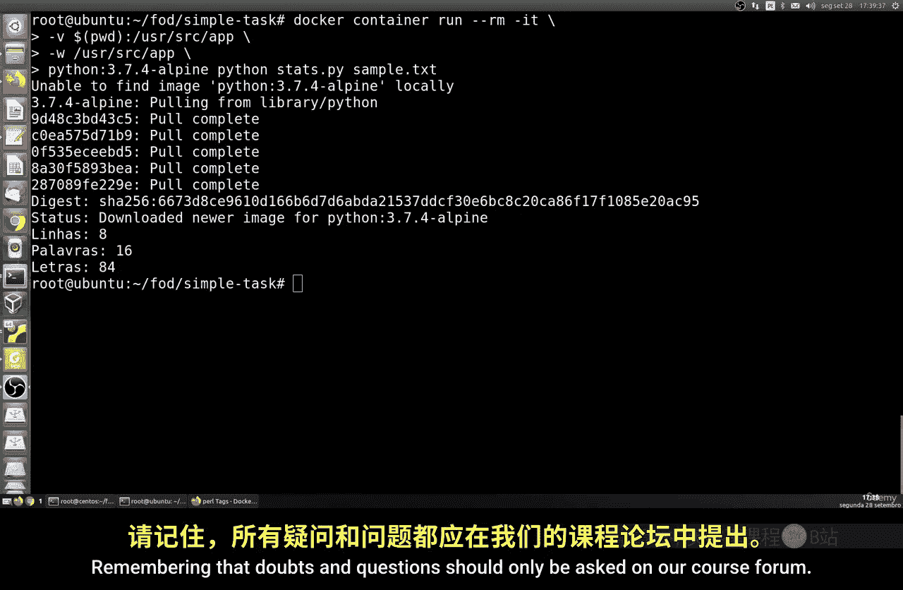

# 172：在容器中执行管理任务 🐳

在本节课中，我们将学习如何在不安装特定语言解释器的情况下，使用Docker容器来运行脚本。这对于测试不同版本的编程语言或执行一次性任务非常有用。

---

## 概述

通常，要运行一个Python或Perl脚本，你需要在本地系统上安装相应的解释器。然而，通过使用Docker，我们可以直接运行官方提供的语言镜像来执行脚本，而无需在主机上进行任何安装。这为开发和系统管理任务提供了极大的灵活性。

---

## 准备工作：创建示例文件



首先，我们需要一个用于测试的文本文件。这个文件将包含一些随机内容和空格，以便后续脚本进行处理。

以下是创建示例文件的步骤：

1.  创建一个名为 `example.txt` 的文件。
2.  在文件中输入一些包含空格的随机文本和数字。



例如，文件内容可以是：
```
Hello World 123
This is a test file with spaces.
Another line here.
```

---

## 使用Docker运行Perl脚本



上一节我们创建了测试文件，本节中我们来看看如何使用Docker运行一个Perl脚本来处理它。假设我们的系统没有安装Perl。

我们将使用Docker Hub上的官方Perl镜像。为了节省空间和提升速度，推荐使用`slim`版本。



执行以下命令：
```bash
docker run -v $(pwd):/app -w /app perl:slim perl -ne 'print if !/^\s*$/'
```
**命令解析**：
*   `-v $(pwd):/app`：将当前目录挂载到容器的 `/app` 目录。
*   `-w /app`：设置容器的工作目录为 `/app`。
*   `perl:slim`：指定使用的Docker镜像。
*   `perl -ne 'print if !/^\s*$/'`：在容器内执行的Perl命令，用于删除文件中的空行。

运行后，该命令会输出处理后的文件内容，所有空白行已被移除。

---

## 使用Docker运行Python脚本

除了Perl，我们也可以用同样的方法运行Python脚本。让我们创建一个简单的Python脚本来统计文本文件的行数、单词数和字母数。

首先，创建一个名为 `count.py` 的Python文件，内容如下：
```python
import sys

with open(sys.argv[1], 'r') as file:
    lines = words = letters = 0
    for line in file:
        lines += 1
        words += len(line.split())
        letters += sum(c.isalpha() for c in line)

print(f"Lines: {lines}")
print(f"Words: {words}")
print(f"Letters: {letters}")
```

现在，使用Docker运行这个Python脚本来分析我们之前创建的 `example.txt` 文件：
```bash
docker run -v $(pwd):/app -w /app python:3.9-alpine python count.py example.txt
```
**命令解析**：
*   `python:3.9-alpine`：指定一个轻量级的Python 3.9镜像。
*   `python count.py example.txt`：在容器内执行我们的Python脚本，并传入文件名作为参数。

命令执行后，会输出文件 `example.txt` 的统计结果。

---

## 总结

本节课中我们一起学习了如何利用Docker容器来执行管理任务，核心要点如下：

*   **核心价值**：无需在本地安装编程语言环境，即可运行对应脚本。
*   **关键命令**：通过 `docker run -v` 挂载本地目录，使用 `-w` 指定工作目录。
*   **灵活选择**：可以自由选择Docker Hub上不同版本或变体（如`slim`、`alpine`）的官方镜像。
*   **应用场景**：适用于快速测试、跨版本验证或执行一次性任务，保持主机环境整洁。



这种方法为开发者和系统管理员提供了强大的工具，能够安全、便捷地使用各种软件环境。