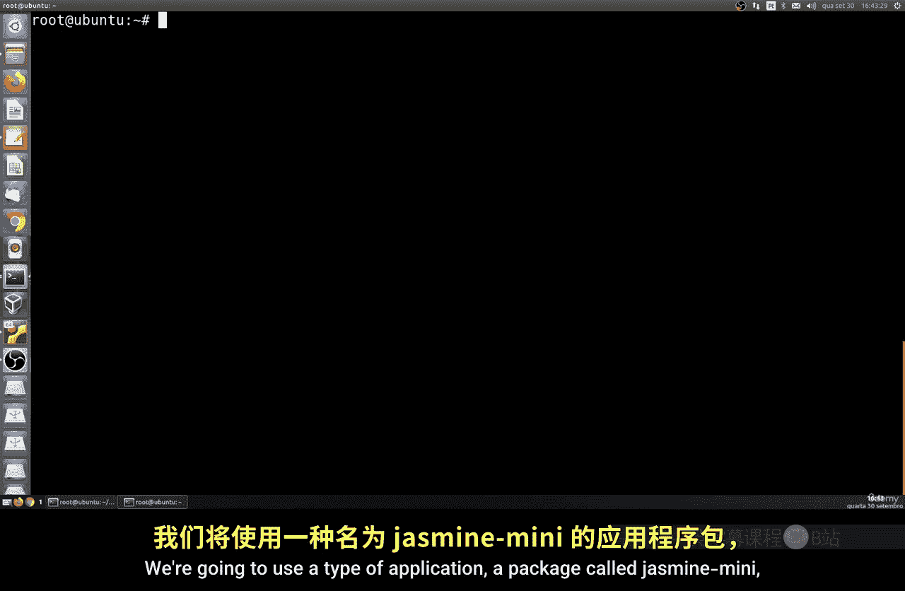
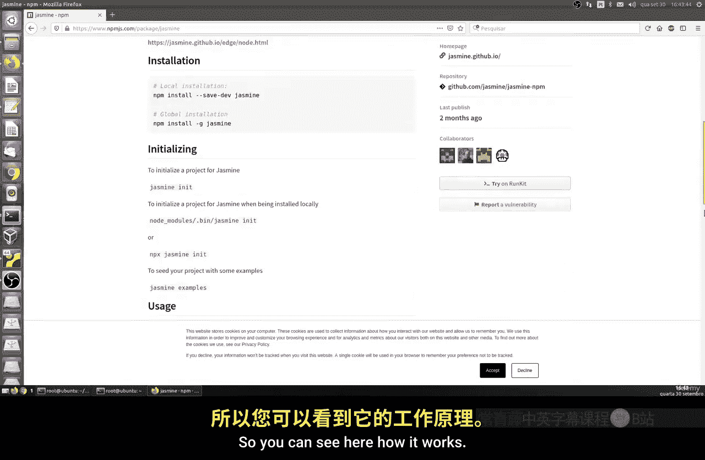
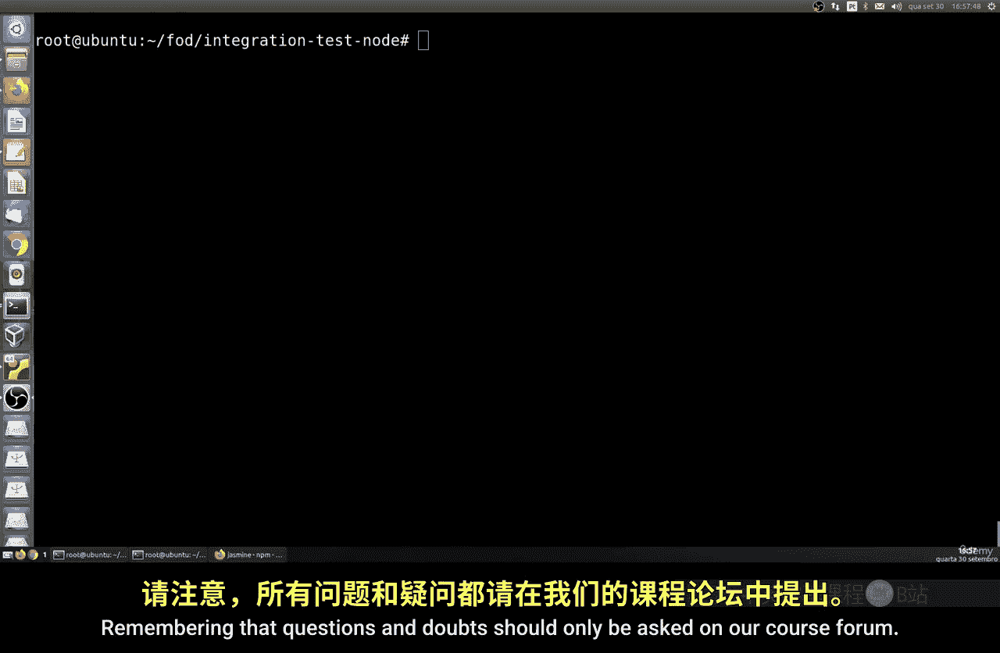

# 173：使用 Docker 与 PostgreSQL 进行 API 集成测试

在本节课中，我们将学习如何为 Node.js 应用构建一个完整的集成测试环境。我们将结合使用 Docker、PostgreSQL 数据库和一个简单的 Node.js API，来模拟并测试一个真实的应用架构。

上一节我们介绍了命令行基础，本节中我们来看看如何将这些工具组合起来进行集成测试。

## 项目结构搭建

首先，我们需要创建一个清晰的项目目录结构。以下是创建步骤：

1.  创建项目根目录 `integration-test-node`。
2.  在该目录下，创建三个子目录：
    *   `api`：用于存放我们的 Node.js API 应用。
    *   `database`：用于存放数据库初始化脚本。
    *   `test`：用于存放测试代码和配置。

## 配置 PostgreSQL 数据库

我们将使用 Docker 运行 PostgreSQL 数据库，并挂载数据卷以持久化数据。

### 创建数据库初始化脚本

进入 `database` 目录，创建一个 SQL 文件 `init-script.sql`。该脚本将创建一张表并插入一些初始数据。

```sql
CREATE TABLE IF NOT EXISTS hobbies (
    id SERIAL PRIMARY KEY,
    name VARCHAR(255) NOT NULL
);

INSERT INTO hobbies (name) VALUES
('Playing'),
('Dancing'),
('Swimming'),
('Cooking'),
('Gaming');
```

### 启动 PostgreSQL 容器

返回项目根目录，执行以下 Docker 命令来创建数据卷并启动数据库容器。

```bash
# 创建数据卷
docker volume create pgdata

# 运行 PostgreSQL 容器
docker run -d \
  --name postgres-test \
  -p 5432:5432 \
  -v $(pwd)/database:/docker-entrypoint-initdb.d \
  -v pgdata:/var/lib/postgresql/data \
  -e POSTGRES_USER=dbuser \
  -e POSTGRES_PASSWORD=secret \
  -e POSTGRES_DB=db \
  postgres:11.5-alpine
```

**命令解释**：
*   `-v $(pwd)/database:/docker-entrypoint-initdb.d`：将本地的 `database` 目录挂载到容器的初始化脚本目录，容器启动时会自动执行其中的 `.sql` 文件。
*   `-v pgdata:/var/lib/postgresql/data`：使用名为 `pgdata` 的数据卷来持久化数据库文件。
*   `-e` 参数用于设置环境变量，这里配置了数据库用户、密码和数据库名。

可以使用 `docker container logs postgres-test` 命令查看容器日志，确认数据库初始化成功。

## 创建 Node.js API

现在，我们来创建一个简单的 Express API 服务。

### 初始化 API 项目

进入 `api` 目录，初始化 Node.js 项目并安装 Express。

```bash
npm init -y
npm install express --save
```

### 配置启动脚本与主文件

编辑 `package.json` 文件，添加 `start` 脚本。

```json
{
  "scripts": {
    "start": "node index.js"
  }
}
```

创建主文件 `index.js`，这是一个监听 3000 端口的简单 API。

```javascript
const express = require('express');
const app = express();
const port = 3000;

app.get('/', (req, res) => {
  res.send('Test API');
});

app.listen(port, () => {
  console.log(`API running on port ${port}`);
});
```

在 `api` 目录下运行 `npm start` 启动 API。在另一个终端中，使用 `curl http://localhost:3000` 命令测试，应返回 “Test API”。



## 配置测试环境



我们将使用 Jasmine 测试框架和 Request 库来编写和运行集成测试。

### 初始化测试项目

进入 `test` 目录，初始化一个新的 Node.js 项目并安装所需依赖。

```bash
npm init -y
npm install jasmine request --save
```

### 配置 Jasmine

运行以下命令初始化 Jasmine 的目录结构。

```bash
./node_modules/.bin/jasmine init
```

编辑生成的 `spec/support/jasmine.json` 配置文件，确保 `random` 选项为 `false`。

```json
{
  "spec_dir": "spec",
  "spec_files": ["**/*[sS]pec.js"],
  "helpers": ["helpers/**/*.js"],
  "stopSpecOnExpectationFailure": false,
  "random": false
}
```

编辑 `test` 目录下的 `package.json`，添加测试脚本。

```json
{
  "scripts": {
    "test": "jasmine"
  }
}
```

### 编写 API 测试用例

在 `spec` 目录下创建测试文件 `api.spec.js`。该测试将检查我们的 API 是否正常运行并返回正确的响应。

```javascript
const request = require('request');

describe('API Integration Test', function() {
  const baseUrl = 'http://localhost:3000';

  it('should return status 200 and correct body', function(done) {
    request.get(baseUrl, function(error, response, body) {
      expect(response.statusCode).toBe(200);
      expect(body).toBe('Test API');
      done();
    });
  });
});
```

确保 API 容器正在运行，然后在 `test` 目录下执行 `npm test` 来运行测试。如果一切正常，测试将通过。

## 使用 Docker Compose 自动化

为了将整个环境（数据库、API、测试）容器化并自动化执行，我们需要为每个部分创建 Dockerfile，并编写一个启动脚本。

### 为 API 创建 Dockerfile

在 `api` 目录下创建 `Dockerfile`。

```dockerfile
FROM node:alpine
WORKDIR /usr/src/app
COPY package*.json ./
RUN npm install
COPY . .
EXPOSE 3000
CMD ["npm", "start"]
```

### 为测试创建 Dockerfile

在 `test` 目录下创建 `Dockerfile`。

```dockerfile
FROM node:alpine
WORKDIR /usr/src/test
COPY package*.json ./
RUN npm install
COPY . .
CMD ["npm", "test"]
```

### 创建自动化构建与测试脚本

在项目根目录创建 `test.sh` 脚本，用于按顺序构建镜像、创建网络、启动容器并执行测试。

```bash
#!/bin/bash

# 构建 API 和测试镜像
docker build -t my-api ./api
docker build -t my-test ./test

# 创建专用网络
docker network create test-net

# 启动数据库容器
docker run -d --name postgres --network test-net \
  -v pgdata:/var/lib/postgresql/data \
  -e POSTGRES_USER=dbuser \
  -e POSTGRES_PASSWORD=secret \
  -e POSTGRES_DB=db \
  postgres:11.5-alpine

# 等待数据库就绪
sleep 5

# 启动 API 容器
docker run -d --name api --network test-net -p 3000:3000 my-api

# 等待 API 就绪
sleep 2

# 运行测试容器（它会连接到同一网络的 API）
docker run --rm --name tester --network test-net my-test

# 测试完成后，清理容器和网络（可选）
# docker stop postgres api
# docker rm postgres api
# docker network rm test-net
```

给脚本添加执行权限并运行：`chmod +x test.sh && ./test.sh`。脚本将自动完成整个集成测试流程。

## 清理资源

测试完成后，可以使用以下命令清理 Docker 资源。

```bash
# 停止并删除容器
docker stop postgres api
docker rm postgres api

# 删除网络
docker network rm test-net

# 删除数据卷（谨慎操作，会删除数据）
docker volume rm pgdata

# 删除镜像
docker rmi my-api my-test
```



本节课中我们一起学习了如何为 Node.js 应用搭建一个包含 API 和 PostgreSQL 数据库的完整集成测试环境。我们使用 Docker 容器化每个组件，并通过编写 Shell 脚本将构建、部署和测试流程自动化。这种方法确保了测试环境的一致性，并且易于在 CI/CD 管道中复现。