# 174：清理环境 🧹

在本节课中，我们将学习如何清理 Docker 环境。随着我们创建和使用越来越多的容器、镜像和卷，系统中可能会积累许多不再需要的资源。及时清理这些资源可以释放磁盘空间，并保持环境的整洁高效。

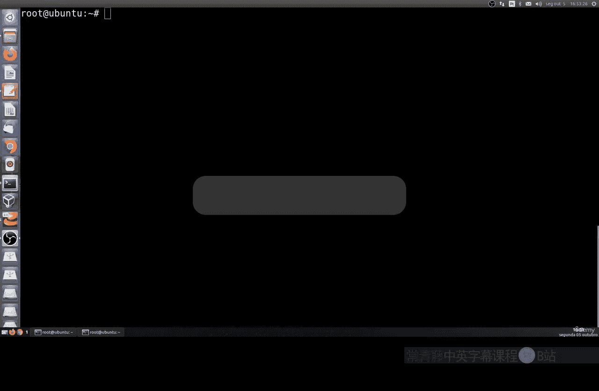

上一节我们介绍了 Docker 的基本操作，本节中我们来看看如何有效地进行环境清理。

## 查看与清理容器

首先，我们需要查看当前系统中存在的容器。使用以下命令可以列出所有容器（包括已停止的）：

```bash
docker ps -a
```

如果确认某些容器已不再需要，可以将其删除以释放资源。以下是删除容器的几种方法。

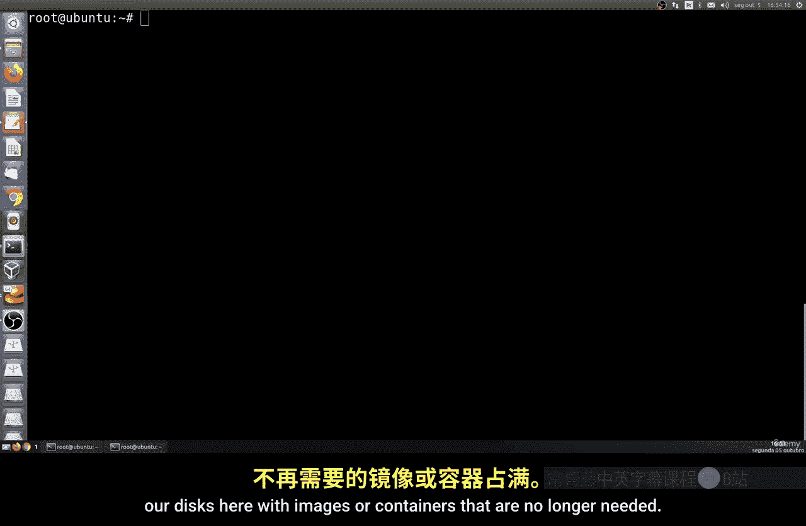

### 删除单个容器

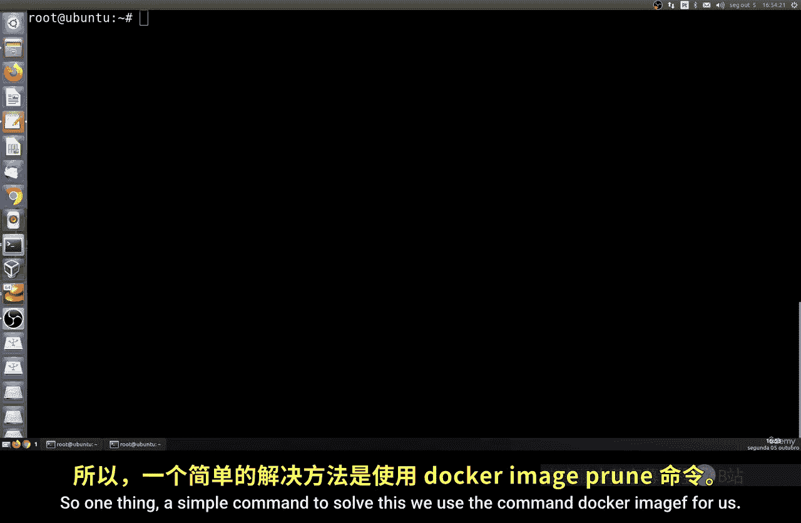

要删除一个特定的容器，你需要知道它的**容器ID**或**容器名称**。可以使用 `docker rm` 命令。

例如，删除一个名为 `my_container` 的容器：
```bash
docker rm my_container
```
或者，使用容器ID进行删除：
```bash
docker rm abc123def456
```

### 批量删除所有已停止的容器

如果你希望一次性清理所有已停止的容器，可以使用以下命令。**请注意，此操作不可逆。**

```bash
docker container prune
```
系统会提示你确认是否删除所有已停止的容器。

如果你想强制删除而不需要确认，可以加上 `-f` 参数：
```bash
docker container prune -f
```

## 清理未使用的镜像

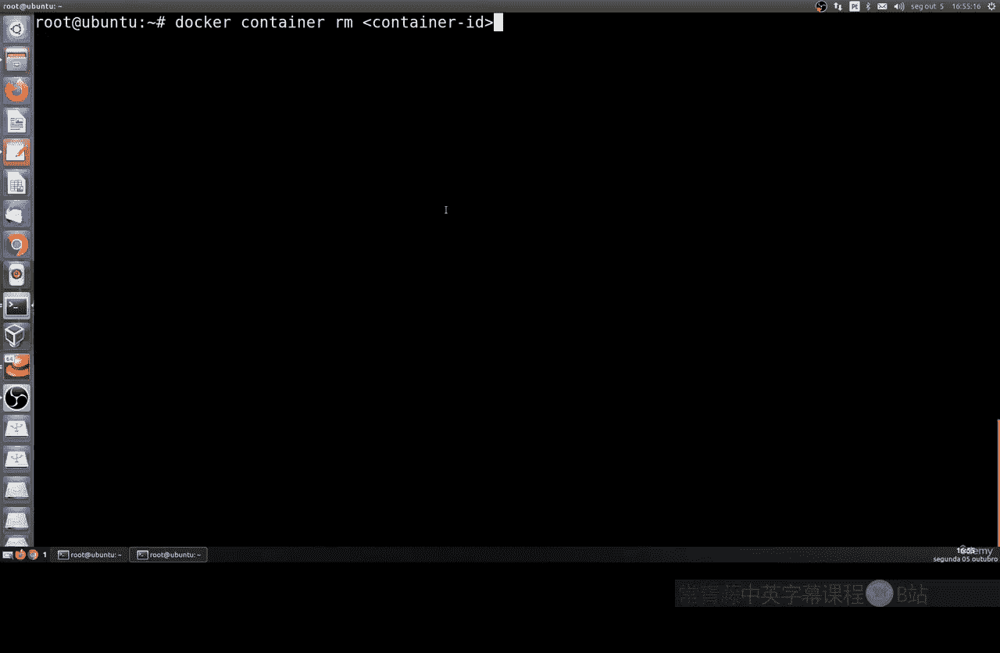

除了容器，未使用的 Docker 镜像也会占用大量磁盘空间。我们可以清理这些镜像。

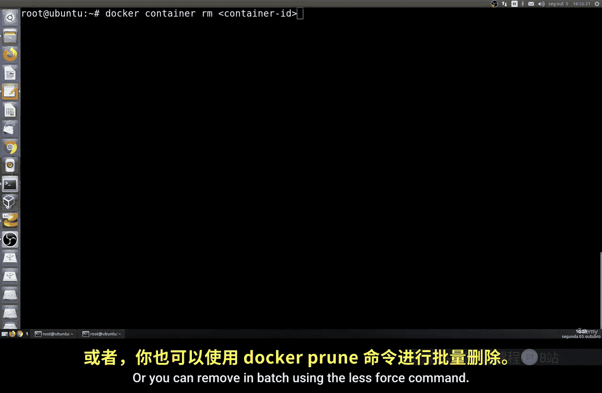

首先，使用以下命令查看所有镜像：
```bash
docker images -a
```

要删除所有未被任何容器引用的悬空镜像（`dangling images`），可以使用：
```bash
docker image prune
```

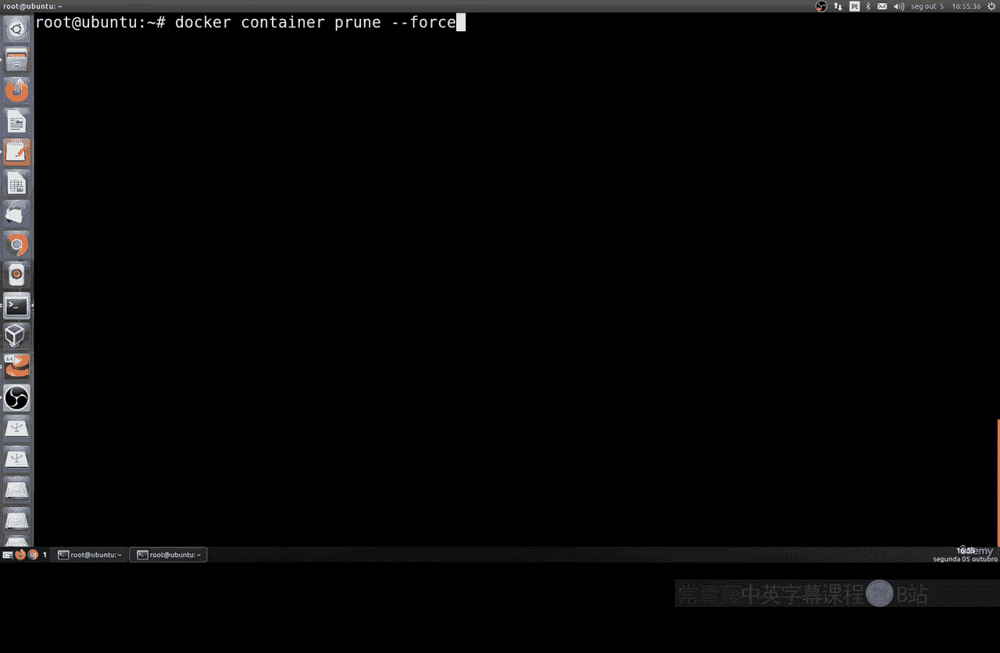

如果你想删除所有未被使用的镜像（包括那些没有被任何容器使用的镜像，而不仅仅是悬空镜像），可以使用：
```bash
docker image prune -a
```
同样，可以加上 `-f` 参数来跳过确认步骤。

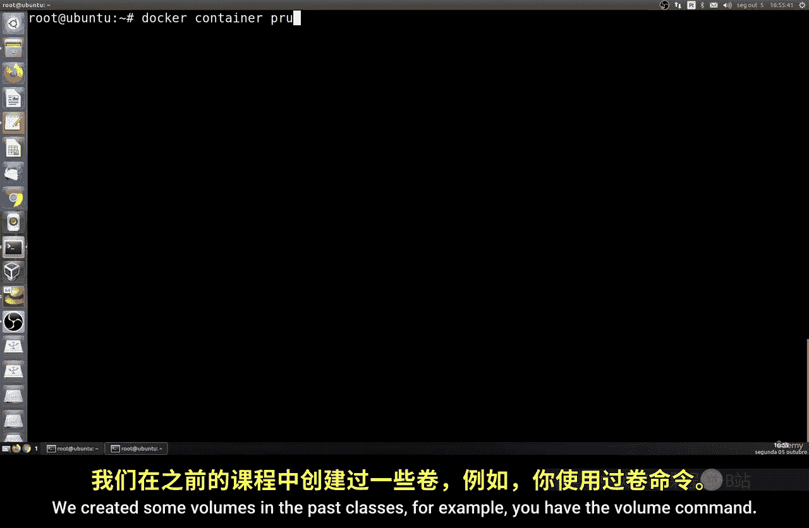

## 清理未使用的卷

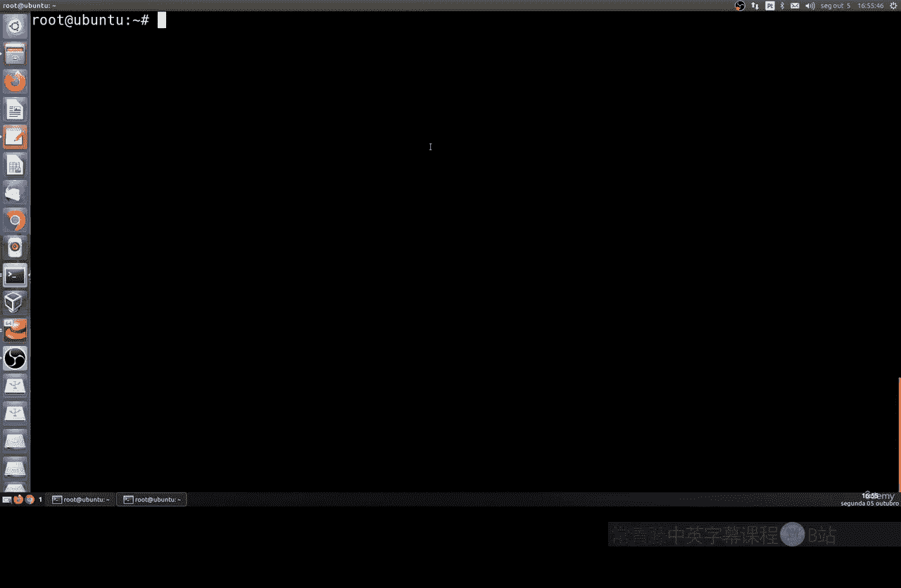

Docker 卷用于持久化数据。如果你创建过卷，它们也可能需要清理。

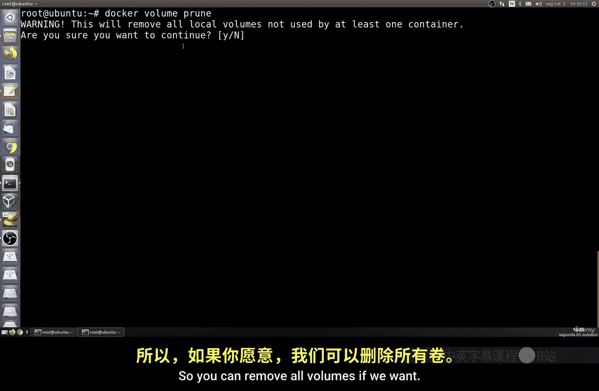

以下是查看所有卷的命令：
```bash
docker volume ls
```

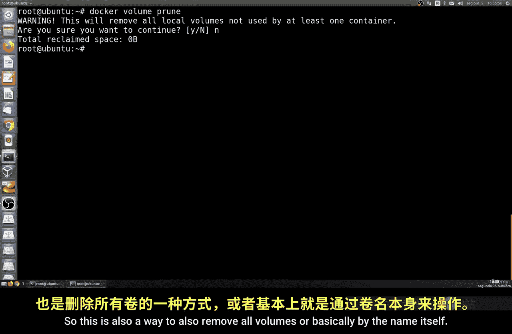

要删除所有未被任何容器使用的卷，可以使用：
```bash
docker volume prune
```

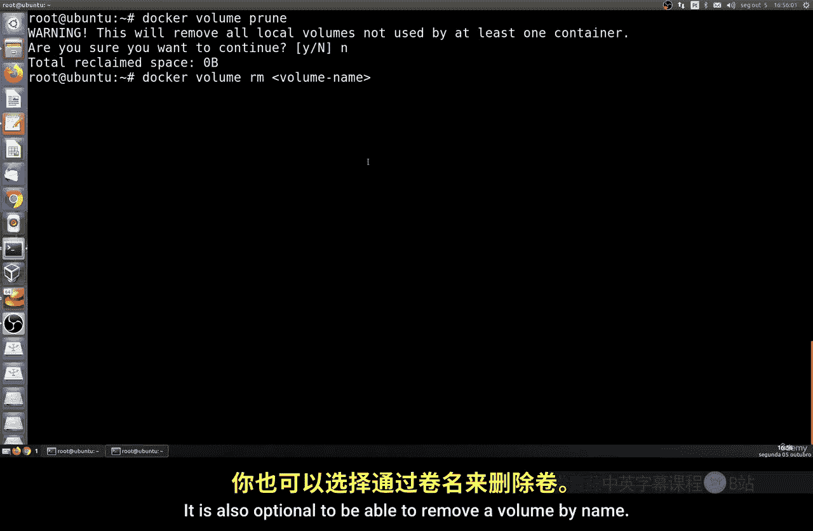

你也可以通过卷的名称来删除特定的卷：
```bash
docker volume rm my_volume_name
```

## 一键清理所有未使用资源

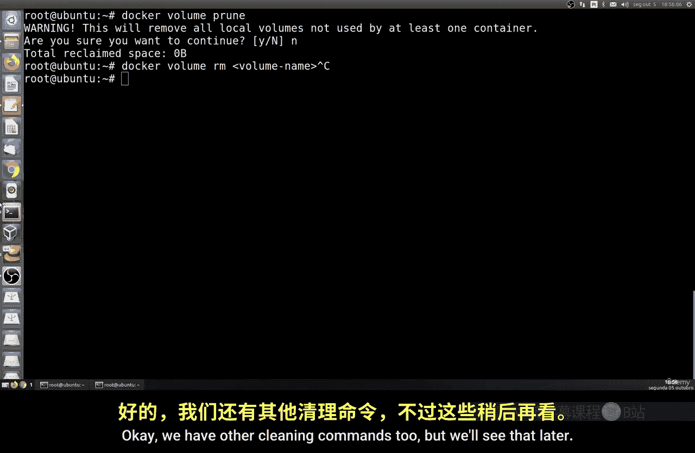

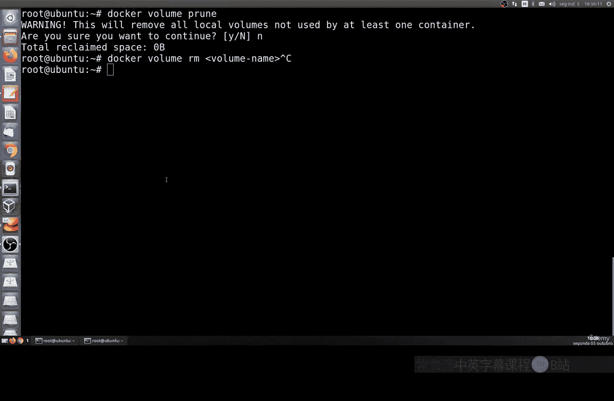

Docker 提供了一个强大的命令，可以一次性清理所有未使用的容器、镜像、网络和卷（通常称为“垃圾回收”）。

```bash
docker system prune -a
```
**警告：** 这个命令会删除所有未使用的资源，包括所有未被容器引用的镜像。请谨慎使用。添加 `-f` 可以强制执行。

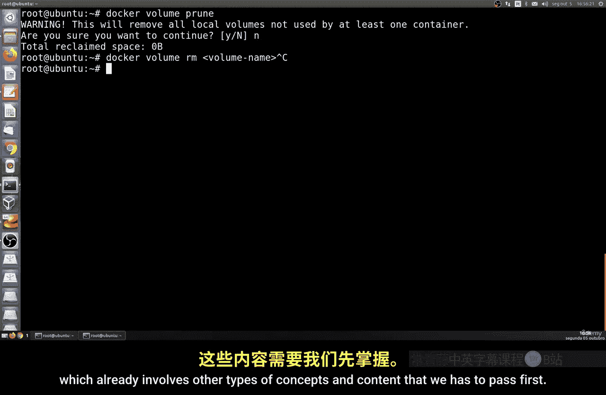

---

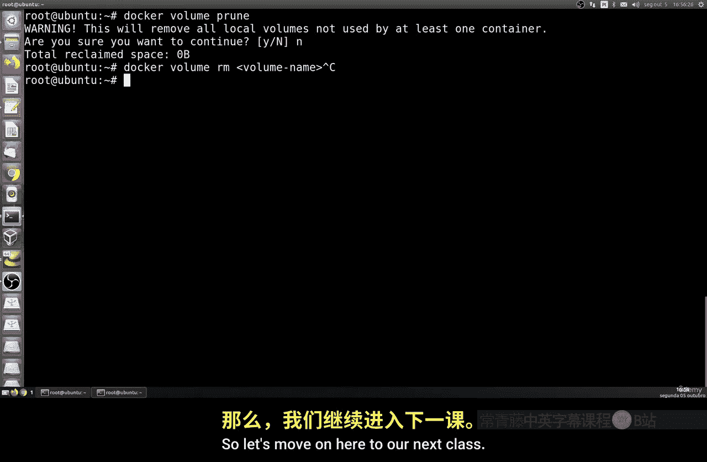

本节课中我们一起学习了 Docker 环境清理的基础知识。我们掌握了如何查看和删除不再需要的容器、镜像和卷，以及如何使用 `prune` 命令进行批量清理。定期执行这些清理操作是维护一个高效、整洁的 Docker 开发环境的重要习惯。在接下来的课程中，我们将接触更多 Docker 的高级概念和操作。