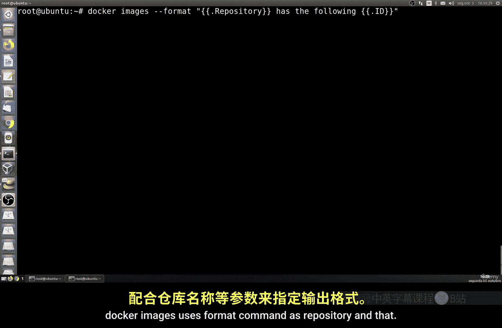
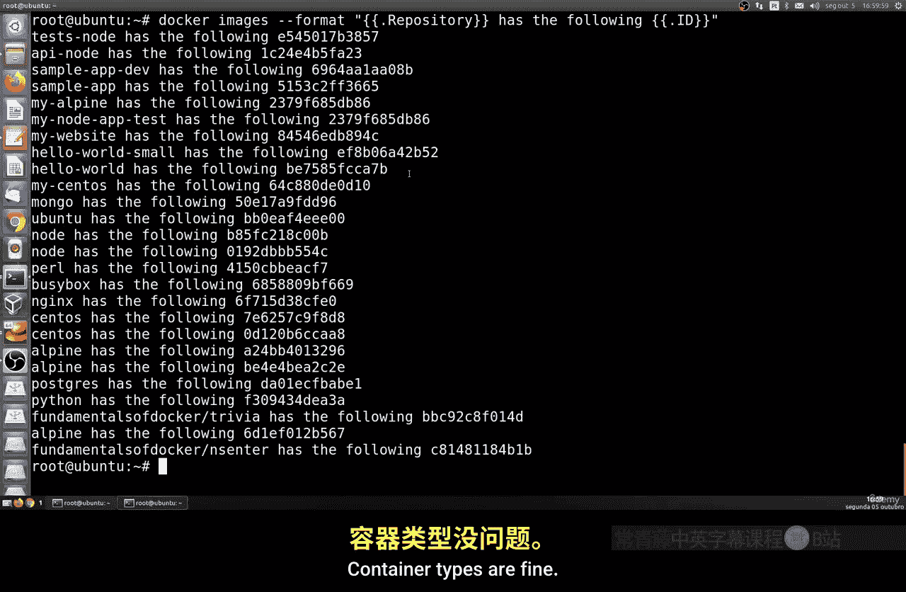
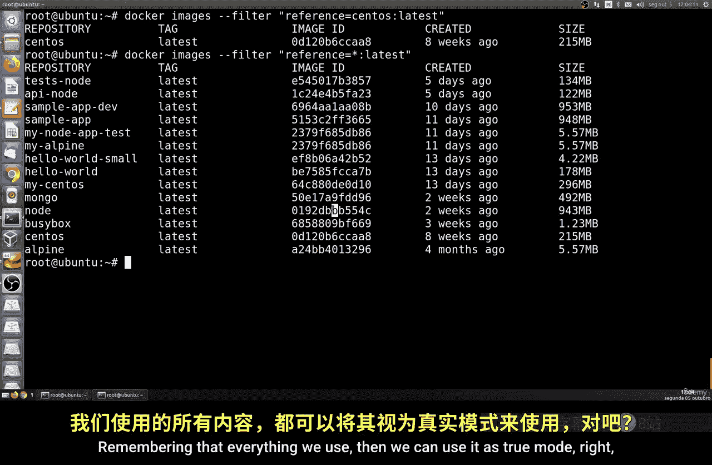
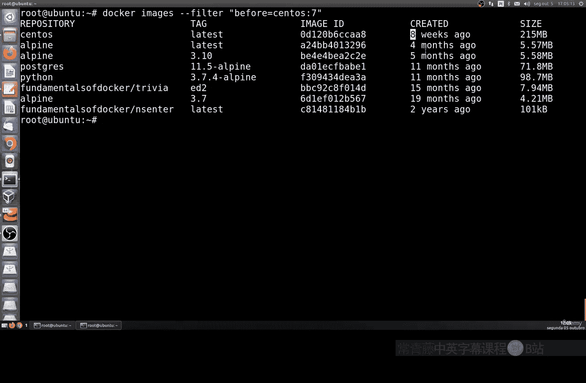
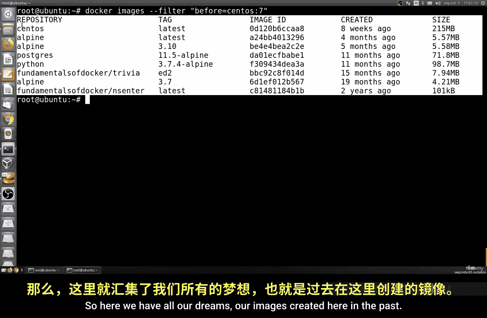
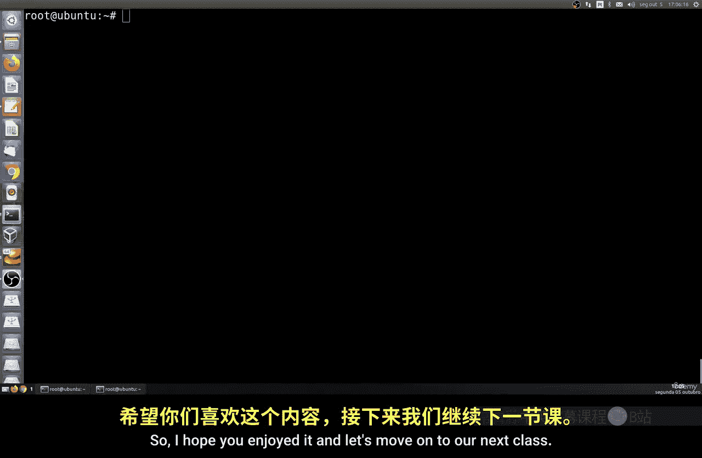

# 175：格式化与过滤输出 🐳

在本节课中，我们将学习如何格式化Docker命令的输出结果，以及如何使用过滤功能来更精确地定位和管理容器与镜像。当你的机器上运行着成百上千个容器时，掌握这些技巧至关重要。

## 格式化输出

上一节我们介绍了基本的容器列表命令。本节中我们来看看如何使用 `--format` 参数来定制化输出信息，只显示我们关心的特定列。

`docker ps` 命令用于列出容器，但默认输出包含所有信息。我们可以使用 `--format` 参数来指定输出格式。例如，以下命令只显示容器的名称、所使用的镜像名称以及当前状态：

```bash
docker ps --format "table {{.Names}}\t{{.Image}}\t{{.Status}}"
```

这个命令会生成一个清晰的表格，包含我们创建的容器名称、其基于的镜像以及状态（运行中、已退出、退出时长等）。

对于镜像列表，我们同样可以进行格式化。如果你想查看镜像仓库名和对应的镜像ID，可以使用以下命令：



```bash
docker images --format "{{.Repository}}\t{{.ID}}"
```

这样，输出将只包含镜像仓库名称和其唯一的ID，便于我们进行后续操作或筛选。



## 过滤输出

除了格式化，Docker还提供了强大的 `--filter` 参数，允许我们根据特定条件筛选结果。`--filter` 参数的基本结构是 `key=value`。

以下是几个常用的过滤键（key）及其用途：

*   **`reference`**: 根据镜像名称或标签进行筛选。
*   **`before`**: 筛选在某个特定时间点之前创建的镜像。
*   **`since`**: 筛选在某个特定时间点之后创建的镜像。
*   **`dangling`**: 筛选未被任何容器使用的“悬空”镜像。

让我们通过一些例子来具体了解如何使用它们。

### 按名称过滤

如果你想列出所有基于 `node` 镜像的容器，可以使用 `reference` 键：

```bash
docker images --filter=reference=node
```

这条命令会列出所有仓库名或标签中包含 “node” 的镜像。

你还可以使用通配符进行更灵活的匹配。例如，以下命令会找出所有标签为 `latest` 的镜像：

```bash
docker images --filter=reference="*:latest"
```

### 按时间过滤

在某些情况下，你可能需要根据创建时间来管理镜像。使用 `before` 和 `since` 键可以实现这一点。

例如，要列出在某个特定镜像（如 `ubuntu:latest`）之前创建的所有镜像：



```bash
docker images --filter=before=ubuntu:latest
```

反之，要列出在某个镜像之后创建的所有镜像，则使用 `since`：

```bash
docker images --filter=since=ubuntu:20.04
```



### 过滤悬空镜像



“悬空镜像”是指那些没有标签且未被任何容器引用的中间层镜像。它们会占用磁盘空间，可以使用以下命令进行查找和清理：

```bash
# 查找悬空镜像
docker images --filter=dangling=true

# 清理所有悬空镜像
docker image prune
```



本节课中我们一起学习了如何利用 `--format` 参数定制Docker命令的输出格式，以及如何使用 `--filter` 参数根据名称、时间、状态等条件精确筛选容器和镜像。掌握这些技巧能帮助你在复杂的Docker环境中更高效地进行管理和排查。