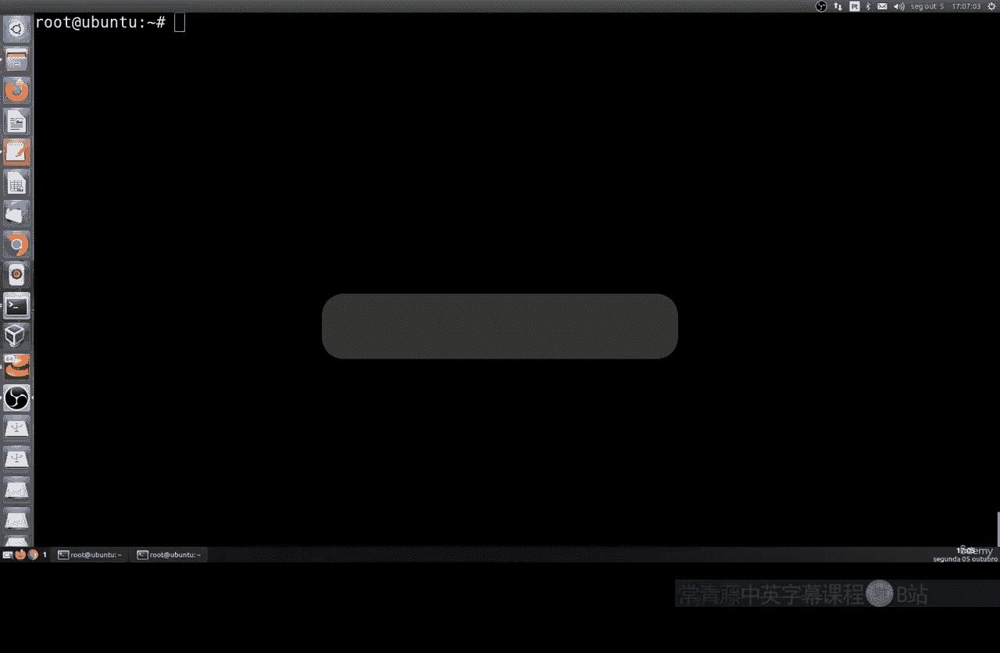
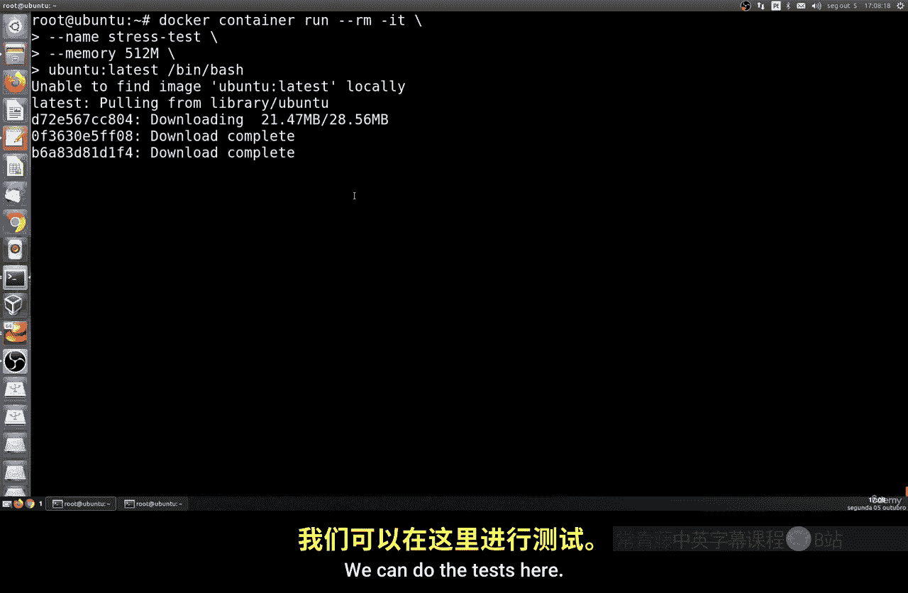
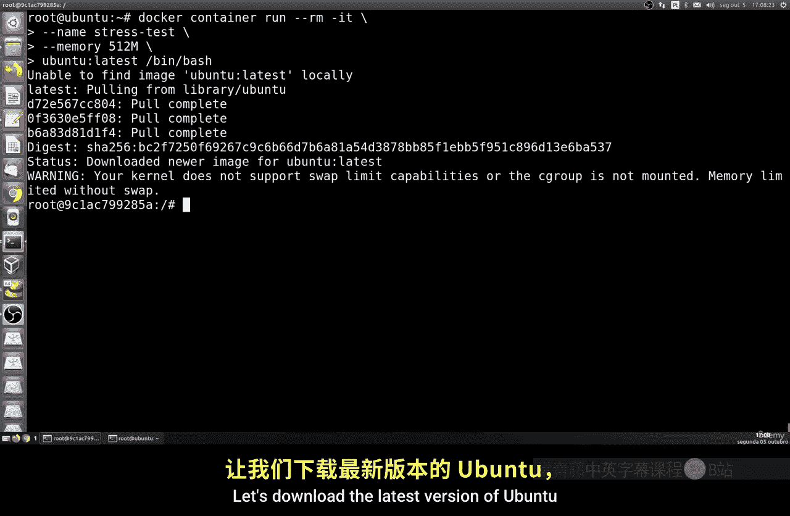
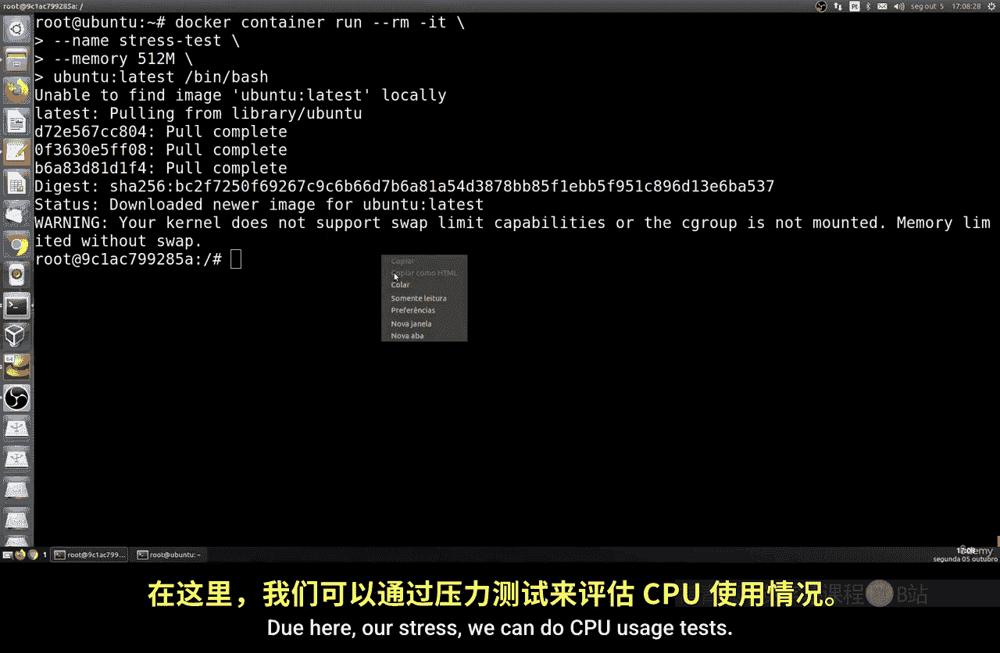
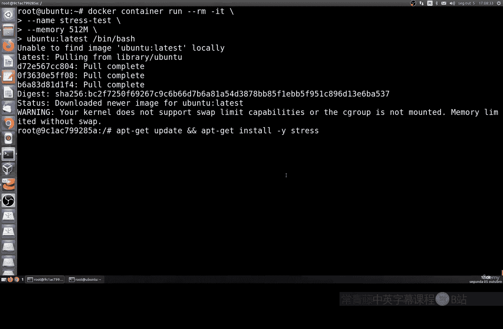
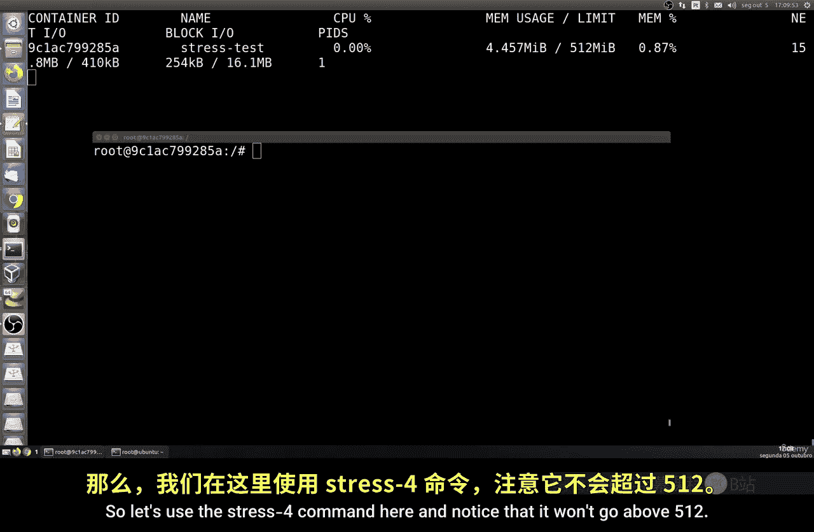
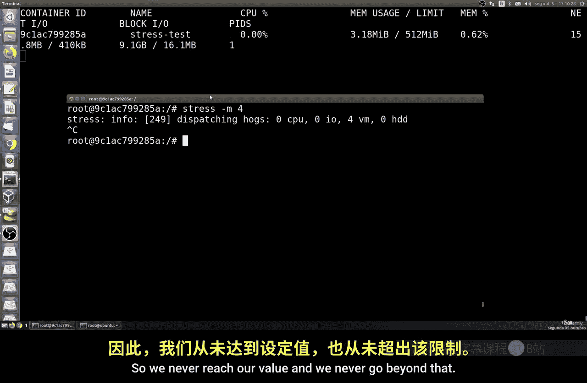
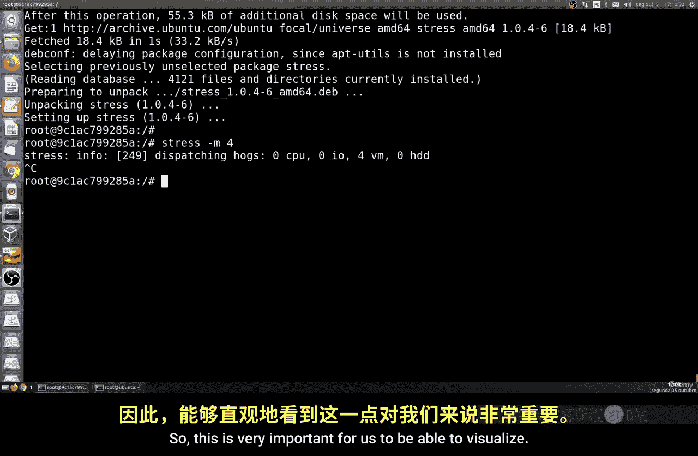
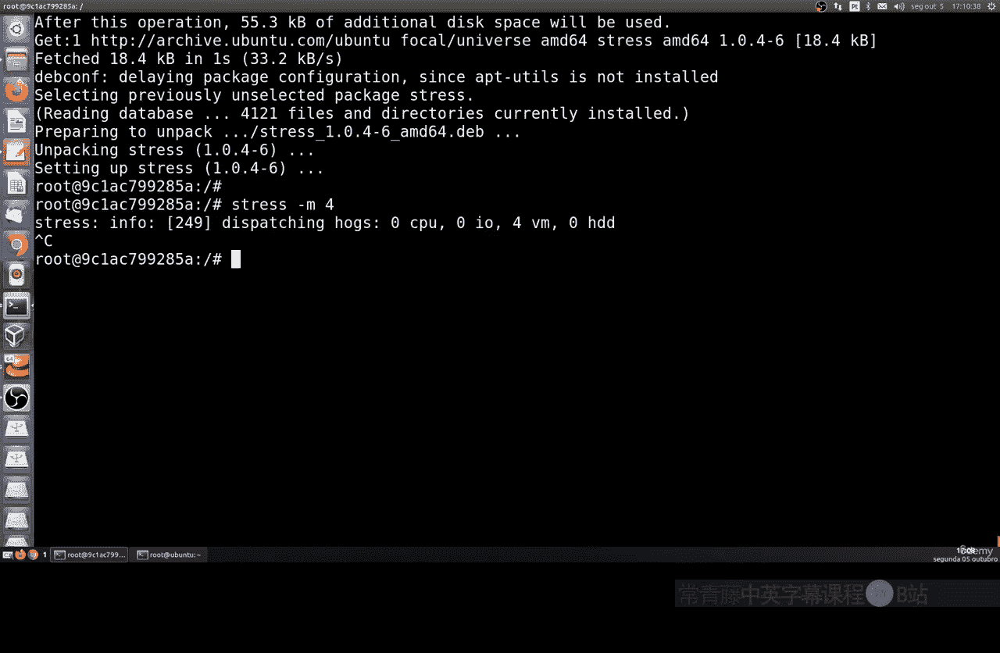
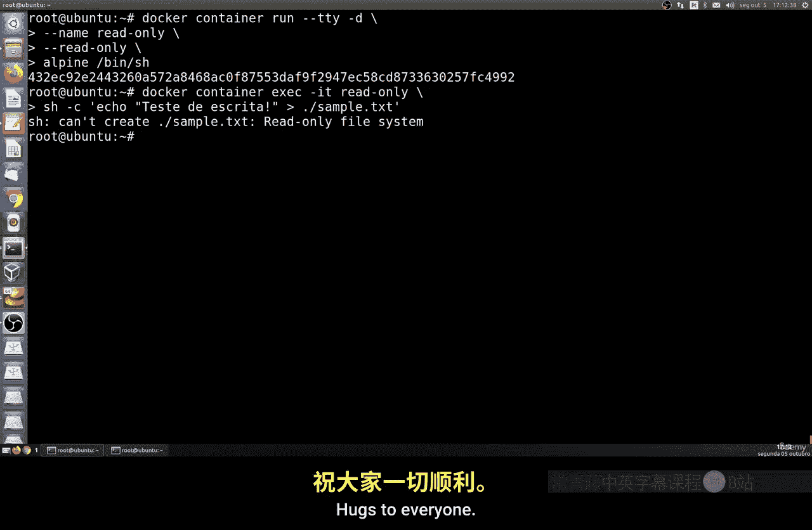

# 176：资源限制与只读系统 🐳



在本节课中，我们将要学习如何在Docker容器中限制资源消耗，以及如何创建只读文件系统的容器。这对于优化服务器性能、控制云服务成本以及增强容器安全性至关重要。

上一节我们介绍了Docker的基本操作，本节中我们来看看如何对容器进行更精细的控制。

## 限制容器资源

在单一服务器或云主机上运行多个Docker容器时，限制每个容器可使用的内存和CPU资源非常重要。这可以防止单个容器消耗过多资源而影响其他服务，同时有助于控制云服务成本。



以下是创建并运行一个资源受限容器的步骤：



1.  **拉取镜像**：首先，我们需要一个基础镜像。我们将使用Ubuntu镜像。
    ```bash
    docker pull ubuntu:latest
    ```





2.  **运行容器并限制内存**：使用 `docker run` 命令启动一个新容器，并通过 `-m` 参数限制其最大内存使用量为512MB。
    ```bash
    docker run -itd --name my_limited_container -m 512m ubuntu:latest
    ```
    这个命令会创建一个名为 `my_limited_container` 的后台交互式容器。

3.  **监控资源使用情况**：打开一个新的终端（宿主机的终端，而非容器内部），使用 `docker stats` 命令实时监控容器的资源使用情况。
    ```bash
    docker stats my_limited_container
    ```
    你将看到类似 `MEM USAGE / LIMIT 4.5MiB / 512MiB` 的输出，表明当前内存使用量和我们设置的限制。

4.  **进行压力测试**：回到容器内部的终端，安装一个压力测试工具来验证限制是否生效。
    ```bash
    apt-get update && apt-get install -y stress
    ```
    安装完成后，运行一个消耗内存的压力测试命令。
    ```bash
    stress --vm 1 --vm-bytes 600M --vm-hang 0
    ```
    此命令尝试分配600MB内存。观察 `docker stats` 的输出窗口，你会发现容器的内存使用量会迅速上升，但**永远不会超过512MB**的限制。它可能达到511MB左右，然后稳定下来，证明资源限制成功生效。

通过以上步骤，我们成功创建了一个内存使用上限为512MB的容器。这对于确保系统稳定性和公平分配资源非常有效。

## 创建只读文件系统容器



除了限制资源，我们还可以通过将容器的根文件系统设置为只读（Read-Only）来增强安全性。这可以防止入侵者或恶意进程在容器内部修改、创建或删除文件，即使他们获得了容器内部的访问权限。

以下是创建只读容器的步骤：



1.  **运行只读容器**：在运行容器时，使用 `--read-only` 参数。
    ```bash
    docker run -itd --name my_readonly_container --read-only ubuntu:latest
    ```





2.  **尝试写入文件**：进入这个只读容器的shell环境。
    ```bash
    docker exec -it my_readonly_container /bin/bash
    ```
    在容器内部，尝试创建一个新文件。
    ```bash
    echo "test content" > /tmp/test.txt
    ```
    执行此命令后，你会收到类似 `Read-only file system` 的错误提示。这表明在只读文件系统上，任何写入操作都会被拒绝。

3.  **应用场景**：只读模式非常适合运行那些不需要写入本地文件的应用，例如：
    *   提供静态内容的Web服务器。
    *   从外部数据库或卷（Volume）读取数据的应用程序。
    *   任何你希望确保其二进制文件和配置在运行时绝对不被篡改的服务。

通过结合资源限制和只读文件系统，你可以构建出更安全、更稳定且资源可控的Docker容器。

## 总结

本节课中我们一起学习了Docker容器管理的两个高级技巧。

首先，我们掌握了如何使用 `-m` 参数限制容器的内存使用量，并通过 `docker stats` 命令进行监控和验证。这是优化多容器环境性能和成本的关键。

其次，我们了解了如何使用 `--read-only` 参数创建只读文件系统的容器，从而极大地增强了容器的安全性，防止了运行时的不必要修改。



合理运用资源限制和只读模式，能帮助你在生产环境中更可靠、更安全地部署和管理Docker容器。