Linux命令行基础：Part2：避免以非root用户运行Docker容器 🔒

在本节课中，我们将学习如何配置Docker，以避免以非root用户身份运行容器时可能引发的安全问题。核心在于理解并正确设置Docker的执行权限，确保普通用户只能运行其拥有适当权限的应用程序。

---

### 概述

默认情况下，Docker守护进程以root权限运行。如果普通用户被添加到`docker`组，他们也能执行Docker命令，这可能导致权限提升风险。本节将演示如何通过创建专用用户和组来运行Docker容器，从而限制对系统敏感文件的访问，遵循安全最佳实践。

---

### 准备工作：将用户加入Docker组

要使普通用户能够运行Docker命令，首先需要将其添加到`docker`组中。

以下是操作步骤：

1.  使用`sudo`或`root`用户执行以下命令，将用户`victor`添加到`docker`组：
    ```bash
    sudo usermod -aG docker victor
    ```
2.  添加完成后，用户需要**注销并重新登录**（通过SSH或终端），以使组更改生效。

完成上述步骤后，用户`victor`便具备了运行Docker的基本权限。

---

### 创建受限制的测试文件

上一节我们配置了用户权限，本节中我们来看看如何创建一个普通用户无法访问的文件，以模拟安全限制环境。

首先，切换到`root`用户，创建一个内容敏感的文件，并修改其权限，确保只有`root`用户可以读写。

```bash
# 切换到root用户
sudo su -

# 创建一个秘密文件
echo "这是顶级机密内容" > top-secret.txt

# 修改文件权限，仅允许root用户读写
chmod 600 top-secret.txt
# 同时修改所有者和组为root
chown root:root top-secret.txt
```

此时，如果切换到普通用户`victor`，尝试查看该文件，权限会被拒绝。

```bash
# 切换回普通用户victor
exit

# 尝试读取文件
cat top-secret.txt
# 输出：cat: top-secret.txt: Permission denied
```

---

### 问题演示：Docker的权限绕过风险

然而，如果用户`victor`利用Docker，可以绕过上述Linux文件权限限制。我们来演示这个安全问题。

用户`victor`创建一个`Dockerfile`，尝试在容器内读取宿主机上的`top-secret.txt`文件。

```dockerfile
# Dockerfile 内容
FROM ubuntu:latest
COPY top-secret.txt /secret/
CMD ["cat", "/secret/top-secret.txt"]
```

然后，由`root`用户构建Docker镜像：

```bash
# 切换回root用户构建镜像
sudo su -
docker build -t test-breach .
```

构建完成后，切换回用户`victor`并运行容器：

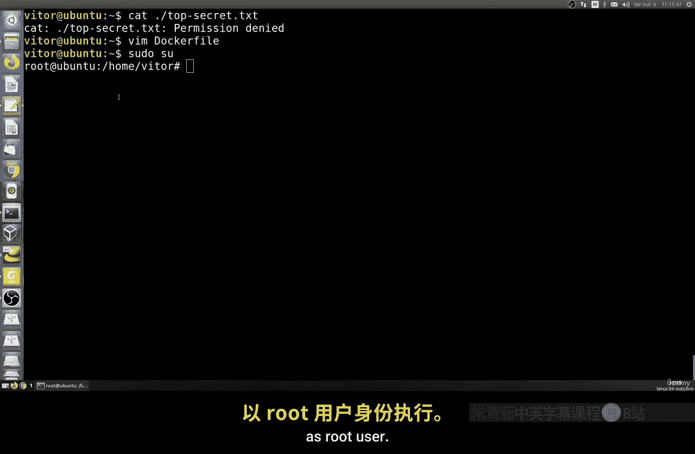

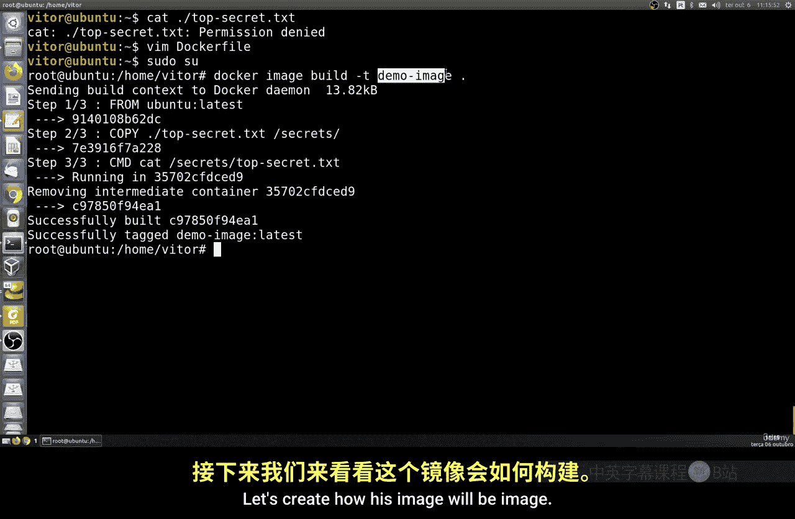

```bash
exit
docker run --rm -v $(pwd)/top-secret.txt:/secret/top-secret.txt test-breach
```

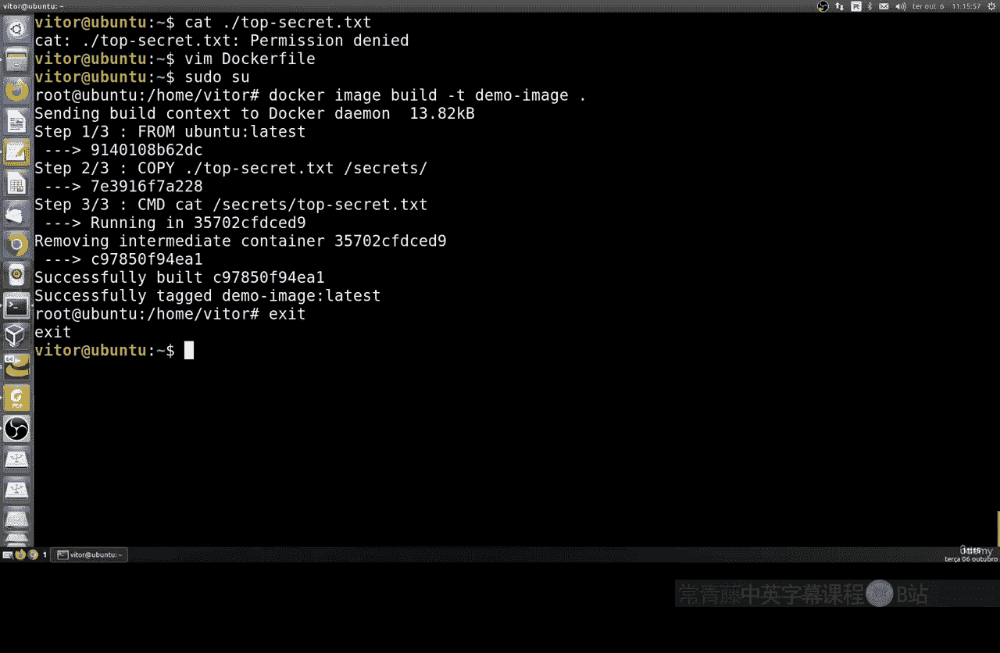

你会发现，容器成功输出了`top-secret.txt`的内容。这意味着**普通用户通过Docker绕过了系统的文件权限控制**，这是一个严重的安全隐患。

---

### 解决方案：在容器内使用非root用户运行

为了解决上述安全问题，我们需要修改`Dockerfile`，确保容器内部使用一个特定的非root用户来运行进程，而不是默认的root或宿主机的普通用户。

以下是修改后的`Dockerfile`安全实践：

```dockerfile
# 安全实践的 Dockerfile
FROM ubuntu:latest

# 1. 创建一个新的用户组，GID设为3000
RUN groupadd -g 3000 demogroup

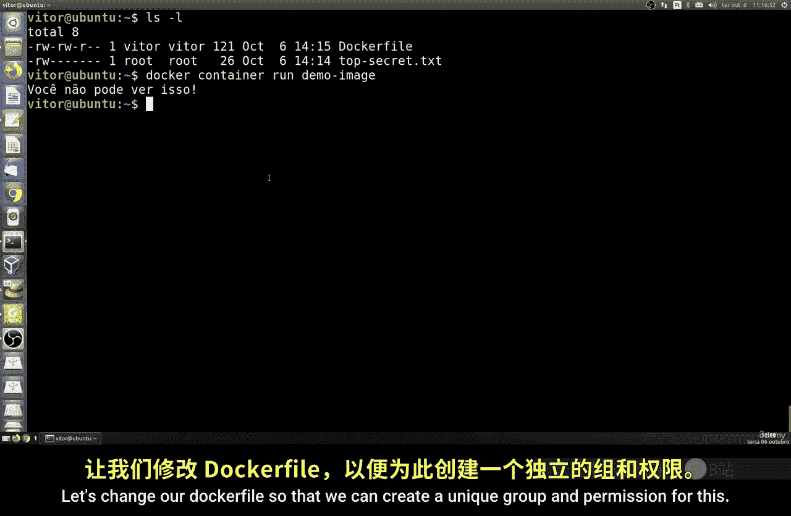

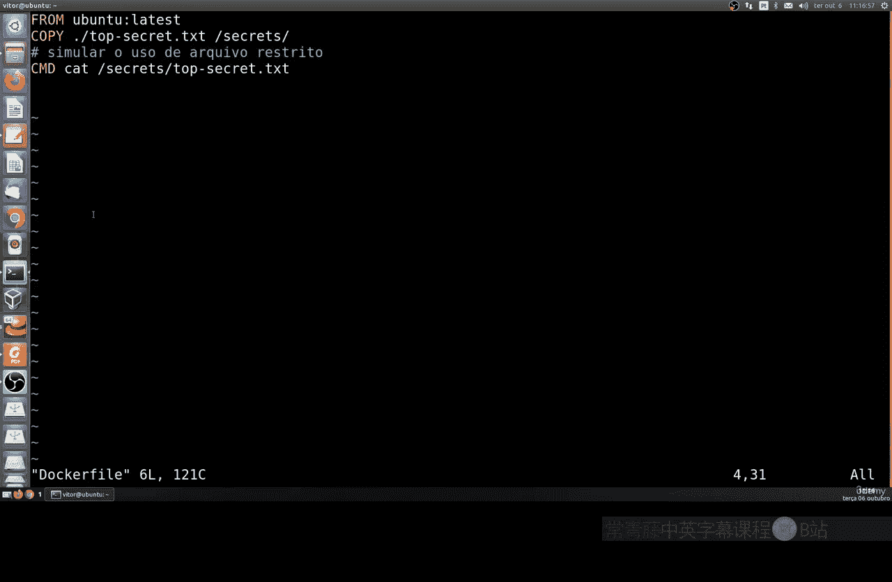

# 2. 创建一个新的用户，UID设为4000，并将其加入上一步创建的组
RUN useradd -u 4000 -g demogroup demo-user

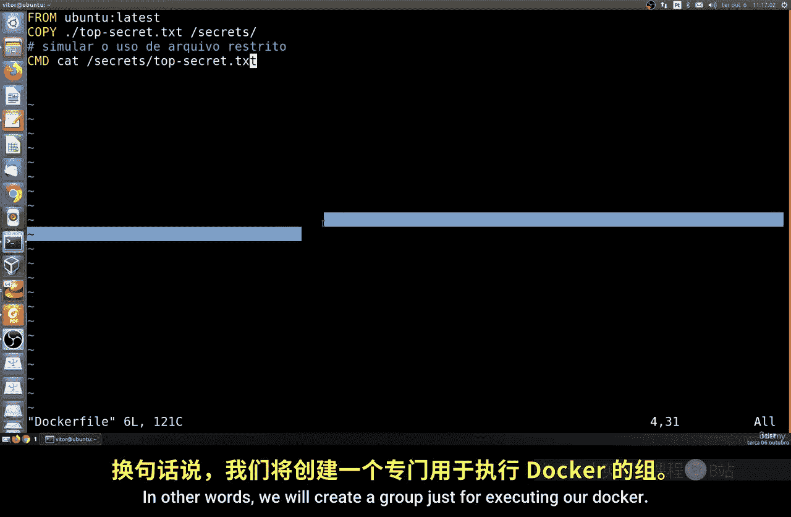

# 3. 将宿主机文件复制到容器内，并更改所有权为新建的用户
COPY top-secret.txt /secret/
RUN chown demo-user:demogroup /secret/top-secret.txt

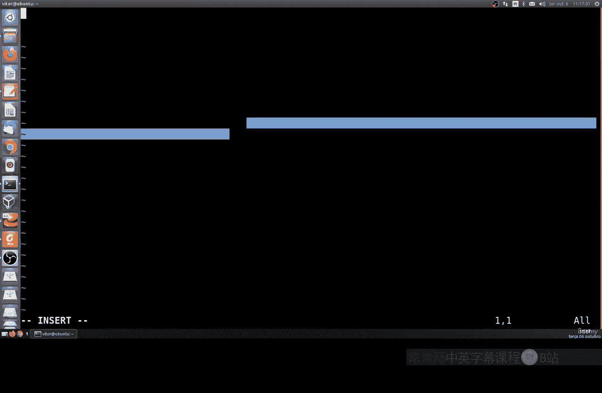

# 4. 切换到新建的非root用户
USER demo-user

# 5. 以该用户身份执行命令
CMD ["cat", "/secret/top-secret.txt"]
```

关键修改点在于：
*   `groupadd -g 3000 demogroup`：在容器内创建了一个GID为3000的新组。
*   `useradd -u 4000 -g demogroup demo-user`：创建了一个UID为4000的新用户，并指定其主组为`demogroup`。
*   `USER demo-user`：指定后续命令以`demo-user`用户身份执行。

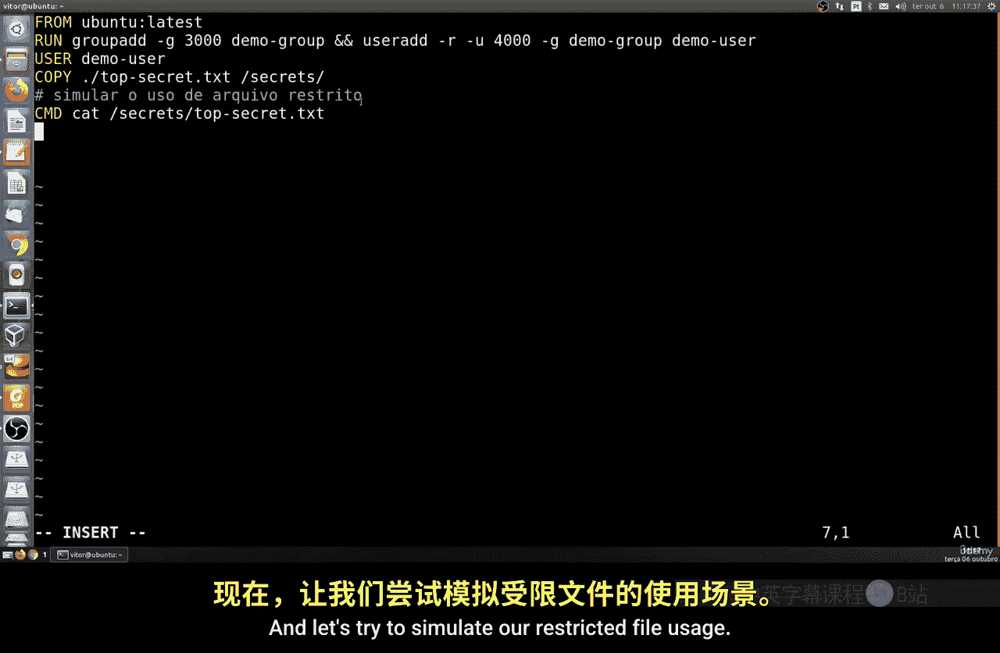

---

### 验证安全配置

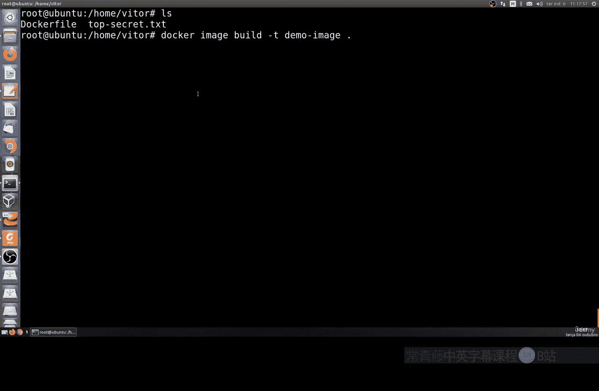

现在，让我们验证新的安全配置是否生效。

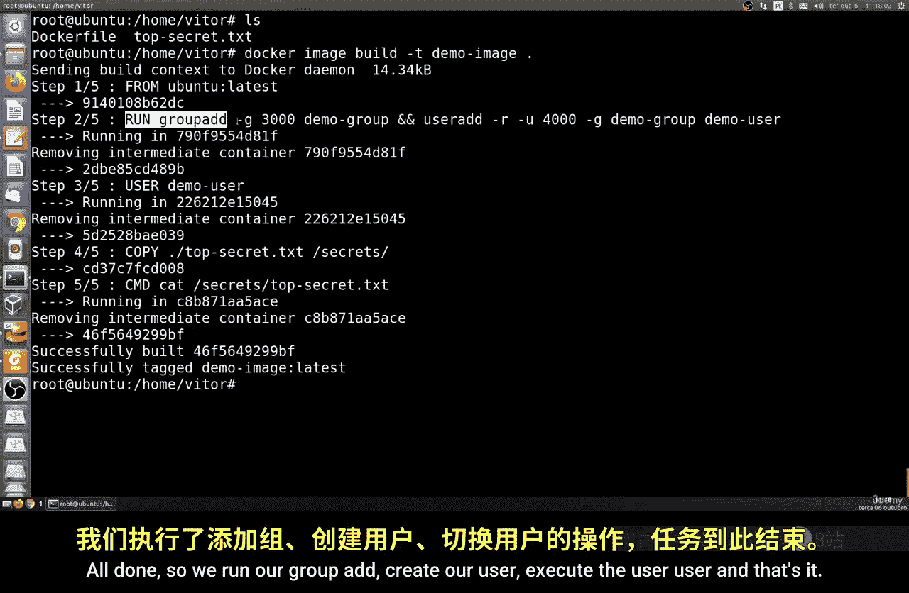

首先，由`root`用户重新构建Docker镜像：

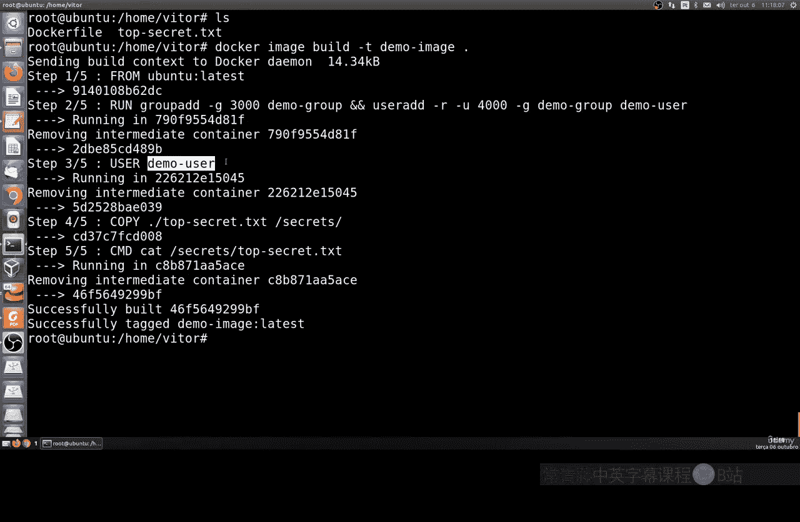

```bash
sudo su -
docker build -t test-secure .
exit
```

然后，用户`victor`尝试运行新的安全容器：

```bash
docker run --rm -v $(pwd)/top-secret.txt:/secret/top-secret.txt test-secure
```

此时，命令执行会失败，并提示`Permission denied`。因为容器内的进程现在是以`demo-user`（UID 4000）运行，而宿主机上的`top-secret.txt`文件只允许`root`（UID 0）访问，权限无法匹配，从而成功阻止了未授权访问。

---

### 总结

本节课中我们一起学习了Docker容器安全的一个重要方面：避免以非root用户运行容器时绕过宿主机的文件权限。

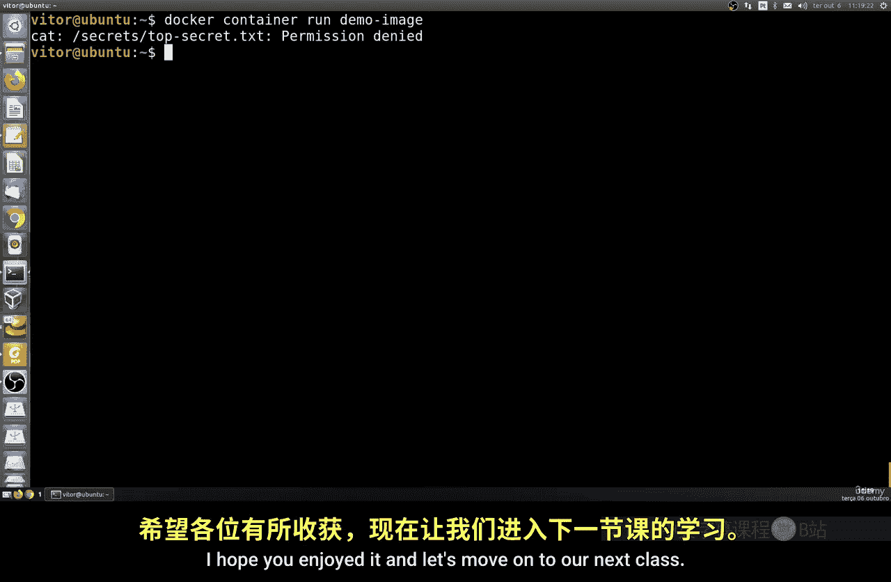

我们首先看到了不安全的做法如何导致权限漏洞，然后通过修改`Dockerfile`，实现了在容器内部创建和使用专用的非root用户（`demo-user`）来运行应用。这种做法确保了容器进程的权限被严格限制在其内部，无法越权访问宿主机的受保护资源，是保障Docker部署安全性的核心实践之一。