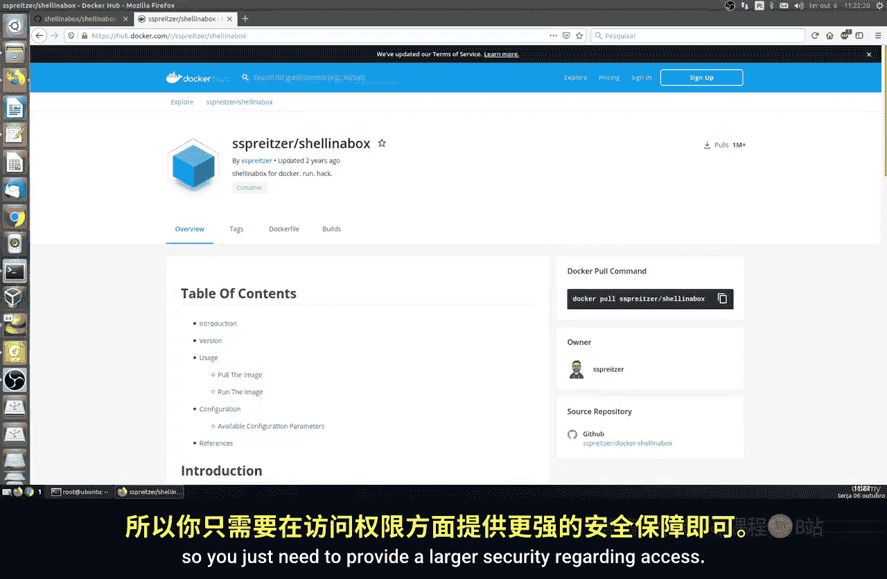
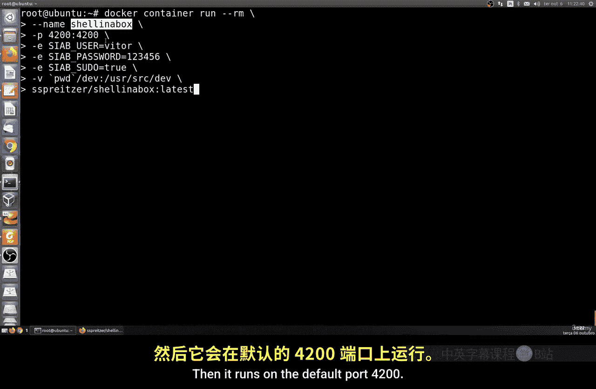
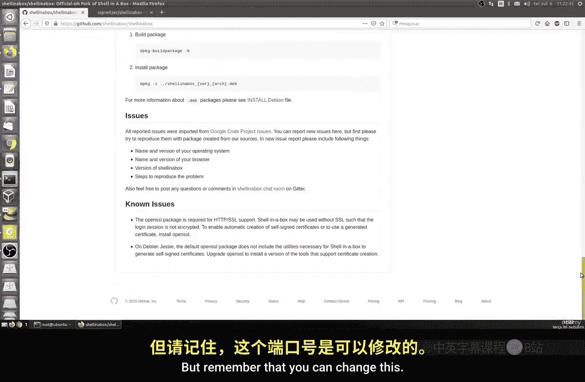
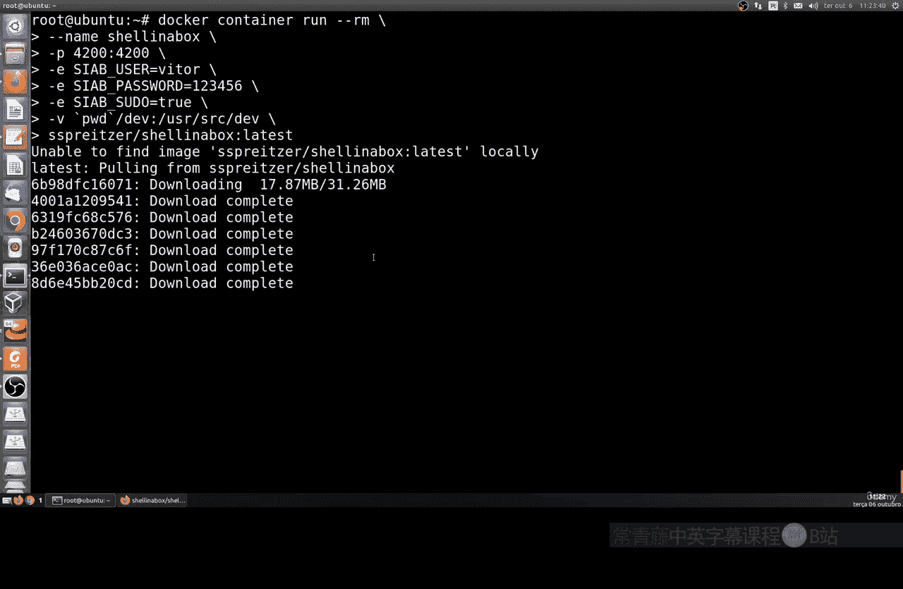
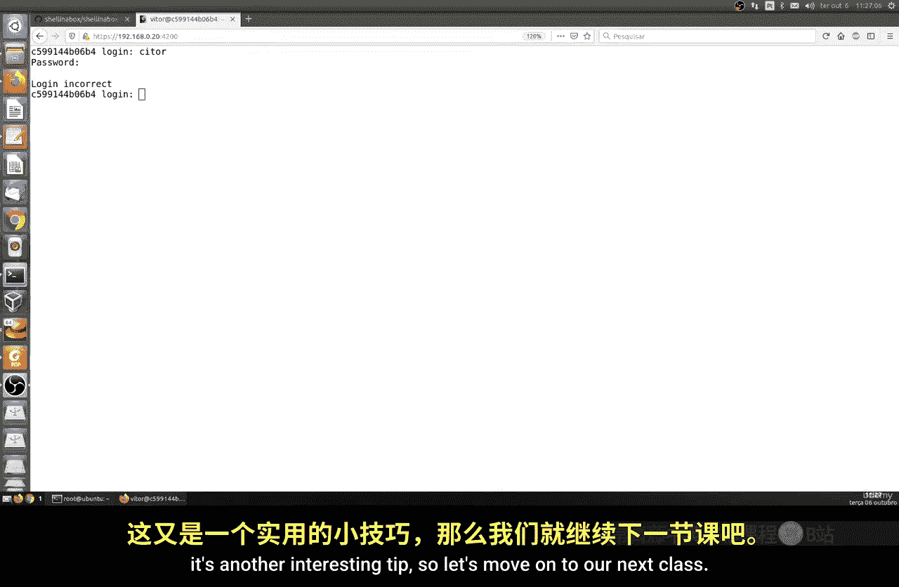

# 178：在Shell-in-a-Box中使用Docker 🐳

在本节课中，我们将学习如何通过浏览器使用Docker，具体方法是运行一个名为Shell-in-aBox的免费开源工具。这为不习惯使用终端或需要更便捷访问方式的用户提供了另一种选择。

## 概述

有时，通过终端工作可能不够方便。通过浏览器访问Docker环境则更为实用。为此，我们可以使用GitHub上完全免费开源的**Shell-in-a-Box**程序。它提供了预配置的Docker镜像，简化了使用流程。

## 获取与运行容器

上一节我们介绍了Docker的基本概念，本节中我们来看看如何运行Shell-in-a-Box容器。其官方镜像托管在Docker Hub上，使用起来非常简单。



运行容器的命令如下：
```bash
docker container run -d --name shellinabox -p 4200:4200 sspreitzer/shellinabox
```



以下是命令解析：
*   `docker container run -d`: 在后台运行一个新的容器。
*   `--name shellinabox`: 将容器命名为“shellinabox”。
*   `-p 4200:4200`: 将容器的4200端口映射到主机的4200端口。
*   `sspreitzer/shellinabox`: 指定使用的镜像名称。



该镜像基于Ubuntu LTS系统，且已预配置了SSL证书，默认通过HTTPS的4200端口提供服务。

## 访问与登录

容器运行后，即可通过浏览器访问。在地址栏输入 `https://<你的服务器IP>:4200`。



首次访问时，浏览器可能会提示安全风险，这是因为使用了自签名证书。选择“接受风险并继续”即可。

随后，你会看到登录界面。你需要使用在运行容器时设置的用户名和密码进行登录。例如，在运行命令中指定：
```bash
-e USER=vitormazuco -e PASSWORD=123456
```
（请注意，示例密码过于简单，实际使用时请设置强密码。）

如果输入错误的用户名或密码，系统会提示登录错误。

## 在浏览器中使用Shell

成功登录后，你将进入一个在浏览器中运行的Shell界面。现在，你可以像在本地终端一样执行命令。

例如，你可以运行系统更新和安装软件：
```bash
sudo apt update
sudo apt install vim
```

这个Web终端提供了一些便捷功能：
*   右键点击会弹出菜单，支持**复制**和**粘贴**文本。
*   界面中通常还包含一些安全选项，例如**注销**按钮，可以让你安全退出当前会话。

这意味着你可以完全通过浏览器来管理和操作这个Docker容器中的Ubuntu系统。

## 总结



本节课中我们一起学习了如何利用Shell-in-a-Box工具，通过网页浏览器来访问和操作Docker容器。这种方法避免了直接使用终端，提供了跨浏览器的便捷访问方式（兼容Chrome、Firefox等），在特定场景下非常实用。我们完成了从拉取镜像、运行容器到通过HTTPS登录并执行命令的完整流程。