# 179：使用桥接网络 🌉

在本节课中，我们将要学习Docker中关于网络配置的基础知识，特别是桥接网络的工作原理和操作方法。

## 概述

Docker的网络功能基于Linux系统的桥接技术。默认情况下，安装Docker后，系统会自动创建一个名为`docker0`的虚拟网络接口，用于容器间的通信。本节将详细介绍如何查看、创建和管理Docker的桥接网络。

## Docker默认桥接网络

上一节我们介绍了Docker的基本概念，本节中我们来看看其网络基础。在Linux机器上，可以通过`ip addr show`命令查看网络接口。你会发现一个名为`docker0`的网络接口被创建。

这是所有Linux系统的标准配置。该接口拥有一个唯一的MAC地址和一个IP地址，默认为`172.17.0.1`。默认情况下，它只启用IPv4，但也可以配置启用IPv6。

要验证Docker中是否真的有这种类型的桥接网络，可以使用`docker network ls`命令列出所有网络接口。

以下是命令输出示例：
```bash
$ docker network ls
NETWORK ID     NAME      DRIVER    SCOPE
abc123def456   bridge    bridge    local
789ghi012jkl   host      host      local
345mno678pqr   none      null      local
```
列表中第一个网络通常名为`bridge`。此外，还有`host`和`none`等其他类型的网络配置。在后续学习Docker Swarm时，还会看到其他类型的网络。

## 桥接网络详细信息

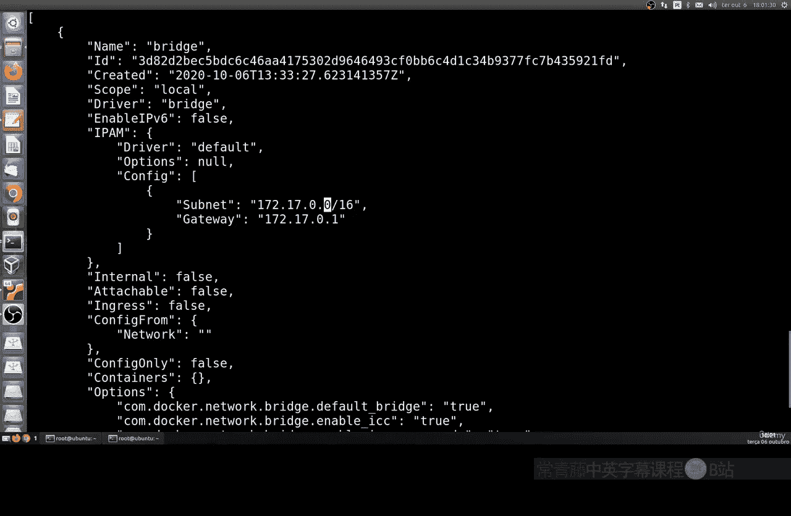

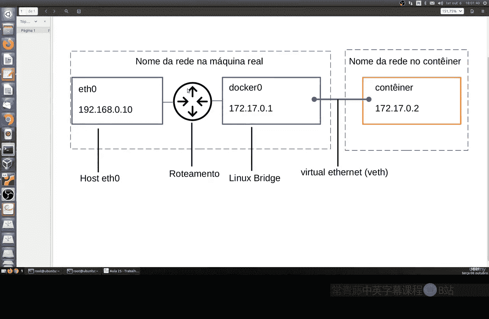

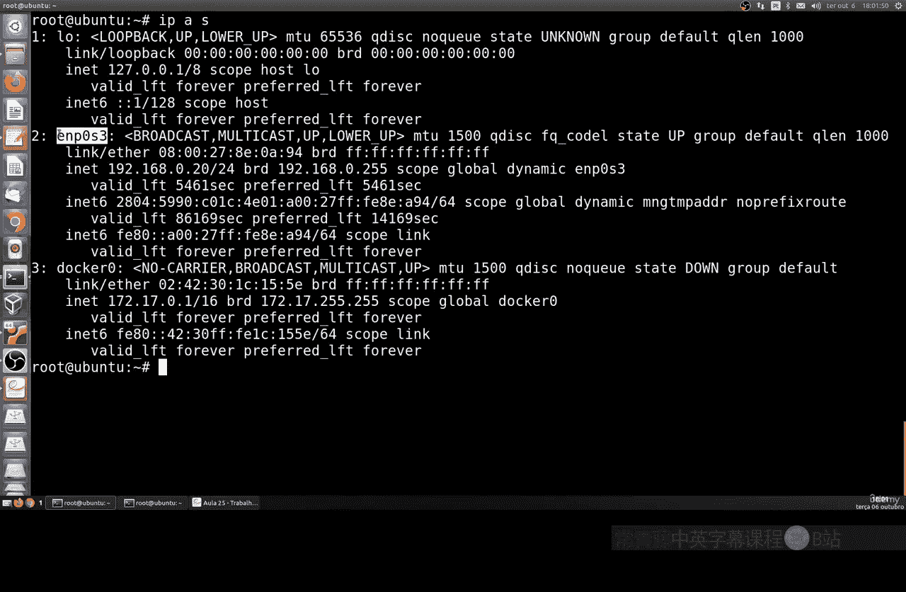

我们可以使用`docker network inspect bridge`命令来查看默认桥接网络的详细信息。这个命令会输出大量信息。

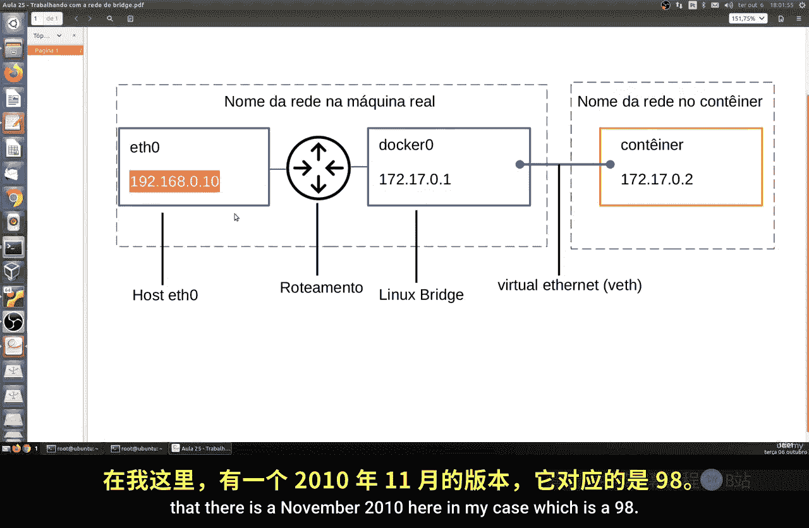

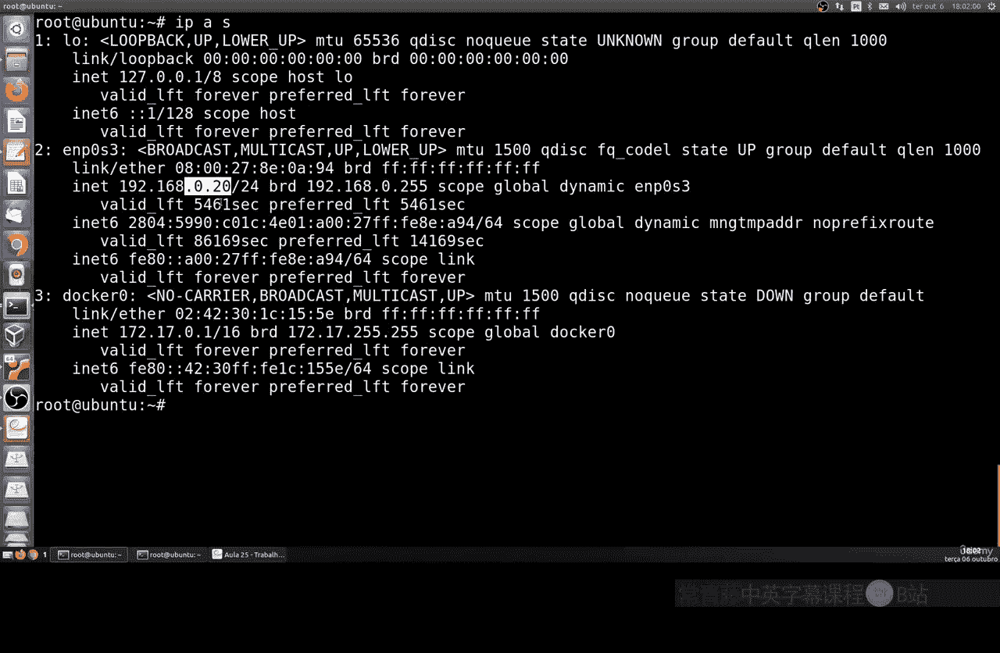

以下是关键信息片段：
*   **名称**：网络名称。
*   **ID**：网络唯一标识符。
*   **创建时间**：网络创建的时间。
*   **作用域**：网络覆盖的范围。
*   **驱动程序**：网络驱动类型，这里是`bridge`。
*   **IPv6**：通常默认未启用。
*   **IPAM配置**：包含子网和网关信息。例如，IP地址为`172.17.0.0/16`，网关为`172.17.0.1`。

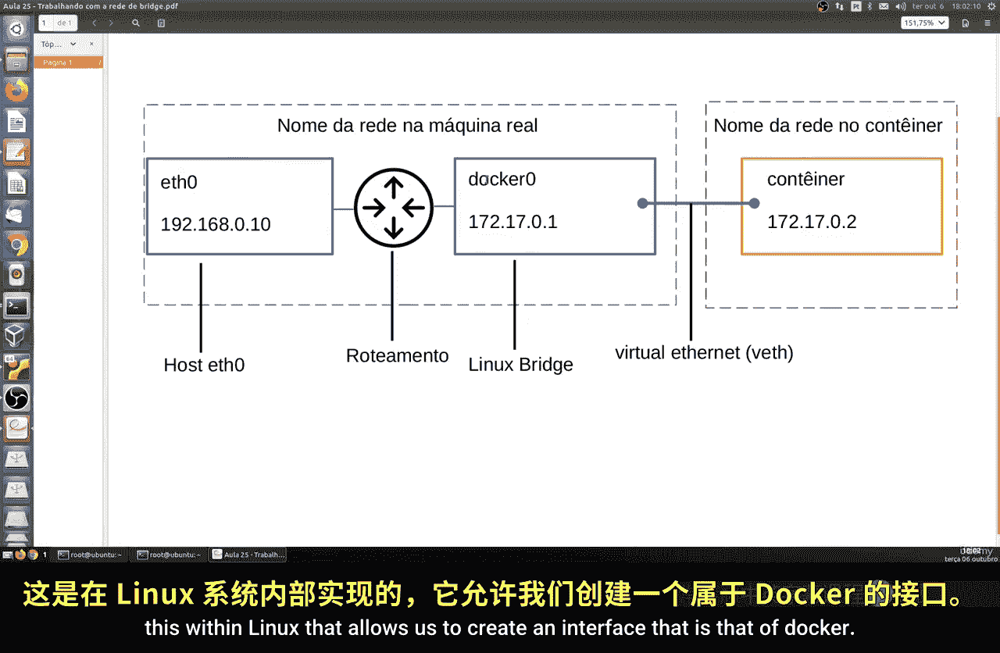

网关地址`172.17.0.1`是容器访问外部网络（例如更新软件包）的路由指向。容器通常会从`172.17.0.2`开始分配IP地址，直到`172.17.0.254`。


## 网络工作原理图解

为了理解网络如何工作，可以参考以下示意图。


如图所示，我们有真实的Linux主机（例如IP为`192.168.0.20`的`eth0`接口）。Linux内部的路由机制允许我们创建Docker接口（`docker0`，IP为`172.17.0.1`），这个接口就是容器的网关。容器IP则从`172.17.0.2`开始分配。

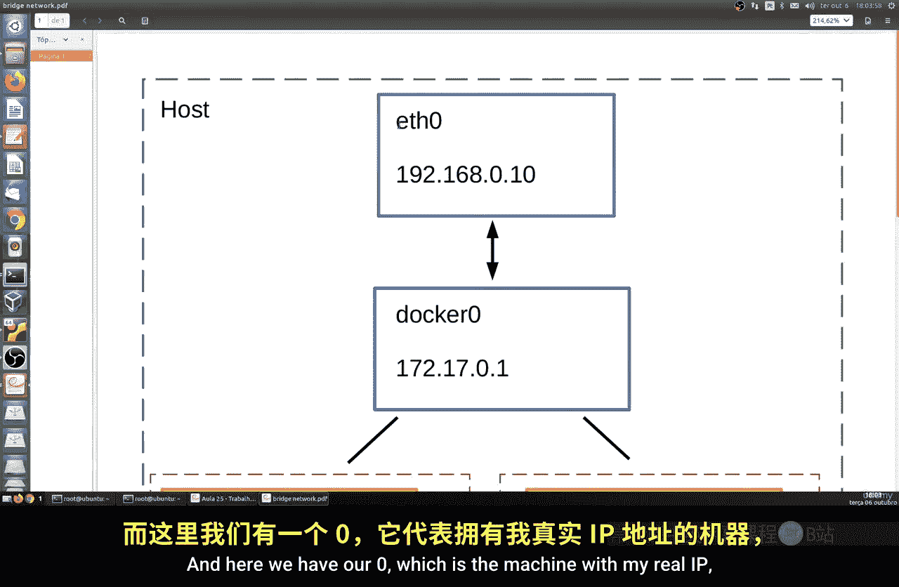

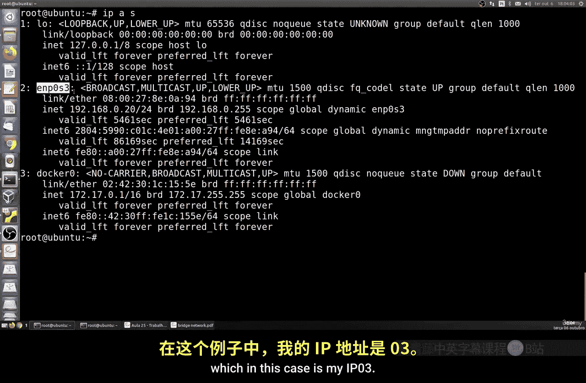

默认情况下，所有从容器到外部网络的出站流量都是允许的，但所有入站流量都被阻止，这类似于防火墙的工作方式。

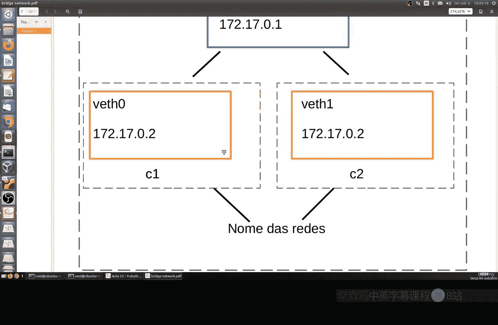

另一张图提供了更多细节。


图中展示了容器（如`172.17.0.2`的容器A和`172.17.0.3`的容器B）、Docker接口（`docker0`，`172.17.0.1`）以及真实主机接口（`eth0`，`192.168.0.20`）之间的关系。


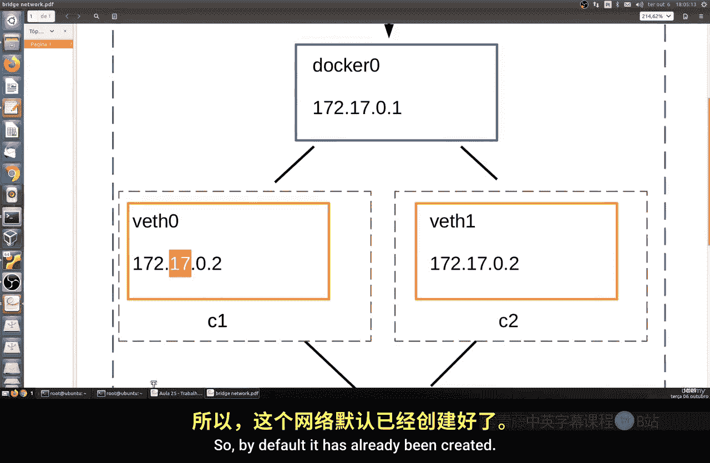

## 创建自定义桥接网络

默认配置已经可以工作，但我们也可以进行自定义。接下来，让我们创建一个新的桥接网络。

使用命令`docker network create --driver bridge simple-net`可以创建一个名为`simple-net`的新桥接网络。网络名称可以任意指定。

创建后，可以使用`docker network inspect simple-net`来检查这个新网络。你会发现它创建了一个新的子网，例如`172.18.0.0/16`。如果继续创建，后续网络可能会是`172.19.0.0/16`，依此类推。

你还可以在创建时指定子网。例如，使用命令`docker network create --driver bridge --subnet 10.0.1.0/24 test-net`可以创建一个使用`10.0.1.0/24`子网、名为`test-net`的网络。

## 将容器连接到网络

现在，如果我们想创建一个容器并让它运行在特定的网络上，可以这样做。

使用命令`docker run -it --name c1 --network test-net alpine sh`可以创建一个名为`c1`的Alpine Linux容器，并将其连接到`test-net`网络。

要查看容器的网络配置，可以在另一个终端执行`docker container inspect c1`。在输出的`NetworkSettings`部分，可以找到IP地址（例如`10.0.1.2`）、网关（`10.0.1.1`）和MAC地址等信息。

我们也可以使用`ip addr show`命令在容器内部查看网络接口信息。

## 容器间通信测试

为了测试容器间的路由通信，让我们打开另一个终端，创建第二个容器。

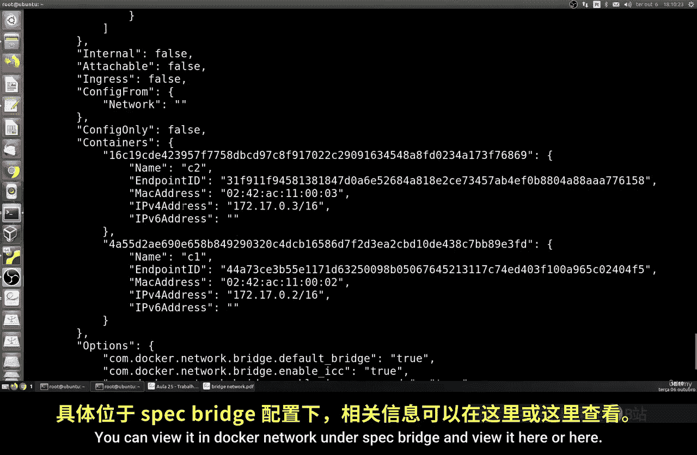

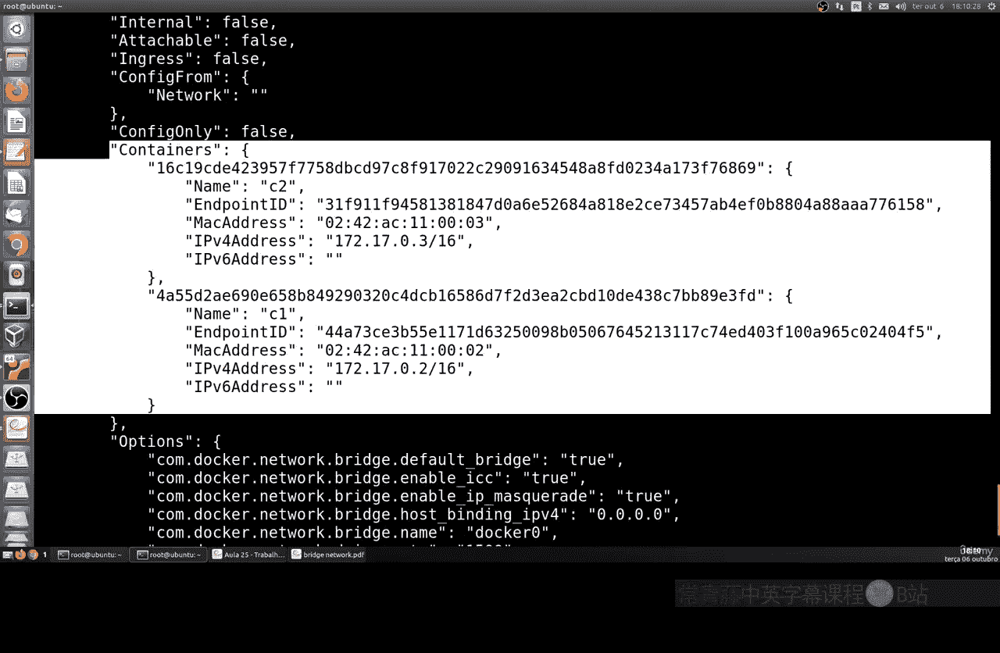

执行命令`docker run -it --name c2 --network test-net alpine sh`创建容器`c2`。通过`docker container inspect c2`查看其IP地址，例如`10.0.1.3`。

由于`c1`（`10.0.1.2`）和`c2`（`10.0.1.3`）在同一网络（`test-net`）上，理论上它们应该能够通信。你可以进入`c1`容器，执行`ping 10.0.1.3`来测试，通信应该成功。

你也可以通过`docker network inspect test-net`命令，在输出的`Containers`部分看到这两个容器及其IP地址。

现在，让我们创建另一个使用不同网络的容器。执行`docker run -it --name c3 --network bridge alpine sh`创建容器`c3`，它连接的是默认的`bridge`网络。

如果你尝试从`c1`（在`test-net`网络）去`ping c3`（在`bridge`网络），通信将会失败。因为它们处于不同的网络，存在一层隔离，不同网络上的容器默认不能直接通信。

## 删除网络

最后，如果你想要删除一个网络，可以使用`docker network rm [网络名称]`命令。

但是，如果网络中有活动的容器（端点），则无法直接删除。你必须先停止并删除所有使用该网络的容器，然后才能成功删除网络本身。


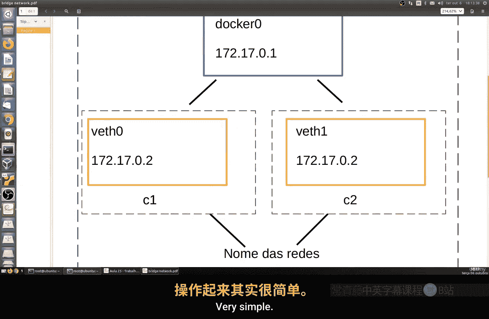

## 总结


本节课中我们一起学习了Docker桥接网络的基础知识。我们了解了默认`docker0`桥接网络的工作原理，学习了如何查看网络详情、创建自定义桥接网络、将容器连接到指定网络，以及测试容器间的通信。理解这些是掌握更复杂Docker网络配置的第一步。后续课程将继续深入探讨Docker网络的其他方面。