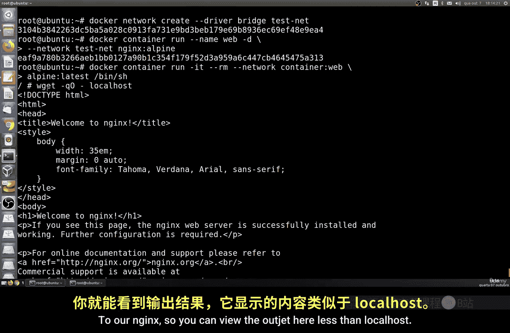
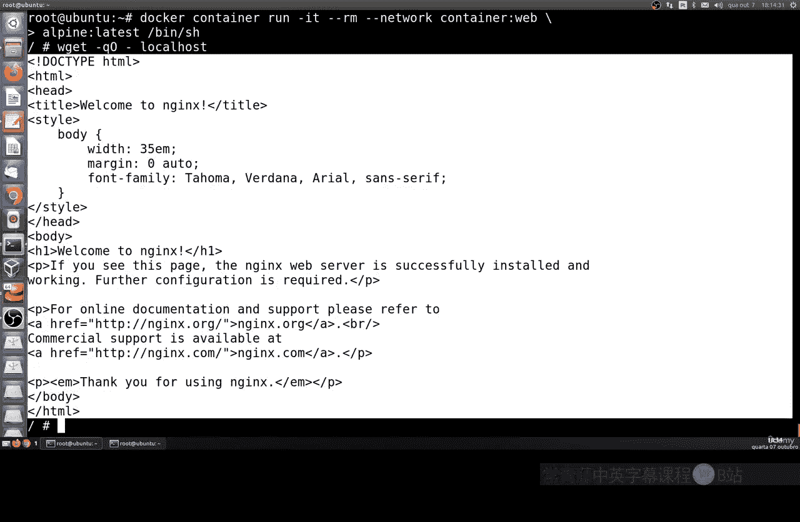
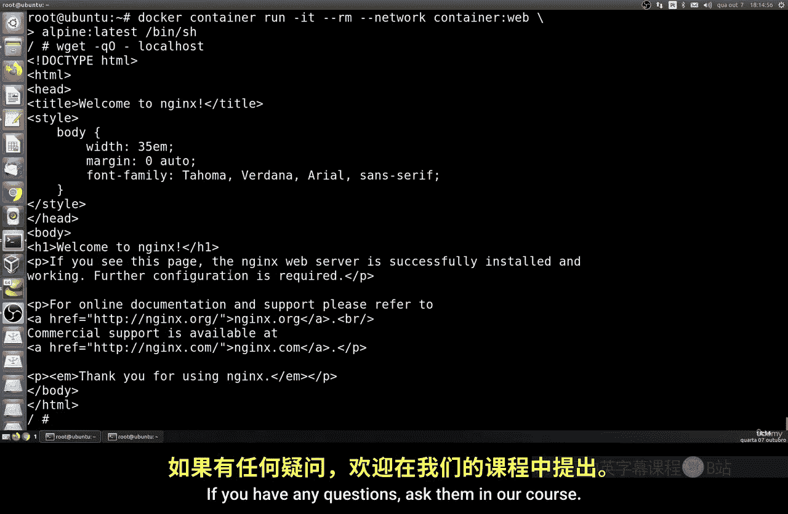

# 180：Docker网络隔离与共享

在本节课中，我们将要学习Docker容器的网络配置。我们将探讨如何运行一个完全与网络隔离的容器，以及如何让多个容器共享同一个网络命名空间。这些技术对于构建安全或需要内部通信的应用环境非常有用。

## 🚫 主机与空网络

上一节我们介绍了Docker的基本网络连接，本节中我们来看看如何运行一个没有任何网络连接的容器。这在某些需要更高安全性的环境中是可能的，特别是当你希望容器完全不连接互联网时。

首先，让我们回顾如何将容器连接到我们的网络。我们可以使用以下命令：

```bash
docker run --network <网络名称> <镜像名称>
```

例如，使用名为 `runermidor` 的网络和镜像。执行后，你可以查看容器的网络配置，它会获得一个IP地址，无论是IPv4还是IPv6。

然而，有时我们需要运行一些完全不需要任何网络连接的服务。这时，最佳实践是将容器连接到一个没有任何配置的网络。在Docker中，我们称之为 `none` 网络。

以下是具体操作步骤：

1.  运行一个连接到 `none` 网络的容器。
2.  使用命令查看容器内部的网络接口。

具体命令如下：
```bash
docker run --network none <镜像名称>
```
按下回车后，容器会正常启动。但如果你进入容器内部查看网络，会发现除了一个必须存在的内部回环接口（loopback）外，没有任何有效的网络接口。

为了验证这一点，你可以在容器内尝试查看IP地址：
```bash
ip addr show
```
或者
```bash
ifconfig
```
这个命令不会显示任何IPv4或IPv6地址，只会提示错误或没有输出。这证明了我们的容器是在没有任何网络连接的情况下运行的。

## 🔗 共享网络命名空间

接下来，我们看看如何让多个容器共享同一个网络命名空间。这意味着它们将处于同一个网络“环境”中，可以直接通过本地主机地址进行通信。

要实现这一点，我们需要先创建一个新的桥接网络，然后运行第一个容器并连接到这个网络。之后，我们可以运行第二个容器，并指定它使用第一个容器的网络命名空间。

以下是实现共享网络命名空间的步骤：

1.  创建一个新的桥接网络。
2.  运行第一个容器（例如一个Web服务器）并连接到新创建的网络。
3.  运行第二个容器，并指定其网络命名空间与第一个容器相同。

具体操作命令如下：
```bash
# 1. 创建新网络
docker network create --driver bridge techne

# 2. 运行第一个容器（例如Nginx）并连接到techne网络
docker run -d --name web --network techne nginx:alpine

# 3. 运行第二个容器，并共享‘web’容器的网络命名空间
docker run -it --network container:web alpine sh
```

执行以上命令后，第二个容器（Alpine）就与第一个容器（Nginx）共享了同一个网络命名空间。为了证明它们可以通信，你可以在第二个容器中尝试访问Nginx服务。



在第二个容器的Shell中，运行：
```bash
wget -qO- localhost
```
如果配置成功，这个命令会返回Nginx服务器的默认欢迎页面内容。这证明了我们的Web服务器正在运行，并且第二个容器可以通过 `localhost` 直接访问它。



这个过程展示了如何将一个容器的网络索引到另一个已存在的Docker容器的网络环境中。

---



本节课中我们一起学习了Docker网络的两个高级主题：如何运行完全网络隔离的容器，以及如何配置多个容器共享同一个网络命名空间。掌握这些知识有助于你根据应用需求，灵活地构建安全或内部互联的容器化环境。