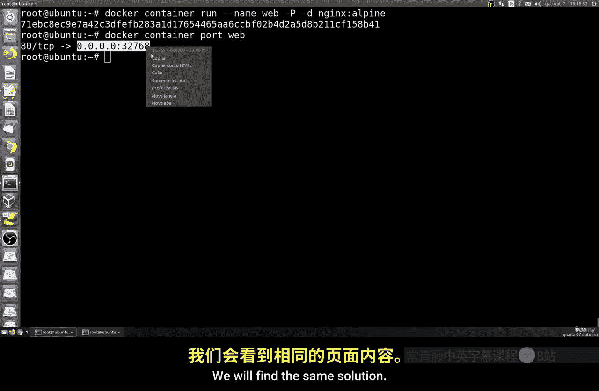
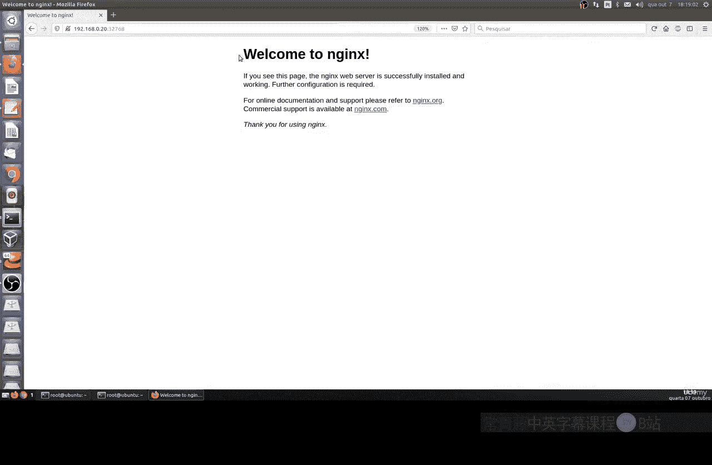
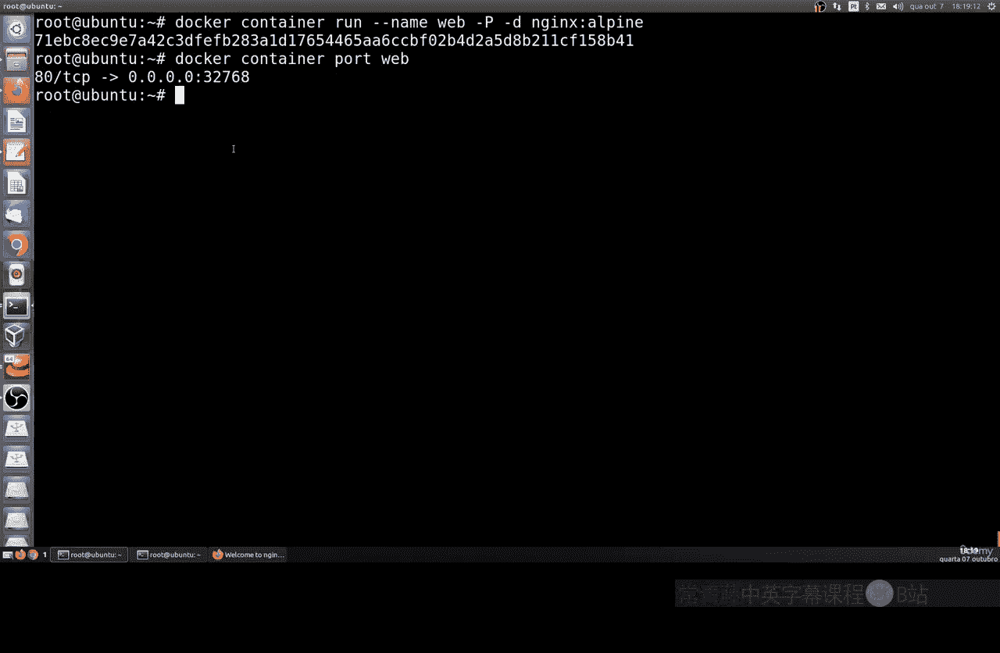
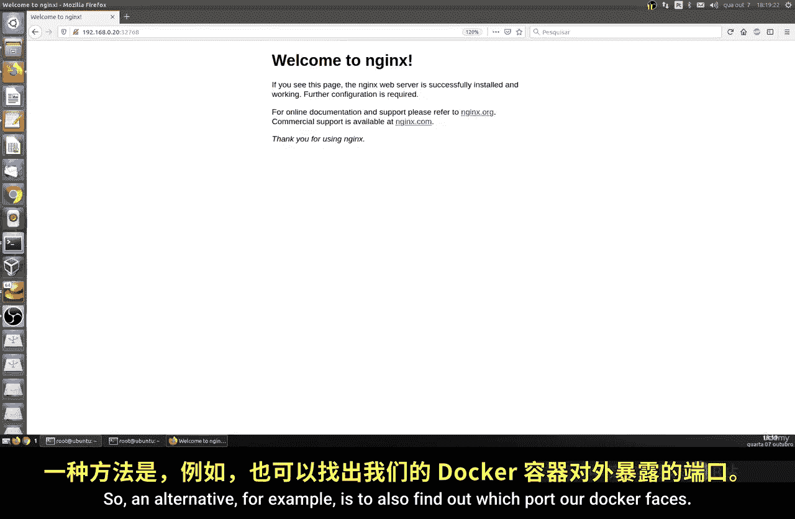
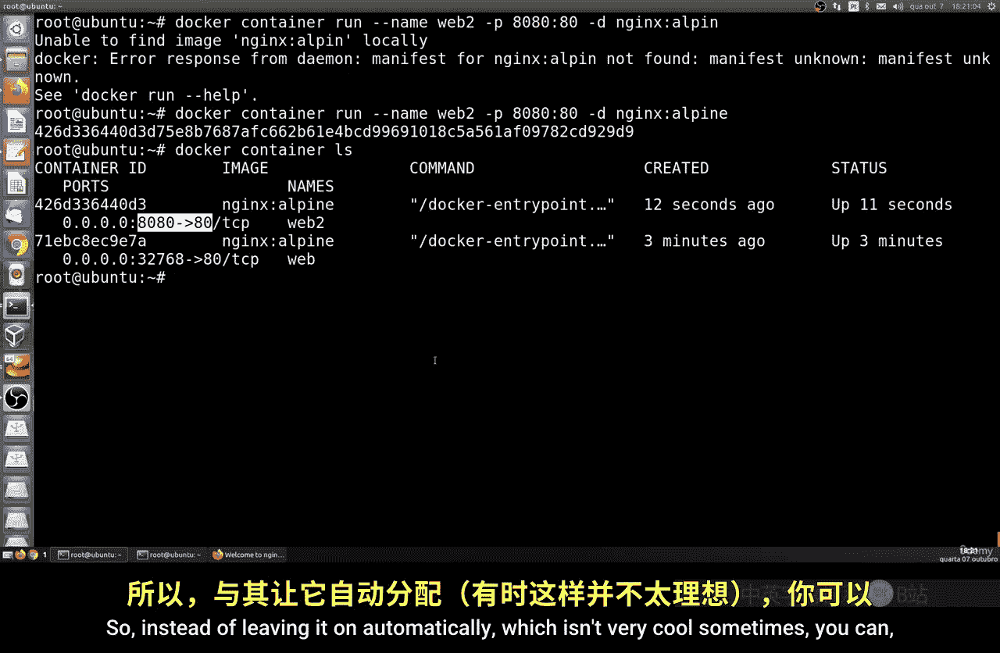
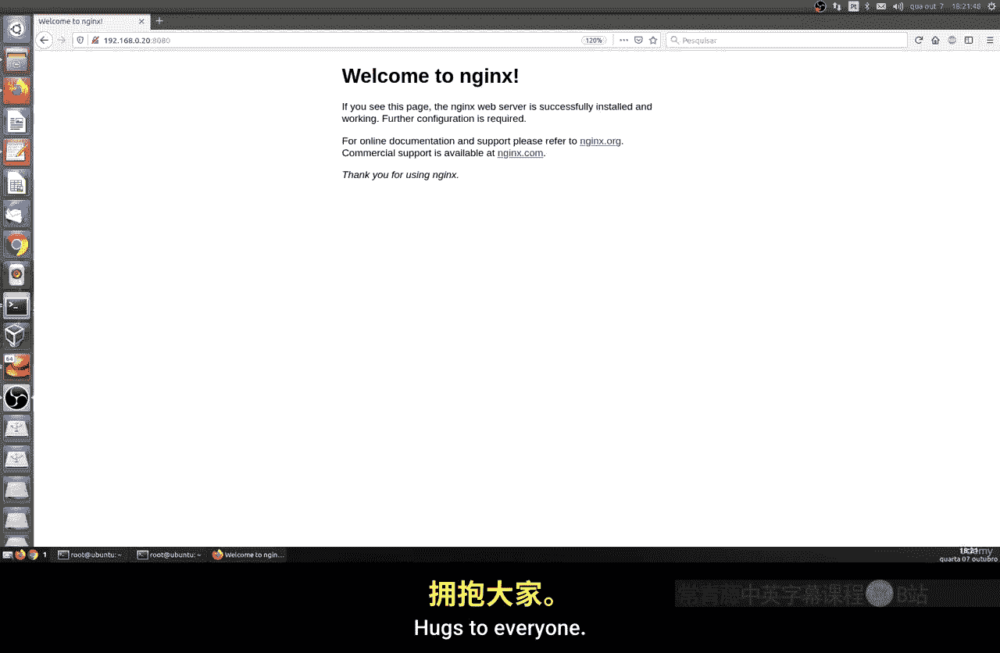

# 181：在Docker中配置端口映射 🐳

在本节课中，我们将学习如何在Docker中配置端口映射。端口映射允许我们将容器内部的服务端口映射到宿主机的不同端口上，从而实现服务的访问和网络隔离。

上一节我们介绍了Docker的基本操作，本节中我们来看看如何管理容器的网络端口。

## 端口映射的基本概念

Docker容器默认运行在隔离的网络环境中。为了让宿主机或外部网络能够访问容器内运行的服务，我们需要进行端口映射。其核心概念是建立一个映射关系：`宿主机端口:容器端口`。

例如，一个标准的Nginx容器在内部监听**80**端口。如果我们希望从宿主机的**8080**端口访问它，就需要建立映射 `8080:80`。

## 查看自动端口映射

当我们运行容器而不指定端口时，Docker会随机分配一个宿主机端口。

以下是创建一个名为`web`的Nginx容器并查看其端口映射的步骤：



1.  运行一个标准的Nginx容器。
    ```bash
    docker run -d --name web nginx:alpine
    ```
2.  使用`docker ps`命令查看容器状态和端口映射。
    ```bash
    docker ps
    ```
    在输出中，你可以看到类似 `0.0.0.0:32768->80/tcp` 的信息。这表示容器的80端口被映射到了宿主机的32768端口。
3.  在浏览器中访问 `http://localhost:32768`，即可看到Nginx的默认欢迎页面。



## 如何查找容器的映射端口



除了`docker ps`，还有几种方法可以查找容器的端口映射信息。



以下是三种常用的方法：

*   **使用 `docker port` 命令**：此命令专门用于列出容器的端口映射。
    ```bash
    docker port web
    ```
*   **使用 `docker inspect` 配合 `grep` 过滤**：`inspect`命令提供容器的详细信息，我们可以用`grep`筛选出端口部分。
    ```bash
    docker inspect web | grep -i port
    ```
*   **使用 `docker container ls` 命令**：这是`docker ps`的另一种写法，功能相同。
    ```bash
    docker container ls
    ```

## 手动指定端口映射

自动分配的端口不易记忆和管理。更常见的做法是手动指定映射关系。

我们可以使用 `-p` 参数来手动设置端口映射。其语法为 `-p <宿主机端口>:<容器端口>`。

例如，将Nginx容器的80端口映射到宿主机的8080端口：

```bash
docker run -d --name web2 -p 8080:80 nginx:alpine
```

运行后，使用 `docker ps` 确认映射已建立。现在，你可以在浏览器中通过 `http://localhost:8080` 访问Nginx服务。



## 总结

本节课中我们一起学习了Docker端口映射的核心操作。我们首先了解了端口映射的必要性，然后学习了如何查看Docker自动分配的端口。接着，我们探索了三种查找容器端口信息的方法。最后，我们掌握了如何使用 `-p` 参数手动指定端口映射，从而更灵活地控制服务的访问方式。



通过端口映射，我们可以轻松地将容器内的服务暴露给外部网络，这是使用Docker部署应用的关键步骤之一。