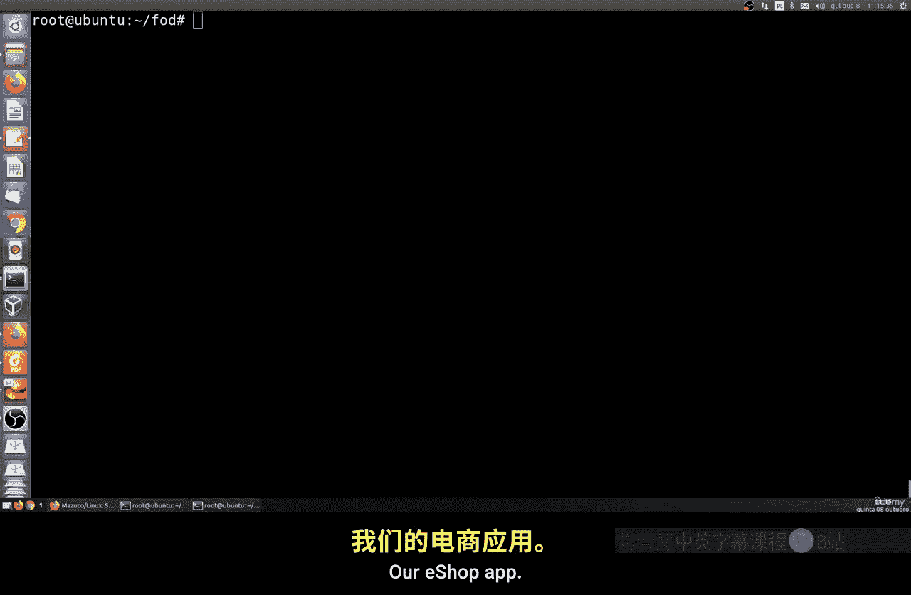
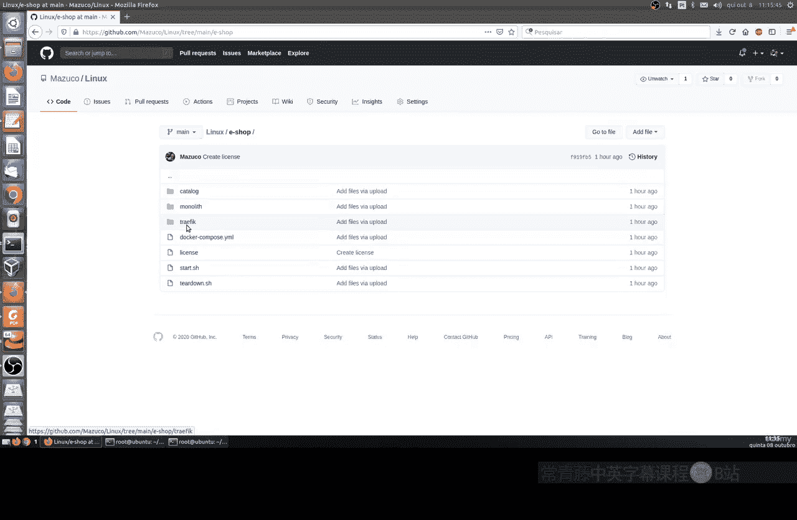
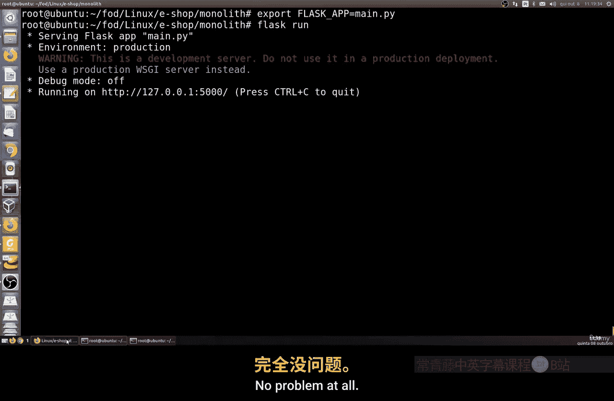
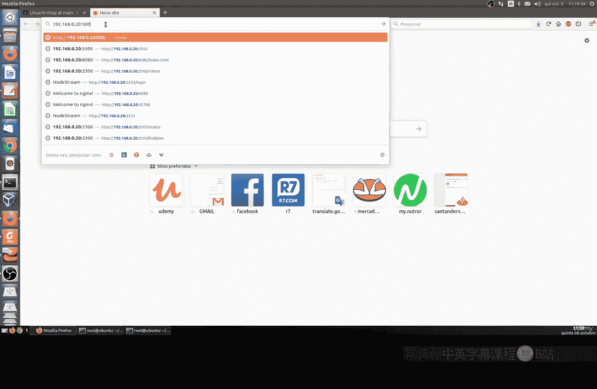
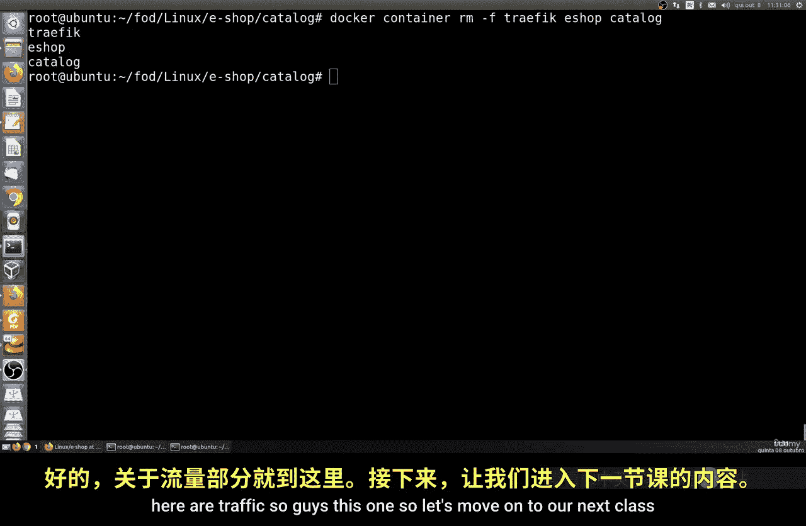

# 182：在Docker中部署REST API单体应用 🐳

在本节课中，我们将学习如何使用Docker容器化一个简单的REST API单体应用。我们将分别使用Python Flask和Node.js来构建应用，并通过Docker运行它们。

---



## 概述



我们将从GitHub下载一个示例应用，该应用包含两个部分：一个使用Python Flask编写的API和一个使用Node.js编写的API。我们将学习如何在本地运行这些应用，然后使用Docker将它们容器化并运行。最后，我们会配置路由，使应用可以通过特定域名和端口访问。

---

## 下载项目

首先，我们需要从GitHub克隆项目仓库到本地Linux系统。

以下是克隆仓库的命令：
```bash
git clone <仓库地址>
```
克隆完成后，进入项目目录。

---

## 使用Python Flask运行应用



上一节我们下载了项目，本节中我们来看看如何使用Python Flask运行其中的一个应用。



项目包含一个名为`Traffic and Cata Monolithic`的目录。进入该目录，我们将在此工作。

首先，需要安装Python 3和Pip。如果系统未安装，可以使用以下命令安装：
```bash
apt install python3 pip
```

接下来，安装项目所需的Python依赖。项目使用Flask框架。

以下是安装依赖的命令：
```bash
pip install -r requirements.txt
```
此命令会安装`requirements.txt`文件中列出的所有包，主要是Flask。

安装完成后，可以运行Flask应用。使用以下命令设置环境变量并启动应用：
```bash
export FLASK_APP=main.py
flask run
```
默认情况下，应用会运行在端口5000。你可以在浏览器或另一个终端中使用`curl`命令测试API。

以下是测试API的`curl`命令示例：
```bash
curl http://localhost:5000
```
此命令会返回一个JSON格式的产品列表，例如自行车信息，包含ID、类型、名称和价格。

为了模拟通过域名访问，我们可以编辑本地的`/etc/hosts`文件，添加一个指向本地主机的域名。例如：
```
127.0.0.1   example.com
```
之后，就可以使用`curl http://example.com:5000`来访问应用。

---

## 使用Docker容器化Flask应用

上一节我们介绍了如何在本地运行Flask应用，本节中我们来看看如何使用Docker将其容器化。

项目目录中包含一个`Dockerfile`文件。其内容基于`Alpine 3.7`镜像，并安装了Python 3.7和必要的依赖。

以下是`Dockerfile`的核心部分：
```dockerfile
FROM alpine:3.7
RUN apk add --no-cache python3 py3-pip
COPY . /app
WORKDIR /app
RUN pip3 install -r requirements.txt
EXPOSE 5000
CMD ["python3", "main.py"]
```

在终端中，进入包含`Dockerfile`的目录，执行以下命令来构建Docker镜像：
```bash
docker build -t flask-app .
```
构建完成后，运行容器：
```bash
docker run -p 5000:5000 --name my-flask-app flask-app
```
现在，应用已在Docker容器中运行。同样可以使用`curl http://localhost:5000`进行测试，结果应与本地运行一致。

---

## 使用Node.js运行另一个应用

除了Flask应用，项目还包含一个使用Node.js编写的应用。现在我们来查看并运行它。

进入项目中的`catalog`目录。这里有一个用于Node.js应用的`Dockerfile`。

以下是Node.js应用的`Dockerfile`示例：
```dockerfile
FROM node:alpine
COPY . /app
WORKDIR /app
RUN npm install
EXPOSE 3000
CMD ["node", "server.js"]
```

首先，在本地运行Node.js应用。确保已安装Node.js和npm，然后运行：
```bash
npm install
node server.js
```
应用将运行在端口3000。使用`curl http://localhost:3000`进行测试。

---

## 使用Docker容器化Node.js应用

现在，我们使用Docker来运行这个Node.js应用。

在`catalog`目录下，构建Docker镜像：
```bash
docker build -t node-app .
```
运行容器，并将主机的端口3000映射到容器的端口3000：
```bash
docker run -p 3000:3000 --name my-node-app node-app
```
测试应用是否正常运行：
```bash
curl http://localhost:3000
```

---

## 配置路由和端口转发

上一节我们成功运行了两个容器化的应用，本节中我们来看看如何通过配置路由，使用统一的端口（如80端口）来访问它们。

项目包含一个`traffic`目录，其中有路由配置示例。我们可以运行一个特定的容器来处理路由转发。

以下是运行路由容器的命令示例（具体命令需根据项目内的配置文件调整）：
```bash
docker run -d -p 80:80 -p 8080:8080 --name traefik -v /var/run/docker.sock:/var/run/docker.sock traefik:v2.4
```
此命令运行了一个Traefik容器，它是一个反向代理和负载均衡器，可以自动发现其他Docker容器并配置路由。

我们需要为之前运行的Flask和Node.js容器添加特定的标签（Labels），以便Traefik识别并将流量路由到它们。例如，对于Node.js应用容器，可以在`docker run`命令中添加：
```bash
--label "traefik.enable=true" --label "traefik.http.routers.catalog.rule=Host(\`example.com\`) && PathPrefix(\`/catalog\`)"
```
配置完成后，就可以通过`http://example.com`（默认80端口）访问到后端对应的应用。

测试路由配置：
```bash
curl http://example.com
```

---

## 清理环境

实验结束后，可以停止并移除所有创建的容器。

以下是停止和移除容器的命令：
```bash
docker stop my-flask-app my-node-app traefik
docker rm my-flask-app my-node-app traefik
```
如果需要，也可以删除构建的Docker镜像。

---

## 总结

本节课中我们一起学习了如何在Docker中部署REST API单体应用。我们完成了以下步骤：
1.  从GitHub克隆示例项目。
2.  在本地运行Python Flask和Node.js应用。
3.  分别为这两个应用创建Docker镜像并运行容器。
4.  使用Traefik配置路由规则，实现通过统一域名和端口访问不同的后端服务。



这种方法可以扩展到其他框架（如Django）和应用，利用Docker实现应用的快速部署、隔离和路由管理。