# 183：使用Docker Compose创建镜像 🐳

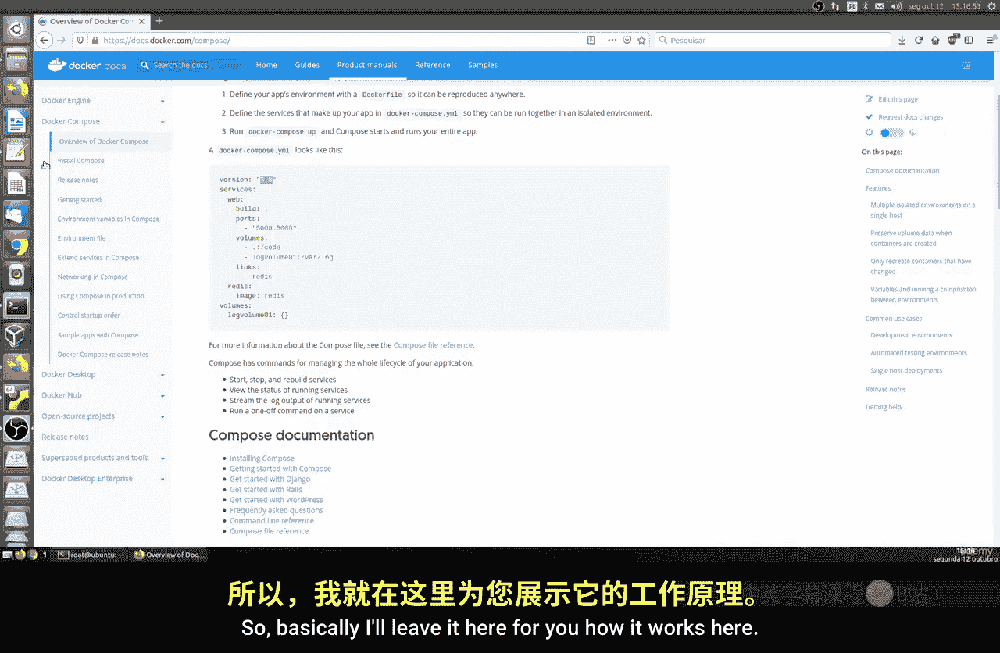

在本节课中，我们将要学习如何使用Docker Compose来创建和管理容器镜像。Docker Compose是一个用于定义和运行多容器Docker应用程序的工具，它通过一个YAML文件来配置应用的服务，使得容器编排变得简单高效。

## 概述

Docker Compose是Docker提供的一个工具，主要用于在单个主机上编排和运行容器。它支持持续集成、自动化测试和质量控制等多种用途。Docker Compose使用一个名为`docker-compose.yml`的YAML文件作为输入配置。

## Docker Compose文件结构

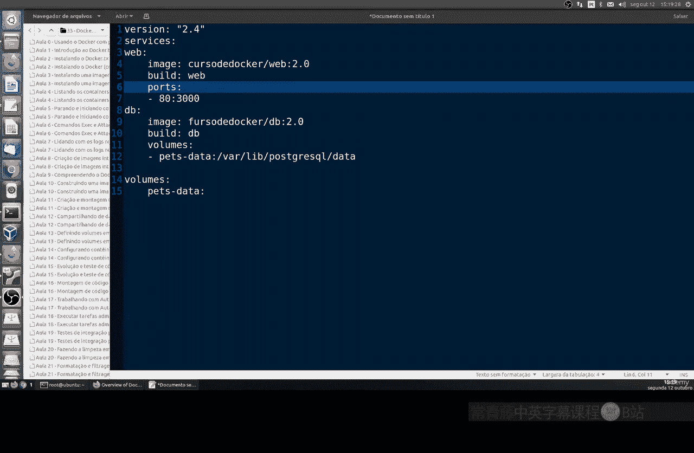

Docker Compose文件使用YAML格式，其核心结构围绕`services`、`networks`和`volumes`等部分展开。以下是一个基本示例：

```yaml
version: '3'
services:
  web:
    image: nginx:alpine
    ports:
      - "80:3000"
  db:
    image: postgres:12-alpine
    volumes:
      - db_data:/var/lib/postgresql/data
volumes:
  db_data:
```

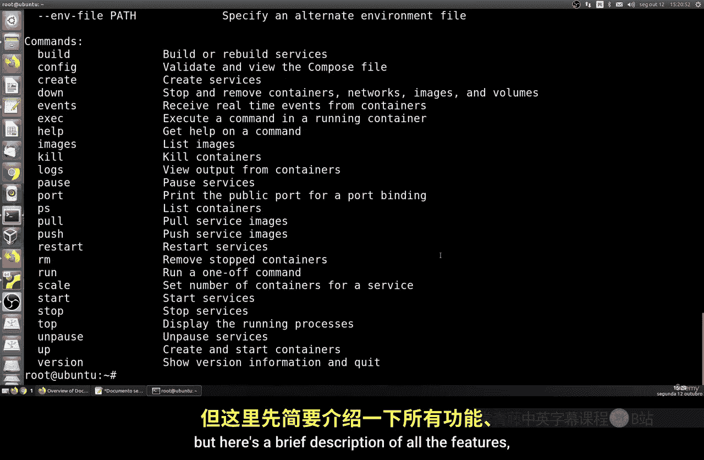

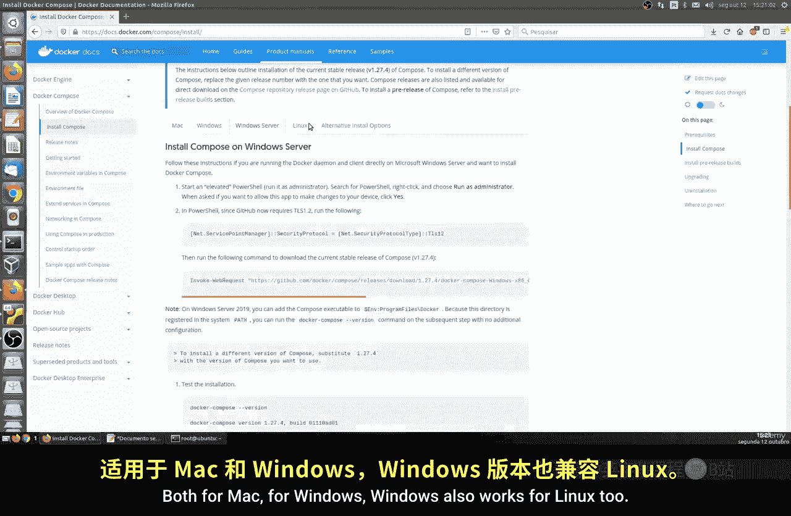

在这个配置中，我们定义了两个服务：一个名为`web`的Nginx服务和一个名为`db`的PostgreSQL数据库服务。`ports`配置将容器的3000端口映射到主机的80端口，`volumes`配置用于持久化数据库数据。

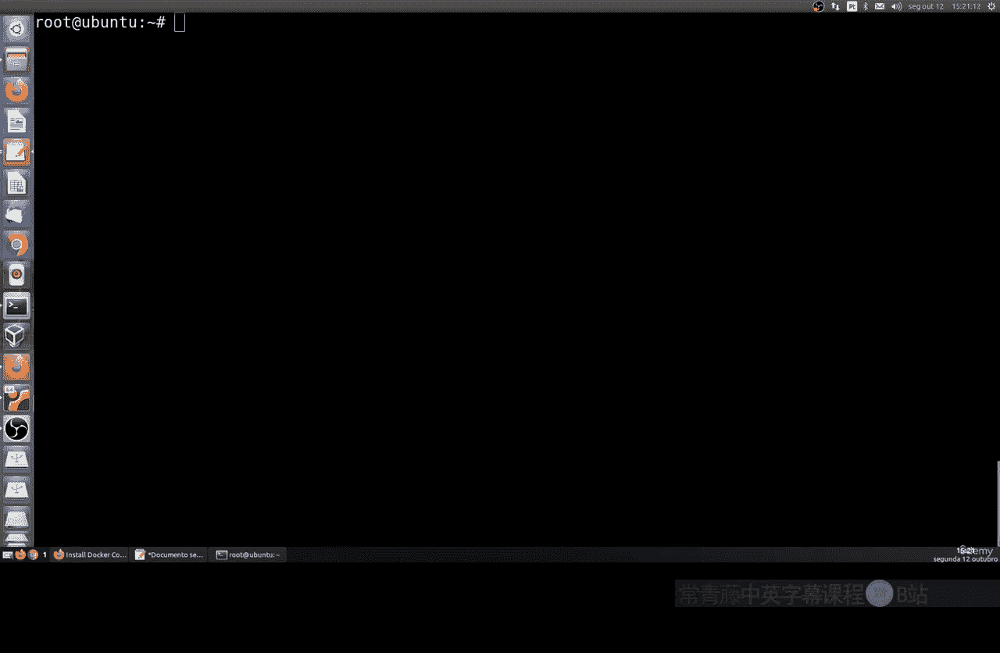

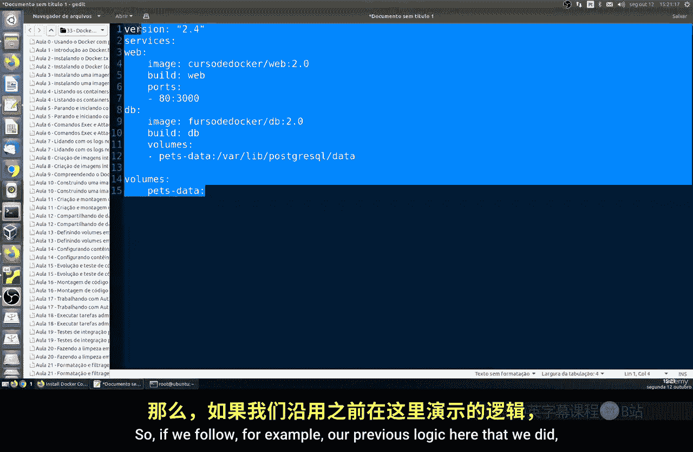

## 安装Docker Compose

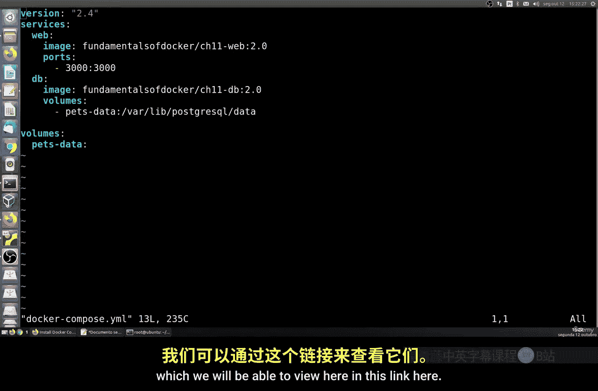

Docker Compose在Linux系统上默认不安装，需要手动进行安装。以下是安装步骤：

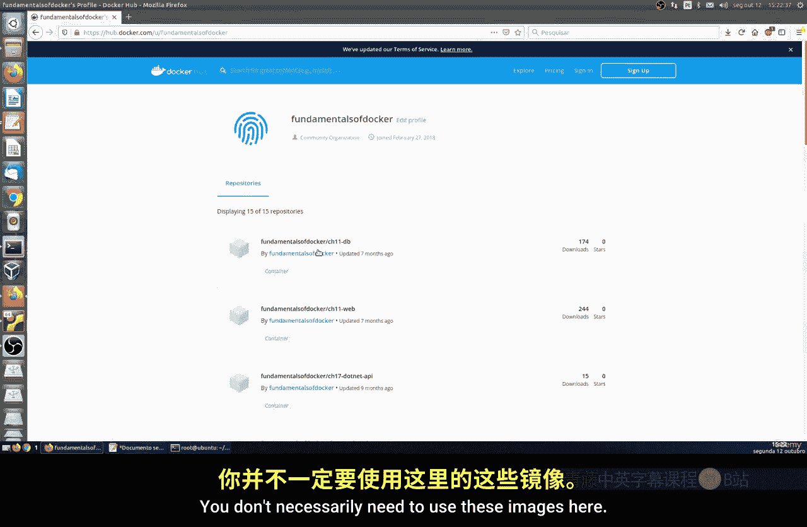

1.  从GitHub下载Docker Compose二进制文件。
2.  使其成为可执行文件。
3.  创建符号链接以便在系统路径中调用。

例如，可以运行以下命令来安装特定版本：
```bash
sudo curl -L "https://github.com/docker/compose/releases/download/1.29.2/docker-compose-$(uname -s)-$(uname -m)" -o /usr/local/bin/docker-compose
sudo chmod +x /usr/local/bin/docker-compose
```
安装完成后，可以通过运行`docker-compose --version`来验证安装是否成功。

## 实践：运行一个多容器应用

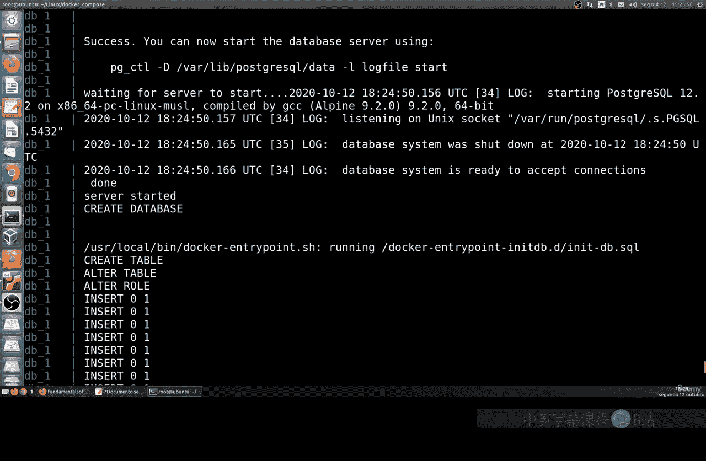

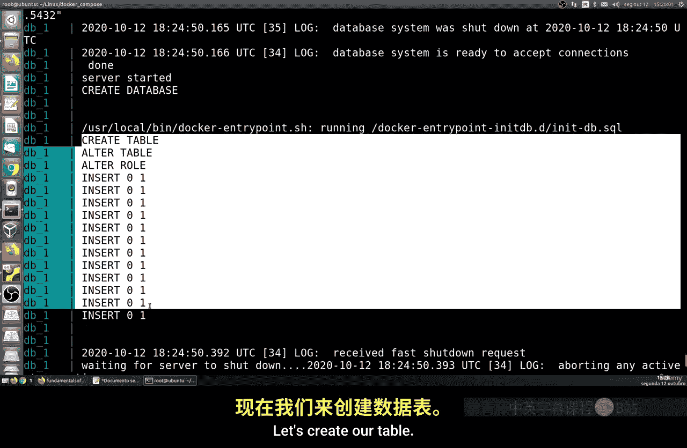

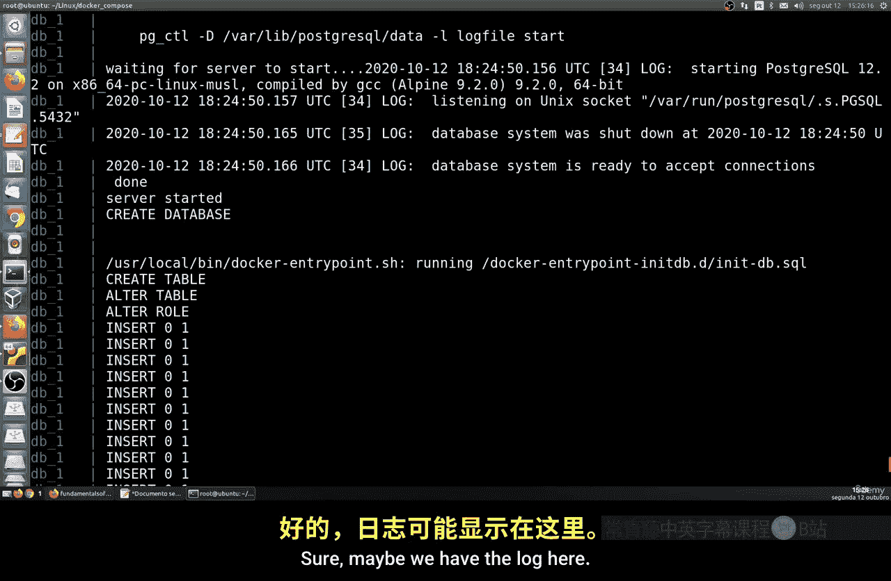

上一节我们介绍了Docker Compose的基本概念和安装方法，本节中我们来看看如何实际使用它来运行一个应用。

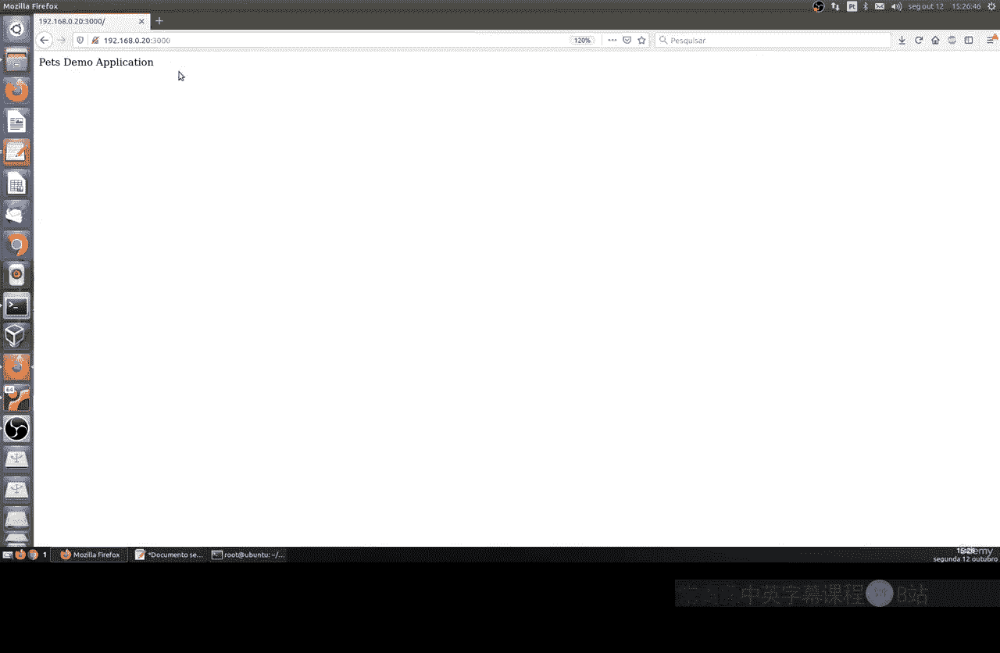

我们将使用一个示例项目，该项目包含一个Web应用和一个数据库。

1.  首先，克隆包含`docker-compose.yml`文件的示例仓库到本地。
2.  进入项目目录。
3.  使用`docker-compose up`命令启动所有服务。

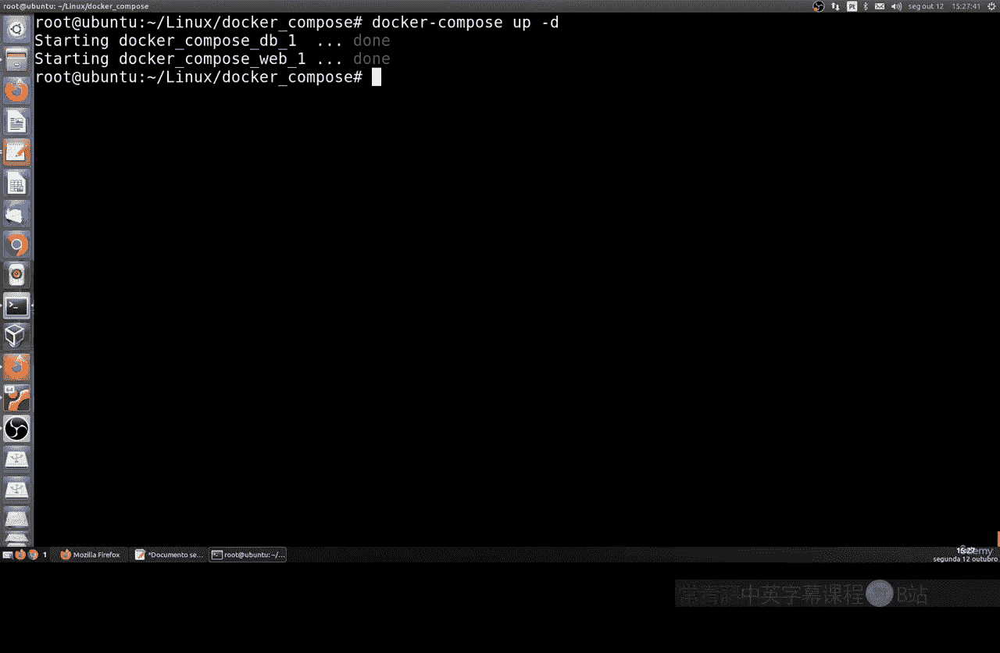


这个命令会读取`docker-compose.yml`文件，如果所需的镜像不在本地缓存中，则会从Docker Hub拉取，然后创建并启动容器。在终端中，你可以看到服务的启动日志。Web服务将在主机的3000端口上可用。

## 管理Compose应用

运行应用后，你可能需要对其进行管理。以下是常用的命令：

*   **后台运行**：使用`docker-compose up -d`命令可以让服务在后台运行。
*   **查看状态**：使用`docker-compose ps`命令可以查看当前由Compose管理的容器状态。
*   **停止服务**：使用`docker-compose stop`命令可以停止所有服务，但保留容器和数据。
*   **停止并清理**：使用`docker-compose down`命令会停止并移除所有容器、网络。添加`-v`选项还会删除相关的数据卷。

## 扩展服务

为了应对更高的负载，我们可以对服务进行横向扩展。例如，我们可以运行多个Web应用实例。

首先，需要修改`docker-compose.yml`文件，将Web服务的端口映射配置调整为仅指定容器端口，以便Compose可以动态分配主机端口。

修改前：
```yaml
ports:
  - "3000:3000"
```
修改后：
```yaml
ports:
  - "3000"
```

然后，使用以下命令将`web`服务扩展为3个实例：
```bash
docker-compose up -d --scale web=3
```
执行后，可以使用`docker-compose ps`查看，现在会有3个Web容器在运行，它们共享同一个数据库服务，并且各自被分配了不同的主机端口。这为在前端使用负载均衡器提供了基础。

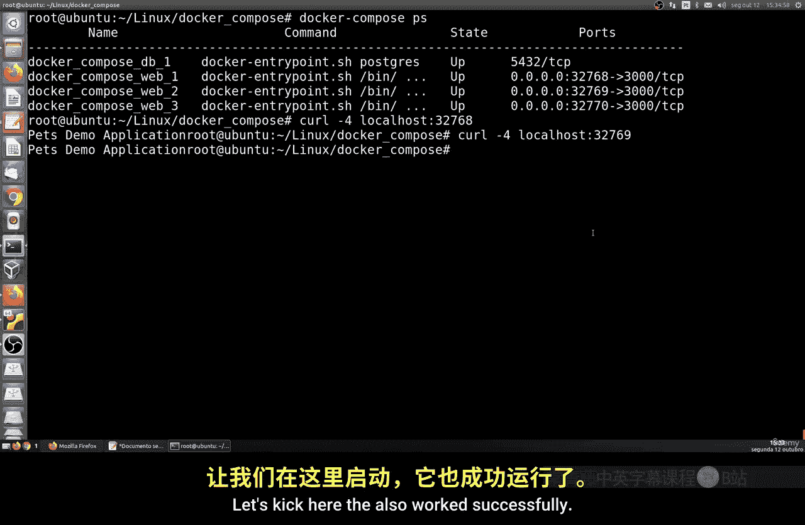

## 总结

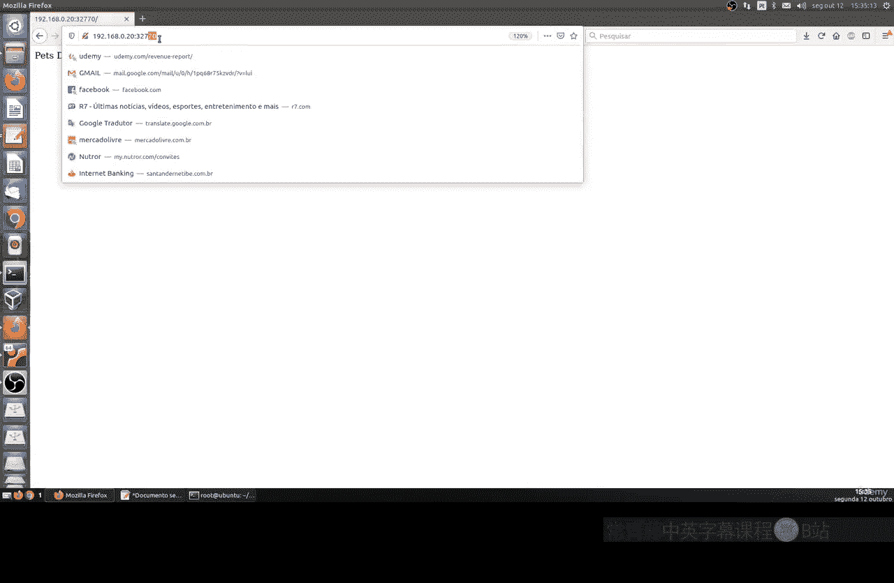


本节课中我们一起学习了Docker Compose的核心用法。我们了解了如何通过`docker-compose.yml`文件定义多服务应用，如何安装Docker Compose，以及如何使用`up`、`ps`、`stop`、`down`等命令来管理应用的生命周期。最后，我们还实践了如何通过`--scale`参数对服务进行横向扩展，以提升应用的承载能力。掌握Docker Compose能极大地简化多容器环境的部署和管理工作。