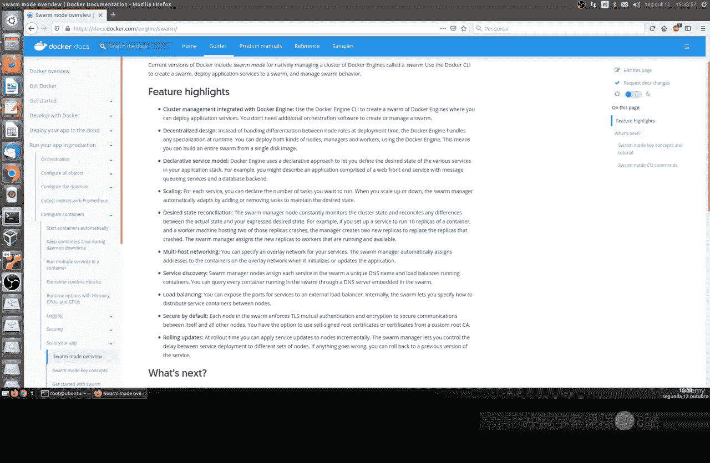
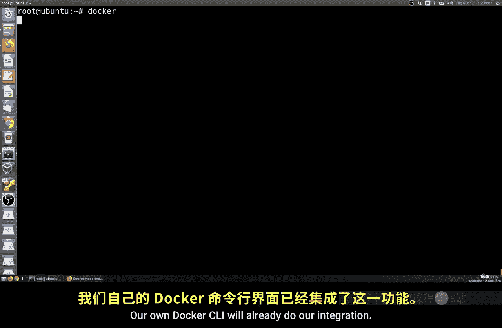
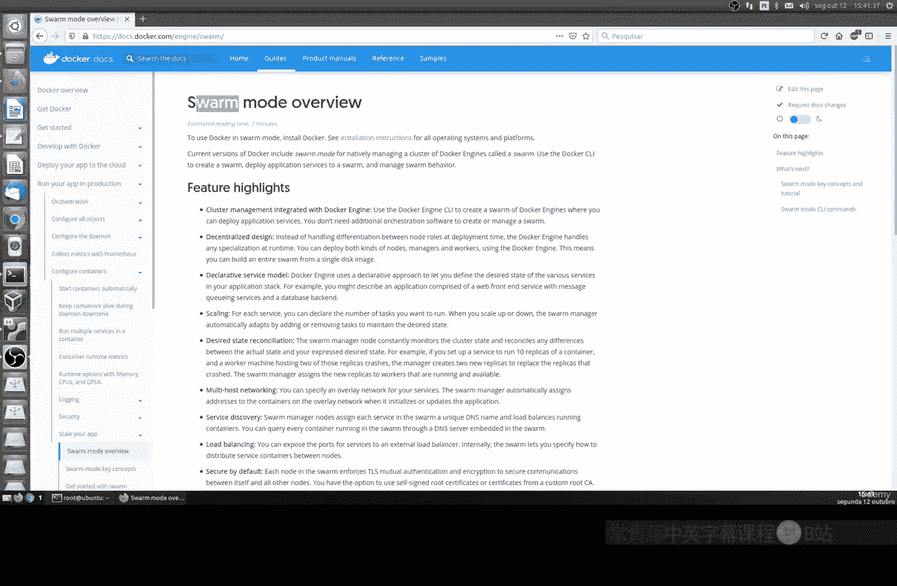
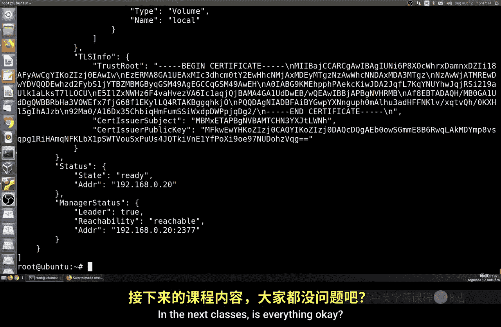
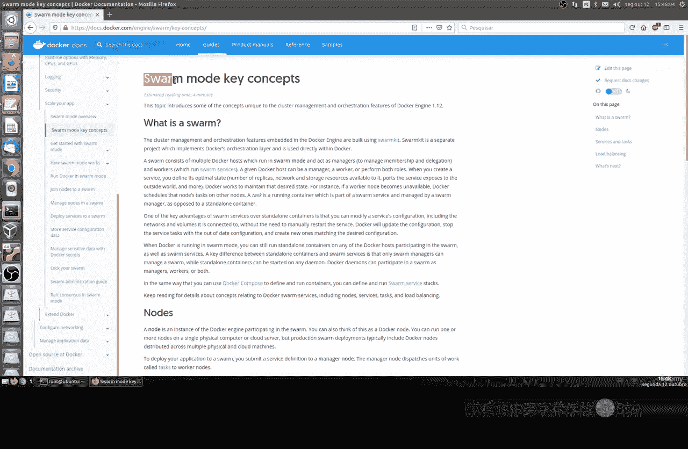

# 184：创建Docker Swarm 🐳

在本节课中，我们将要学习如何初始化并配置Docker Swarm。Docker Swarm是Docker原生的集群管理工具，由社区创建，旨在以更复杂的方式管理和扩展容器，并专注于高可用性。



## 概述



Docker Swarm内置于Docker引擎中，无需安装额外软件即可使用。它提供了集群管理、声明式服务模型、服务伸缩、网络管理、服务发现、负载均衡和安全通信等功能。它是Kubernetes的竞争者，但已集成在Docker中，使用起来非常简单。

## Docker Swarm的主要优势

以下是Docker Swarm提供的一些关键优势：

*   **内置集群管理**：集群管理功能直接集成在Docker引擎中。这意味着如果你已经安装了Docker CLI，就可以直接使用Swarm，无需安装任何额外软件。
*   **声明式服务模型**：你可以定义各种服务的期望状态。例如，你可以声明想要运行的任务数量。
*   **服务伸缩**：Docker允许你为每种服务声明想要运行的任务数量，从而实现服务的伸缩。
*   **网络管理**：你可以使用多种网络，包括主机网络和覆盖网络。
*   **服务发现与负载均衡**：你可以使用唯一的DNS名称来发现服务，并自动对运行的容器进行负载均衡。负载均衡允许你指定如何在节点之间分发服务容器。
*   **安全性**：Swarm默认非常安全，它使用TLS进行通信，包含实际签名的证书。
*   **滚动更新**：在部署时，你可以自动地、渐进式地应用服务更新。

## 初始化Docker Swarm

上一节我们介绍了Docker Swarm的优势，本节中我们来看看如何初始化一个Swarm集群。

初始化过程非常简单，只需运行一个命令。你不需要安装任何额外的程序或工具，如果你已经安装了Docker，就可以直接使用。

要初始化Docker Swarm，你只需要在命令行中运行以下命令：



```bash
docker swarm init
```

执行此命令后，你的计算机将成为一个Swarm节点，并自动被赋予**管理节点**的角色。管理节点是集群的领导者，负责主要配置工作。

初始化过程会完成以下几件事：
1.  创建一个根证书颁发机构的证书。
2.  创建一个键值存储，用于存储整个Swarm集群的状态（我们将在后续课程中详细介绍）。
3.  生成一个**加入令牌**。这是一个由字母、数字和特殊字符组成的随机字符串。
4.  显示管理节点的IP地址和端口（默认是2377）。

例如，命令输出可能包含如下信息：
*   **Swarm initialized**: 表示初始化成功。
*   **加入令牌**: 类似 `SWMTKN-1-0z6v...` 的一长串字符。
*   **管理节点IP和端口**: 例如 `192.168.0.20:2377`。这是其他节点加入集群时需要连接的地址。

## 查看Swarm节点

初始化完成后，我们可以查看当前Swarm集群中的所有节点。

要列出所有节点，可以运行以下命令：

```bash
docker node ls
```

**请注意**：这里的 `node` 指的是Swarm集群中的节点（服务器），与JavaScript的Node.js运行时环境无关。

该命令会输出一个节点列表。目前，列表中应该只有你刚刚初始化的这一个管理节点。输出信息通常包括：
*   **节点ID**: 一长串由字母和数字组成的唯一标识符。
*   **主机名**: 节点的名称。
*   **状态**: 显示节点是 `Ready`（就绪）还是 `Down`（下线）。
*   **可用性**: 显示节点是 `Active`（活跃）还是 `Drain`（排水模式，即不接收新任务）。
*   **管理状态**: 显示节点是 `Leader`（领导者）还是 `Reachable`（可访问的管理节点）。

## 检查节点详细信息

如果你想查看某个节点的详细信息，可以使用 `docker node inspect` 命令。

首先，从 `docker node ls` 的输出中复制目标节点的ID。然后运行：

```bash
docker node inspect <节点ID>
```

这个命令会返回该节点的详细JSON格式信息，包括：
*   **版本信息**
*   **创建/更新时间**
*   **运行的平台和系统**
*   **分配的CPU和内存资源**
*   **Docker引擎版本和插件**
*   **网络和卷配置**
*   **TLS证书和公钥信息**
*   **节点的状态、IP地址、端口以及它是否是领导者**

如果你之前学习过MongoDB集群，会发现这种通过一个主节点（领导者）来管理集群成员的方式有些相似，因为它们都涉及节点配置和键值存储。

## 总结与后续



本节课中我们一起学习了Docker Swarm的基础知识。我们了解了它的核心优势，并动手初始化了一个单节点的Swarm集群，将其设为了管理节点。我们还学习了如何查看集群节点列表以及检查单个节点的详细信息。



这只是一个开始。在接下来的课程中，我们将继续深入，学习如何：
*   将更多的工作节点加入到这个Swarm集群中。
*   在集群上部署和管理服务。
*   进行服务的伸缩和滚动更新。


操作本身并不复杂，我们将一步步进行演示。为了能更好地理解后续内容，建议你阅读Docker官方文档中关于Swarm的部分，以便更清晰地掌握其工作原理和核心概念。