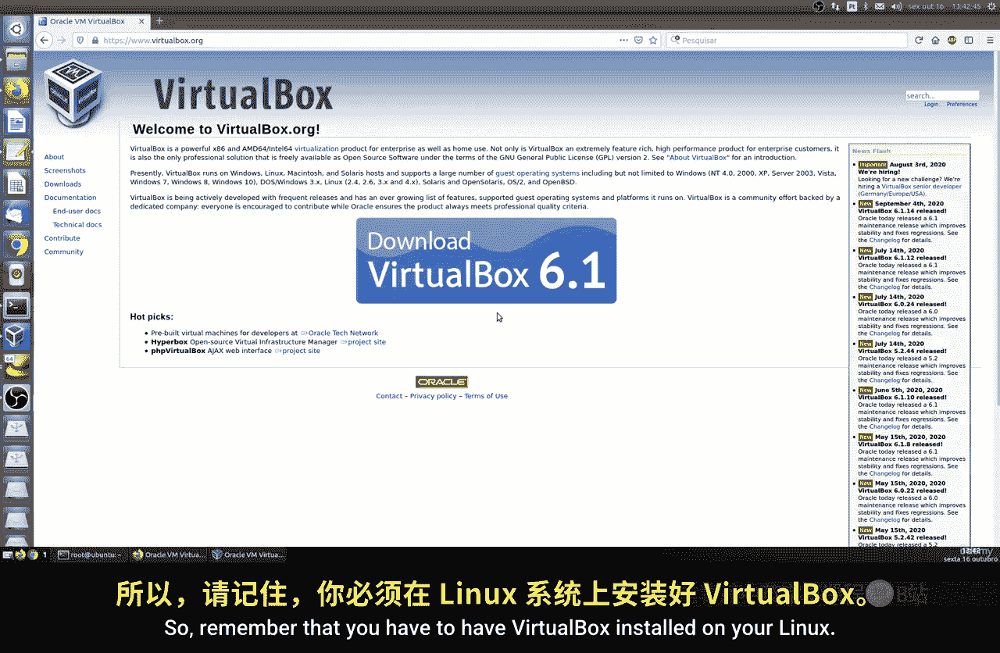
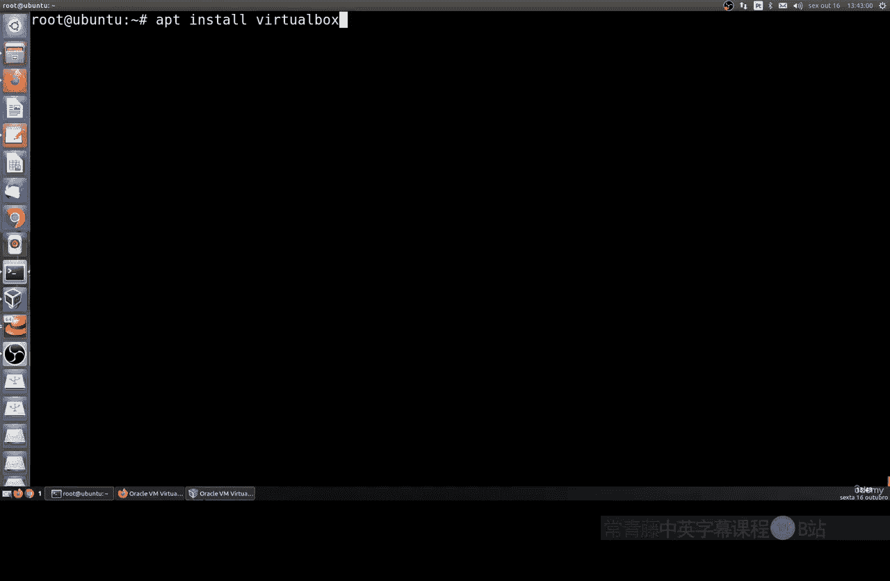
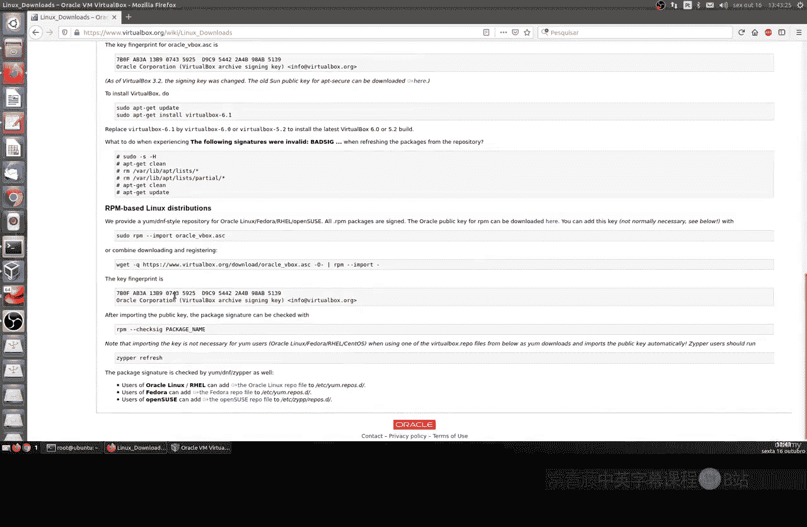
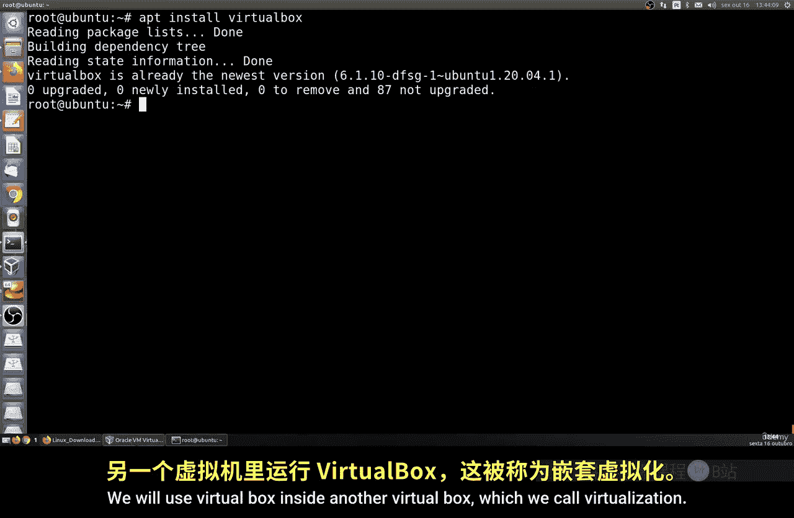
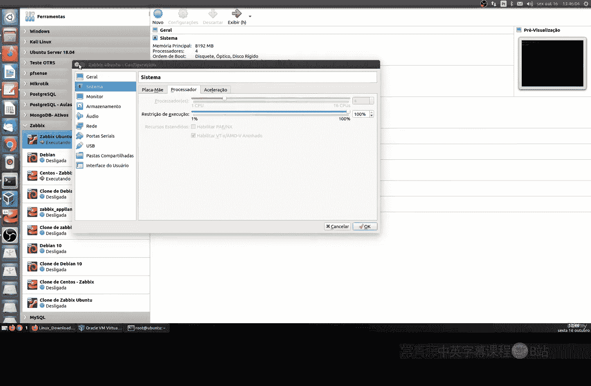
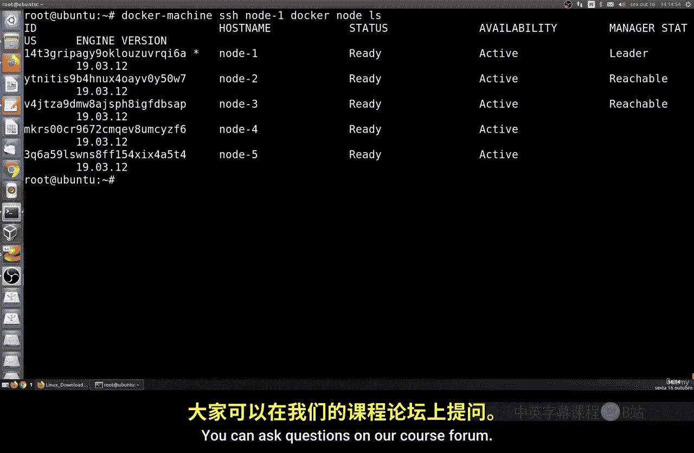

# 185：在 VirtualBox 中创建本地 Swarm 🐳



在本节课中，我们将学习如何在本地环境中创建一个 Docker Swarm 集群。我们将使用 VirtualBox 驱动来模拟多台机器，从而构建一个用于学习和测试的本地机器池。



## 概述



我们将通过一系列步骤，从安装必要的软件开始，到最终创建一个包含多个节点的 Docker Swarm 集群。这个过程将帮助我们理解 Swarm 的基本概念和操作。



## 准备工作

首先，我们需要在 Linux 系统上安装 VirtualBox。这是创建虚拟机的必要驱动。

以下是安装 VirtualBox 的步骤：
*   对于 Ubuntu 或 Debian 系统，可以运行命令 `apt install virtualbox`。
*   对于其他 Linux 发行版，请参考官方文档，例如通过下载 RPM 包或使用 `yum install` 命令进行安装。

请注意，我们主要使用 VirtualBox 的驱动功能，而非其桌面图形界面。此外，如果你是在一个虚拟机（例如 Ubuntu 虚拟机）中运行此教程，你需要在虚拟机设置中启用虚拟化技术（如 Intel VT-x 或 AMD-V），以支持嵌套虚拟化。

创建 Docker Swarm 需要同时运行多台虚拟机，这对计算机性能有一定要求。建议至少拥有 8GB 内存和 4 个 CPU 核心，以确保运行流畅。



## 安装 Docker Machine

完成 VirtualBox 安装后，我们需要安装 Docker Machine 工具。它可以帮助我们快速创建和管理 Docker 主机。

运行以下命令即可完成安装。该命令会从 GitHub 下载二进制文件，并将其移动到系统的可执行目录中。
```bash
base=https://github.com/docker/machine/releases/download/v0.16.0 && curl -L $base/docker-machine-$(uname -s)-$(uname -m) >/tmp/docker-machine && sudo install /tmp/docker-machine /usr/local/bin/docker-machine
```
安装完成后，你可以通过运行 `docker-machine --version` 来验证安装是否成功。

## 创建第一个测试节点

现在，让我们使用 Docker Machine 和 VirtualBox 驱动创建第一个 Docker 主机。

运行以下命令来创建一个名为 `default` 的机器：
```bash
docker-machine create --driver virtualbox default
```
这个命令会执行多个步骤：下载 Boot2Docker ISO 镜像、在 VirtualBox 中创建虚拟机、配置 SSH 密钥、启动虚拟机并为其分配 IP 地址。这个过程可能需要一些时间，具体取决于你的网络速度。

创建完成后，你可以使用以下命令列出所有机器，并查看其状态和 IP 地址：
```bash
docker-machine ls
```
你可以使用 `docker-machine start <机器名>` 和 `docker-machine stop <机器名>` 来启动或停止机器。

## 创建 Swarm 集群节点

上一节我们创建了一个独立的 Docker 主机，本节中我们将创建多个节点来组建 Swarm 集群。

为了简化操作，我们将使用一个 Shell 脚本来批量创建 5 个节点。脚本使用 `for` 循环依次创建名为 `node1` 到 `node5` 的机器。

以下是创建节点的脚本：
```bash
for i in {1..5}; do docker-machine create --driver virtualbox node$i; done
```
执行此脚本后，系统会依次创建并启动五台虚拟机。这个过程会消耗较多的 CPU 和内存资源，请确保你的系统有足够的资源支持。

所有节点创建完成后，再次运行 `docker-machine ls`，你应该能看到 `node1` 到 `node5` 都处于运行状态。

## 初始化 Swarm 集群并加入节点

现在我们已经有了五台运行中的 Docker 主机，接下来需要将它们组织成一个 Swarm 集群。

首先，我们需要指定一个领导者节点。我们将选择 `node1` 作为 Swarm 管理节点（Leader）。

通过 SSH 连接到 `node1` 并初始化 Swarm：
```bash
eval $(docker-machine env node1)
docker swarm init --advertise-addr $(docker-machine ip node1)
```
初始化命令会输出一个用于其他节点加入集群的令牌（Token）。请保存好这个令牌。

接下来，我们需要让其余节点（`node2` 到 `node5`）加入这个 Swarm。

同样，我们可以使用一个循环脚本，让每个节点执行加入命令。请将 `<TOKEN>` 替换为上一步得到的实际令牌。

以下是加入集群的脚本：
```bash
for i in {2..5}; do eval $(docker-machine env node$i) && docker swarm join --token <TOKEN> $(docker-machine ip node1):2377; done
```
执行成功后，所有节点都将成为 Swarm 集群的工作节点。

## 管理 Swarm 集群

我们可以从管理节点 `node1` 查看集群的状态。

在 `node1` 的环境中，运行以下命令列出所有节点：
```bash
eval $(docker-machine env node1)
docker node ls
```
命令输出将显示所有节点的 ID、主机名、状态和角色。`node1` 应显示为 `Leader`，其他节点为 `Active`。

你还可以提升其他节点的角色。例如，将 `node2` 也提升为管理节点（Manager）：
```bash
docker node promote node2
```
再次运行 `docker node ls`，可以看到 `node2` 的角色已变为 `Manager`。

## 重置与清理脚本

如果你在过程中遇到问题，或者希望重新开始整个配置，可以使用一个自动化脚本来清理并重建所有节点。

以下脚本示例展示了如何移除所有节点并重新开始：
```bash
# 停止并移除所有节点
for i in {1..5}; do docker-machine stop node$i; docker-machine rm -y node$i; done
docker-machine stop default; docker-machine rm -y default

# 重新创建节点并初始化 Swarm（此处为示例逻辑，具体脚本需根据上述步骤组合）
# ... 创建节点、初始化、加入集群的命令 ...
```
使用此类脚本可以节省时间，但确保你理解每一步的操作。

## 总结



本节课中我们一起学习了如何在本地使用 VirtualBox 搭建一个 Docker Swarm 集群。我们完成了从安装基础软件、创建多个 Docker 主机，到初始化 Swarm 并将所有节点加入集群的完整流程。现在，你已经拥有了一个可以用于后续学习和测试的本地 Swarm 环境。在接下来的课程中，我们将基于此环境进行更多的配置和实践操作。