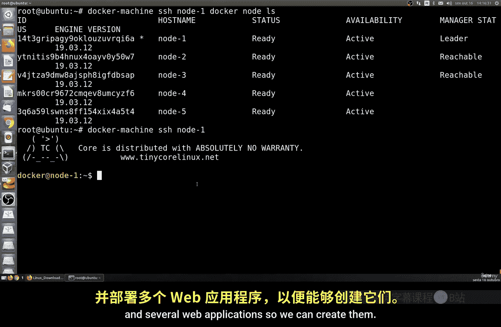
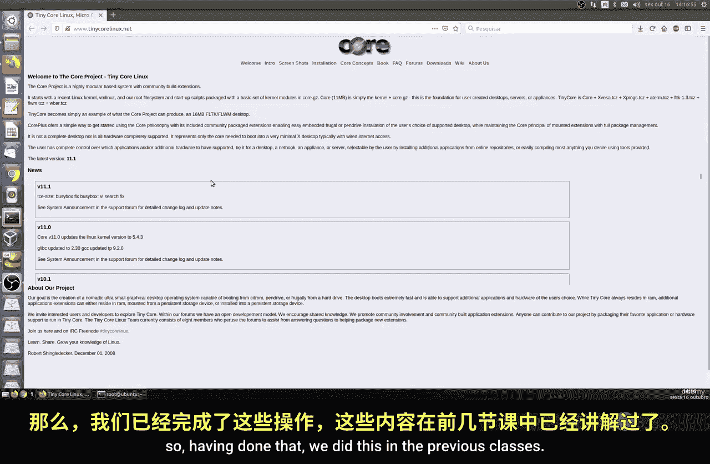
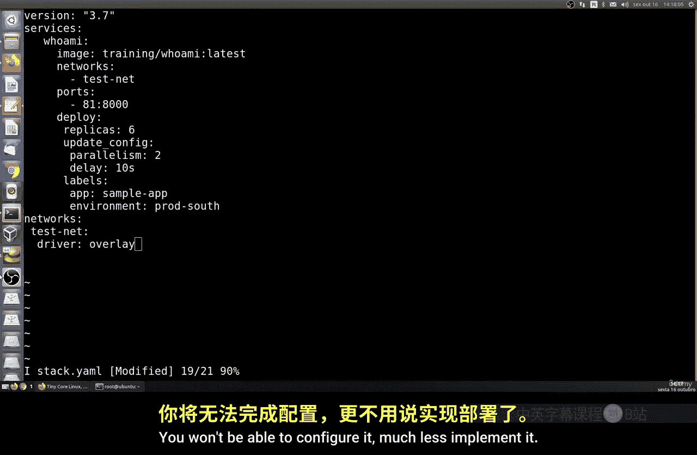
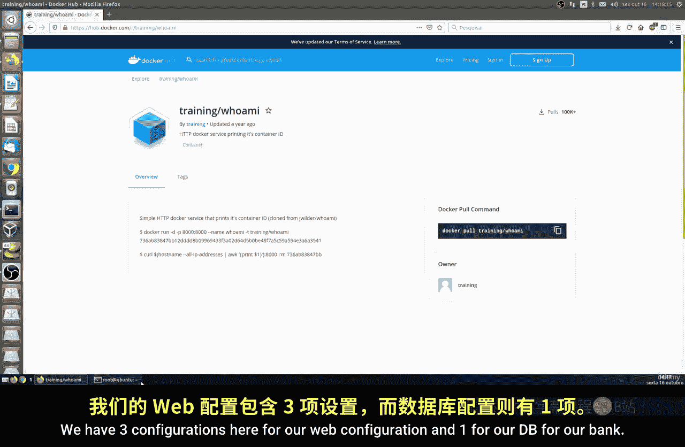
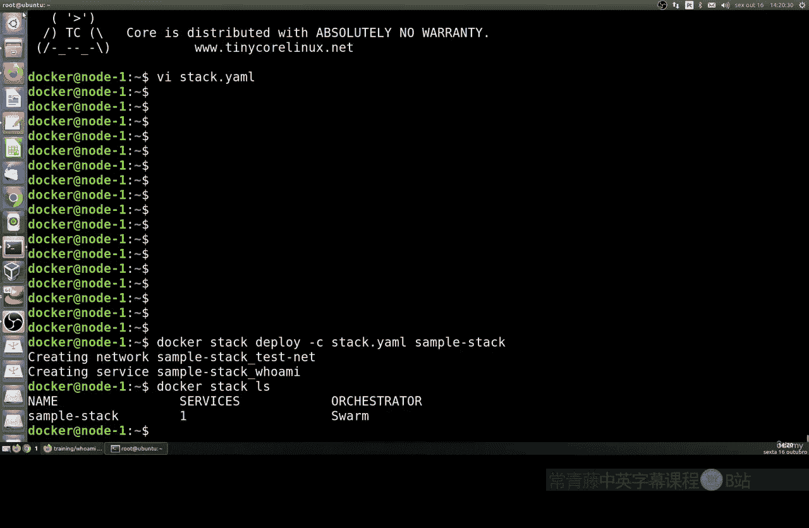
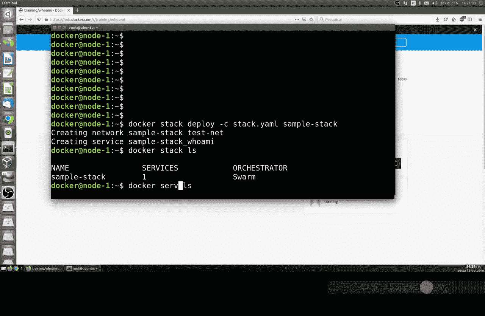
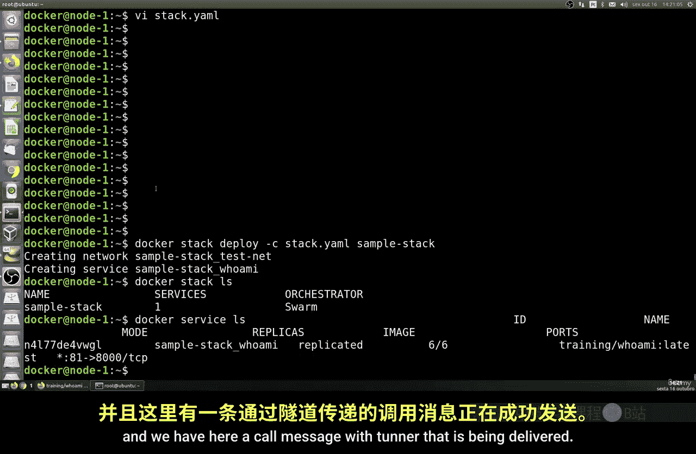
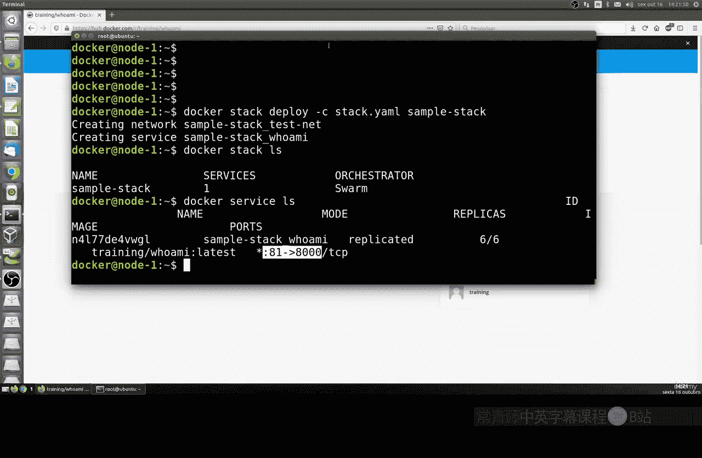
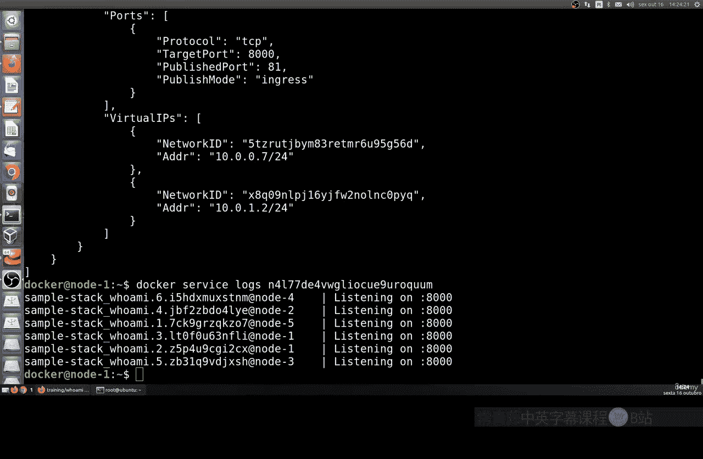

# 186：部署首个应用 🚀

在本节课中，我们将学习如何使用Docker Swarm部署一个多服务应用。我们将创建一个包含数据库和Web应用副本的栈，并验证其负载均衡功能。

上一节我们介绍了Docker Swarm的基本概念，本节中我们来看看如何实际部署一个应用栈。

## 准备环境



首先，请确保你已配置好Swarm集群，并且`node1`是管理节点（leader）。你可以通过SSH连接到`node1`节点。

```bash
docker-machine ssh node1
```



## 创建栈文件

接下来，我们需要创建一个栈定义文件。以下是创建步骤：

1.  使用文本编辑器（如Vim）创建一个名为 `PaStack1.yml` 的文件。
2.  将以下YAML配置内容复制到文件中。**请特别注意缩进和空格**，YAML格式对此要求严格，错误的缩进会导致部署失败。

```yaml
version: '3.8'
services:
  web:
    image: eugenm/manuel
    deploy:
      replicas: 3
    ports:
      - "3000:3000"
    networks:
      - webnet
    depends_on:
      - db
  db:
    image: postgres
    volumes:
      - data:/var/lib/postgresql/data
    networks:
      - webnet



volumes:
  data:



networks:
  webnet:
    driver: overlay
```

**核心配置说明：**
*   **`web` 服务**：使用 `eugenm/manuel` 镜像，部署 **3个副本**，将容器内部的3000端口映射到主机的3000端口。
*   **`db` 服务**：使用 `postgres` 镜像，并挂载一个名为 `data` 的持久化卷。
*   **网络**：创建一个名为 `webnet` 的覆盖网络，使所有服务能够相互通信。

## 部署应用栈

保存并退出编辑器后，使用以下命令部署应用栈：

```bash
docker stack deploy -c PaStack1.yml mystack
```

这个命令会读取 `PaStack1.yml` 文件，并在Swarm集群中创建或更新一个名为 `mystack` 的栈。它会自动创建定义的服务、网络和卷。

部署完成后，你可以使用以下命令查看运行中的服务：

```bash
docker service ls
```

或者查看所有容器的状态：



```bash
docker stack ps mystack
```

## 测试应用

现在，让我们测试应用是否正常运行。由于Web服务映射到了主机的3000端口，你可以通过浏览器或命令行工具访问它。





例如，使用 `curl` 命令测试：

```bash
curl http://localhost:3000
```

如果配置成功，你将收到一个HTML响应。这个应用会显示处理当前请求的容器ID。



**负载均衡测试：**
多次执行 `curl` 命令，观察返回的容器ID。因为 `web` 服务有3个副本，Swarm的负载均衡器会将请求分发到不同的容器上，所以你每次看到的容器ID很可能不同。这证明了负载均衡正在工作。

## 清理资源

如果你想移除整个应用栈（包括所有服务、网络和卷），可以使用以下命令：

```bash
docker stack rm mystack
```

---



本节课中我们一起学习了如何使用Docker Swarm和栈文件来部署一个多服务的应用。我们创建了包含数据库和多个Web应用副本的配置，验证了服务的运行和负载均衡效果，并最后学习了如何清理部署。整个过程展示了使用声明式文件高效管理复杂应用部署的能力。