# 187：使用Docker Swarm部署多服务应用 🐳

在本节课中，我们将学习如何使用Docker Swarm部署一个包含数据库和Web应用的多服务栈。我们将创建一个Stack文件来定义服务，并观察负载均衡器如何在不同容器间分配请求。

## 概述

我们将创建一个与Docker Compose功能类似的部署，但这次使用Docker Swarm。我们将配置一个数据库服务和一个包含三个副本的Web应用服务，并通过一个Stack文件来定义和管理它们。

## 创建Stack文件

首先，我们需要登录到Swarm集群的Leader节点（例如node1）并创建一个Stack文件。

使用SSH连接到node1节点：
```bash
docker-machine ssh node1
```

创建一个名为 `PaStack1.yml` 的文件。我们将使用Vim文本编辑器：
```bash
vim PaStack1.yml
```

在文件中输入以下内容。**请特别注意缩进和空格**，YAML格式对此要求严格，错误的缩进会导致配置失败。

```yaml
version: '3.8'
services:
  web:
    image: eugenm/manuel-enginx
    deploy:
      replicas: 3
    ports:
      - "3000:3000"
    networks:
      - webnet
    depends_on:
      - db

  db:
    image: postgres
    volumes:
      - data:/var/lib/postgresql/data
    networks:
      - webnet

volumes:
  data:

networks:
  webnet:
    driver: overlay
```

**文件内容说明：**
*   **`web` 服务**：使用 `eugenm/manuel-enginx` 镜像，部署3个副本，将容器内部的3000端口映射到主机的3000端口，并连接到 `webnet` 网络。
*   **`db` 服务**：使用 `postgres` 镜像，创建一个名为 `data` 的持久化卷来存储数据库数据，并连接到 `webnet` 网络。
*   **`volumes`**：定义了名为 `data` 的卷。
*   **`networks`**：定义了一个名为 `webnet` 的覆盖网络，用于服务间通信。

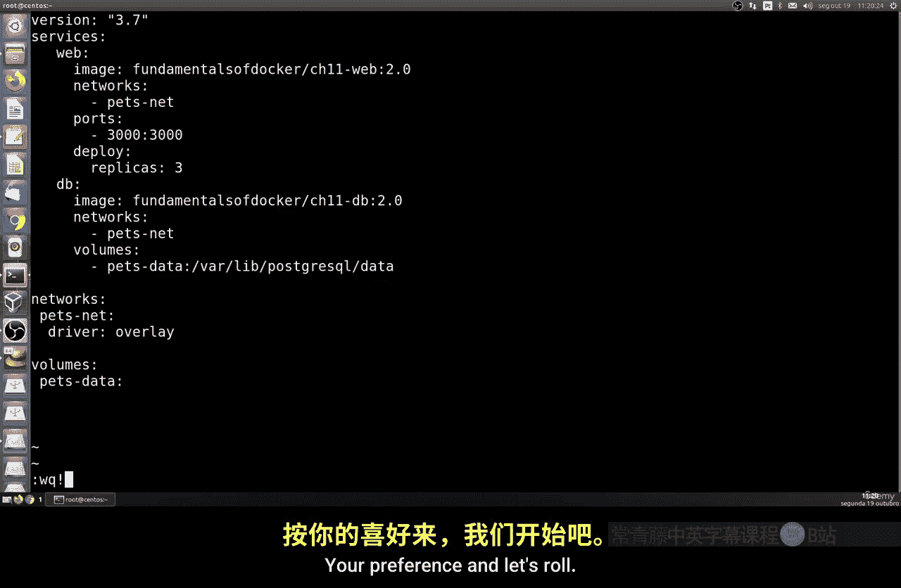

编辑完成后，保存并退出Vim编辑器。建议在专业的IDE（如Visual Studio Code）中检查文件的缩进格式，确保无误。

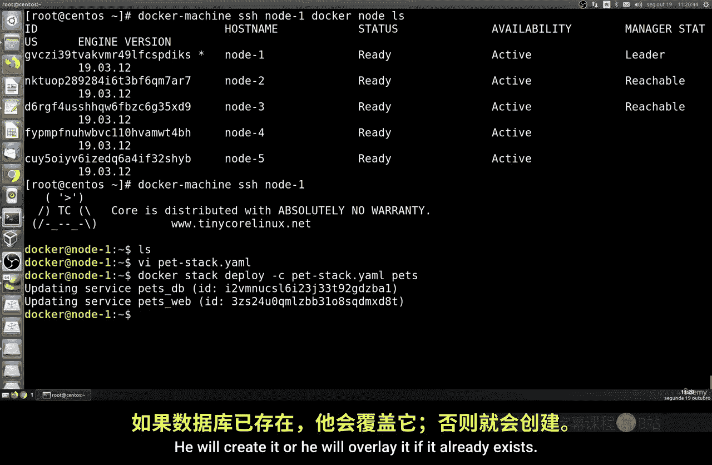

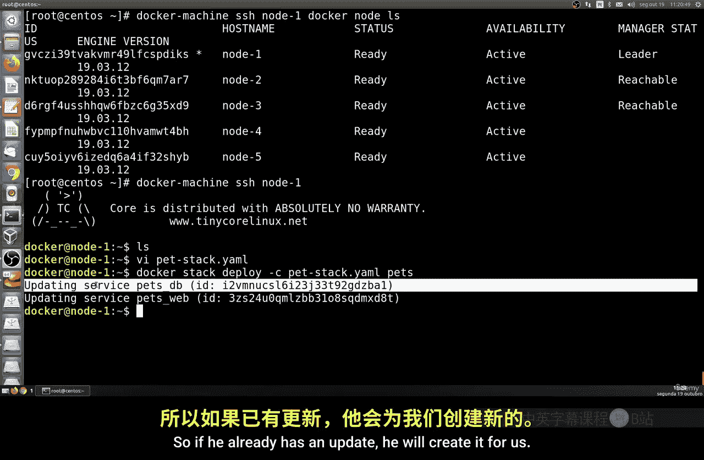

## 部署服务栈

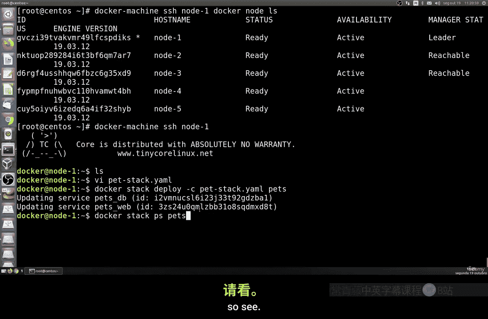

现在，我们可以使用 `docker stack deploy` 命令来部署这个服务栈。

在node1节点上执行以下命令：
```bash
docker stack deploy -c PaStack1.yml mystack
```
这个命令会读取 `PaStack1.yml` 文件，并创建一个名为 `mystack` 的堆栈。如果服务已存在，Docker会对其进行更新。

要查看部署的服务和容器状态，可以使用 `docker stack ps` 命令：
```bash
docker stack ps mystack
```
或者使用 `docker service ls` 查看服务列表：
```bash
docker service ls
```
使用 `docker ps` 可以查看当前节点上正在运行的容器。

## 测试应用

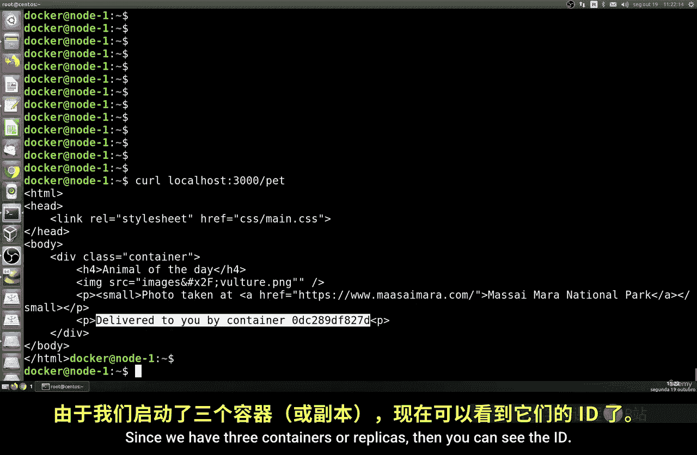

部署完成后，我们可以测试应用是否正常运行。

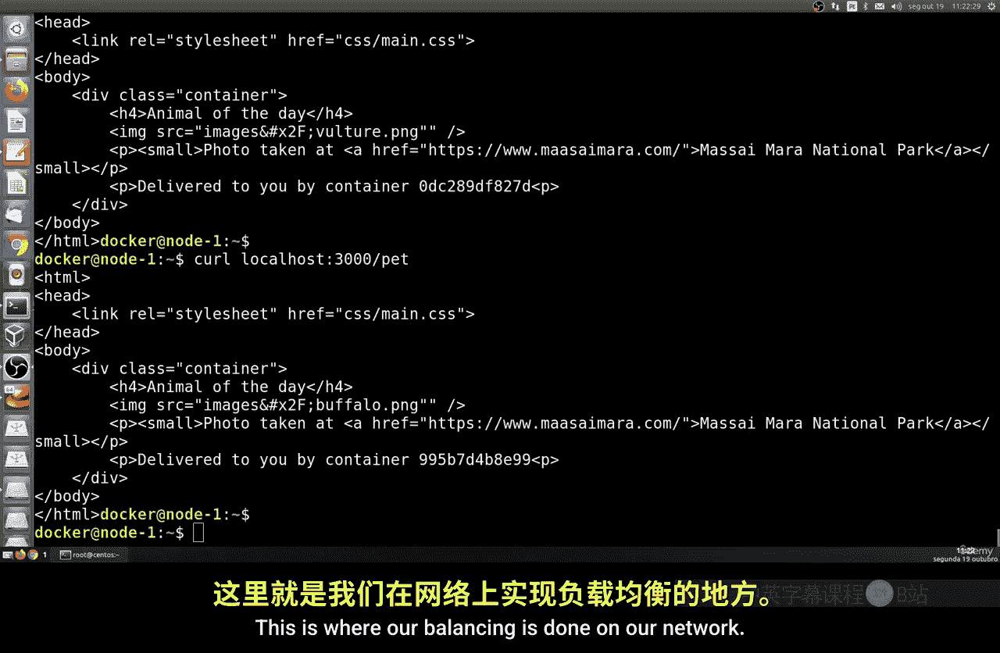

由于Web服务映射到了主机的3000端口，你可以通过浏览器或命令行工具访问该应用。在命令行中，可以使用 `curl` 命令进行测试：
```bash
curl http://localhost:3000
```
或者，如果你知道Swarm集群中任一节点的IP地址，也可以在浏览器中访问 `http://<节点IP>:3000`。

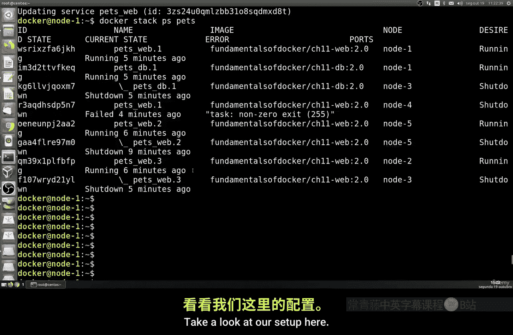

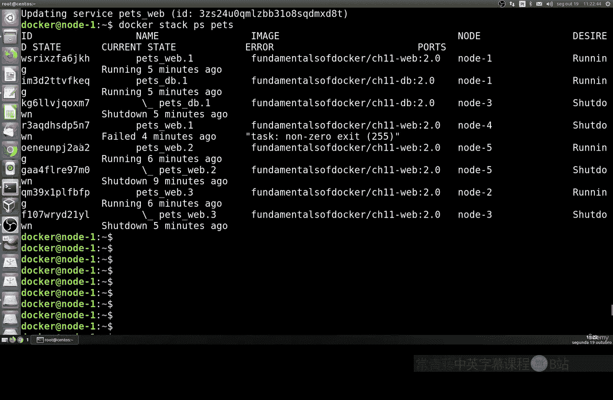

页面会返回一个简单的HTML响应，并显示处理该请求的容器ID。由于我们部署了3个Web副本，负载均衡器会将请求分发到不同的容器上。

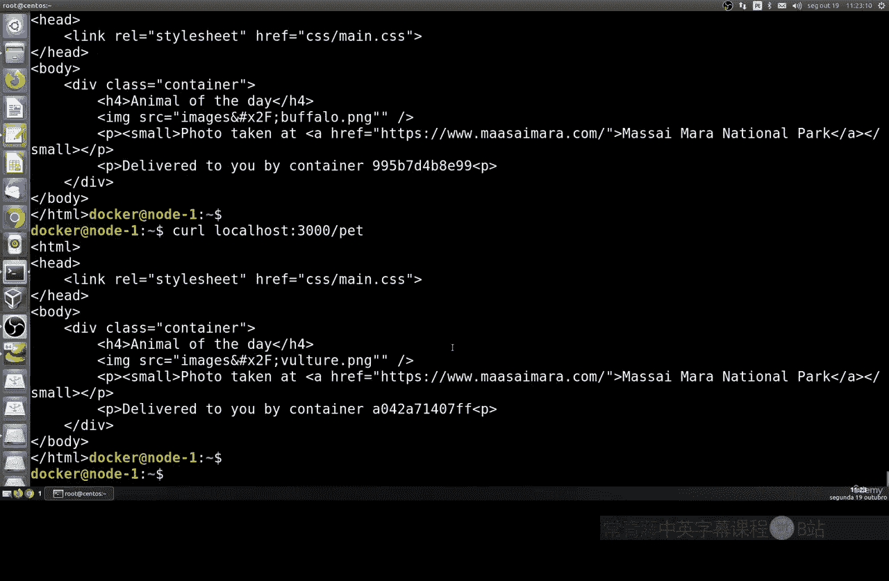

**以下是测试负载均衡的方法：**
多次执行 `curl` 命令，观察返回的容器ID是否变化。
```bash
curl http://localhost:3000
# 可能返回：Container ID: abc123...
curl http://localhost:3000
# 可能返回：Container ID: def456...
```
如果每次返回的容器ID不同，说明Swarm的负载均衡正在正常工作，请求被均匀地分配到了不同的容器实例上。

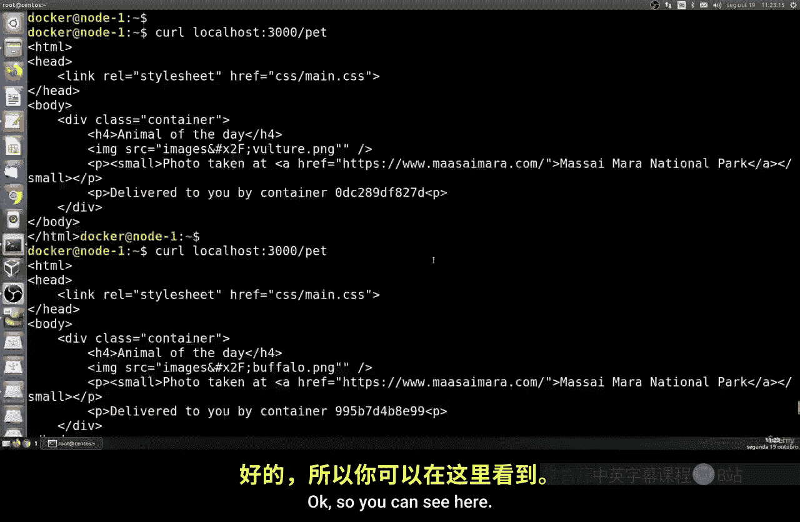

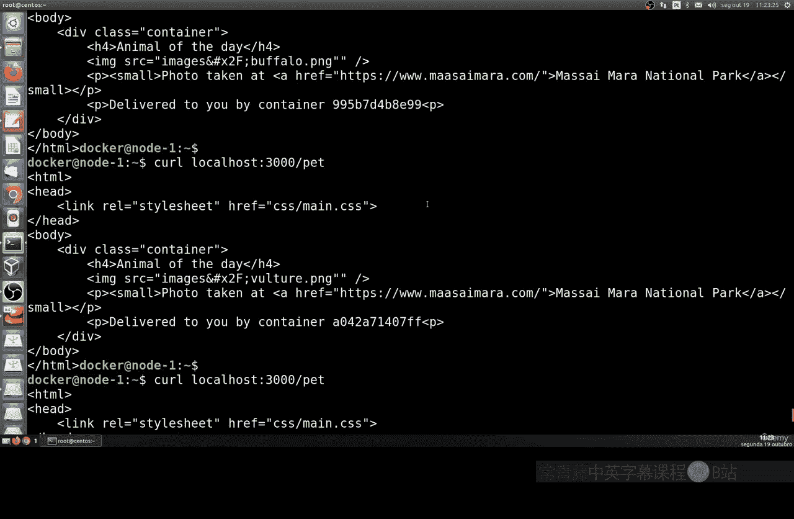

## 清理服务栈

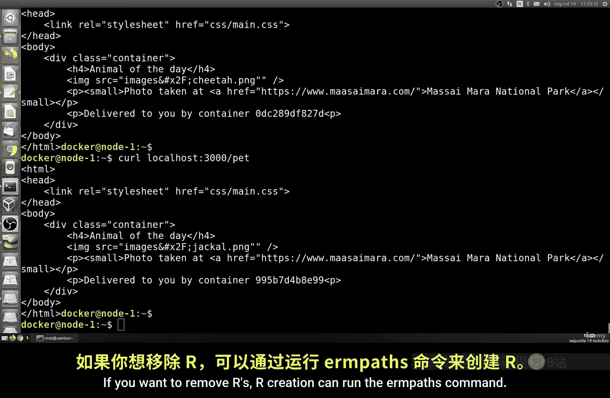

当你需要移除整个服务栈（包括服务、网络和卷）时，可以使用以下命令：
```bash
docker stack rm mystack
```
执行此命令后，Docker Swarm会清理掉 `mystack` 栈中定义的所有资源。

## 总结

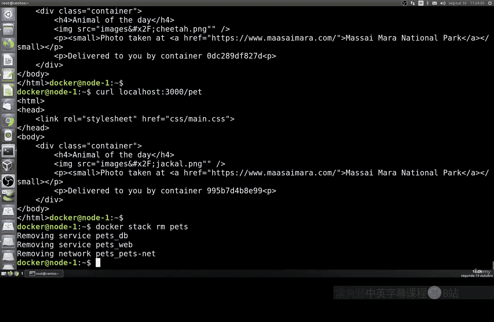

本节课中，我们一起学习了如何使用Docker Swarm和Stack文件来部署一个多服务应用。我们完成了从编写YAML格式的Stack文件，到部署服务、验证应用运行状态，再到测试负载均衡效果的全过程。最后，我们也了解了如何清理部署的资源。通过Stack文件，你可以轻松地定义、部署和管理复杂的多服务应用架构。