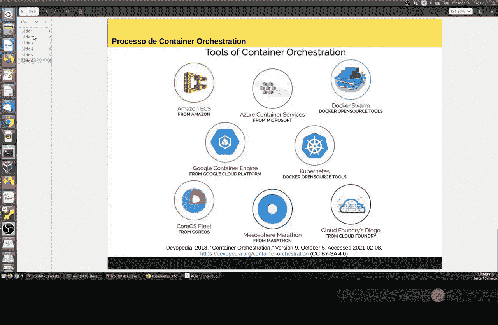
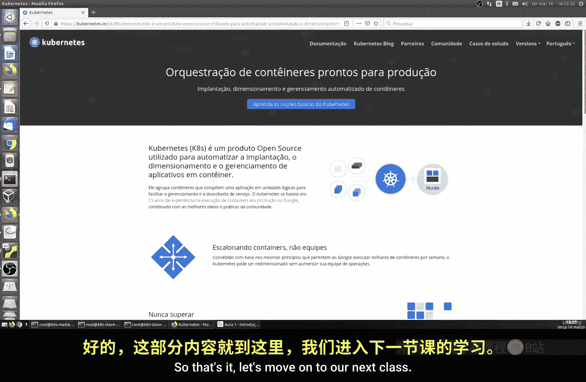

Linux命令行基础：Part2：容器编排介绍 🚢

在本节课中，我们将要学习容器编排的基本概念，了解其重要性，并认识一些主流的编排工具。

---

### 概述

在之前的课程中，我们学习了Docker及其功能。随着容器数量的增加，手动管理变得复杂。本节将介绍容器编排，这是一个自动化管理多个容器的过程。

### 什么是容器编排？

容器编排，顾名思义，是对容器进行编排的过程。它是在计算集群中实施容器的过程。集群通常由多个节点组成。编排工具增强了跨多个容器以复杂方式管理工作负载的能力。

想象一下，在上一节课中我们创建了多个Docker容器。你可以创建数十甚至数百个，具体取决于机器性能。手动管理所有这些容器将非常困难。

容器的出现极大地改变了当今应用程序的使用和部署方式。因此，这种新的管理、组织和编排方式变得几乎必不可少。

### 容器编排的核心功能

为了让你更容易理解，容器编排是一个自动化流程，它负责容器化应用（例如基于Docker的应用）的部署、管理、扩展、网络连接和可用性。

以下是容器编排涵盖的一些核心功能方面：

*   **服务管理**：负责处理标签、组、命名空间、依赖关系、负载均衡和健康检查。
*   **调度**：负责容器的分配、复制、重新调度、部署、滚动升级等。简而言之，它管理CPU、GPU、存储卷、端口、资源、IP地址等。
*   **其他流程**：还包括可扩展性、可用性、灵活性、易用性、可移植性和安全性。

### 主流编排工具

有多种工具负责处理容器编排。Docker Swarm是其中之一，我们在之前的课程中学习过，它由Docker自身提供。

我们还有其他几种工具。其中最主要、或者说最常用的是**Kubernetes**，我们将在后续课程中重点学习它。所有这些都是容器编排系统。

不同的工具背后有不同的公司或组织支持。例如，有亚马逊的AWS ECS，它也是一种编排服务；还有CoreOS的rkt等。Kubernetes是早期的编排工具之一，拥有庞大的社区用户，是发展最活跃的工具之一。

在接下来的课程中，我们将重点使用Kubernetes。它与Docker完全兼容，因此我们可以基于Docker来学习和实践容器编排。

### 实验环境准备

接下来，我们将开始准备实验环境。需要记住的是，我们至少需要三台机器。我们将使用至少三台机器。你也可以使用其他配置，但为了能更好地学习和操作，建议使用虚拟机。

其中至少一台机器的内存应不少于2GB，以确保我们能在课程实验中高效地进行操作。

### 总结

本节课我们一起学习了容器编排的基本概念，了解了它如何自动化管理容器化应用的生命周期，并认识了以Kubernetes为代表的主流编排工具。我们还为接下来的动手实验准备好了环境要求。

---

> 相关资源链接：你可以访问 [Kubernetes官方网站](https://kubernetes.io/)，我们将在那里开始我们的实践工作。