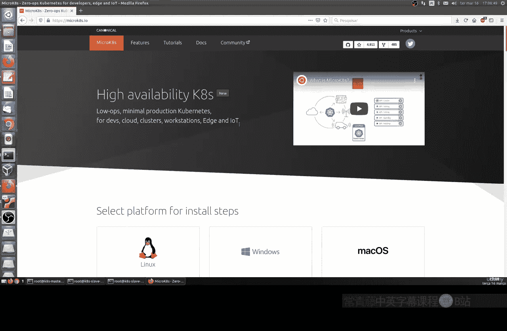
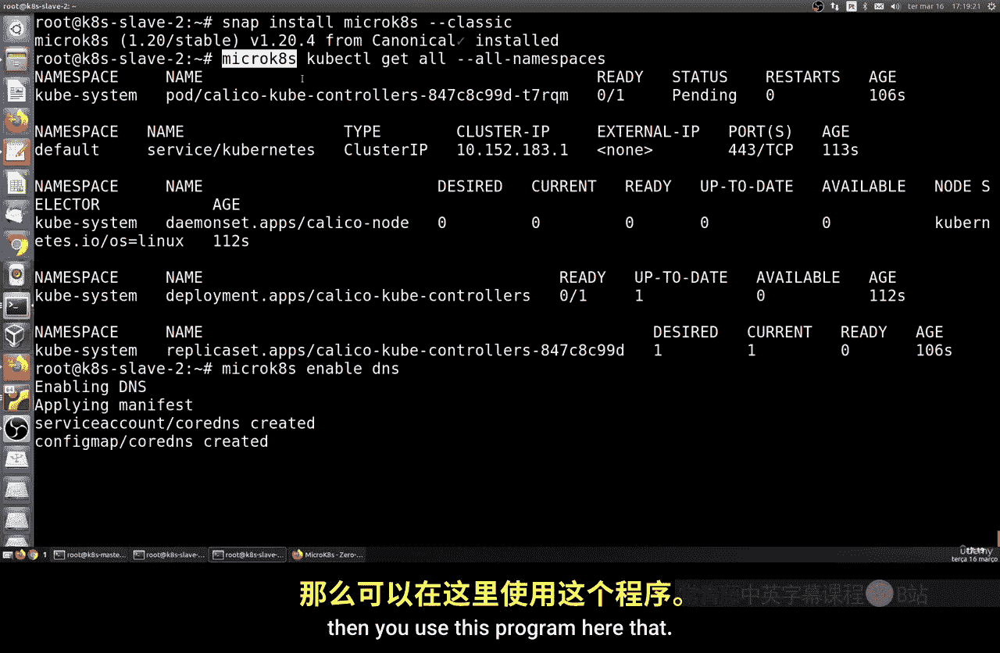
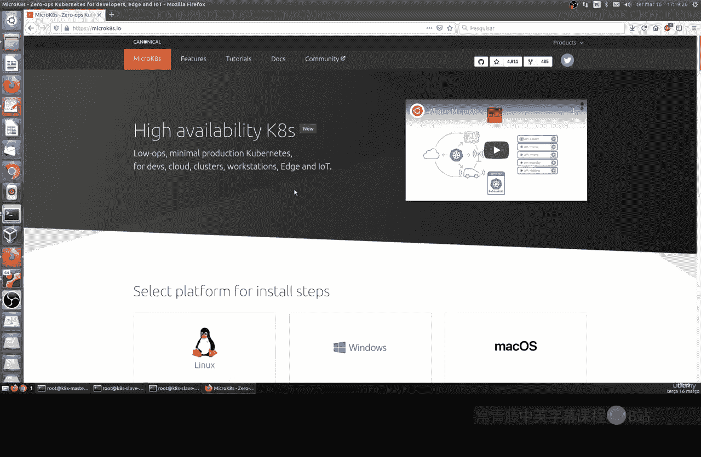
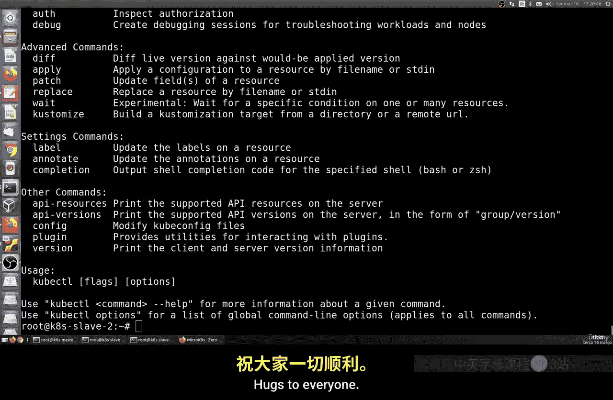

# 189：使用MicroK8s准备环境 🚀

在本节课中，我们将学习如何安装和配置MicroK8s，这是一个由Canonical（Ubuntu的开发商）维护的轻量级Kubernetes发行版。它的主要目标是让用户能够在资源有限的机器上（例如内存少于2GB）运行Kubernetes，非常适合学习和测试环境。

## 概述：什么是MicroK8s？

上一节我们介绍了Kubernetes的基本概念，本节中我们来看看一个更轻量级的替代方案——MicroK8s。MicroK8s是一个专为简化Kubernetes使用而设计的程序。它允许用户在资源受限的环境下运行一个功能完整的Kubernetes集群。

**核心概念**：MicroK8s = 一个打包的、单节点的轻量级Kubernetes发行版。

需要注意的是，MicroK8s**不推荐用于生产环境**。它主要用于学习、开发和测试目的。如果你没有更好的机器（例如Raspberry Pi或更强大的服务器）来搭建完整的Kubernetes集群，那么MicroK8s是一个可行的选择。它占用极少的磁盘空间、CPU和内存资源。

## 安装MicroK8s



我们将使用Snap包管理器进行安装。在Ubuntu系统中，Snap通常是预装的。如果你使用的是Fedora或Red Hat等系统，可能需要先安装Snap。

以下是安装步骤：

1.  **执行安装命令**：打开终端，运行以下命令。
    ```bash
    sudo snap install microk8s --classic
    ```
    这个命令会从Snap商店下载并安装MicroK8s的经典（稳定）版本。安装过程可能需要一些时间，具体取决于你的网络速度和Snap服务器的响应。

2.  **检查安装状态**：安装完成后，你可以使用以下命令检查MicroK8s的状态。
    ```bash
    microk8s status --wait-ready
    ```

## 基本配置

安装完成后，我们需要进行一些基本配置以确保其功能正常。

1.  **启用DNS插件**：Kubernetes内部的服务发现需要DNS。运行以下命令来启用DNS。
    ```bash
    microk8s enable dns
    ```
    这个命令会部署一个DNS服务，帮助集群内的Pod解析服务名称。

## 重要注意事项：命令格式

这是使用MicroK8s时最关键的一点。MicroK8s将所有Kubernetes命令行工具（如`kubectl`）封装在了`microk8s`这个命令之下。

**核心规则**：所有标准的Kubernetes命令前都必须加上 `microk8s` 前缀。





例如：
*   标准Kubernetes查看节点命令是 `kubectl get nodes`。
*   在MicroK8s中，相同的命令是 `microk8s kubectl get nodes`。

这个规则适用于所有命令，包括 `kubectl`、`kubeadm` 等。在后续课程中，如果你选择使用MicroK8s，请务必记住这个格式。

## 总结

本节课中我们一起学习了如何为学习Kubernetes准备一个轻量级环境。我们介绍了MicroK8s的用途和限制，逐步完成了通过Snap安装MicroK8s的过程，并配置了基础的DNS服务。最重要的是，我们明确了MicroK8s的命令使用格式：在所有Kubernetes命令前添加 `microk8s` 前缀。



记住，MicroK8s是学习和实验的绝佳工具，但在资源允许的情况下，搭建一个更接近生产环境的集群会让你学到更多。现在，你的MicroK8s环境已经就绪，可以开始探索Kubernetes的世界了。