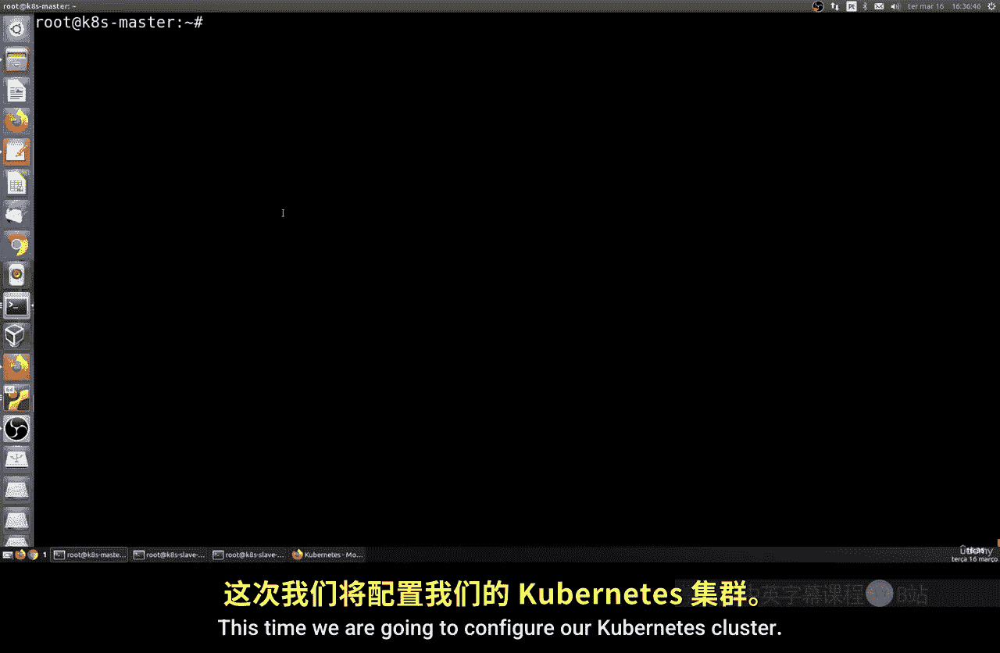
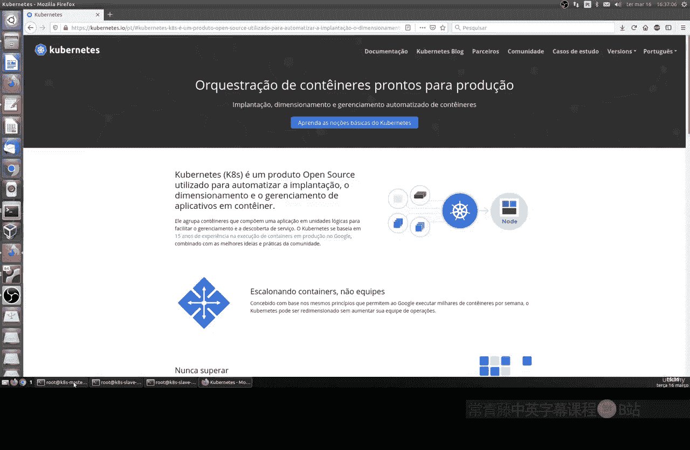
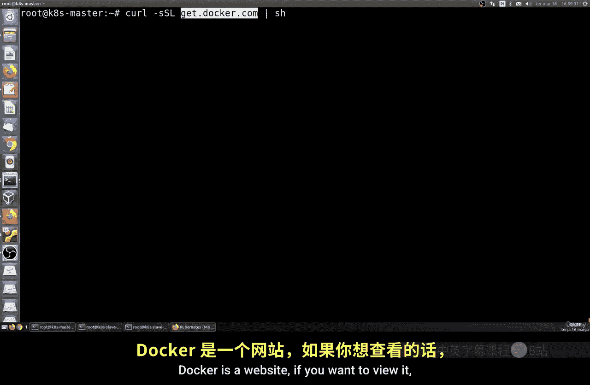
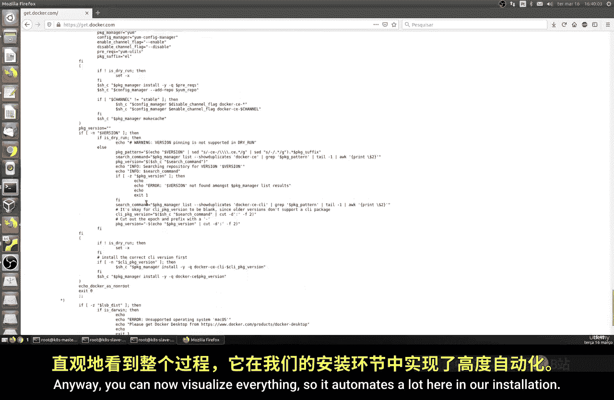
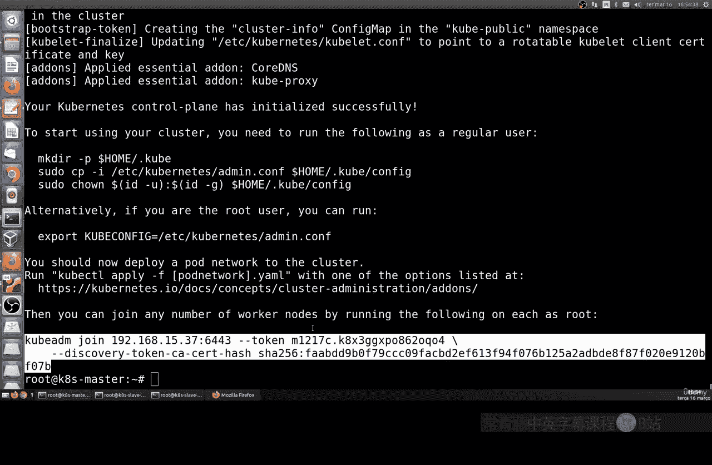
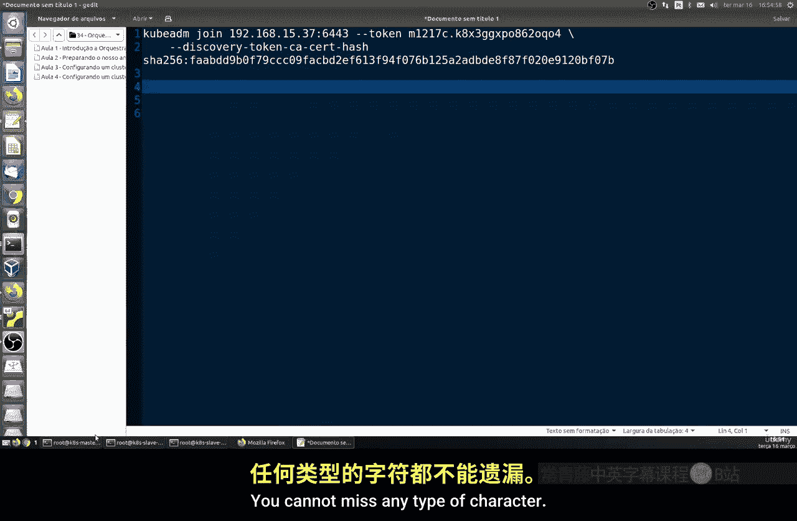

# 190：配置 Kubernetes 集群 🚀



在本节课中，我们将学习如何配置一个生产环境可用的 Kubernetes 集群。我们将使用三台独立的虚拟机（一台主节点，两台工作节点），并完成从 Docker 安装到 Kubernetes 初始化的完整流程。



---

## 环境准备

上一节我们介绍了集群的基本概念，本节中我们来看看具体的环境要求与准备工作。

我们需要准备三台虚拟机，并确保它们满足以下条件：
*   一台作为主节点（Master）。
*   两台作为工作节点（Slave 1 和 Slave 2）。
*   所有机器使用**相同类型和版本**的操作系统（本教程使用 Ubuntu）。
*   主节点需要配置**固定 IP 地址**。
*   每台机器至少需要 **2 GB 内存**。如果使用虚拟机，请确保分配足够资源。树莓派（Raspberry Pi）也可作为节点使用。

以下是节点规划示意图：


---

## 安装 Docker

集群中的所有节点都需要运行容器运行时。我们将为所有三台机器安装 Docker。

Docker 官网提供了一个便捷的安装脚本，它能自动检测系统并完成安装。我们将在每台机器上执行以下命令：



```bash
curl -fsSL https://get.docker.com -o get-docker.sh
sudo sh get-docker.sh
```



安装完成后，为了能以非 root 用户（可选）更方便地使用 Docker，可以执行以下命令将用户加入 docker 组。本教程为简便起见，将直接使用 root 用户操作。

```bash
sudo usermod -aG docker $USER
```

---

## 配置 Docker Daemon

接下来，我们需要在所有三台机器上配置 Docker 守护进程，以确保其符合 Kubernetes 的运行要求。

我们需要编辑或创建 Docker 的守护进程配置文件 `/etc/docker/daemon.json`，并添加以下内容：

```json
{
  "exec-opts": ["native.cgroupdriver=systemd"],
  "log-driver": "json-file",
  "log-opts": {
    "max-size": "100m"
  },
  "storage-driver": "overlay2"
}
```

这个配置设定了 cgroup 驱动、日志格式和存储驱动，这是 Kubernetes 的推荐配置。

---

## 启用 IP 转发

Kubernetes 网络需要内核支持 IP 转发。我们必须在所有节点上启用此功能。

执行以下命令来启用 IP 转发：
```bash
sudo sysctl net.ipv4.ip_forward=1
```

为了使此配置在重启后永久生效，需要编辑 `/etc/sysctl.conf` 文件，确保包含以下行：
```bash
net.ipv4.ip_forward = 1
```

完成以上配置后，请**重启所有三台机器**以使更改生效。

---

## 验证 Docker 安装

机器重启后，我们需要验证 Docker 是否在所有节点上正常运行。

首先，检查 Docker 服务状态：
```bash
sudo systemctl status docker
```

状态应显示为 `active (running)`。然后，运行经典的测试命令：
```bash
sudo docker run hello-world
```

如果看到 “Hello from Docker!” 的欢迎信息，说明 Docker 安装和运行成功。请在主节点和两个工作节点上均完成此验证。

---

## 禁用 Swap 内存

Kubernetes 为了确保性能和稳定性，要求禁用交换分区（Swap）。

首先，临时禁用当前已启用的 Swap：
```bash
sudo swapoff -a
```

然后，为了使配置永久生效，需要编辑 `/etc/fstab` 文件，**注释掉**或**删除**所有包含 `swap` 字样的行。例如，将类似下面的一行注释掉：
```bash
# /dev/mapper/ubuntu--vg-ubuntu--lv none swap sw 0 0
```

---

## 安装 Kubernetes 组件

现在，我们将在所有三台机器上安装 Kubernetes 的核心组件：`kubeadm`、`kubelet` 和 `kubectl`。

以下是安装步骤：
1.  添加 Kubernetes 的 APT 仓库密钥。
2.  添加软件仓库。
3.  更新软件包列表并安装组件。

具体命令如下：
```bash
# 添加密钥
sudo curl -fsSLo /usr/share/keyrings/kubernetes-archive-keyring.gpg https://packages.cloud.google.com/apt/doc/apt-key.gpg

# 添加仓库
echo "deb [signed-by=/usr/share/keyrings/kubernetes-archive-keyring.gpg] https://apt.kubernetes.io/ kubernetes-xenial main" | sudo tee /etc/apt/sources.list.d/kubernetes.list

# 更新并安装
sudo apt update
sudo apt install -y kubelet kubeadm kubectl
sudo apt-mark hold kubelet kubeadm kubectl # 阻止自动更新
```

组件说明：
*   **`kubeadm`**：用于快速初始化集群的命令行工具。
*   **`kubectl`**：与集群通信、管理应用和资源的命令行工具。
*   **`kubelet`**：运行在每个节点上的代理，负责确保容器按预期运行。

---

## 初始化主节点（Master）

所有前置工作完成后，我们将在主节点上初始化 Kubernetes 控制平面。

在初始化前，请再次确认：
1.  主节点内存大于 2 GB (`free -h`)。
2.  Swap 已完全禁用 (`free -h` 中 Swap 一行显示为 0）。
3.  主节点主机名和 IP 地址已正确配置。

执行初始化命令。其中 `--pod-network-cidr` 指定了 Pod 使用的内部网络段，可根据需要调整。
```bash
sudo kubeadm init --pod-network-cidr=10.244.0.0/16
```

此过程可能需要几分钟。初始化成功后，命令行会输出几条重要信息：
1.  如何使用 `kubectl` 的配置命令，例如：
    ```bash
    mkdir -p $HOME/.kube
    sudo cp -i /etc/kubernetes/admin.conf $HOME/.kube/config
    sudo chown $(id -u):$(id -g) $HOME/.kube/config
    ```
2.  一个格式如下的 `kubeadm join` 命令，其中包含令牌（Token）和哈希值（Hash）。**请务必妥善保存此命令**，它用于将工作节点加入集群。
    ```
    kubeadm join <主节点IP>:6443 --token <令牌> --discovery-token-ca-cert-hash sha256:<哈希值>
    ```



---



## 本节总结

本节课中，我们一起完成了 Kubernetes 集群配置的前半部分工作。我们准备了三台虚拟机，为所有节点安装并配置了 Docker，禁用了 Swap 内存，安装了必要的 Kubernetes 组件，并成功初始化了主节点。

最关键的一步是，我们获得了用于将工作节点加入集群的 `kubeadm join` 命令。在下一节课中，我们将使用这个命令把两个工作节点加入到集群中，并安装网络插件，最终让整个 Kubernetes 集群准备就绪，可以运行我们的容器化应用。


