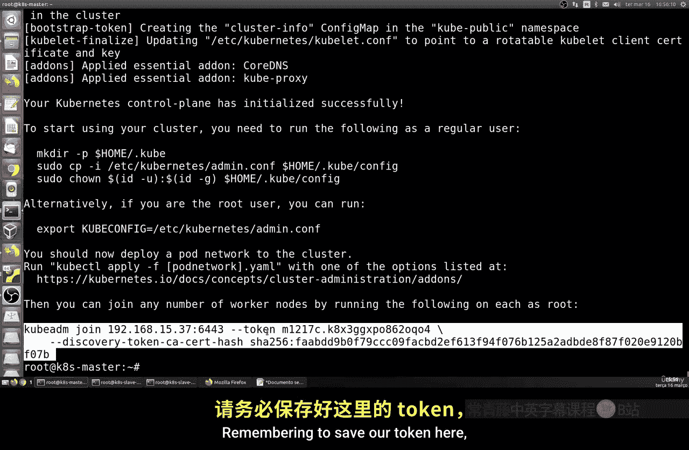
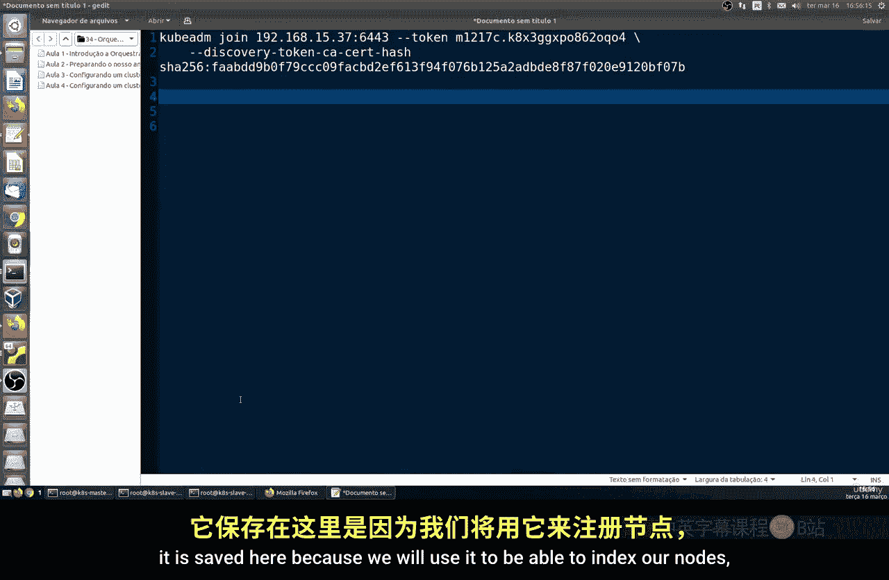
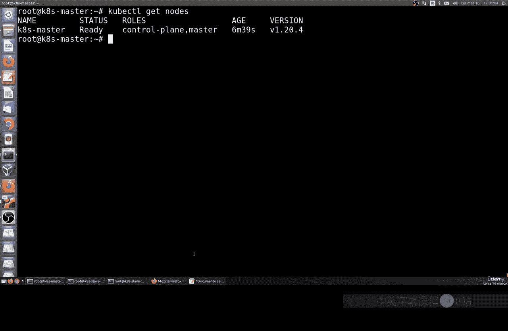
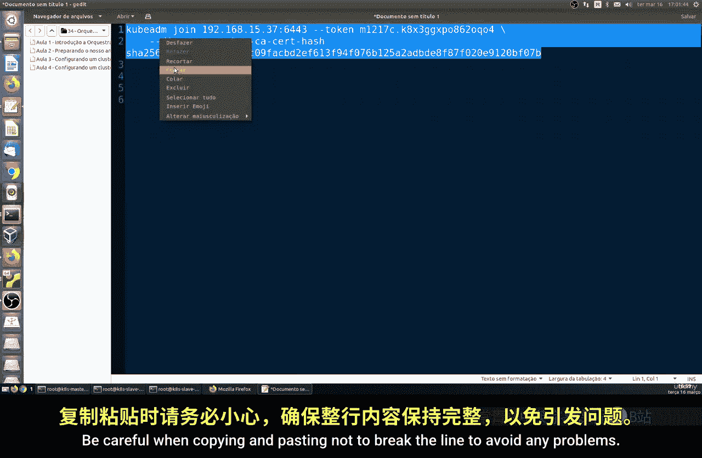
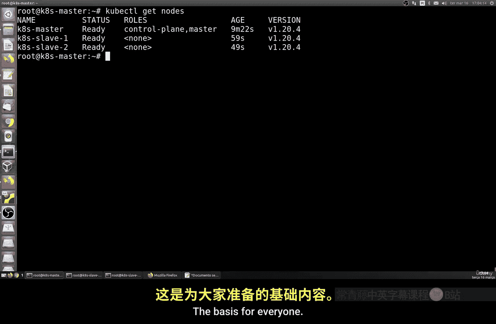

# 191：设置Kubernetes集群 - 第二部分



## 概述
在本节课中，我们将继续Kubernetes集群的设置工作。我们将完成集群网络的配置，并将从节点（Slave Nodes）加入到主节点（Master Node）中，最终构建一个可用的Kubernetes集群。



---

## 回顾与准备工作
上一节我们介绍了初始化主节点和保存连接令牌。本节中我们来看看如何配置集群网络并加入从节点。

请确保已保存好上节课生成的令牌，因为我们将使用它来将节点加入集群。令牌信息至关重要。

以下是需要保存的令牌示例（具体内容因人而异）：
```
kubeadm join 192.168.1.100:6443 --token abcdef.0123456789abcdef \
    --discovery-token-ca-cert-hash sha256:xxxxxxxxxxxxxxxxxxxxxxxxxxxxxxxxxxxxxxxxxxxxxxxxxxxxxxxxxxxxxxxx
```

现在，我们可以开始配置Kubernetes本身。Kubernetes集群由多个可以运行容器的Pod组成。这些Pod将在我们配置的节点（即我们的虚拟机）上运行。

---

## 检查初始状态
首先，让我们可视化当前的状态。在主节点上，我们没有任何正在运行的容器。

使用以下命令查看所有Pod的状态：
```bash
kubectl get pods --all-namespaces
```
你可以看到，在Master节点上，有一些系统Pod正在运行，但`core-dns`等相关Pod可能处于`Pending`状态。这是因为我们的网络尚未配置。

所以，我们基本上需要实现一个网络，让我们的Pod配置能够相互通信。目前我们在这方面存在一些问题。

---

## 安装网络插件
为了解决网络问题，我们必须安装另一个程序。我推荐使用最常用的`Flannel`。这是一个为Kubernetes配置内部网络的程序。当然还有其他类型，但我们将使用这个，并且它运行良好。重要的是它能工作。

我们将从GitHub获取其部署清单。CoreOS团队（我们在第一节课也提到过他们从事编排工作）提供了一个名为Flannel的网络程序。我们将在这里为我们的Kubernetes集群使用它，它是完全兼容的。

现在，让我们应用Flannel的配置：
```bash
kubectl apply -f https://raw.githubusercontent.com/coreos/flannel/master/Documentation/kube-flannel.yml
```

---

## 验证网络配置
配置完成后，让我们再次检查状态。你可以看到，现在所有的Pod都处于`Running`状态。之前它们像是`Pending`，现在所有的Pod都成功运行了。

这里可以看到前后的对比，效果很好。

---



## 加入从节点到集群
接下来，我们需要将我们的从节点（Slave One和Slave Two）加入到我们的主节点。我们的主节点已经配置完毕，准备好接收连接了。

那么配置将如何进行？让我们在主节点上查看当前节点状态：
```bash
kubectl get nodes
```
它显示我们还没有配置任何从节点，这很明显，因为尚未配置。但我们的主节点已经就绪，状态显示为`Ready`。它表明“我是控制者，我是主节点”。同时它还显示了连接时长和机器名称。

现在我们要做的是，将节点索引并加入到集群中。我们将使用之前保存的`kubeadm join`命令。



**重要提示**：该命令包含了主节点的IP地址、令牌和网络证书。这就是为什么主节点需要固定IP，不能更改，否则可能导致问题。请完整地复制该命令，并小心不要断行（注意命令中的反斜杠`\`），以避免粘贴时出现任何问题。

在主节点上，我们不需要执行任何操作；只需复制我们的连接代码。然后将其粘贴到我们的从节点上执行。

在`slave-one`虚拟机上运行复制的命令。如果你有`slave-two`、`slave-three`等，执行相同的命令即可。

---

## 验证集群状态
现在，我们只需要再次查看状态。再次运行获取节点的命令：
```bash
kubectl get nodes
```
节点信息已经开始同步。只需稍等片刻，它们就会显示为`Ready`状态。同步需要一点时间。

看，我们的`slave-one`已经就绪了。再等一会儿，`slave-two`应该也配置好了。它们都在这里了，主节点已配置，从节点也已加入。我们的集群已经存在，并准备好投入使用了。

我们下一步，在接下来的课程中，就是真正地使用它：部署一个容器，然后进行管理和各项操作。

---

## 总结
本节课中我们一起学习了如何完成Kubernetes集群的设置。我们安装了Flannel网络插件解决了Pod通信问题，并使用`kubeadm join`命令成功地将从节点加入了主节点，最终建立了一个包含一个主节点和两个从节点的基本Kubernetes集群。

请记住，任何与我们的课程或课堂相关的疑问，都应在我们平台的课程论坛上专门提出。所有命令步骤都已提供，请严格按照我们在课堂上的操作进行，不要修改或更改任何内容，以避免任何类型的错误。



基础内容就到这里。