# 192：容器编排入门 🚢

在本节课中，我们将要学习容器编排的基本概念。我们将了解什么是容器编排，为什么需要它，以及它如何帮助管理复杂的容器化应用。课程最后，我们会介绍一些主流的编排工具，并重点说明我们将要使用的Kubernetes。

---

## 什么是容器编排？🤔

上一节我们介绍了Docker及其功能，学习了如何创建和管理单个容器。然而，在实际生产环境中，应用通常由数十甚至数百个容器组成。手动管理如此多的容器会变得极其复杂和低效。

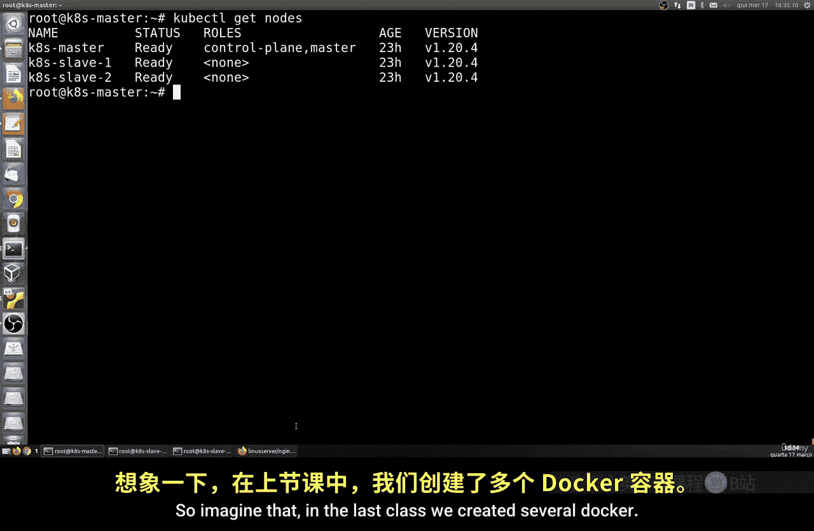

容器编排正是为了解决这个问题而出现的。它是一个在计算集群中自动化部署和管理容器的过程。一个集群通常由多个节点组成。

**容器编排** 的核心定义是：一个**自动化**容器化应用的**部署、管理、扩展、网络连接和可用性**的过程。

---

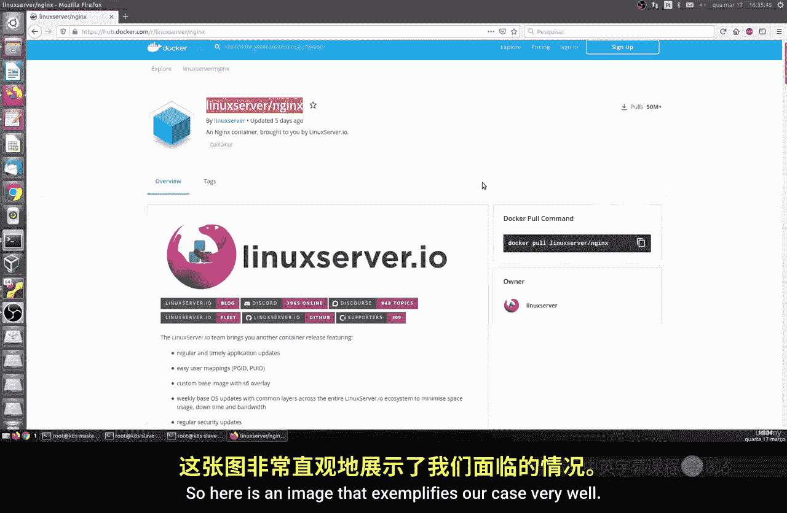

## 为什么需要容器编排？⚙️

为了让你更直观地理解，想象一下我们手动管理大量Docker容器的场景。我们需要处理：

*   容器的启动和停止。
*   容器之间的网络通信。
*   当某个容器失败时，如何重新启动它。
*   如何根据负载动态增加或减少容器数量。
*   如何统一配置和更新所有容器。

容器编排工具将这些任务自动化，极大地改变了应用部署和运维的方式，使得管理大规模容器化应用变得可行。

以下是容器编排涵盖的一些关键功能方面：

*   **服务管理**：负责处理标签、组、命名空间、依赖关系、负载均衡和健康检查。
*   **调度**：负责容器的分配、复制、重新调度、部署、滚动升级等。简而言之，它管理CPU、GPU、存储卷、端口、IP地址等资源。
*   **其他特性**：包括可扩展性、高可用性、灵活性、易用性、可移植性和安全性。

---

## 主流容器编排工具 🛠️

目前市场上有多种容器编排工具可供选择，它们各有特点，通常由不同的公司或社区支持。

以下是部分主流工具：

*   **Docker Swarm**： Docker官方提供的编排工具，我们已在之前的课程中学习过。
*   **Kubernetes**： 目前最流行、社区最活跃的编排系统，也是我们接下来课程的重点。
*   **Amazon ECS**： 亚马逊AWS提供的容器服务。
*   **Azure Kubernetes Service**： 微软Azure提供的Kubernetes托管服务。
*   **Google Kubernetes Engine**： 谷歌云提供的Kubernetes托管服务。

在所有这些工具中，Kubernetes是社区最活跃、发展最迅速的一个。它完全兼容Docker，这意味着我们可以利用已有的Docker知识和镜像，在Kubernetes上进行编排管理。

因此，在接下来的课程中，我们将聚焦于学习Kubernetes。

---

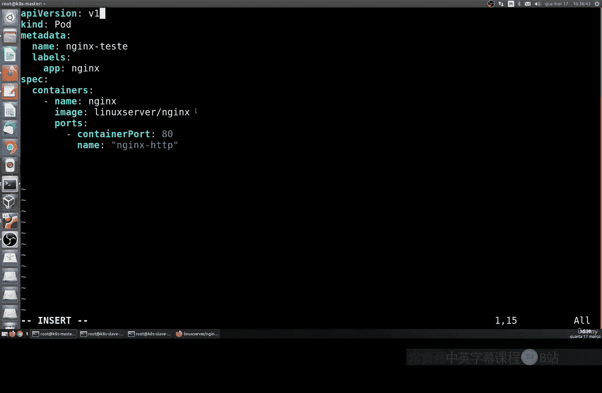

## 课程准备与环境要求 💻

在开始动手实践之前，我们需要准备好实验环境。

为了能够有效地学习和实践Kubernetes集群，你需要准备至少三台机器。你可以使用物理机或虚拟机。

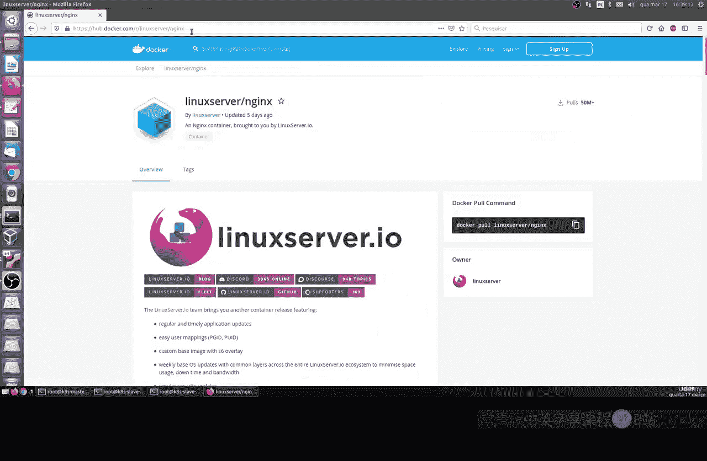

以下是环境配置建议：

*   **机器数量**： 至少3台。
*   **配置要求**： 其中至少一台机器需要至少2GB的内存，以确保我们的实验能够流畅运行。

请确保你的环境满足以上要求，以便跟随后续的课程进行实践。

---

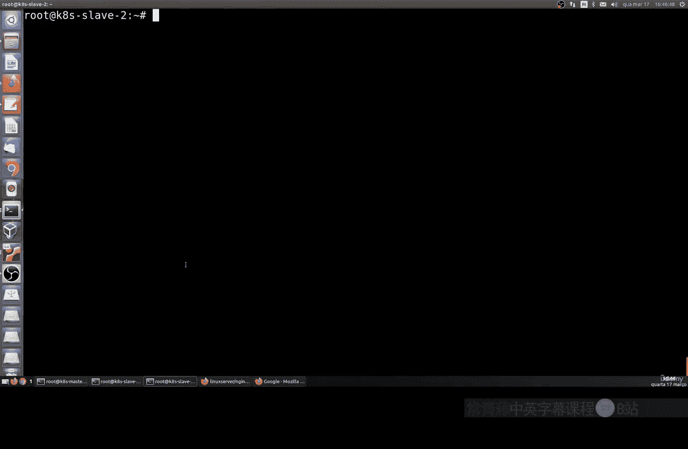

## 总结 📚

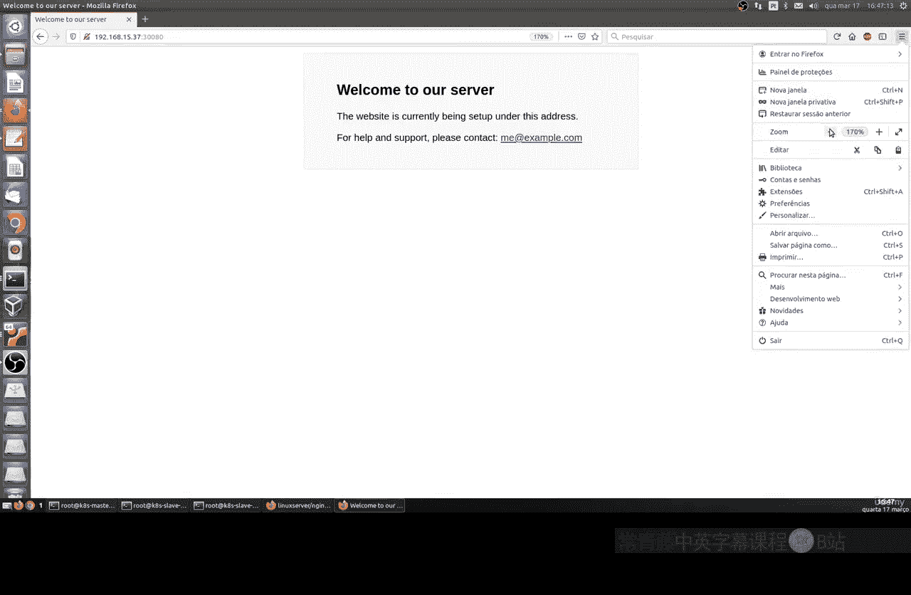

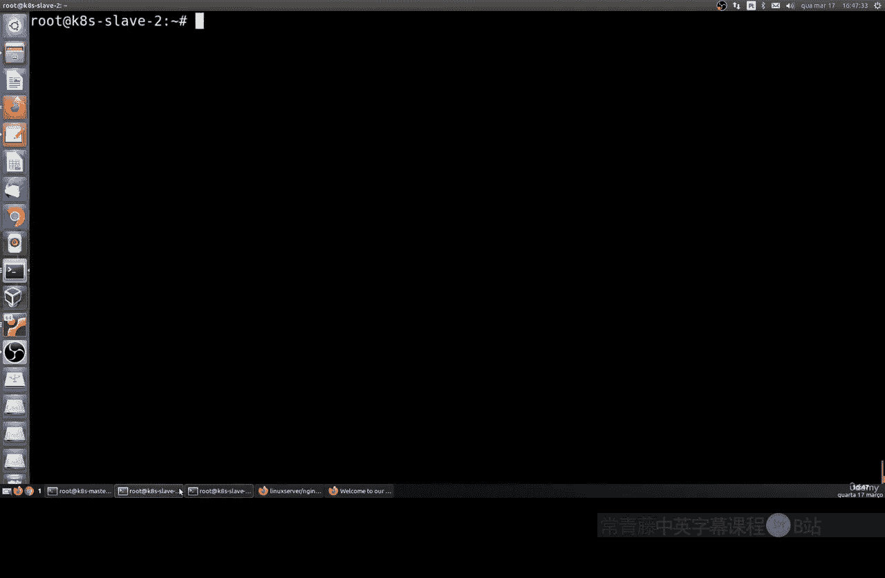

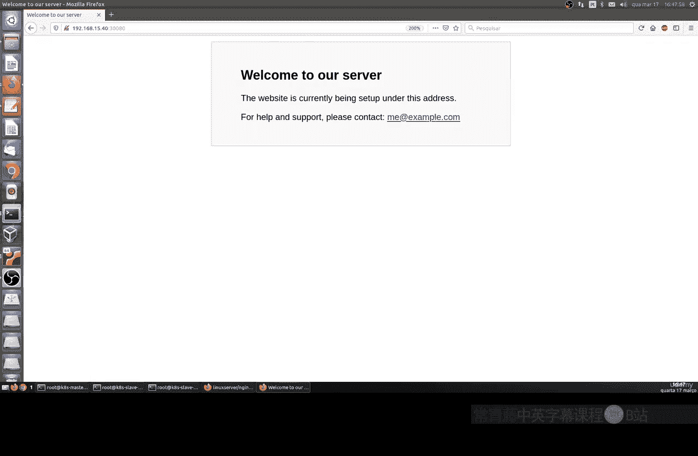

本节课中我们一起学习了容器编排的基础知识。

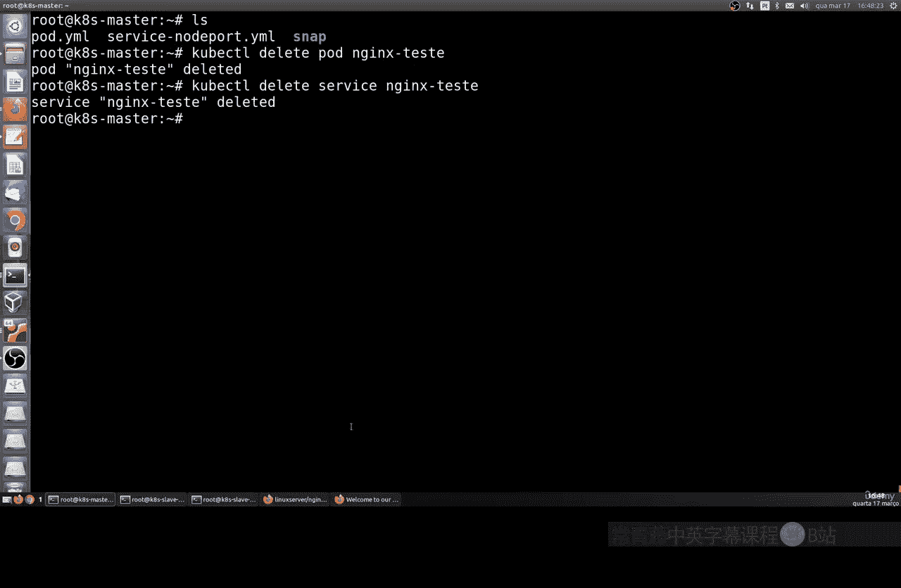

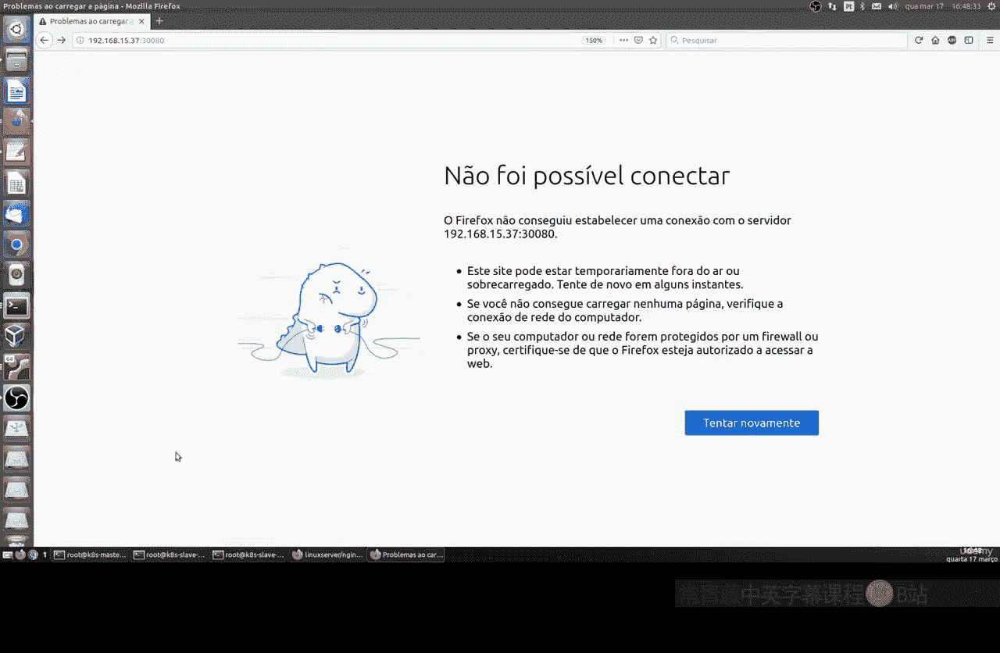

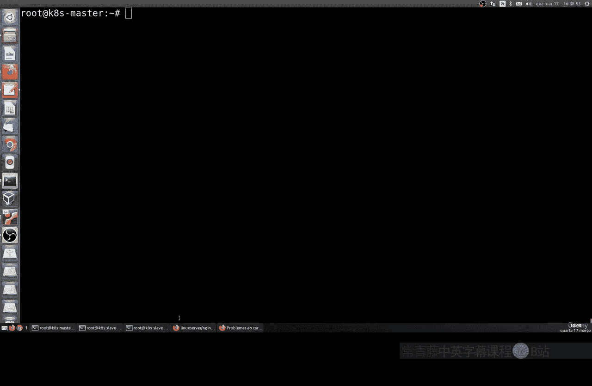

我们首先了解了容器编排的定义，即自动化管理容器生命周期和集群资源的过程。接着，我们探讨了为什么在大规模容器部署中编排工具是必不可少的。然后，我们浏览了几种主流的容器编排工具，并确定了将使用Kubernetes作为我们学习的重点。最后，我们说明了开始实践前需要准备的环境要求。

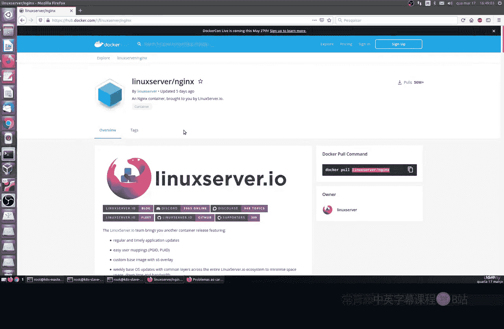

在下一节课，我们将开始动手搭建Kubernetes集群环境。你可以提前访问 [Kubernetes官方网站](https://kubernetes.io) 了解更多信息。