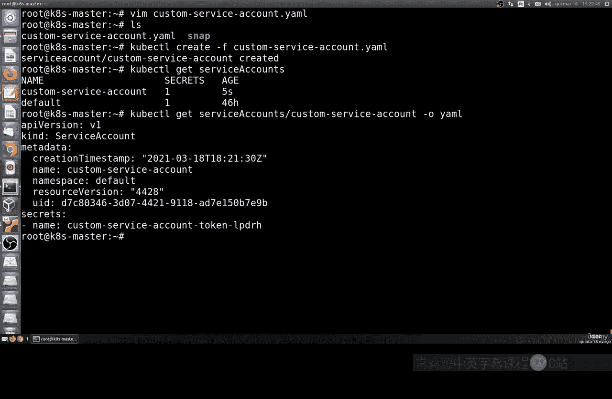
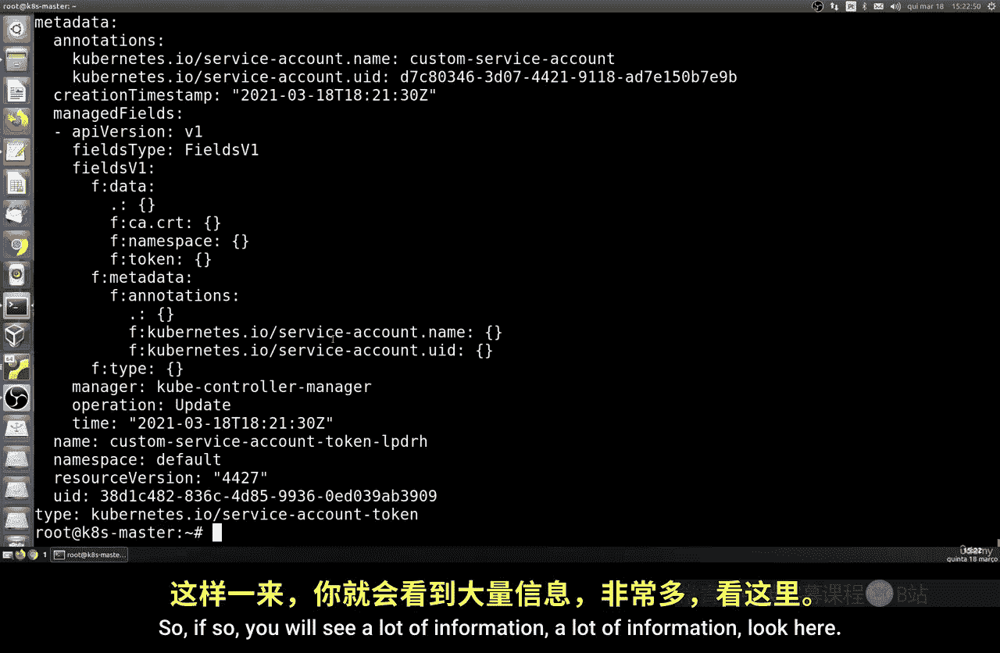
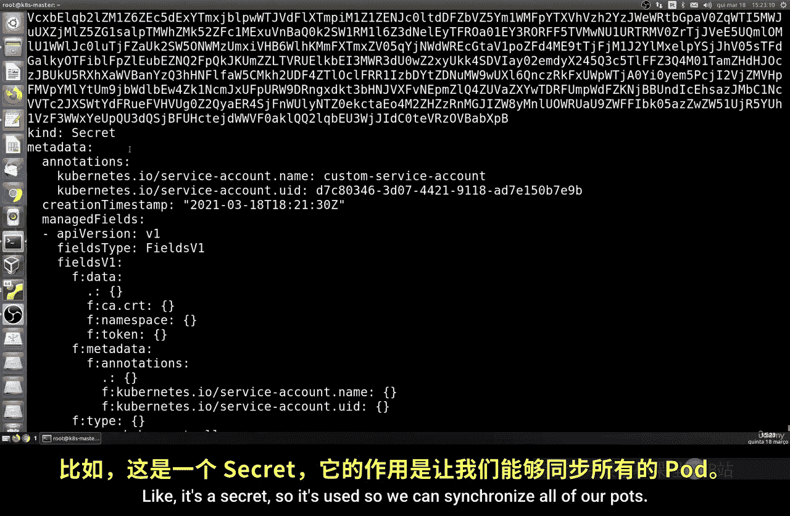
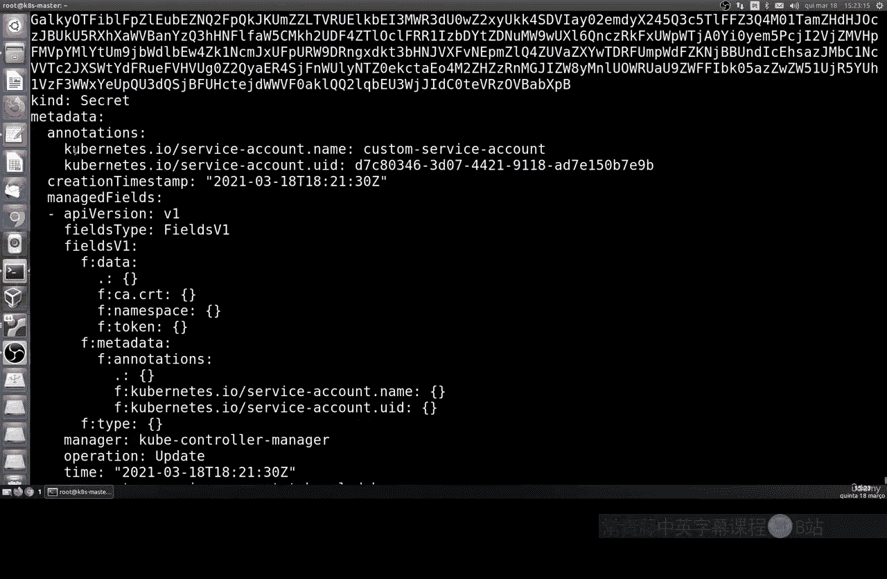
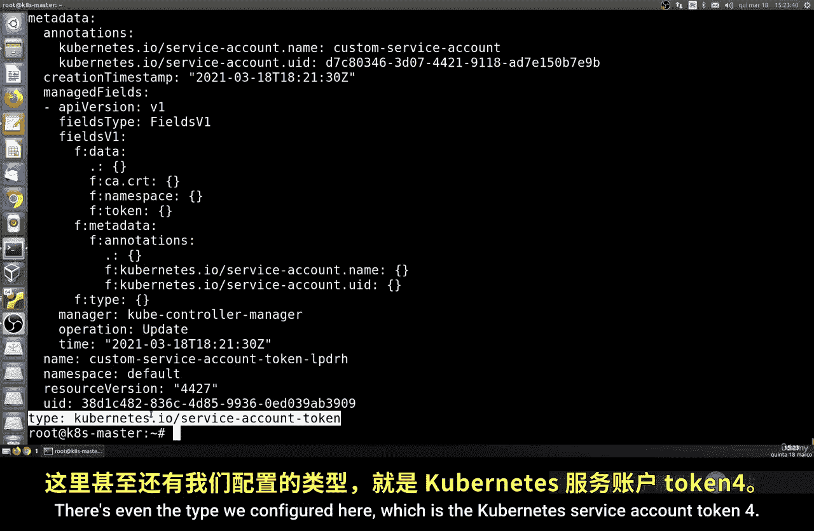
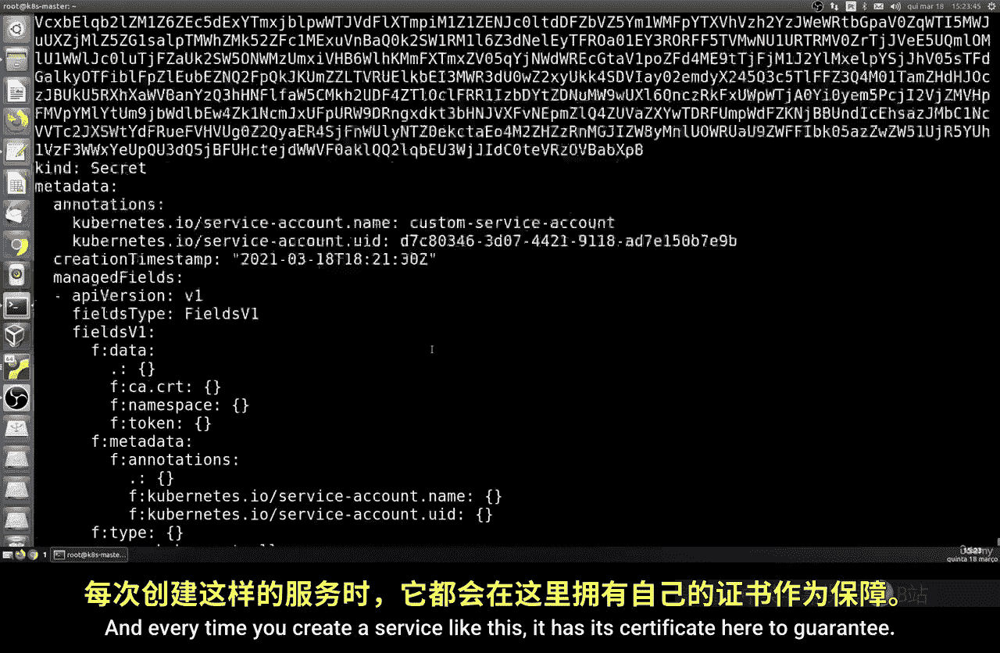
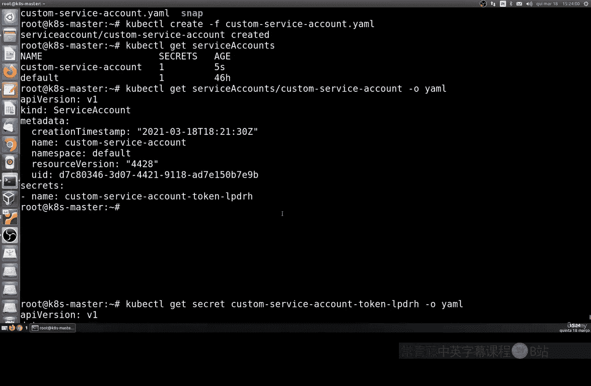
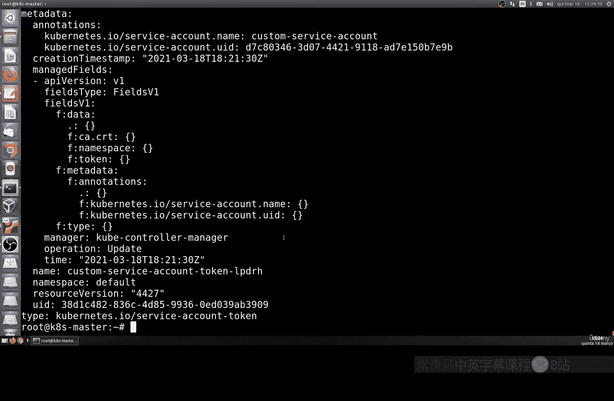
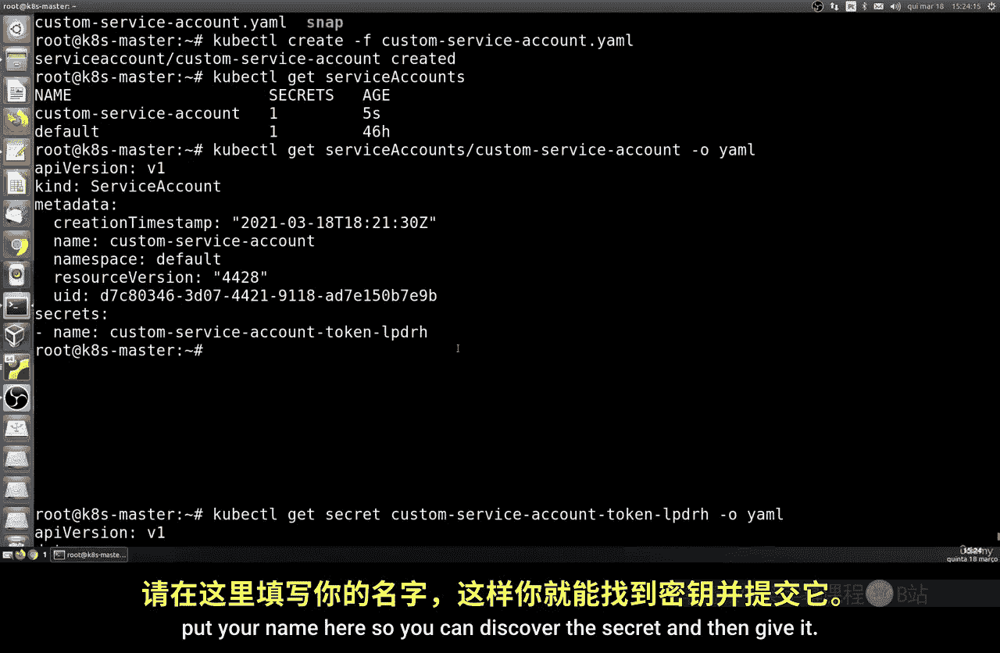
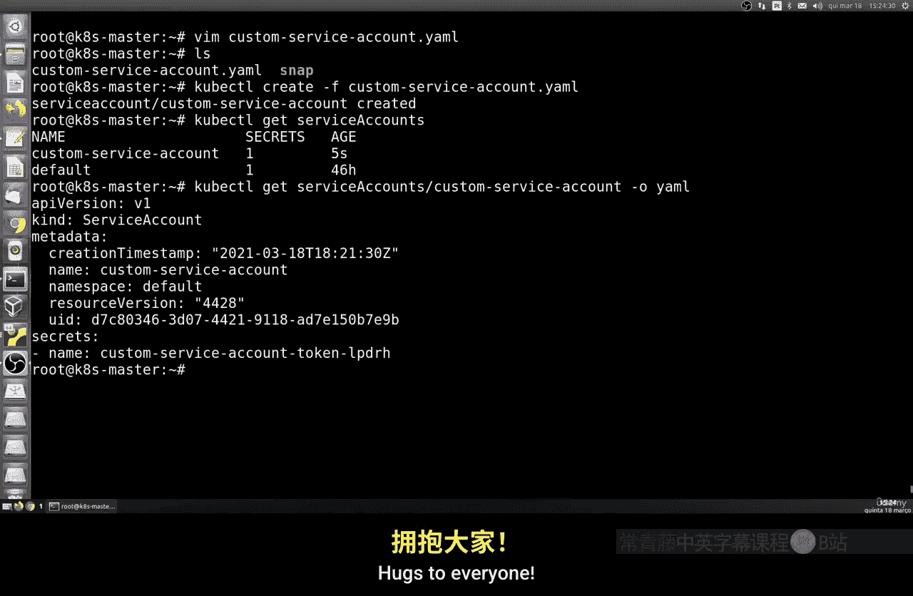

# 193：理解服务账户 🛡️

在本节课中，我们将学习Kubernetes中的服务账户。服务账户是集群内部用于身份验证和授权的特殊账户，与普通用户账户不同。我们将了解其工作原理、如何创建以及如何查看其详细信息。

## 概述

Kubernetes集群中有两种主要账户类型。一种是普通用户账户，由集群外部管理，供人类用户连接集群使用。另一种是服务账户，这是我们本节课的重点。服务账户用于Pod内的进程与Kubernetes API服务器进行安全通信。

上一节我们介绍了Kubernetes的基础概念，本节中我们来看看服务账户的具体机制。

## 服务账户与普通用户的区别

以下是服务账户与普通用户账户的核心区别：

*   **作用范围**：普通用户账户是全局的，可以访问集群中的多个命名空间。服务账户的作用范围则被限制在**其所属的命名空间内**。这一点非常重要，因为它确保了命名空间之间的隔离性。
*   **管理方式**：普通用户由外部系统（如公司LDAP）管理。服务账户则由Kubernetes API在集群内部创建和管理。
*   **使用场景**：当Pod中的进程需要与API服务器交互（例如，查询其他Pod信息或部署新应用）时，会使用服务账户的身份凭证。

## 服务账户的工作原理

Kubernetes集群启动并运行后，API服务器会管理所有服务账户。当创建一个Pod时，Kubernetes会为该Pod分配一个服务账户。默认情况下，每个命名空间都有一个名为 `default` 的服务账户。除非特别指定，新创建的Pod会自动使用其所在命名空间的 `default` 服务账户。

每个服务账户都有一组凭据，这些凭据以**Secret卷**的形式挂载到使用该账户的Pod中。当Pod内的进程与API服务器通信时，就会使用这些凭据进行身份验证。

## 创建自定义服务账户

现在，让我们动手创建一个自定义的服务账户。

首先，我们需要创建一个YAML配置文件。你可以为文件取任意名称，但扩展名必须是 `.yaml` 或 `.yml`，就像我们在之前的课程中做的那样。

以下是配置文件的内容：

```yaml
apiVersion: v1
kind: ServiceAccount
metadata:
  name: custom-service-account
```

这个配置非常简单。`apiVersion` 指定了Kubernetes API的版本，`kind` 声明我们要创建的资源类型是 `ServiceAccount`，`metadata.name` 则为我们自定义的服务账户命名。

保存文件后，使用 `kubectl create` 命令来创建这个服务账户：



```bash
kubectl create -f <你的文件名>.yaml
```



创建完成后，可以使用 `kubectl get serviceaccount` 命令查看所有服务账户，确认我们创建的 `custom-service-account` 已经存在。

## 查看服务账户详情





要查看某个服务账户的详细信息，可以使用 `kubectl describe` 命令：

```bash
kubectl describe serviceaccount custom-service-account
```



命令输出会显示该服务账户的详细信息，包括其名称、所属命名空间、创建时间、唯一ID以及关联的Secret名称。这个关联的Secret里就包含了访问API服务器所需的令牌（Token）和证书。



以下是查看关联Secret详细内容的方法：



```bash
kubectl describe secret <上一步中看到的Secret名称>
```



在Secret的详情中，你会看到编码后的证书（`ca.crt`）和令牌（`token`）数据。这些就是挂载到Pod中的安全凭据，用于确保Pod与API服务器之间通信的安全性。



## 总结



本节课中我们一起学习了Kubernetes服务账户的核心知识。我们了解了服务账户与普通用户账户的区别，知道了服务账户被限制在命名空间内以确保隔离性。我们还实践了如何创建自定义服务账户，并学会了如何查看其详细信息及关联的Secret凭证。理解服务账户是掌握Kubernetes安全模型的重要一步。在接下来的课程中，我们将继续探索Kubernetes的其他功能。