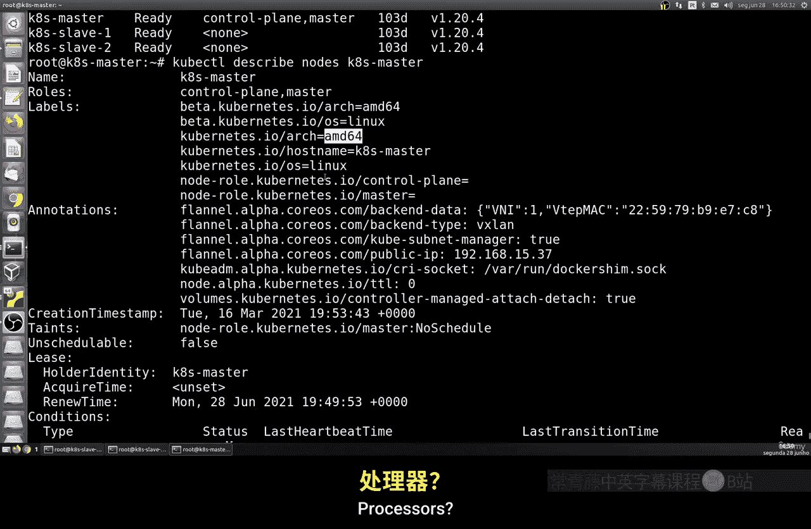
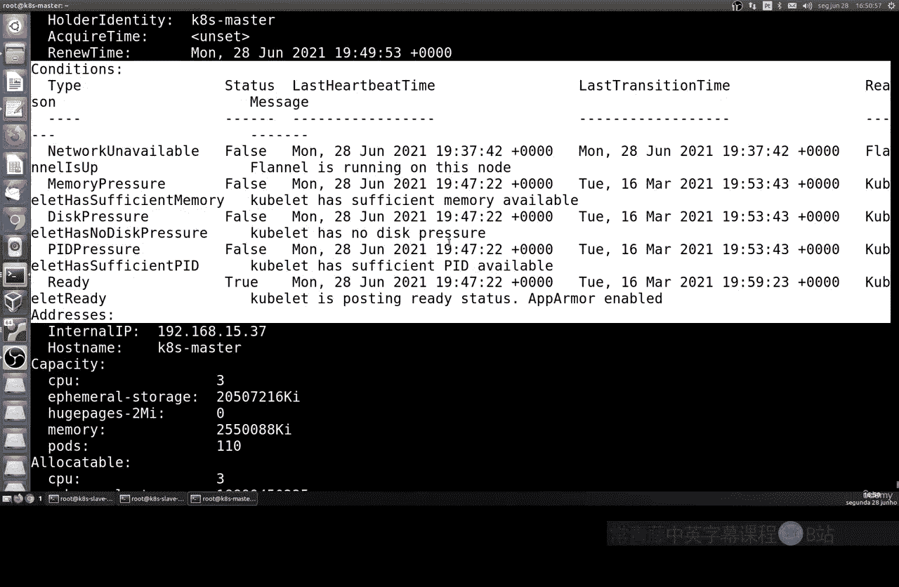
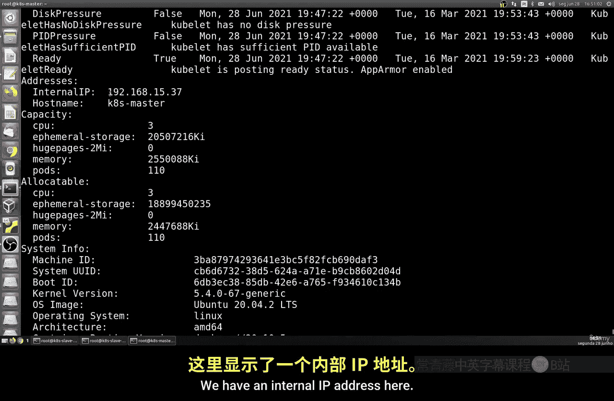
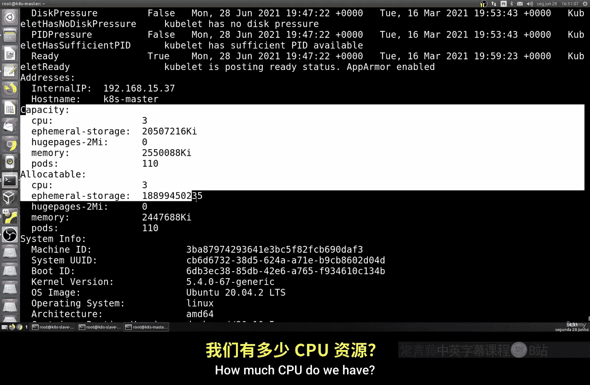
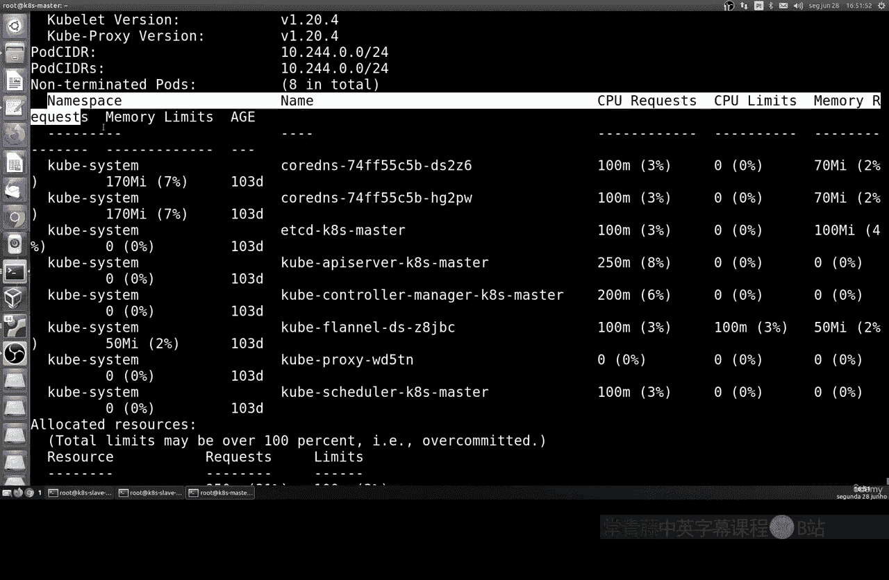
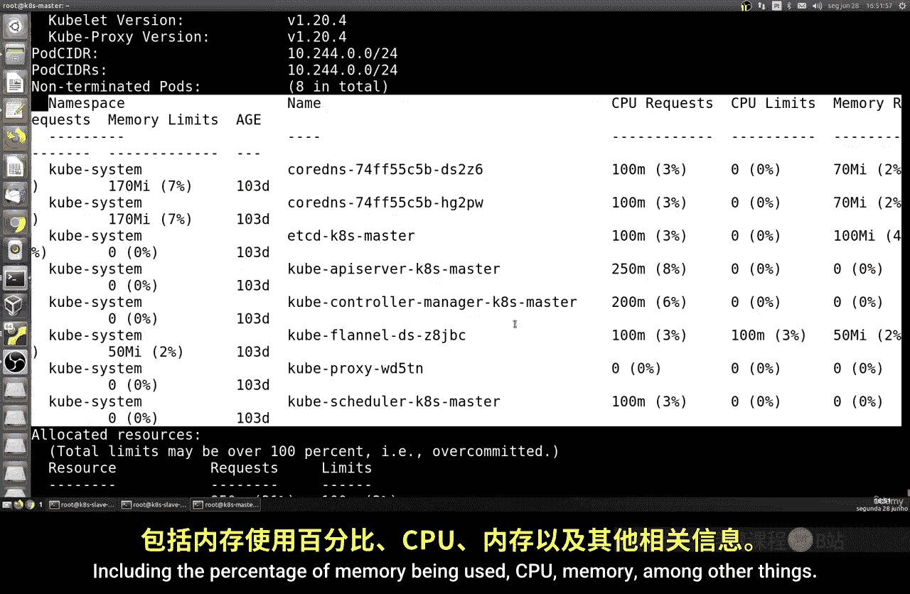
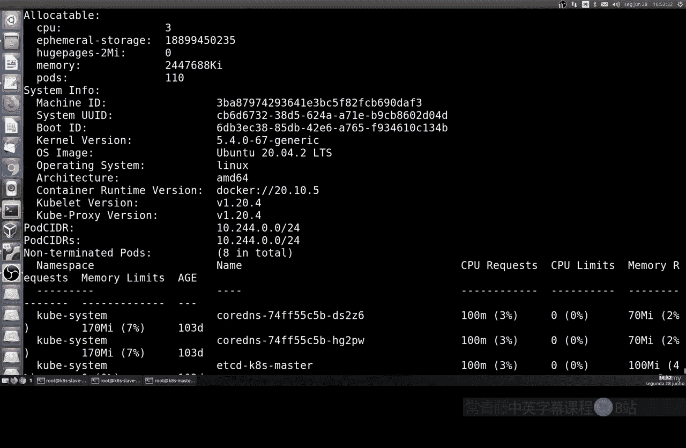

# 194：检查集群状态 🕵️

在本节课中，我们将学习如何检查Kubernetes集群的状态。我们将了解如何获取集群版本、节点信息以及各种组件的详细状态，这对于管理和维护一个健康的集群至关重要。

## 检查集群版本

首先，我们需要确认集群正在运行的版本。这应该在主节点上执行。

使用以下命令检查版本：
```bash
kubectl version
```
该命令会显示集群的服务器版本和客户端版本。你还需要在其他节点上运行此命令。如果版本非常接近，通常不会造成大问题。但版本差异过大，例如发布时间相隔很久，则可能因为某些命令或功能的增删而影响集群运行。最佳实践是始终使用最新版本，或确保所有节点版本一致，这有助于避免未来出现问题。

## 获取集群组件状态

上一节我们介绍了如何检查版本，本节中我们来看看如何获取集群核心组件的状态信息。

以下是获取组件状态的命令（注意：此命令在v1.19版本后已弃用，但仍可使用）：
```bash
kubectl get componentstatuses
```
该命令会显示诸如调度器（scheduler）或控制器管理器（controller-manager）等组件的状态。控制器管理器负责执行定义集群行为的各种控制器，而调度器则负责将不同的Pod分配到节点上。我们还会看到`etcd`，它指示了集群的存储区域。这些主题我们将在后续课程中详细研究。

## 查看集群节点信息

除了组件状态，了解集群中的节点详情也非常重要。



以下是列出所有节点的命令：
```bash
kubectl get nodes
```
如你所见，该命令会显示主节点和工作节点的信息，包括它们的Kubernetes版本。这是我们之前课程中已经使用过的命令。



## 获取节点详细信息





为了观察更具体的细节，我们可以获取单个节点的详尽描述。

例如，要查看名为`ks-master`的主节点信息，请运行：
```bash
kubectl describe node ks-master
```
请注意，节点名称是你为那个节点所起的名字。这个命令会返回大量信息，包括：
*   系统类型和架构（例如Linux， ARM或AMD/Intel处理器）。
*   节点角色（主节点或工作节点）。
*   运行的Kubernetes版本。
*   公共IP地址。
*   创建时间、唯一标识。
*   与Pod相关的信息，如DNS、代理。
*   资源使用情况百分比。
*   内部IP地址。
*   CPU和内存的总量及已分配量。
*   操作系统和内核版本。
*   容器运行时（如Docker）及其版本。
*   各种守护进程（如`kubelet`和`kube-proxy`）的版本。
*   存储资源信息。



总之，这里包含了大量关于系统、资源利用率和组件版本的有趣且重要的信息。我们将在后续课程中更深入地研究这些主题。



## 总结



本节课中我们一起学习了如何检查Kubernetes集群的状态。我们掌握了使用`kubectl version`查看版本，使用`kubectl get componentstatuses`（已弃用）和`kubectl get nodes`查看组件与节点概览，以及使用`kubectl describe node <node-name>`获取单个节点的详细描述。这些是管理和监控集群健康的基础技能。在接下来的课程中，我们将继续逐步回顾和学习这些主题。