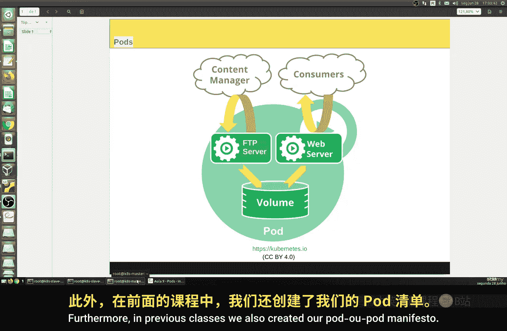

# 196：Pod详解 🐳

在本节课中，我们将深入学习Kubernetes的核心概念——Pod。我们将回顾Pod的基本定义，探讨其设计原理，并理解为何它是Kubernetes中最小的可部署计算单元。通过本课，你将清晰地掌握Pod的组成、作用及其在容器编排中的重要性。

---

上一节我们介绍了Kubernetes的基础，本节中我们来看看其最核心的组件——Pod。

Pod是一组共享存储和网络资源的一个或多个容器。它定义了如何在集群中运行这些容器。Pod的名称源于鲸鱼群，暗喻了Docker的鲸鱼标志。

Pod的内容总是在共享的上下文中共同调度和运行。它模拟了一个逻辑主机，可以是一台特定的物理机，其中包含一个或多个紧密耦合的应用程序容器。

创建Pod的主要目的是运行多个紧密关联的应用程序容器。这些通常是小型应用，共享基础设施。例如，它们可以共享资源，同时确保整个系统的可靠性。这是此类概念被创造出来的核心原因。

以下是Pod的一个典型结构示例：
```yaml
apiVersion: v1
kind: Pod
metadata:
  name: example-pod
spec:
  containers:
  - name: web-server
    image: nginx
  - name: ftp-server
    image: vsftpd
  volumes:
  - name: shared-storage
    emptyDir: {}
```

假设一个Pod中运行着一个Web服务器和一个FTP服务器，它们共享同一个磁盘卷。如果其中一个容器（例如FTP服务器）出现内存使用过量的问题，我们必须确保这个问题不会耗尽分配给Pod的所有内存，并且不能损害Pod内的另一个容器。

任何类型的问题（内存、CPU等）都应当被隔离在发生问题的容器内部，不能影响Pod内的其他服务，更不能导致整个Pod停止服务。这意味着我们的操作具有更高的可靠性，因为问题不会波及其他应用，我们可以定点、局部地解决问题，而不影响任何其他正在运行的服务。

从逻辑上讲，Pod是我们在Kubernetes中可以创建和管理的最小计算单元。这意味着容器并不总是必须在同一台物理主机上，但它们可以组成一个共享某些Linux命名空间（如IP地址、主机名等）的组，并利用Docker提供的资源隔离机制。

当然，Pod也可以被调度到不同的物理服务器上运行，Kubernetes正是为此而设计的。



在之前的课程中，我们也创建过Pod清单模板。这些通常是YAML或JSON格式的文件。我们主要使用YAML格式，以声明式的方式记录所有配置细节。这样做使我们的系统更可靠，也更容易管理。我们已经实践过，但接下来我们将一步步回顾，并加入新的命令和技巧。

---


本节课中我们一起学习了Pod的核心概念。我们明确了Pod是一组共享资源的容器集合，理解了其设计旨在实现应用间的资源隔离与故障隔离，从而提升系统可靠性。同时，我们也回顾了使用声明式清单文件来定义Pod的方法。在下一节课，我们将更详细地探讨与Pod相关的具体操作和实践。